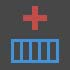
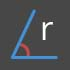
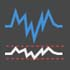
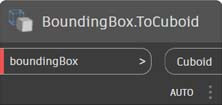
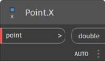

# Указатель узлов 

В этом указателе представлена дополнительная информация обо всех узлах, используемых в учебнике, а также о других компонентах, которые могут оказаться полезными. Это лишь краткое описание некоторых из 500 узлов Dynamo.

## Display

### Цвет

|                                            |                                                                                                                       |                                                           |
| ------------------------------------------ | --------------------------------------------------------------------------------------------------------------------- | --------------------------------------------------------- |
|                                            | СОЗДАНИЕ                                                                                                                |                                                           |
|           | 
<strong>Color.ByARGB</strong> Создание цвета с помощью компонентов «альфа», «красный», «зеленый» и «синий».
                  |  (1) (1).jpg>) |
|              | 
<strong>Цветовой диапазон</strong> Получение цвета на основе цветового градиента между начальным и конечным цветом.
      | .jpg)          |
|                                            | ДЕЙСТВИЯ                                                                                                               |                                                           |
|       | 
<strong>Color.Brightness</strong> Получение значения яркости для данного цвета.
                                 | .jpg)     |
| .jpg>) | 
<strong>Color.Components</strong> Вывод списка компонентов цвета в следующем порядке: альфа, красный, зеленый, синий.
 |            |
|       | 
<strong>Color.Saturation</strong> Получение значения насыщенности для данного цвета.
                                  |           |
|              | 
<strong>Color.Hue</strong> Получение значения оттенка для данного цвета.
                                               |                  |
|                                            | ЗАПРОС                                                                                                                 |                                                           |
| .jpg>)     | 
<strong>Color.Alpha</strong> Поиск альфа-компонента цвета (от 0 до 255).
                                 |                |
|             | 
<strong>Color.Blue</strong> Поиск синего компонента цвета (от 0 до 255).
                                   |                 |
|            | 
<strong>Color.Green</strong> Поиск зеленого компонента цвета (от 0 до 255).
                                 |                |
|              | 
<strong>Color.Red</strong> Поиск красного компонента цвета (от 0 до 255).
                                     |                  |

|                                                               |                                                                                           |                                                               |
| ------------------------------------------------------------- | ----------------------------------------------------------------------------------------- | ------------------------------------------------------------- |
|                                                               | СОЗДАНИЕ                                                                                    |                                                               |
|  (1) (1).jpg>) | 
<strong>GeometryColor.ByGeometryColor</strong> Отображение геометрии с помощью цвета.
 |  |

### Watch

|                                 |                                                                               |                                                  |
| ------------------------------- | ----------------------------------------------------------------------------- | ------------------------------------------------ |
|                                 | ДЕЙСТВИЯ                                                                       |                                                  |
|    | 
<strong>View.Watch</strong> Визуализация выходных данных узла.
           |        |
|  | 
<strong>View.Watch 3D</strong> Динамический предварительный просмотр геометрии.
 |  |

## Входные данные

|                                       |                                                                                                          |                                                |
| ------------------------------------- | -------------------------------------------------------------------------------------------------------- | ---------------------------------------------- |
|                                       | ДЕЙСТВИЯ                                                                                                  |                                                |
|            | 
<strong>Логическое</strong> Выбор между значениями True и False.
                                   |        |
| .jpg>) | 
<strong>Code Block</strong> Непосредственная разработка кода DesignScript.
              |      |
|      | 
<strong>Directory Path</strong> Выбор папки в системе и получение пути к ней.
 |  |
|           | 
<strong>File Path</strong> Выбор файла в системе и получение его имени.
        |       |
|      | 
<strong>Integer Slider</strong> Регулятор, создающий целые значения.
                         |  |
|  (1).jpg>)   | 
<strong>Number</strong> Создание числа.
                                                      | .jpg)   |
|       | 
<strong>Number Slider</strong> Регулятор, создающий числовые значения.
                          |   |
|  (1).jpg>)   | 
<strong>Строка</strong> Создание строки.
                                                      |         |
|       | 
<strong>Object.IsNull</strong> Определение того, имеет ли данный объект нулевое значение.
                         |   |

## List

|                                            |                                                                                                                                                                                                                                               |                                                        |
| ------------------------------------------ | --------------------------------------------------------------------------------------------------------------------------------------------------------------------------------------------------------------------------------------------- | ------------------------------------------------------ |
|                                            | СОЗДАНИЕ                                                                                                                                                                                                                                        |                                                        |
|              | 
<strong>List.Create</strong> Создание нового списка из заданных входных значений.
                                                                                                                                                              |             |
|             | 
<strong>List.Combine</strong> Применение комбинатора к каждому элементу в двух последовательностях.
                                                                                                                                                 |            |
|                   | 
<strong>Number Range</strong> Создание последовательности чисел в заданном диапазоне.
                                                                                                                                                  |  (1).jpg>)        |
|                | 
<strong>Number Sequence</strong> Создание последовательности чисел.
                                                                                                                                                                     |               |
|                                            | ДЕЙСТВИЯ                                                                                                                                                                                                                                       |                                                        |
|                | 
<strong>List.Chop</strong> Разделение списка на набор списков, содержащих заданное количество элементов.
                                                                                                                               |               |
| .jpg)             | 
<strong>List.Count</strong> Получение количества элементов, хранящихся в данном списке.
                                                                                                                                                   | (1) (1) (1).jpg>) |
|             | 
<strong>List.Flatten</strong> Выравнивание вложенного списка списков по определенному количественному значению.
                                                                                                                                                  |            |
|    | 
<strong>List.FilterByBoolMask</strong> Фильтрация последовательности путем поиска соответствующих индексов в отдельном списке логических операций.
                                                                                                       |   |
|      | 
<strong>List.GetItemAtIndex</strong> Получение элемента из данного списка, расположенного по заданному индексу.
                                                                                                                        |     |
|                                            | 
<strong>List.Map</strong> Применение функции ко всем элементам списка с созданием нового списка на основе результатов.
                                                                                                                    |                |
|                                            | 
<strong>List.Reverse</strong> Создание нового списка, содержащего элементы из заданного списка, расположенные в обратном порядке.
                                                                                                                        |            |
|  | 
<strong>List.ReplaceItemAtIndex</strong> Замена элемента из данного списка, расположенного по заданному индексу.
                                                                                                                  |     |
|        | 
<strong>List.ShiftIndices</strong> Смещение индексов в списке вправо на заданную величину.
                                                                                                                                      |       |
|    | 
<strong>List.TakeEveryNthItem</strong> Извлечение элементов из данного списка по индексам, которые являются множителями заданного значения, после заданного смещения.
                                                                                  |   |
|           | 
<strong>List.Transpose</strong> Перестановка строк и столбцов в списке списков. Если некоторые строки короче других, то в конечный массив в качестве заполнителей вставляются нулевые значения, чтобы он оставался прямоугольным.
 |          |

## Logic

|                          |                                                                                                                                                                                                              |                                     |
| ------------------------ | ------------------------------------------------------------------------------------------------------------------------------------------------------------------------------------------------------------ | ----------------------------------- |
|                          | ДЕЙСТВИЯ                                                                                                                                                                                                      |                                     |
|  | 
<strong>If</strong> Условное выражение. Проверка логического значения тестового ввода. Если тестовый ввод истинен, в результате выводится значение True; в противном случае выводится значение False.
 |  |

## Math

|                                          |                                                                                                                              |                                                       |
| ---------------------------------------- | ---------------------------------------------------------------------------------------------------------------------------- | ----------------------------------------------------- |
|                                          | ДЕЙСТВИЯ                                                                                                                      |                                                       |
|               | 
<strong>Math.Cos</strong> Нахождение косинуса угла.
                                                            |               |
|  | 
<strong>Math.DegreesToRadians</strong> Преобразование единиц угла из градусов в радианы.
                        |  |
|               | 
<strong>Math.Pow</strong> Возведение числа в заданную степень.
                                                  |               |
|  | 
<strong>Math.RadiansToDegrees</strong> Преобразование единиц угла из радианов в градусы.
                        |  |
|        | 
<strong>Math.RemapRange</strong> Корректировка диапазона списка чисел при сохранении коэффициента распределения.
   |        |
|               | 
<strong>Math.Sin</strong> Поиск синуса угла.
                                                              |               |
|             | 
<strong>Formula</strong> Оценка математических формул. Для оценки используется NCalc. См. раздел http://ncalc.codeplex.com
 |               |
| .jpg)             | 
<strong>Map</strong> Сопоставление значения с диапазоном входных данных.
                                                              |               |

## String

|                                    |                                                                                                                                                      |                                                          |
| ---------------------------------- | ---------------------------------------------------------------------------------------------------------------------------------------------------- | -------------------------------------------------------- |
|                                    | ДЕЙСТВИЯ                                                                                                                                              |                                                          |
|    | 
<strong>String.Concat</strong> Объединение нескольких строк в одну.
                                                         |             |
|  | 
<strong>String.Contains</strong> Определение того, содержит ли данная строка подстроку.
                                              |           |
|      | 
<strong>String.Join</strong> Объединение нескольких строк в одну со вставкой заданного разделителя между ними.
 |  (1) (1).jpg>) |
|     | 
<strong>String.Split</strong> Разделение одной строки на список строк, деления которого определяются заданными строками-разделителями.
    |              |
|  | 
<strong>String.ToNumber</strong> Преобразование строки в целое или двойное число.
                                                              |           |

## Геометрия

### Окружность

|                                               |                                                                                                                                                          |                                                                  |
| --------------------------------------------- | -------------------------------------------------------------------------------------------------------------------------------------------------------- | ---------------------------------------------------------------- |
|                                               | СОЗДАНИЕ                                                                                                                                                   |                                                                  |
|  | 
<strong>Circle.ByCenterPointRadius</strong> Построение окружности с входным центром и радиусом в плоскости XY мировой системы координат с осью Z мировой системы координат в качестве нормали.
 |  |
|        | 
<strong>Circle.ByPlaneRadius</strong> Создание окружности с входным центром в начале координат плоскости, находящейся в заданной плоскости, с заданным радиусом.
  |              |

|                                                                   |                                                                                                                                                                                                    |                                                                            |
| ----------------------------------------------------------------- | -------------------------------------------------------------------------------------------------------------------------------------------------------------------------------------------------- | -------------------------------------------------------------------------- |
|                                                                   | СОЗДАНИЕ                                                                                                                                                                                             |                                                                            |
|                       | 
<strong>CoordinateSystem.ByOrigin</strong> Создание объекта CoordinateSystem с началом координат во входной точке, с осями X и Y, соответствующими осям X и Y МСК.
                                               |                  |
| .jpg) | 
<strong>CoordinateSystem.ByCyclindricalCoordinates</strong> Создание объекта CoordinateSystem с заданными параметрами цилиндрических координат относительно заданной системы координат.
 |  |

### Cuboid

|                                                          |                                                                                                                                            |                                                                  |
| -------------------------------------------------------- | ------------------------------------------------------------------------------------------------------------------------------------------ | ---------------------------------------------------------------- |
|                                                          | СОЗДАНИЕ                                                                                                                                     |                                                                  |
|  (1) (1).jpg>)          | 
<strong>Cuboid.ByLengths</strong> Создание кубоида с центром в начале координат МСК с определенной шириной, длиной и высотой.
                        |                  |
| .jpg)            | 
<strong>Cuboid.ByLengths</strong> (начало координат)

Создание кубоида с центром во входной точке с определенной шириной, длиной и высотой.
 |            |
| .jpg) | 
<strong>Cuboid.ByLengths</strong> (система координат)

Создание кубоида с центром в начале координат МСК с определенной шириной, длиной и высотой.
  |  |
| .jpg)                 | 
<strong>Cuboid.ByCorners</strong>

Создание пролета кубоида от нижней до верхней точки.
                                      |                  |
|  (1) (1).jpg>)            | 
<strong>Cuboid.Length</strong>

Возврат входных размеров кубоида, а НЕ фактических размеров мирового пространства. **
           |                     |
| .jpg)                     | 
<strong>Cuboid.Width</strong>

Возврат входных размеров кубоида, а НЕ фактических размеров мирового пространства. **
            |                      |
|  (1).jpg>)                | 
<strong>Cuboid.Height</strong>

Возврат входных размеров кубоида, а НЕ фактических размеров мирового пространства. **
           |                     |
|  (1) (1).jpg>)     | 
<strong>BoundingBox.ToCuboid</strong>

Получение ограничивающей рамки в виде твердотельного кубоида.
                                                  |              |

 ** Другими словами, при создании кубоида длиной 10 по ширине (ось X) и преобразовании его в систему координат с 2-кратным масштабированием по оси X, его ширина останется равной 10. ASM не позволяет извлекать вершины тела в каком-либо предсказуемом порядке, поэтому после преобразования определить размеры невозможно. 

### Curve

|                                           |                                                                                                                                                  |                                                        |
| ----------------------------------------- | ------------------------------------------------------------------------------------------------------------------------------------------------ | ------------------------------------------------------ |
|                                           | ДЕЙСТВИЯ                                                                                                                                          |                                                        |
|           | 
<strong>Curve.Extrude</strong> (расстояние) Выдавливание кривой в направлении вектора нормали.
                                             |           |
|  | 
<strong>Curve.PointAtParameter</strong> Получение точки на кривой по заданному параметру между StartParameter() и EndParameter().
 |  |

### Модификаторы геометрии

|                                           |                                                                                                                                    |                                                        |
| ----------------------------------------- | ---------------------------------------------------------------------------------------------------------------------------------- | ------------------------------------------------------ |
|                                           | ДЕЙСТВИЯ                                                                                                                            |                                                        |
|     | 
<strong>Geometry.DistanceTo</strong> Получение расстояния от этого до другого геометрического объекта.
                                 |     |
|        | 
<strong>Geometry.Explode</strong> Расчленение составных или неразделенных элементов на компоненты.
                |        |
|  | 
<strong>Geometry.ImportFromSAT</strong> Список импортированных геометрических объектов.
                                                      |  |
|         | 
<strong>Geometry.Rotate</strong> (basePlane) Поворот объекта относительно начала координат плоскости и нормали на заданное количество градусов
 |         |
|      | 
<strong>Geometry.Translate</strong> Перенос любого типа геометрии на заданное расстояние в заданном направлении.
           |      |

### Line

|                                                      |                                                                                                                                                          |                                                                  |
| ---------------------------------------------------- | -------------------------------------------------------------------------------------------------------------------------------------------------------- | ---------------------------------------------------------------- |
|                                                      | СОЗДАНИЕ                                                                                                                                                   |                                                                  |
|        | 
<strong>Line.ByBestFitThroughPoints</strong> Создание линии, максимально приближенной к графику рассеяния точек.
                                       |       |
|   | 
<strong>Line.ByStartPointDirectionLength</strong> Построение прямой линии от начальной точки в направлении вектора на заданную длину.
 |  |
| .jpg>) | 
<strong>Line.ByStartPointEndPoint</strong> Построение прямой линии между двумя заданными точками.
                                                   |         |
|                    | 
<strong>Line.ByTangency</strong> Создание линии, касательной к исходной кривой, расположенной в точке параметра исходной кривой.
               |                   |
|                                                      | QUERY                                                                                                                                                    |                                                                  |
|                     | 
<strong>Line.Direction</strong> Направление кривой.
                                                                                    |                    |

### NurbsCurve

|                                               |                                                                                                               |                                                            |
| --------------------------------------------- | ------------------------------------------------------------------------------------------------------------- | ---------------------------------------------------------- |
|                                               | Создание                                                                                                        |                                                            |
|  | 
<strong>NurbsCurve.ByControlPoints</strong> Создание объекта BSplineCurve с использованием явно заданных управляющих точек.
 |  |
|         | 
<strong>NurbsCurve.ByPoints</strong> Создание элемента BSplineCurve путем интерполяции между точками.
          |         |

### Объект NurbsSurface

|                                                 |                                                                                                                                                                                            |                                                              |
| ----------------------------------------------- | ------------------------------------------------------------------------------------------------------------------------------------------------------------------------------------------ | ------------------------------------------------------------ |
|                                                 | Создание                                                                                                                                                                                     |                                                              |
|  | 
<strong>NurbsSurface.ByControlPoints</strong> Создание объекта NurbsSurface по явно заданным управляющим точкам с заданными значениями кривизны U и V.
                                             |  |
|         | 
<strong>NurbsSurface.ByPoints</strong> Создание объекта NurbsSurface с заданными интерполированными точками и значениями кривизны U и V. Полученная поверхность проходит через все точки.
 |         |

### Plane

|                                         |                                                                                                                  |                                                      |
| --------------------------------------- | ---------------------------------------------------------------------------------------------------------------- | ---------------------------------------------------- |
|                                         | СОЗДАНИЕ                                                                                                           |                                                      |
|  | 
<strong>Plane.ByOriginNormal</strong> Создание плоскости с центром в корневой точке с входным вектором нормали.
 |  |
|              | 
<strong>Plane.XY</strong> Создание плоскости XY в МСК.
                                              |              |

### Point

|                                                 |                                                                                                                                           |                                                              |
| ----------------------------------------------- | ----------------------------------------------------------------------------------------------------------------------------------------- | ------------------------------------------------------------ |
|                                                 | СОЗДАНИЕ                                                                                                                                    |                                                              |
|  | 
<strong>Point.ByCartesianCoordinates</strong> Построение точки в заданной системе координат с тремя декартовыми координатами.
          |  |
|         | 
<strong>Point.ByCoordinates</strong> (2d) Построение точки в плоскости XY по двум заданным декартовым координатам. Координата Z равна 0.
 |         |
|         | 
<strong>Point.ByCoordinates</strong> (3d) Построение точки по трем заданным декартовым координатам.
                                           |         |
|                  | 
<strong>Point.Origin</strong> Получение точки начала координат (0,0,0).
                                                                      |                  |
|                                                 | ДЕЙСТВИЯ                                                                                                                                   |                                                              |
|                     | 
<strong>Point.Add</strong> Добавление вектора к точке. Аналогично Translate (вектор).
                                             |                     |
|                                                 | QUERY                                                                                                                                     |                                                              |
|                       | 
<strong>Point.X</strong> Получение координаты точки по оси X.
                                                                         |                       |
|                       | 
<strong>Point.Y</strong> Получение координаты точки по оси Y.
                                                                         |                       |
|                       | 
<strong>Point.Z</strong> Получение координаты точки по оси Z.
                                                                         |                       |

### Polycurve

|                                       |                                                                                                                                                                                       |                                                    |
| ------------------------------------- | ------------------------------------------------------------------------------------------------------------------------------------------------------------------------------------- | -------------------------------------------------- |
|                                       | СОЗДАНИЕ                                                                                                                                                                                |                                                    |
|  | 
<strong>Polycurve.ByPoints</strong> Создание объекта PolyCurve из последовательности линий, соединяющих точки. Последняя точка замкнутой кривой должна находиться в том же месте, что и начальная точка.
 |  |

### Rectangle

|                                            |                                                                                                                                                                               |                                                         |
| ------------------------------------------ | ----------------------------------------------------------------------------------------------------------------------------------------------------------------------------- | ------------------------------------------------------- |
|                                            | СОЗДАНИЕ                                                                                                                                                                        |                                                         |
|  | 
<strong>Rectangle.ByWidthLength</strong> (плоскость) Построение прямоугольника с центром во входном корне плоскости с входной шириной (расстояние по оси плоскости X) и длиной (расстояние по оси плоскости Y).
 |  |

### Sphere

|                                               |                                                                                                                             |                                                            |
| --------------------------------------------- | --------------------------------------------------------------------------------------------------------------------------- | ---------------------------------------------------------- |
|                                               | СОЗДАНИЕ                                                                                                                      |                                                            |
|  | 
<strong>Sphere.ByCenterPointRadius</strong> Создание твердотельного шара с заданным радиусом с центром во входной точке.
 |  |

### Surface

|                                                   |                                                                                                                                                      |                                                          |
| ------------------------------------------------- | ---------------------------------------------------------------------------------------------------------------------------------------------------- | -------------------------------------------------------- |
|                                                   | СОЗДАНИЕ                                                                                                                                               |                                                          |
| (1) (1) (5).jpg>) | 
<strong>Surface.ByLoft</strong> Создание поверхности посредством лофтинга между входными кривыми поперечного сечения.
                                             |            |
| (1) (1) (4).jpg>) | 
<strong>Surface.ByPatch</strong> Создание поверхности путем заполнения пространства внутри замкнутой границы, определяемой входными кривыми.
                 | .jpg)     |
|                                                   | ДЕЙСТВИЯ                                                                                                                                              |                                                          |
|  (1) (1).jpg>)    | 
<strong>Surface.Offset</strong> Смещение поверхности в направлении нормали поверхности на заданное расстояние.
                                        |            |
| .jpg)  | 
<strong>Surface.PointAtParameter</strong> Получение точки с заданными параметрами U и V.
                                              |  |
| .jpg)           | 
<strong>Surface.Thicken</strong> Утолщение поверхности до формирования тела с выдавливанием в направлении нормалей поверхности с обеих сторон поверхности.
 |           |

### UV

|                                                  |                                                                           |                                                  |
| ------------------------------------------------ | ------------------------------------------------------------------------- | ------------------------------------------------ |
|                                                  | СОЗДАНИЕ                                                                    |                                                  |
|  (1) (1).jpg>) | 
<strong>UV.ByCoordinates</strong> Создание UV из двух двойных значений.
 |  |

### Работа с векторами

|                                                      |                                                                                          |                                                      |
| ---------------------------------------------------- | ---------------------------------------------------------------------------------------- | ---------------------------------------------------- |
|                                                      | СОЗДАНИЕ                                                                                   |                                                      |
|  (1) (1).jpg>) | 
<strong>Vector.ByCoordinates</strong> Построение вектора на основе трех евклидовых координат.
 |  |
| .jpg)                 | 
<strong>Vector.XAxis</strong> Получение канонического вектора оси X (1,0,0).
         |              |
| .jpg)                 | 
<strong>Vector.YAxis</strong> Получение канонического вектора оси Y (0,1,0).
         |              |
| .jpg)                 | 
<strong>Vector.ZAxis</strong> Получение канонического вектора оси Z (0,0,1).
         |              |
|                                                      | ДЕЙСТВИЯ                                                                                  |                                                      |
|  (1) (1).jpg>)    | 
<strong>Vector.Normalized</strong> Получение нормализованной версии вектора.
      |     |

## Система координат

|                                                                   |                                                                                                                                                                                                    |                                                                            |
| ----------------------------------------------------------------- | -------------------------------------------------------------------------------------------------------------------------------------------------------------------------------------------------- | -------------------------------------------------------------------------- |
|                                                                   | СОЗДАНИЕ                                                                                                                                                                                             |                                                                            |
|                       | 
<strong>CoordinateSystem.ByOrigin</strong> Создание объекта CoordinateSystem с началом координат во входной точке, с осями X и Y, соответствующими осям X и Y МСК.
                                               |                  |
| .jpg) | 
<strong>CoordinateSystem.ByCyclindricalCoordinates</strong> Создание объекта CoordinateSystem с заданными параметрами цилиндрических координат относительно заданной системы координат.
 |  |

## Операторы

|                                              |                                                                                                                         |                                                 |
| -------------------------------------------- | ----------------------------------------------------------------------------------------------------------------------- | ----------------------------------------------- |
| .jpg>)         | 
<strong>+</strong> Сложение
                                                                                   |        |
| .jpg>)      | 
<strong>-</strong> Вычитание
                                                                                |     |
| .jpg>)   | 
<strong>*</strong> Умножение
                                                                             |  |
| .jpg>)         | 
<strong>/</strong> Деление
                                                                                   |        |
| .jpg)             | 
<strong>%</strong> При модульном делении выполняется поиск остатка первых введенных данных после деления на вторые.
 |         |
| .jpg)            | 
<strong><</strong> Меньше, чем
                                                                             |        |
|  (1) (1).jpg>) | 
<strong>></strong> Больше, чем
                                                                               |     |
|  (1) (1).jpg>)          | 
<strong>==</strong> Проверка равенства двух значений.
                                           |              |
