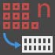
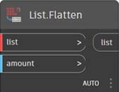
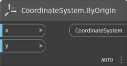
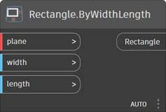

# Indeks węzłów

Ten indeks zawiera dodatkowe informacje o wszystkich węzłach zawartych w tym elementarzu, a także o pozostałych składnikach, które mogą być przydatne. Podano w nim tylko część z około 500 węzłów dostępnych w programie Dynamo.

## Widoczność

### Kolor

|                                            |                                                                                                                       |                                                           |
| ------------------------------------------ | --------------------------------------------------------------------------------------------------------------------- | --------------------------------------------------------- |
|                                            | TWORZENIE                                                                                                                |                                                           |
| .jpg>)      | 
<strong>Color.ByARGB</strong> Tworzy kolor według składowych: alfa, czerwony, zielony i niebieski.
                  | .jpg)         |
|              | 
<strong>Zakres kolorów</strong> Pobiera kolor z gradientu między kolorem początkowym i końcowym.
      |  (1).jpg>)      |
|                                            | DZIAŁANIA                                                                                                               |                                                           |
| .jpg>)  | 
<strong>Color.Brightness</strong> Pobiera wartość jasności tego koloru.
                                 |  (1).jpg>) |
|          | 
<strong>Color.Components</strong> Wyświetla listę składowych koloru w następującej kolejności: alfa, czerwony, zielony, niebieski.
 |            |
| .jpg>)  | 
<strong>Color.Saturation</strong> Pobiera wartość nasycenia tego koloru.
                                  |           |
|                | 
<strong>Color.Hue</strong> Pobiera wartość barwy tego koloru.
                                               |                  |
|                                            | ZAPYTANIE                                                                                                                 |                                                           |
| \(1\).jpg)   | 
<strong>Color.Alpha</strong> Znajduje składową alfa koloru, od 0 do 255.
                                 |                |
| .jpg>)        | 
<strong>Color.Blue</strong> Znajduje niebieską składową koloru, od 0 do 255.
                                   |                 |
| (1) (3).jpg>) | 
<strong>Color.Green</strong> Znajduje zieloną składową koloru, od 0 do 255.
                                 |                |
|                | 
<strong>Color.Red</strong> Znajduje czerwoną składową koloru, od 0 do 255.
                                     |                  |

|                                                       |                                                                                           |                                                               |
| ----------------------------------------------------- | ----------------------------------------------------------------------------------------- | ------------------------------------------------------------- |
|                                                       | TWORZENIE                                                                                    |                                                               |
| .jpg) | 
<strong>GeometryColor.ByGeometryColor</strong> Wyświetla geometrię za pomocą koloru.
 |  |

### Watch

|                                 |                                                                               |                                                  |
| ------------------------------- | ----------------------------------------------------------------------------- | ------------------------------------------------ |
|                                 | DZIAŁANIA                                                                       |                                                  |
|    | 
<strong>View.Watch</strong> Wizualizuje dane wyjściowe węzła.
           |        |
|  | 
<strong>View.Watch 3D</strong> Wyświetla dynamiczny podgląd geometrii.
 |  |

## Dane wejściowe

|                                         |                                                                                                          |                                                  |
| --------------------------------------- | -------------------------------------------------------------------------------------------------------- | ------------------------------------------------ |
|                                         | DZIAŁANIA                                                                                                  |                                                  |
|              | 
<strong>Boolean</strong> Wybór między true i false.
                                   |          |
| \(1\).jpg) | 
<strong>Code Block</strong> Umożliwia bezpośrednie utworzenie kodu DesignScript.
              |        |
|        | 
<strong>Directory Path</strong> Umożliwia wybranie katalogu w systemie, aby pobrać jego ścieżkę.
 |    |
|             | 
<strong>File Path</strong> Umożliwia wybranie pliku w systemie, aby pobrać jego nazwę
        |         |
|        | 
<strong>Integer Slider</strong> Suwak, który generuje wartości całkowite.
                         |    |
|               | 
<strong>Number</strong> Tworzy liczbę.
                                                      |  (1).jpg>) |
|         | 
<strong>Number Slider</strong> Suwak pozwalający uzyskać wartości liczbowe.
                          |     |
|               | 
<strong>String</strong> Tworzy ciąg.
                                                      |           |
|         | 
<strong>Object.IsNull</strong> Określa, czy podany obiekt ma wartość null.
                         |     |

## Lista

|                                            |                                                                                                                                                                                                                                               |                                                       |
| ------------------------------------------ | --------------------------------------------------------------------------------------------------------------------------------------------------------------------------------------------------------------------------------------------- | ----------------------------------------------------- |
|                                            | TWORZENIE                                                                                                                                                                                                                                        |                                                       |
|              | 
<strong>List.Create</strong> Tworzy nową listę z określonych danych wejściowych.
                                                                                                                                                              |            |
|             | 
<strong>List.Combine</strong> Stosuje kombinator do każdego elementu w dwóch sekwencjach.
                                                                                                                                                 |           |
|                   | 
<strong>Number Range</strong> Tworzy sekwencję liczb w określonym zakresie
                                                                                                                                                  | .jpg)           |
|                | 
<strong>Number Sequence</strong> Tworzy sekwencję liczb.
                                                                                                                                                                     |              |
|                                            | DZIAŁANIA                                                                                                                                                                                                                                       |                                                       |
|                | 
<strong>List.Chop</strong> Dzieli listę na zestaw list, z których każdy zawiera zadaną liczbę elementów.
                                                                                                                               |              |
|  (1).jpg>)         | 
<strong>List.Count</strong> Zwraca liczbę elementów przechowywanych w danej liście.
                                                                                                                                                   |             |
|             | 
<strong>List.Flatten</strong> Zrównuje zagnieżdżony wykaz list o określoną wartość.
                                                                                                                                                  |           |
|    | 
<strong>List.FilterByBoolMask</strong> Filtruje sekwencję, sprawdzając odpowiadające indeksy w osobnej liście wartości logicznych.
                                                                                                       |  |
|      | 
<strong>List.GetItemAtIndex</strong> Pobiera element z danej listy, który znajduje się w określonym indeksie.
                                                                                                                        |    |
|                                            | 
<strong>List.Map</strong> Stosuje funkcję do wszystkich elementów listy, generując z wyników nową listę.
                                                                                                                    |               |
|                                            | 
<strong>List.Reverse</strong> Tworzy nową listę zawierającą elementy z danej listy, ale w odwrotnej kolejności.
                                                                                                                        |           |
|  | 
<strong>List.ReplaceItemAtIndex</strong> Zastępuje element z danej listy, który znajduje się w określonym indeksie.
                                                                                                                  |    |
|        | 
<strong>List.ShiftIndices</strong> Przesuwa indeksy na liście w prawo o podaną wartość.
                                                                                                                                      |      |
|    | 
<strong>List.TakeEveryNthItem</strong> Pobiera elementy z danej listy w indeksach, które są wielokrotnością danej wartości, po uwzględnieniu podanego odsunięcia.
                                                                                  |  |
|           | 
<strong>List.Transpose</strong> Zamienia wiersze z kolumnami na liście list. Jeśli niektóre wiersze są krótsze niż inne, w tablicy wynikowej są wstawiane wartości null jako elementy zastępcze, tak aby zawsze uzyskać prostokąt.
 |         |

## Logika

|                        |                                                                                                                                                                                                              |                                     |
| ---------------------- | ------------------------------------------------------------------------------------------------------------------------------------------------------------------------------------------------------------ | ----------------------------------- |
|                        | DZIAŁANIA                                                                                                                                                                                                      |                                     |
|  | 
<strong>If</strong> Instrukcja warunkowa. Sprawdza wartość logiczną danych wejściowych przekazanych do sprawdzenia. Jeśli dane wejściowe są prawdziwe, generuje wartość wyjściową true. W przeciwnym razie generuje wartość wyjściową false.
 |  |

## Matematyka

|                                          |                                                                                                                              |                                                       |
| ---------------------------------------- | ---------------------------------------------------------------------------------------------------------------------------- | ----------------------------------------------------- |
|                                          | DZIAŁANIA                                                                                                                      |                                                       |
|               | 
<strong>Math.Cos</strong> Oblicza cosinus kąta.
                                                            |               |
|  | 
<strong>Math.DegreesToRadians</strong> Konwertuje wartość kąta w stopniach na wartość w radianach.
                        |  |
|               | 
<strong>Math.Pow</strong> Podnosi liczbę do określonej potęgi.
                                                  |               |
|  | 
<strong>Math.RadiansToDegrees</strong> Konwertuje wartość kąta w radianach na wartość w stopniach.
                        |  |
|        | 
<strong>Math.RemapRange</strong> Dostosowuje zakres listy liczb, zachowując współczynnik rozkładu.
   |        |
|               | 
<strong>Math.Sin</strong> Oblicza sinus kąta.
                                                              |               |
|               | 
<strong>Wzór</strong> Oblicza wartość wzoru matematycznego. Korzysta z funkcji NCalc. Zobacz sekcję http://ncalc.codeplex.com
 |               |
|  (1).jpg>)         | 
<strong>Mapowanie</strong> Przypisuje wartość do zakresu danych wejściowych.
                                                              |               |

## String

|                                    |                                                                                                                                                      |                                                  |
| ---------------------------------- | ---------------------------------------------------------------------------------------------------------------------------------------------------- | ------------------------------------------------ |
|                                    | DZIAŁANIA                                                                                                                                              |                                                  |
|    | 
<strong>String.Concat</strong> Łączy wiele ciągów w jeden.
                                                         |     |
|  | 
<strong>String.Contains</strong> Określa, czy dany ciąg zawiera dany podciąg.
                                              |   |
|      | 
<strong>String.Join</strong> Łączy wiele ciągów w jeden, wstawiając podany separator między poszczególnymi ciągami.
 | .jpg) |
|     | 
<strong>String.Split</strong> Dzieli pojedynczy ciąg na listę ciągów, z podziałami wyznaczanymi przez podane ciągi — separatory.
    |      |
|  | 
<strong>String.ToNumber</strong> Konwertuje ciąg na liczbę całkowitą lub zmiennoprzecinkową o podwójnej dokładności.
                                                              |   |

## Geometria

### Okrąg

|                                               |                                                                                                                                                          |                                                                  |
| --------------------------------------------- | -------------------------------------------------------------------------------------------------------------------------------------------------------- | ---------------------------------------------------------------- |
|                                               | TWORZENIE                                                                                                                                                   |                                                                  |
|  | 
<strong>Circle.ByCenterPointRadius</strong> Tworzy okrąg ze środkiem i promieniem wejściowym w płaszczyźnie globalnej XY, ze współrzędną globalną Z jako normalną.
 |  |
|        | 
<strong>Circle.ByPlaneRadius</strong> Tworzy okrąg ze środkiem w początku płaszczyzny wejściowej (głównym), leżący w płaszczyźnie wejściowej, o podanym promieniu.
  |              |

|                                                                       |                                                                                                                                                                                                    |                                                                            |
| --------------------------------------------------------------------- | -------------------------------------------------------------------------------------------------------------------------------------------------------------------------------------------------- | -------------------------------------------------------------------------- |
|                                                                       | TWORZENIE                                                                                                                                                                                             |                                                                            |
|                           | 
<strong>CoordinateSystem.ByOrigin</strong> Tworzy układ współrzędnych z początkiem w punkcie wejściowym, z osiami X i Y ustawionymi jako osie X i Y GUW.
                                               |                  |
|  (1).jpg>) | 
<strong>CoordinateSystem.ByCyclindricalCoordinates</strong> Tworzy układ współrzędnych o określonych parametrach współrzędnych walcowych względem określonego układu współrzędnych.
 |  |

### Prostopadłościan

|                                                              |                                                                                                                                            |                                                                  |
| ------------------------------------------------------------ | ------------------------------------------------------------------------------------------------------------------------------------------ | ---------------------------------------------------------------- |
|                                                              | TWORZENIE                                                                                                                                     |                                                                  |
| .jpg)                      | 
<strong>Cuboid.ByLengths</strong> Utwórz prostopadłościan wyśrodkowany na początku GUW, z określoną szerokością, długością i wysokością.
                        |                  |
|  (1).jpg>)            | 
<strong>Cuboid.ByLengths</strong> (origin)

Utwórz prostopadłościan wyśrodkowany w punkcie wejściowym, z określoną szerokością, długością i wysokością.
 |            |
|  (1).jpg>) | 
<strong>Cuboid.ByLengths</strong> (coordinateSystem)

Utwórz prostopadłościan wyśrodkowany na początku GUW, z określoną szerokością, długością i wysokością.
  |  |
|  (1).jpg>)                 | 
<strong>Cuboid.ByCorners</strong>

Utwórz prostopadłościan łączący punkt niski z punktem wysokim.
                                      |                  |
| .jpg)                        | 
<strong>Cuboid.Length</strong>

Zwraca wymiary wejściowe prostopadłościanu, NIE rzeczywiste wymiary przestrzeni globalnej**.
           |                     |
|  (1).jpg>)                     | 
<strong>Cuboid.Width</strong>

Zwraca wymiary wejściowe prostopadłościanu, NIE rzeczywiste wymiary przestrzeni globalnej**.
            |                      |
| .jpg)                        | 
<strong>Cuboid.Height</strong>

Zwraca wymiary wejściowe prostopadłościanu, NIE rzeczywiste wymiary przestrzeni globalnej**.
           |                     |
| .jpg)                 | 
<strong>BoundingBox.ToCuboid</strong>

Pobierz ramkę ograniczającą jako prostopadłościan bryłowy
                                                  |              |

**Innymi słowy: jeśli utworzysz długość szerokości prostopadłościanu (na osi X) równą 10 i przekształcisz go, stosując układ współrzędnych z 2-krotnym skalowaniem na osi X, szerokość nadal będzie wynosić 10. ASM nie pozwala wyodrębnić wierzchołków bryły w przewidywalnej kolejności, dlatego nie można określić wymiarów po przekształceniu. 

### Krzywa

|                                           |                                                                                                                                                  |                                                        |
| ----------------------------------------- | ------------------------------------------------------------------------------------------------------------------------------------------------ | ------------------------------------------------------ |
|                                           | DZIAŁANIA                                                                                                                                          |                                                        |
|           | 
<strong>Curve.Extrude</strong> (distance) Wyciąga krzywą w kierunku wektora normalnego.
                                             |           |
|  | 
<strong>Curve.PointAtParameter</strong> Pobiera punkt na krzywej o określonym parametrze między StartParameter() a EndParameter().
 |  |

### Modyfikatory geometrii

|                                           |                                                                                                                                    |                                                        |
| ----------------------------------------- | ---------------------------------------------------------------------------------------------------------------------------------- | ------------------------------------------------------ |
|                                           | DZIAŁANIA                                                                                                                            |                                                        |
|     | 
<strong>Geometry.DistanceTo</strong> Wyznacza odległość od tej geometrii do innej.
                                 |     |
|        | 
<strong>Geometry.Explode</strong> Rozdziela złożone (nierozdzielone) elementy na części składowe.
                |        |
|  | 
<strong>Geometry.ImportFromSAT</strong> Lista zaimportowanych geometrii.
                                                      |  |
|         | 
<strong>Geometry.Rotate</strong> (basePlane) Obraca obiekt wokół początku układu współrzędnych i wektora normalnego o kąt określony w stopniach.
 |         |
|      | 
<strong>Geometry.Translate</strong> Przekształca geometrię dowolnego typu o podaną odległość w podanym kierunku.
           |      |

### Linia

|                                                     |                                                                                                                                                          |                                                                  |
| --------------------------------------------------- | -------------------------------------------------------------------------------------------------------------------------------------------------------- | ---------------------------------------------------------------- |
|                                                     | TWORZENIE                                                                                                                                                   |                                                                  |
|       | 
<strong>Line.ByBestFitThroughPoints</strong> Tworzy linię najdokładniej przybliżającą do wykresu punktowego punktów.
                                       |       |
|  | 
<strong>Line.ByStartPointDirectionLength</strong> Tworzy linię prostą, zaczynając od punktu początkowego i wydłużając w kierunku wektora o określoną długość.
 |  |
|         | 
<strong>Line.ByStartPointEndPoint</strong> Tworzy linię prostą między dwoma punktami wejściowymi.
                                                   |         |
|                   | 
<strong>Line.ByTangency</strong> Tworzy linię styczną do krzywej wejściowej, umieszczoną w punkcie parametru krzywej wejściowej.
               |                   |
|                                                     | ZAPYTANIE                                                                                                                                                    |                                                                  |
|                    | 
<strong>Line.Direction</strong> Kierunek krzywej.
                                                                                    |                    |

### Krzywa NurbsCurve

|                                               |                                                                                                               |                                                            |
| --------------------------------------------- | ------------------------------------------------------------------------------------------------------------- | ---------------------------------------------------------- |
|                                               | Tworzenie                                                                                                        |                                                            |
|  | 
<strong>NurbsCurve.ByControlPoints</strong> Tworzy obiekt BSplineCurve przy użyciu jawnie podanych punktów sterujących.
 |  |
|         | 
<strong>NurbsCurve.ByPoints</strong> Tworzy obiekt BSplineCurve przez interpolację między punktami.
          |         |

### Powierzchnia NurbsSurface

|                                                 |                                                                                                                                                                                            |                                                              |
| ----------------------------------------------- | ------------------------------------------------------------------------------------------------------------------------------------------------------------------------------------------ | ------------------------------------------------------------ |
|                                                 | Tworzenie                                                                                                                                                                                     |                                                              |
|  | 
<strong>NurbsSurface.ByControlPoints</strong> Tworzy powierzchnię NURBS przy użyciu jawnie podanych punktów sterujących oraz kątów U i V podanych w stopniach.
                                             |  |
|         | 
<strong>NurbsSurface.ByPoints</strong> Tworzy powierzchnię NURBS przy użyciu interpolacji podanych punktów oraz kątów U i V podanych w stopniach. Powierzchnia wynikowa przecina wszystkie te punkty.
 |         |

### Płaszczyzna

|                                         |                                                                                                                  |                                                      |
| --------------------------------------- | ---------------------------------------------------------------------------------------------------------------- | ---------------------------------------------------- |
|                                         | TWORZENIE                                                                                                           |                                                      |
|  | 
<strong>Plane.ByOriginNormal</strong> Tworzy płaszczyznę wyśrodkowaną w punkcie głównym i mającą wejściowy wektor normalny.
 |  |
|              | 
<strong>Plane.XY</strong> Tworzy płaszczyznę w globalnej płaszczyźnie XY.
                                              |              |

### Punkt

|                                                 |                                                                                                                                           |                                                              |
| ----------------------------------------------- | ----------------------------------------------------------------------------------------------------------------------------------------- | ------------------------------------------------------------ |
|                                                 | TWORZENIE                                                                                                                                    |                                                              |
|  | 
<strong>Point.ByCartesianCoordinates</strong> Tworzy punkt w podanym układzie współrzędnych z trzema współrzędnymi kartezjańskimi.
          |  |
|         | 
<strong>Point.ByCoordinates</strong> (2d) Tworzy punkt na płaszczyźnie XY zadanej przez dwie współrzędne kartezjańskie. Składnik Z wynosi 0.
 |         |
|         | 
<strong>Point.ByCoordinates</strong> (3d) Tworzy punkt na podstawie trzech współrzędnych kartezjańskich.
                                           |         |
|                  | 
<strong>Point.Origin</strong> Pobiera punkt początku układu współrzędnych (0,0,0).
                                                                      |                  |
|                                                 | DZIAŁANIA                                                                                                                                   |                                                              |
|                     | 
<strong>Point.Add</strong> Dodaje wektor do punktu. Działa podobnie do Translate (Vector).
                                             |                     |
|                                                 | ZAPYTANIE                                                                                                                                     |                                                              |
|                       | 
<strong>Point.X</strong> Pobiera składową X punktu.
                                                                         |                       |
|                       | 
<strong>Point.Y</strong> Pobiera składową Y punktu.
                                                                         |                       |
|                       | 
<strong>Point.Z</strong> Pobiera składową Z punktu.
                                                                         |                       |

### Krzywa PolyCurve

|                                       |                                                                                                                                                                                       |                                                    |
| ------------------------------------- | ------------------------------------------------------------------------------------------------------------------------------------------------------------------------------------- | -------------------------------------------------- |
|                                       | TWORZENIE                                                                                                                                                                                |                                                    |
|  | 
<strong>Polycurve.ByPoints</strong> Tworzy krzywą złożoną z sekwencji linii łączących punkty. Aby powstała krzywa zamknięta, ostatni punkt powinien być w tym samym miejscu co punkt początkowy.
 |  |

### Prostokąt

|                                            |                                                                                                                                                                               |                                                         |
| ------------------------------------------ | ----------------------------------------------------------------------------------------------------------------------------------------------------------------------------- | ------------------------------------------------------- |
|                                            | TWORZENIE                                                                                                                                                                        |                                                         |
|  | 
<strong>Rectangle.ByWidthLength</strong> (Plane) Tworzy prostokąt ze środkiem w głównym punkcie na płaszczyźnie wejściowej, o szerokości wejściowej (długość osi X) i długości (długość osi Y).
 |  |

### Sfera

|                                               |                                                                                                                             |                                                            |
| --------------------------------------------- | --------------------------------------------------------------------------------------------------------------------------- | ---------------------------------------------------------- |
|                                               | TWORZENIE                                                                                                                      |                                                            |
|  | 
<strong>Sphere.ByCenterPointRadius</strong> Tworzy bryłę sferyczną ze środkiem w punkcie wejściowym, o podanym promieniu.
 |  |

### Powierzchnia

|                                                      |                                                                                                                                                      |                                                          |
| ---------------------------------------------------- | ---------------------------------------------------------------------------------------------------------------------------------------------------- | -------------------------------------------------------- |
|                                                      | TWORZENIE                                                                                                                                               |                                                          |
| .jpg)               | 
<strong>Surface.ByLoft</strong> Tworzy powierzchnię przez wyciągnięcie między krzywymi wejściowymi przekroju poprzecznego.
                                             |            |
|                    | 
<strong>Surface.ByPatch</strong> Tworzy powierzchnię przez wypełnienie wnętrza zamkniętej obwiedni określonej przez krzywe wejściowe.
                 |  (1).jpg>) |
|                                                      | DZIAŁANIA                                                                                                                                              |                                                          |
| .jpg)               | 
<strong>Surface.Offset</strong> Odsuwa powierzchnię w kierunku normalnej powierzchni o określoną odległość.
                                        |            |
|  (1).jpg>) | 
<strong>Surface.PointAtParameter</strong> Zwraca punkt dla określonych parametrów U i V.
                                              |  |
|  (1).jpg>)          | 
<strong>Surface.Thicken</strong> Pogrubia powierzchnię w celu utworzenia bryły, wyciągając w kierunku normalnych powierzchni po obu stronach powierzchni.
 |           |

### UV

|                                          |                                                                           |                                                  |
| ---------------------------------------- | ------------------------------------------------------------------------- | ------------------------------------------------ |
|                                          | TWORZENIE                                                                    |                                                  |
| .jpg) | 
<strong>UV.ByCoordinates</strong> Tworzy UV z dwóch wartości podwojonych.
 |  |

### Wektor

|                                              |                                                                                          |                                                      |
| -------------------------------------------- | ---------------------------------------------------------------------------------------- | ---------------------------------------------------- |
|                                              | TWORZENIE                                                                                   |                                                      |
| .jpg) | 
<strong>Vector.ByCoordinates</strong> Tworzy wektor z trzech współrzędnych euklidesowych.
 |  |
|  (1).jpg>)     | 
<strong>Vector.XAxis</strong> Pobiera kanoniczny wektor osi X (1,0,0).
         |              |
|  (1).jpg>)     | 
<strong>Vector.YAxis</strong> Pobiera kanoniczny wektor osi Y (0,1,0).
         |              |
|  (1).jpg>)     | 
<strong>Vector.ZAxis</strong> Pobiera kanoniczny wektor osi Z (0,0,1).
         |              |
|                                              | DZIAŁANIA                                                                                  |                                                      |
| .jpg)    | 
<strong>Vector.Normalized</strong> Pobiera znormalizowaną wersję wektora.
      |     |

## CoordinateSystem

|                                                                       |                                                                                                                                                                                                    |                                                                            |
| --------------------------------------------------------------------- | -------------------------------------------------------------------------------------------------------------------------------------------------------------------------------------------------- | -------------------------------------------------------------------------- |
|                                                                       | TWORZENIE                                                                                                                                                                                             |                                                                            |
|                           | 
<strong>CoordinateSystem.ByOrigin</strong> Tworzy układ współrzędnych z początkiem w punkcie wejściowym, z osiami X i Y ustawionymi jako osie X i Y GUW.
                                               |                  |
|  (1).jpg>) | 
<strong>CoordinateSystem.ByCyclindricalCoordinates</strong> Tworzy układ współrzędnych o określonych parametrach współrzędnych walcowych względem określonego układu współrzędnych.
 |  |

## Operatory

|                                              |                                                                                                                         |                                                 |
| -------------------------------------------- | ----------------------------------------------------------------------------------------------------------------------- | ----------------------------------------------- |
| \(1\).jpg)       | 
<strong>+</strong> Dodawanie
                                                                                   |        |
| (1) (1).jpg>)  | 
<strong>-</strong> Odejmowanie
                                                                                |     |
| \(1\).jpg) | 
<strong>*</strong> Mnożenie
                                                                             |  |
| \(1\).jpg)       | 
<strong>/</strong> Dzielenie
                                                                                   |        |
|  (1).jpg>)         | 
<strong>%</strong> Dzielenie modulo. Oblicza resztę z dzielenia pierwszej wartości wejściowej przez drugą.
 |         |
|  (1).jpg>)        | 
<strong><</strong> Mniejsze niż
                                                                             |        |
| .jpg)         | 
<strong>></strong> Większe niż
                                                                               |     |
| .jpg)                  | 
<strong>==</strong> Test równości między dwiema wartościami.
                                           |              |
