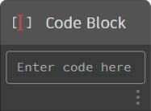
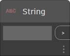
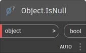
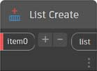
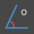
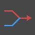
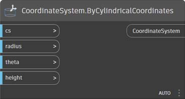

# 노드의 색인

이 색인에서는 이 Primer에 사용된 모든 노드 및 기타 유용할 수 있는 구성요소에 대한 추가 정보를 제공합니다. 여기에는 Dynamo에서 사용할 수 있는 500개의 노드 중 일부만 소개되어 있습니다.

## 화면표시

### 색상

|                                               |                                                                                                                       |                                                                   |
| --------------------------------------------- | --------------------------------------------------------------------------------------------------------------------- | ----------------------------------------------------------------- |
|                                               | CREATE                                                                                                                |                                                                   |
| \ (1).jpg>)     | 
<strong>Color.ByARGB</strong> 알파, 빨간색, 녹색, 파란색 구성요소로 색상을 구성합니다.
                  | \ (1).jpg>)             |
|                 | 
<strong>색상 범위</strong> 시작 색상과 끝 색상 간의 색상 그라데이션에서 색상을 가져옵니다.
      | \ (1) (1).jpg>)          |
|                                               | ACTION                                                                                                               |                                                                   |
| \ (1).jpg>) | 
<strong>Color.Brightness</strong> 이 색상의 밝기 값을 가져옵니다.
                                 | \ (1) (1) (1).jpg>) |
| \.jpg>)      | 
<strong>Color.Components</strong> 색상의 구성요소를 알파, 빨간색, 녹색, 파란색의 순서로 나열합니다.
 |                    |
| \ (1).jpg>) | 
<strong>Color.Saturation</strong> 이 색상의 채도 값을 가져옵니다.
                                  |                   |
| \.jpg>)            | 
<strong>Color.Hue</strong> 이 색상의 색조 값을 가져옵니다.
                                               |                          |
|                                               | QUERY                                                                                                                 |                                                                   |
| \(1) (1).jpg>)    | 
<strong>Color.Alpha</strong> 색상의 알파 구성요소를 찾습니다(0~255).
                                 |                        |
| \ (1).jpg>)       | 
<strong>Color.Blue</strong> 색상의 파란색 구성요소를 찾습니다(0~255).
                                   |                         |
| \(1) (1).jpg>)    | 
<strong>Color.Green</strong> 색상의 녹색 구성요소를 찾습니다(0~255).
                                 |                        |
| \ (1).jpg>)        | 
<strong>Color.Red</strong> 색상의 빨간색 구성요소를 찾습니다(0~255).
                                     |                          |

|                                                               |                                                                                           |                                                               |
| ------------------------------------------------------------- | ----------------------------------------------------------------------------------------- | ------------------------------------------------------------- |
|                                                               | CREATE                                                                                    |                                                               |
| \ (1) (1).jpg>) | 
<strong>GeometryColor.ByGeometryColor</strong> 색상을 사용하여 형상을 표시합니다.
 |  |

### Watch

|                                 |                                                                               |                                                  |
| ------------------------------- | ----------------------------------------------------------------------------- | ------------------------------------------------ |
|                                 | ACTION                                                                       |                                                  |
|    | 
<strong>View.Watch</strong> 노드의 출력을 시각화합니다.
           |        |
|  | 
<strong>View.Watch 3D</strong> 형상의 동적 미리보기를 표시합니다.
 |  |

## 입력

|                                             |                                                                                                          |                                                          |
| ------------------------------------------- | -------------------------------------------------------------------------------------------------------- | -------------------------------------------------------- |
|                                             | ACTION                                                                                                  |                                                          |
|                  | 
<strong>부울</strong> True와 False 사이에서 선택합니다.
                                   |                  |
| \(1) (1).jpg>)   | 
<strong>Code Block</strong> DesignScript 코드를 직접 작성할 수 있습니다.
              |                |
|            | 
<strong>디렉토리 경로</strong> 시스템에서 디렉토리를 선택하여 디렉토리 경로를 가져올 수 있습니다.
 |            |
|                 | 
<strong>파일 경로</strong> 시스템에서 파일을 선택하여 파일 이름을 가져올 수 있습니다.
        |                 |
|            | 
<strong>정수 슬라이더</strong> 정수 값을 생성하는 슬라이더입니다.
                         |            |
| \ (1) (1) (1).jpg>) | 
<strong>Number</strong> 숫자를 작성합니다.
                                                      | \ (1) (1) (1).jpg>) |
|             | 
<strong>번호 슬라이더</strong> 숫자 값을 생성하는 슬라이더입니다.
                          |             |
| \ (1) (1) (1).jpg>) | 
<strong>String</strong> 문자열을 작성합니다.
                                                      |                   |
|             | 
<strong>Object.IsNull</strong> 지정된 객체가 null인지 확인합니다.
                         |             |

## 리스트

|                                            |                                                                                                                                                                                                                                               |                                                            |
| ------------------------------------------ | --------------------------------------------------------------------------------------------------------------------------------------------------------------------------------------------------------------------------------------------- | ---------------------------------------------------------- |
|                                            | CREATE                                                                                                                                                                                                                                        |                                                            |
|              | 
<strong>List.Create</strong> 지정된 입력에서 새 리스트를 작성합니다.
                                                                                                                                                              |                 |
|             | 
<strong>List.Combine</strong> 두 시퀀스의 각 요소에 연결자를 적용합니다.
                                                                                                                                                 |                |
|                   | 
<strong>Number Range</strong> 지정된 범위에서 숫자의 시퀀스를 작성합니다.
                                                                                                                                                  | \ (1) (1).jpg>)        |
|                | 
<strong>Number Sequence</strong> 숫자의 시퀀스를 작성합니다.
                                                                                                                                                                     |                   |
|                                            | ACTION                                                                                                                                                                                                                                       |                                                            |
|                | 
<strong>List.Chop</strong> 리스트를 각각 지정된 양의 항목이 포함된 리스트 세트로 자릅니다.
                                                                                                                               |                   |
| \ (1) (1) (1).jpg>) | 
<strong>List.Count</strong> 지정된 리스트에 저장된 항목의 개수를 반환합니다.
                                                                                                                                                   | \(1) (1) (2) (6).jpg>) |
|             | 
<strong>List.Flatten</strong> 리스트의 내포된 리스트를 특정한 양만큼 단순화합니다.
                                                                                                                                                  |                |
|    | 
<strong>List.FilterByBoolMask</strong> 별도의 부울 리스트에서 해당하는 인덱스를 조회하여 시퀀스를 필터링합니다.
                                                                                                       |       |
|      | 
<strong>List.GetItemAtIndex</strong> 지정된 색인에 위치하는 지정된 리스트에서 항목을 가져옵니다.
                                                                                                                        |         |
|                                            | 
<strong>List.Map</strong> 리스트의 모든 요소에 함수를 적용하고 결과에서 새 리스트를 생성합니다.
                                                                                                                    |                    |
|                                            | 
<strong>List.Reverse</strong> 지정된 리스트의 항목이 역순으로 포함된 새 리스트를 작성합니다.
                                                                                                                        |                |
|  | 
<strong>List.ReplaceItemAtIndex</strong> 지정된 인덱스에 위치한 지정된 리스트에서 항목을 대체합니다.
                                                                                                                  |         |
|        | 
<strong>List.ShiftIndices</strong> 리스트의 인덱스를 지정된 수만큼 오른쪽으로 이동합니다.
                                                                                                                                      |           |
|    | 
<strong>List.TakeEveryNthItem</strong> 지정된 리스트에서 지정된 간격띄우기 이후 지정된 값의 배수인 인덱스의 항목을 가져옵니다.
                                                                                  |       |
|           | 
<strong>List.Transpose</strong> 리스트의 리스트에서 행과 열을 교체합니다. 다른 행보다 짧은 행이 몇 개 있을 경우 null 값이 결과 배열에 자리 표시자로 삽입되어 항상 직사각형이 되도록 합니다.
 |              |

## 논리

|                        |                                                                                                                                                                                                              |                                     |
| ---------------------- | ------------------------------------------------------------------------------------------------------------------------------------------------------------------------------------------------------------ | ----------------------------------- |
|                        | ACTION                                                                                                                                                                                                      |                                     |
|  | 
<strong>If</strong> 조건문입니다. 테스트 입력의 부울 값을 확인합니다. 테스트 입력이 true인 경우 결과에서 true 입력을 출력하고, 그렇지 않은 경우 결과에서 false 입력을 출력합니다.
 |  |

## 수학

|                                          |                                                                                                                              |                                                       |
| ---------------------------------------- | ---------------------------------------------------------------------------------------------------------------------------- | ----------------------------------------------------- |
|                                          | ACTION                                                                                                                      |                                                       |
|               | 
<strong>Math.Cos</strong> 각도의 코사인 값을 계산합니다.
                                                            |               |
|  | 
<strong>Math.DegreesToRadians</strong> 도 각도를 라디안 각도로 변환합니다.
                        |  |
|               | 
<strong>Math.Pow</strong> 숫자를 지정된 멱 수만큼 제곱합니다.
                                                  |               |
|  | 
<strong>Math.RadiansToDegrees</strong> 라디안 각도를 도 각도로 변환합니다.
                        |  |
|        | 
<strong>Math.RemapRange</strong> 분포 비율을 유지하면서 숫자 리스트의 범위를 조정합니다.
   |        |
|               | 
<strong>Math.Sin</strong> 각도의 사인을 계산합니다.
                                                              |               |
| \ (1) (1) (1).jpg>) | 
<strong>Map</strong> 값을 입력 범위로 매핑합니다.
                                                              |               |

## 문자열

|                                    |                                                                                                                                                      |                                                          |
| ---------------------------------- | ---------------------------------------------------------------------------------------------------------------------------------------------------- | -------------------------------------------------------- |
|                                    | ACTION                                                                                                                                              |                                                          |
|    | 
<strong>String.Concat</strong> 여러 문자열을 하나의 문자열로 연결합니다.
                                                         |             |
|  | 
<strong>String.Contains</strong> 지정된 문자열에 지정된 하위 문자열이 포함되어 있는지 확인합니다.
                                              |           |
|      | 
<strong>String.Join</strong> 결합되는 각 문자열 사이에 지정된 구분자를 삽입하여, 여러 문자열을 하나의 문자열로 연결합니다.
 | \ (1) (2).jpg>) |
|     | 
<strong>String.Split</strong> 단일 문자열을 지정된 구분 문자열을 사용하여 문자열 리스트로 구분합니다.
    |              |
|  | 
<strong>String.ToNumber</strong> 문자열을 정수 또는 double 값으로 변환합니다.
                                                              |           |

## 형상

### 원

|                                               |                                                                                                                                                          |                                                                  |
| --------------------------------------------- | -------------------------------------------------------------------------------------------------------------------------------------------------------- | ---------------------------------------------------------------- |
|                                               | CREATE                                                                                                                                                   |                                                                  |
|  | 
<strong>Circle.ByCenterPointRadius</strong> 표준 XY 평면의 입력 중심점과 반지름을 사용하고 표준 Z를 법선으로 사용하여 원을 작성합니다.
 |  |
|        | 
<strong>Circle.ByPlaneRadius</strong> 입력 평면 원점(루트)을 중심으로 지정된 반지름을 사용하여 입력 평면에 원을 작성합니다.
  |              |

|                                                                               |                                                                                                                                                                                                    |                                                                            |
| ----------------------------------------------------------------------------- | -------------------------------------------------------------------------------------------------------------------------------------------------------------------------------------------------- | -------------------------------------------------------------------------- |
|                                                                               | CREATE                                                                                                                                                                                             |                                                                            |
|                                   | 
<strong>CoordinateSystem.ByOrigin</strong> 입력 점을 원점으로 하고 X 및 Y축이 WCS X 및 Y축으로 설정된 CoordinateSystem을 작성합니다.
                                               |                  |
| \ (1) (1) (1).jpg>) | 
<strong>CoordinateSystem.ByCylindricalCoordinates</strong> 지정된 좌표계를 기준으로 지정된 원통형 좌표 매개변수에서 CoordinateSystem을 작성합니다.
 |  |

### 직육면체

|                                                                  |                                                                                                                                            |                                                                  |
| ---------------------------------------------------------------- | ------------------------------------------------------------------------------------------------------------------------------------------ | ---------------------------------------------------------------- |
|                                                                  | CREATE                                                                                                                                     |                                                                  |
| \ (1) (1).jpg>)                  | 
<strong>Cuboid.ByLengths</strong> WCS 원점을 중심으로 지정된 폭, 길이, 높이의 직육면체를 작성합니다.
                        |                  |
| \ (1) (1) (1).jpg>)        | 
<strong>Cuboid.ByLengths</strong>(원점)

입력 점을 중심으로 지정된 폭, 길이, 높이의 직육면체를 작성합니다.
 |            |
| \ (1) (1).jpg>) | 
<strong>Cuboid.ByLengths</strong>(coordinateSystem)

WCS 원점을 중심으로 지정된 폭, 길이, 높이의 직육면체를 작성합니다.
  |  |
| \ (1) (1) (1).jpg>)             | 
<strong>Cuboid.ByCorners</strong>

낮은 점에서 높은 점에 걸친 직육면체를 작성합니다.
                                      |                  |
| \ (1) (2).jpg>)                    | 
<strong>Cuboid.Length</strong>

이 함수는 실제 표준 공간 치수가 아니라 직육면체의 입력 치수를 반환합니다. **
           |                     |
| \ (1) (1) (1).jpg>)                 | 
<strong>Cuboid.Width</strong>

이 함수는 실제 표준 공간 치수가 아니라 직육면체의 입력 치수를 반환합니다. **
            |                      |
| \ (1) (1).jpg>)                    | 
<strong>Cuboid.Height</strong>

이 함수는 실제 표준 공간 치수가 아니라 직육면체의 입력 치수를 반환합니다. **
           |                     |
| \ (1).jpg>)                 | 
<strong>BoundingBox.ToCuboid</strong>

경계 상자를 솔리드 직육면체로 가져옵니다.
                                                  |              |

 **즉, 폭(X축) 길이가 10인 직육면체를 작성하고 X 축척을 두 배로 하여 CoordinateSystem으로 변환해도 폭은 여전히 10입니다. ASM에서는 예측 가능한 순서로 본체의 정점을 추출할 수 없으므로, 변환 후 치수를 결정할 수 없습니다. 

### 곡선

|                                           |                                                                                                                                                  |                                                        |
| ----------------------------------------- | ------------------------------------------------------------------------------------------------------------------------------------------------ | ------------------------------------------------------ |
|                                           | ACTION                                                                                                                                          |                                                        |
|           | 
<strong>Curve.Extrude</strong>(거리) 곡선을 법선 벡터 방향으로 돌출시킵니다.
                                             |           |
|  | 
<strong>Curve.PointAtParameter</strong> StartParameter() 및 EndParameter() 사이의 지정된 매개변수에서 곡선상의 점을 가져옵니다.
 |  |

### 형상 수정자

|                                           |                                                                                                                                    |                                                        |
| ----------------------------------------- | ---------------------------------------------------------------------------------------------------------------------------------- | ------------------------------------------------------ |
|                                           | ACTION                                                                                                                            |                                                        |
|     | 
<strong>Geometry.DistanceTo</strong> 이 형상에서 다른 형상까지의 거리를 가져옵니다.
                                 |     |
|        | 
<strong>Geometry.Explode</strong> 복합 또는 분리되지 않은 요소를 구성요소 부품으로 분리합니다.
                |        |
|  | 
<strong>Geometry.ImportFromSAT</strong> 가져온 형상 리스트입니다.
                                                      |  |
|         | 
<strong>Geometry.Rotate</strong>(basePlane) 객체를 평면 원점 및 법선 주위로 지정된 각도만큼 회전합니다.
 |         |
|      | 
<strong>Geometry.Translate</strong> 형상 유형을 지정된 방향으로 지정된 거리만큼 변환합니다.
           |      |

### 선

|                                                     |                                                                                                                                                          |                                                                  |
| --------------------------------------------------- | -------------------------------------------------------------------------------------------------------------------------------------------------------- | ---------------------------------------------------------------- |
|                                                     | CREATE                                                                                                                                                   |                                                                  |
|       | 
<strong>Line.ByBestFitThroughPoints</strong> 점의 산점도에 가장 가까운 선을 작성합니다.
                                       |       |
|  | 
<strong>Line.ByStartPointDirectionLength</strong> 점에서 시작하여 벡터 방향으로 지정된 길이만큼 연장되는 직선을 작성합니다.
 |  |
| \.jpg>)  | 
<strong>Line.ByStartPointEndPoint</strong> 두 입력 점 사이에 직선을 작성합니다.
                                                   |         |
|                   | 
<strong>Line.ByTangency</strong> 입력 곡선의 매개변수 점에서 입력 곡선에 접하는 선을 작성합니다.
               |                   |
|                                                     | QUERY                                                                                                                                                    |                                                                  |
|                    | 
<strong>Line.Direction</strong> 곡선 방향입니다.
                                                                                    |                    |

### NurbsCurve

|                                               |                                                                                                               |                                                            |
| --------------------------------------------- | ------------------------------------------------------------------------------------------------------------- | ---------------------------------------------------------- |
|                                               | Create                                                                                                        |                                                            |
|  | 
<strong>NurbsCurve.ByControlPoints</strong> 명시적 제어점을 사용하여 BSplineCurve를 작성합니다.
 |  |
|         | 
<strong>NurbsCurve.ByPoints</strong> 점 사이를 보간하여 BSplineCurve를 작성합니다.
          |         |

### NurbsSurface

|                                                 |                                                                                                                                                                                            |                                                              |
| ----------------------------------------------- | ------------------------------------------------------------------------------------------------------------------------------------------------------------------------------------------ | ------------------------------------------------------------ |
|                                                 | Create                                                                                                                                                                                     |                                                              |
|  | 
<strong>NurbsSurface.ByControlPoints</strong> 명시적 제어점과 지정된 U 및 V 각도를 사용하여 NurbsSurface를 작성합니다.
                                             |  |
|         | 
<strong>NurbsSurface.ByPoints</strong> 지정된 보간 점과 U 및 V 각도를 사용하여 NurbsSurface를 작성합니다. 결과 표면은 모든 점을 통과합니다.
 |         |

### 평면

|                                         |                                                                                                                  |                                                      |
| --------------------------------------- | ---------------------------------------------------------------------------------------------------------------- | ---------------------------------------------------- |
|                                         | CREATE                                                                                                           |                                                      |
|  | 
<strong>Plane.ByOriginNormal</strong> 루트 점을 중심으로 입력 법선 벡터를 사용하여 평면을 작성합니다.
 |  |
|              | 
<strong>Plane.XY</strong> 표준 XY 평면에 평면을 작성합니다.
                                              |              |

### 점

|                                                 |                                                                                                                                           |                                                              |
| ----------------------------------------------- | ----------------------------------------------------------------------------------------------------------------------------------------- | ------------------------------------------------------------ |
|                                                 | CREATE                                                                                                                                    |                                                              |
|  | 
<strong>Point.ByCartesianCoordinates</strong> 3개의 데카르트 좌표를 사용하여 지정된 좌표계에서 점을 형성합니다.
          |  |
|         | 
<strong>Point.ByCoordinates</strong>(2D) 지정된 2개의 데카르트 좌표를 사용하여 XY 평면에 점을 형성합니다. Z 구성요소는 0입니다.
 |         |
|         | 
<strong>Point.ByCoordinates</strong>(3D) 지정된 3개의 데카르트 좌표를 사용하여 점을 형성합니다.
                                           |         |
|                  | 
<strong>Point.Origin</strong> 원점(0,0,0)을 가져옵니다.
                                                                      |                  |
|                                                 | ACTION                                                                                                                                   |                                                              |
|                     | 
<strong>Point.Add</strong> 점에 벡터를 추가합니다. 변환(벡터)과 같습니다.
                                             |                     |
|                                                 | QUERY                                                                                                                                     |                                                              |
|                       | 
<strong>Point.X</strong> 점의 X 구성요소를 가져옵니다.
                                                                         |                       |
|                       | 
<strong>Point.Y</strong> 점의 Y 구성요소를 가져옵니다.
                                                                         |                       |
|                       | 
<strong>Point.Z</strong> 점의 Z 구성요소를 가져옵니다.
                                                                         |                       |

### 폴리 곡선

|                                       |                                                                                                                                                                                       |                                                    |
| ------------------------------------- | ------------------------------------------------------------------------------------------------------------------------------------------------------------------------------------- | -------------------------------------------------- |
|                                       | CREATE                                                                                                                                                                                |                                                    |
|  | 
<strong>Polycurve.ByPoints</strong> 점을 연결하는 일련의 선에서 PolyCurve를 작성합니다. 닫힌 곡선의 경우 마지막 점은 시작점과 같은 위치에 있어야 합니다.
 |  |

### 직사각형

|                                            |                                                                                                                                                                               |                                                         |
| ------------------------------------------ | ----------------------------------------------------------------------------------------------------------------------------------------------------------------------------- | ------------------------------------------------------- |
|                                            | CREATE                                                                                                                                                                        |                                                         |
|  | 
<strong>Rectangle.ByWidthLength</strong>(평면) 입력 평면 루트를 중심으로 입력 폭(평면 X축 길이)과 길이(평면 Y축 길이)를 사용하여 직사각형을 작성합니다.
 |  |

### 구

|                                               |                                                                                                                             |                                                            |
| --------------------------------------------- | --------------------------------------------------------------------------------------------------------------------------- | ---------------------------------------------------------- |
|                                               | CREATE                                                                                                                      |                                                            |
|  | 
<strong>Sphere.ByCenterPointRadius</strong> 입력 점을 중심으로 지정된 반지름을 사용하여 솔리드 구를 작성합니다.
 |  |

### 표면

|                                                          |                                                                                                                                                      |                                                              |
| -------------------------------------------------------- | ---------------------------------------------------------------------------------------------------------------------------------------------------- | ------------------------------------------------------------ |
|                                                          | CREATE                                                                                                                                               |                                                              |
| \(1) (1) (1) (1).jpg>)    | 
<strong>Surface.ByLoft</strong> 입력 횡단면 곡선 사이에서 로프트하여 표면을 작성합니다.
                                             |                |
| \(1) (1) (1) (2).jpg>)    | 
<strong>Surface.ByPatch</strong> 입력 곡선에 의해 정의된 닫힌 경계의 내부를 채워 표면을 작성합니다.
                 | \ (1) (1).jpg>) |
|                                                          | ACTION                                                                                                                                              |                                                              |
| \ (1) (2).jpg>)           | 
<strong>Surface.Offset</strong> 표면의 간격을 표면 법선 방향으로 지정된 거리만큼 띄웁니다.
                                        |                |
| \ (1) (1).jpg>) | 
<strong>Surface.PointAtParameter</strong> 지정된 U 및 V 매개변수에서 점을 반환합니다.
                                              |      |
| \ (1) (1) (2).jpg>)      | 
<strong>Surface.Thicken</strong> 표면을 두껍게 하여 솔리드로 만들고, 표면의 양쪽에서 표면 법선 방향으로 돌출합니다.
 |               |

### UV

|                                                  |                                                                           |                                                  |
| ------------------------------------------------ | ------------------------------------------------------------------------- | ------------------------------------------------ |
|                                                  | CREATE                                                                    |                                                  |
| \ (1) (2).jpg>) | 
<strong>UV.ByCoordinates</strong> 두 double 값에서 UV를 작성합니다.
 |  |

### 벡터

|                                                  |                                                                                          |                                                      |
| ------------------------------------------------ | ---------------------------------------------------------------------------------------- | ---------------------------------------------------- |
|                                                  | CREATE                                                                                   |                                                      |
| \ (1).jpg>) | 
<strong>Vector.ByCoordinates</strong> 3개의 유클리드 좌표로 벡터를 형성합니다.
 |  |
| \ (1) (1) (1).jpg>) | 
<strong>Vector.XAxis</strong> 표준 X축 벡터(1,0,0)를 가져옵니다.
         |              |
| \ (1) (1) (1).jpg>) | 
<strong>Vector.YAxis</strong> 표준 Y축 벡터(0,1,0)를 가져옵니다.
         |              |
| \ (1) (1) (1).jpg>) | 
<strong>Vector.ZAxis</strong> 표준 Z축 벡터(0,0,1)를 가져옵니다.
         |              |
|                                                  | ACTION                                                                                  |                                                      |
| \ (1).jpg>)    | 
<strong>Vector.Normalized</strong> 벡터의 정규화된 버전을 가져옵니다.
      |     |

## CoordinateSystem

|                                                                               |                                                                                                                                                                                                    |                                                                            |
| ----------------------------------------------------------------------------- | -------------------------------------------------------------------------------------------------------------------------------------------------------------------------------------------------- | -------------------------------------------------------------------------- |
|                                                                               | CREATE                                                                                                                                                                                             |                                                                            |
|                                   | 
<strong>CoordinateSystem.ByOrigin</strong> 입력 점을 원점으로 하고 X 및 Y축이 WCS X 및 Y축으로 설정된 CoordinateSystem을 작성합니다.
                                               |                  |
| \ (1) (1) (1).jpg>) | 
<strong>CoordinateSystem.ByCylindricalCoordinates</strong> 지정된 좌표계를 기준으로 지정된 원통형 좌표 매개변수에서 CoordinateSystem을 작성합니다.
 |  |

## 연산자

|                                                |                                                                                                                         |                                                 |
| ---------------------------------------------- | ----------------------------------------------------------------------------------------------------------------------- | ----------------------------------------------- |
| \(1) (1).jpg>)       | 
<strong>+</strong> 더하기
                                                                                   |        |
| \(1) (1).jpg>)    | 
<strong>-</strong> 빼기
                                                                                |     |
| \(1) (1).jpg>) | 
<strong>*</strong> 곱하기
                                                                             |  |
| \(1) (1).jpg>)       | 
<strong>/</strong> 나누기
                                                                                   |        |
| \ (1) (1).jpg>)       | 
<strong>%</strong> 모듈 방식 분할에서는 두 번째 입력으로 나눈 후 첫 번째 입력의 나머지를 계산합니다.
 |         |
| \ (1) (1).jpg>)      | 
<strong><</strong> 다음보다 작음
                                                                             |        |
| \ (1).jpg>)       | 
<strong>></strong> 다음보다 큼
                                                                               |     |
| \ (1).jpg>)                | 
<strong>==</strong> 두 값 간의 균일성에 대한 균일성 테스트입니다.
                                           |              |
