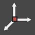
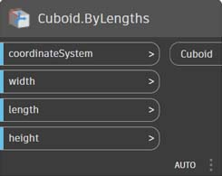
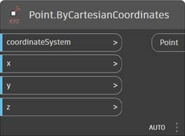
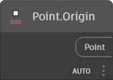
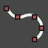

# ノードの索引

この索引では、この手引で言及しているすべてのノードと他の便利なコンポーネントについて、補足情報を提供します。ここで紹介するのは、Dynamo で使用できる 500 個のノードのうち一部にすぎません。

## Display

### Color ノード

|                                               |                                                                                                                       |                                                                   |
| --------------------------------------------- | --------------------------------------------------------------------------------------------------------------------- | ----------------------------------------------------------------- |
|                                               | CREATE                                                                                                                |                                                                   |
| (1).jpg>)     | 
<strong>Color.ByARGB</strong> アルファ、赤、緑、青の各成分から色を作成します。
                  | (1).jpg>)             |
|                 | 
<strong>Color Range</strong> 開始色と終了色間の色のグラデーションから色を取得します。
      | (1) (1).jpg>)          |
|                                               | ACTIONS                                                                                                               |                                                                   |
| (1).jpg>) | 
<strong>Color.Brightness</strong> 色の明度の値を取得します。
                                 | (1) (1) (1).jpg>) |
|.jpg>)      | 
<strong>Color.Components</strong> 色の各成分を、アルファ、赤、緑、青の順のリストとして返します。
 |                    |
| (1).jpg>) | 
<strong>Color.Saturation</strong> 色の彩度の値を取得します。
                                  |                   |
|.jpg>)            | 
<strong>Color.Hue</strong> 色の色相の値を取得します。
                                               |                          |
|                                               | QUERY                                                                                                                 |                                                                   |
|(1) (1).jpg>)    | 
<strong>Color.Alpha</strong> 色のアルファ成分の値(0 ～ 255)を取得します。
                                 |                        |
| (1).jpg>)       | 
<strong>Color.Blue</strong> 色の青色成分の値(0 ～ 255)を取得します。
                                   |                         |
|(1) (1).jpg>)    | 
<strong>Color.Green</strong> 色の緑色成分の値(0 ～ 255)を取得します。
                                 |                        |
| (1).jpg>)        | 
<strong>Color.Red</strong> 色の赤色成分の値(0 ～ 255)を取得します。
                                     |                          |

|                                                               |                                                                                           |                                                               |
| ------------------------------------------------------------- | ----------------------------------------------------------------------------------------- | ------------------------------------------------------------- |
|                                                               | CREATE                                                                                    |                                                               |
| (1) (1).jpg>) | 
<strong>GeometryColor.ByGeometryColor</strong> 任意の色を使用してジオメトリを表示します。
 |  |

### Watch ノード

|                                 |                                                                               |                                                  |
| ------------------------------- | ----------------------------------------------------------------------------- | ------------------------------------------------ |
|                                 | ACTIONS                                                                       |                                                  |
|    | 
<strong>View.Watch</strong> ノードの出力を視覚化します。
           |        |
|  | 
<strong>View.Watch 3D</strong> ジオメトリのダイナミック プレビューを表示します。
 |  |

## Input ノード

|                                             |                                                                                                          |                                                          |
| ------------------------------------------- | -------------------------------------------------------------------------------------------------------- | -------------------------------------------------------- |
|                                             | ACTIONS                                                                                                  |                                                          |
|                  | 
<strong>Boolean</strong> True と False のいずれかを選択します。
                                   |                  |
|(1) (1).jpg>)   | 
<strong>Code Block</strong> DesignScript のコードを直接作成することができます。
              |                |
|            | 
<strong>Directory Path</strong> システム上で任意のフォルダを選択して、そのパスを取得することができます。
 |            |
|                 | 
<strong>File Path</strong> システム上で任意のファイルを選択して、そのファイル名を取得することができます。
        |                 |
|            | 
<strong>Integer Slider</strong> 整数値を生成するスライダです。
                         |            |
| (1) (1) (1).jpg>) | 
<strong>Number</strong> 数値を作成します。
                                                      | (1) (1) (1).jpg>) |
|             | 
<strong>Number Slider</strong> 数値を生成するスライダです。
                          |             |
| (1) (1) (1).jpg>) | 
<strong>String</strong> 文字列を作成します。
                                                      |                   |
|             | 
<strong>Object.IsNull</strong> 指定されたオブジェクトが NULL であるかどうかを判断します。
                         |             |

## List ノード

|                                            |                                                                                                                                                                                                                                               |                                                            |
| ------------------------------------------ | --------------------------------------------------------------------------------------------------------------------------------------------------------------------------------------------------------------------------------------------- | ---------------------------------------------------------- |
|                                            | CREATE                                                                                                                                                                                                                                        |                                                            |
|              | 
<strong>List.Create</strong> 与えられた入力に基づいて新しいリストを作成します。
                                                                                                                                                              |                 |
|             | 
<strong>List.Combine</strong> 2 つのシーケンスの各要素にコンビネータを適用します。
                                                                                                                                                 |                |
|                   | 
<strong>Number Range</strong> 指定された範囲内で数値のシーケンスを作成します。
                                                                                                                                                  | (1) (1).jpg>)        |
|                | 
<strong>Number Sequence</strong> 数値のシーケンスを作成します。
                                                                                                                                                                     |                   |
|                                            | ACTIONS                                                                                                                                                                                                                                       |                                                            |
|                | 
<strong>List.Chop</strong> リストを、それぞれ指定された個数の項目から成るリストの集合に分割します。
                                                                                                                               |                   |
| (1) (1) (1).jpg>) | 
<strong>List.Count</strong> 指定されたリストに格納されている項目の数を返します。
                                                                                                                                                   |(1) (1) (2) (6).jpg>) |
|             | 
<strong>List.Flatten</strong> ネストされたリストのリストを、指定された量だけフラットにします。
                                                                                                                                                  |                |
|    | 
<strong>List.FilterByBoolMask</strong> 別個のブール値を要素に持つリスト内で対応するインデックスを検索して、シーケンスをフィルタします。
                                                                                                       |       |
|      | 
<strong>List.GetItemAtIndex</strong> リストの、指定されたインデックスにある項目を取得します。
                                                                                                                        |         |
|                                            | 
<strong>List.Map</strong> リスト内のすべての要素に関数を適用し、その結果から新しいリストを生成します。
                                                                                                                    |                    |
|                                            | 
<strong>List.Reverse</strong> 指定されたリスト内の項目を逆順で含む新しいリストを作成します。
                                                                                                                        |                |
|  | 
<strong>List.ReplaceItemAtIndex</strong> リストの、指定されたインデックスにある項目を置き換えます。
                                                                                                                  |         |
|        | 
<strong>List.ShiftIndices</strong> リスト内のインデックスを、指定された量だけ右に移動します。
                                                                                                                                      |           |
|    | 
<strong>List.TakeEveryNthItem</strong> 指定されたオフセットの後、指定された値の倍数であるインデックスの項目を、指定されたリストから取得します。
                                                                                  |       |
|           | 
<strong>List.Transpose</strong> 任意のリストのリストの行と列を入れ替えます。他の行よりも短い行がある場合は、作成される配列が常に長方形になるように、プレースホルダーとして NULL 値が挿入されます。
 |              |

## ロジック

|                        |                                                                                                                                                                                                              |                                     |
| ---------------------- | ------------------------------------------------------------------------------------------------------------------------------------------------------------------------------------------------------------ | ----------------------------------- |
|                        | ACTIONS                                                                                                                                                                                                      |                                     |
|  | 
<strong>If</strong> 条件ステートメントです。テスト入力のブール値をチェックします。テスト入力が true である場合は、結果として true の入力を出力します。false である場合は、結果として false の入力を出力します。
 |  |

## Math ノード

|                                          |                                                                                                                              |                                                       |
| ---------------------------------------- | ---------------------------------------------------------------------------------------------------------------------------- | ----------------------------------------------------- |
|                                          | ACTIONS                                                                                                                      |                                                       |
|               | 
<strong>Math.Cos</strong> 角度の余弦を求めます。
                                                            |               |
|  | 
<strong>Math.DegreesToRadians</strong> 度単位の角度をラジアン単位の角度に変換します。
                        |  |
|               | 
<strong>Math.Pow</strong> 指定された指数に対して値を累乗します。
                                                  |               |
|  | 
<strong>Math.RadiansToDegrees</strong> ラジアン単位の角度を度単位の角度に変換します。
                        |  |
|        | 
<strong>Math.RemapRange</strong> 分布比率を保持しながら数値のリストの範囲を調整します。
   |        |
|               | 
<strong>Math.Sin</strong> 角度の正弦を求めます。
                                                              |               |
|               | 
<strong>Formula</strong> 数学式を評価します。NCalc を評価に使用します。次を参照してください。http://ncalc.codeplex.com
 |               |
| (1) (1) (1).jpg>) | 
<strong>Map</strong> 値を入力された範囲にマッピングします。
                                                              |               |

## String ノード

|                                    |                                                                                                                                                      |                                                          |
| ---------------------------------- | ---------------------------------------------------------------------------------------------------------------------------------------------------- | -------------------------------------------------------- |
|                                    | ACTIONS                                                                                                                                              |                                                          |
|    | 
<strong>String.Concat</strong> 複数の文字列を 1 つの文字列に連結します。
                                                         |             |
|  | 
<strong>String.Contains</strong> 指定された文字列に指定されたサブストリングが含まれているかどうかを判断します。
                                              |           |
|      | 
<strong>String.Join</strong> 複数の文字列を 1 つの文字列に連結し、結合されるそれぞれの文字列の間に区切り文字を挿入します。
 | (1) (2).jpg>) |
|     | 
<strong>String.Split</strong> 1 つの文字列を文字列のリストに分割します。指定された区切り文字によって分割場所が決定されます。
    |              |
|  | 
<strong>String.ToNumber</strong> 文字列を整数または倍精度浮動小数点数に変換します。
                                                              |           |

## ジオメトリ

### Circle ノード

|                                               |                                                                                                                                                          |                                                                  |
| --------------------------------------------- | -------------------------------------------------------------------------------------------------------------------------------------------------------- | ---------------------------------------------------------------- |
|                                               | CREATE                                                                                                                                                   |                                                                  |
|  | 
<strong>Circle.ByCenterPointRadius</strong> 入力された中心点と半径をワールド座標系の XY 平面に持ち、ワールド座標系の Z 軸を法線とする円を作成します。
 |  |
|        | 
<strong>Circle.ByPlaneRadius</strong> 入力された平面の基準点(ルート)に中心を持ち、指定された半径を持つ円を平面上に作成します。
  |              |

|                                                                               |                                                                                                                                                                                                    |                                                                            |
| ----------------------------------------------------------------------------- | -------------------------------------------------------------------------------------------------------------------------------------------------------------------------------------------------- | -------------------------------------------------------------------------- |
|                                                                               | CREATE                                                                                                                                                                                             |                                                                            |
|                                   | 
<strong>CoordinateSystem.ByOrigin</strong> 入力された点に基準点を持ち、X 軸と Y 軸を WCS(ワールド座標系)の X 軸および Y 軸に設定した座標系を作成します。
                                               |                  |
| (1) (1) (1).jpg>) | 
<strong>CoordinateSystem.ByCyclindricalCoordinates</strong> 指定された座標系に対して、指定された円柱座標パラメータに基づいて座標系を作成します。
 |  |

### Cuboid ノード

|                                                                  |                                                                                                                                            |                                                                  |
| ---------------------------------------------------------------- | ------------------------------------------------------------------------------------------------------------------------------------------ | ---------------------------------------------------------------- |
|                                                                  | CREATE                                                                                                                                     |                                                                  |
| (1) (1).jpg>)                  | 
<strong>Cuboid.ByLengths</strong> ワールド座標系の基準点を中心として、幅、長さ、高さを持つ直方体を作成します。
                        |                  |
| (1) (1) (1).jpg>)        | 
<strong>Cuboid.ByLengths</strong> (origin)

中心を入力された点に設定し、指定された幅、長さ、高さの直方体を作成します。
 |            |
| (1) (1).jpg>) | 
<strong>Cuboid.ByLengths</strong> (coordinateSystem)

ワールド座標系の基準点を中心として、幅、長さ、高さを持つ直方体を作成します。
  |  |
| (1) (1) (1).jpg>)             | 
<strong>Cuboid.ByCorners</strong>

lowPoint から highPoint までの範囲に広がる直方体を作成します。
                                      |                  |
| (1) (2).jpg>)                    | 
<strong>Cuboid.Length</strong>

実際のワールド空間寸法ではなく、直方体の入力寸法を返します。**
           |                     |
| (1) (1) (1).jpg>)                 | 
<strong>Cuboid.Width</strong>

実際のワールド空間寸法ではなく、直方体の入力寸法を返します。**
            |                      |
| (1) (1).jpg>)                    | 
<strong>Cuboid.Height</strong>

実際のワールド空間寸法ではなく、直方体の入力寸法を返します。**
           |                     |
| (1).jpg>)                 | 
<strong>BoundingBox.ToCuboid</strong>

ソリッドの直方体として境界ボックスを取得します。
                                                  |              |


**つまり、直方体の幅(X 軸)の長さ 10 を作成し、それを X 軸で 2 倍のスケーリングを行う座標系に変換しても、幅は 10 のままです。ASM では、ボディの頂点を予測可能な順序で抽出することができないため、変換後に寸法を決定することはできません。


### Curve ノード

|                                           |                                                                                                                                                  |                                                        |
| ----------------------------------------- | ------------------------------------------------------------------------------------------------------------------------------------------------ | ------------------------------------------------------ |
|                                           | ACTIONS                                                                                                                                          |                                                        |
|           | 
<strong>Curve.Extrude</strong> (distance) 法線ベクトルの方向に曲線を押し出します。
                                             |           |
|  | 
<strong>Curve.PointAtParameter</strong> StartParameter() から EndParameter() までの範囲の指定されたパラメータで曲線上の点を取得します。
 |  |

### ジオメトリ モディファイア

|                                           |                                                                                                                                    |                                                        |
| ----------------------------------------- | ---------------------------------------------------------------------------------------------------------------------------------- | ------------------------------------------------------ |
|                                           | ACTIONS                                                                                                                            |                                                        |
|     | 
<strong>Geometry.DistanceTo</strong> このジオメトリから別のジオメトリへの距離を取得します。
                                 |     |
|        | 
<strong>Geometry.Explode</strong> 複合要素または分割されていない要素をコンポーネント パーツに分割します。
                |        |
|  | 
<strong>Geometry.ImportFromSAT</strong> 読み込まれたジオメトリのリストです。
                                                      |  |
|         | 
<strong>Geometry.Rotate</strong> (basePlane) 平面の基準点と法線を中心にオブジェクトを指定された角度だけ回転させます。
 |         |
|      | 
<strong>Geometry.Translate</strong> 指定された方向に距離を指定して、ジオメトリ タイプを平行移動させます。
           |      |

### Line ノード

|                                                     |                                                                                                                                                          |                                                                  |
| --------------------------------------------------- | -------------------------------------------------------------------------------------------------------------------------------------------------------- | ---------------------------------------------------------------- |
|                                                     | CREATE                                                                                                                                                   |                                                                  |
|       | 
<strong>Line.ByBestFitThroughPoints</strong> 点の散布図に最もよく近似する直線を作成します。
                                       |       |
|  | 
<strong>Line.ByStartPointDirectionLength</strong> 開始点から始まり、ベクトルの向きに指定された長さだけ延長する線分を作成します。
 |  |
|.jpg>)  | 
<strong>Line.ByStartPointEndPoint</strong> 入力された 2 点を端点とする線分を作成します。
                                                   |         |
|                   | 
<strong>Line.ByTangency</strong> 入力された曲線に接し、曲線のパラメータで指定された点に位置する直線を作成します。
               |                   |
|                                                     | QUERY                                                                                                                                                    |                                                                  |
|                    | 
<strong>Line.Direction</strong> 曲線の方向を返します。
                                                                                    |                    |

### NurbsCurve ノード

|                                               |                                                                                                               |                                                            |
| --------------------------------------------- | ------------------------------------------------------------------------------------------------------------- | ---------------------------------------------------------- |
|                                               | Create                                                                                                        |                                                            |
|  | 
<strong>NurbsCurve.ByControlPoints</strong> 明示的な制御点を使用して B スプライン曲線を作成します。
 |  |
|         | 
<strong>NurbsCurve.ByPoints</strong> 点間を補間して B スプライン曲線を作成します。
          |         |

### NurbsSurface ノード

|                                                 |                                                                                                                                                                                            |                                                              |
| ----------------------------------------------- | ------------------------------------------------------------------------------------------------------------------------------------------------------------------------------------------ | ------------------------------------------------------------ |
|                                                 | Create                                                                                                                                                                                     |                                                              |
|  | 
<strong>NurbsSurface.ByControlPoints</strong> 明示的な制御点と指定された U 次数と V 次数を使用して NURBS 曲面 を作成します。
                                             |  |
|         | 
<strong>NurbsSurface.ByPoints</strong> 指定された補間される点、U 次数、V 次数を使用して NURBS 曲面を作成します。作成されるサーフェスはすべての指定された点を通過します。
 |         |

### Plane ノード

|                                         |                                                                                                                  |                                                      |
| --------------------------------------- | ---------------------------------------------------------------------------------------------------------------- | ---------------------------------------------------- |
|                                         | CREATE                                                                                                           |                                                      |
|  | 
<strong>Plane.ByOriginNormal</strong> 中心をルート点に持ち、入力された法線ベクトルを持つ平面を作成します。
 |  |
|              | 
<strong>Plane.XY</strong> ワールド座標系の XY に平面を作成します。
                                              |              |

### Point ノード

|                                                 |                                                                                                                                           |                                                              |
| ----------------------------------------------- | ----------------------------------------------------------------------------------------------------------------------------------------- | ------------------------------------------------------------ |
|                                                 | CREATE                                                                                                                                    |                                                              |
|  | 
<strong>Point.ByCartesianCoordinates</strong> 指定された座標系と 3 つのデカルト座標で点を作成します。
          |  |
|         | 
<strong>Point.ByCoordinates</strong> (2d) 指定された 2 つのデカルト座標を使用して、XY 平面に点を作成します。Z コンポーネントは 0 です。
 |         |
|         | 
<strong>Point.ByCoordinates</strong> (3d) 指定された 3 つのデカルト座標を使用して点を作成します。
                                           |         |
|                  | 
<strong>Point.Origin</strong> 基準点 (0,0,0)を取得します。
                                                                      |                  |
|                                                 | ACTIONS                                                                                                                                   |                                                              |
|                     | 
<strong>Point.Add</strong> 点にベクトルを追加します。Translate(Vector)と同じ操作です。
                                             |                     |
|                                                 | QUERY                                                                                                                                     |                                                              |
|                       | 
<strong>Point.X</strong> 点の X 座標を取得します。
                                                                         |                       |
|                       | 
<strong>Point.Y</strong> 点の Y 座標を取得します。
                                                                         |                       |
|                       | 
<strong>Point.Z</strong> 点の Z 座標を取得します。
                                                                         |                       |

### Polycurve ノード

|                                       |                                                                                                                                                                                       |                                                    |
| ------------------------------------- | ------------------------------------------------------------------------------------------------------------------------------------------------------------------------------------- | -------------------------------------------------- |
|                                       | CREATE                                                                                                                                                                                |                                                    |
|  | 
<strong>Polycurve.ByPoints</strong> 点をつなげる線分のシーケンスからポリカーブを作成します。閉じた曲線を作成するには、最後の点の位置を始点の位置と同じにします。
 |  |

### Rectangle ノード

|                                            |                                                                                                                                                                               |                                                         |
| ------------------------------------------ | ----------------------------------------------------------------------------------------------------------------------------------------------------------------------------- | ------------------------------------------------------- |
|                                            | CREATE                                                                                                                                                                        |                                                         |
|  | 
<strong>Rectangle.ByWidthLength</strong> (Plane) 入力された幅(平面の X 軸の長さ)と高さ(平面の Y 軸の長さ)を使用して、平面のルートを中心とする長方形を作成します。
 |  |

### Sphere ノード

|                                               |                                                                                                                             |                                                            |
| --------------------------------------------- | --------------------------------------------------------------------------------------------------------------------------- | ---------------------------------------------------------- |
|                                               | CREATE                                                                                                                      |                                                            |
|  | 
<strong>Sphere.ByCenterPointRadius</strong> 入力された点を中心とし、指定された半径を持つソリッド球体を作成します。
 |  |

### Surface ノード

|                                                          |                                                                                                                                                      |                                                              |
| -------------------------------------------------------- | ---------------------------------------------------------------------------------------------------------------------------------------------------- | ------------------------------------------------------------ |
|                                                          | CREATE                                                                                                                                               |                                                              |
|(1) (1) (1) (1).jpg>)    | 
<strong>Surface.ByLoft</strong> 入力された断面曲線間をロフトしてサーフェスを作成します。
                                             |                |
|(1) (1) (1) (2).jpg>)    | 
<strong>Surface.ByPatch</strong> 入力された曲線で設定される閉じた境界の内部を塗り潰してサーフェスを作成します。
                 | (1) (1).jpg>) |
|                                                          | ACTIONS                                                                                                                                              |                                                              |
| (1) (2).jpg>)           | 
<strong>Surface.Offset</strong> サーフェスの法線の方向に指定された距離だけサーフェスをオフセットします。
                                        |                |
| (1) (1).jpg>) | 
<strong>Surface.PointAtParameter</strong> 指定された U および V パラメータの点を返します。
                                              |      |
| (1) (1) (2).jpg>)      | 
<strong>Surface.Thicken</strong> サーフェスに厚みを持たせてソリッドを作成します。サーフェスを法線の方向に両側に押し出します。
 |               |

### UV ノード

|                                                  |                                                                           |                                                  |
| ------------------------------------------------ | ------------------------------------------------------------------------- | ------------------------------------------------ |
|                                                  | CREATE                                                                    |                                                  |
| (1) (2).jpg>) | 
<strong>UV.ByCoordinates</strong> 2 つの倍精度浮動小数点値から UV を作成します。
 |  |

### Vector ノード

|                                                  |                                                                                          |                                                      |
| ------------------------------------------------ | ---------------------------------------------------------------------------------------- | ---------------------------------------------------- |
|                                                  | CREATE                                                                                   |                                                      |
| (1).jpg>) | 
<strong>Vector.ByCoordinates</strong> 3 つのユークリッド座標でベクトルを形成します。
 |  |
| (1) (1) (1).jpg>) | 
<strong>Vector.XAxis</strong> 基底 X 軸ベクトル(1,0,0)を取得します。
         |              |
| (1) (1) (1).jpg>) | 
<strong>Vector.YAxis</strong> 基底 Y 軸ベクトル(0,1,0)を取得します。
         |              |
| (1) (1) (1).jpg>) | 
<strong>Vector.ZAxis</strong> 基底 Z 軸ベクトル(0,0,1)を取得します。
         |              |
|                                                  | ACTIONS                                                                                  |                                                      |
| (1).jpg>)    | 
<strong>Vector.Normalized</strong> 正規化されたベクトルを取得します。
      |     |

## CoordinateSystem ノード

|                                                                               |                                                                                                                                                                                                    |                                                                            |
| ----------------------------------------------------------------------------- | -------------------------------------------------------------------------------------------------------------------------------------------------------------------------------------------------- | -------------------------------------------------------------------------- |
|                                                                               | CREATE                                                                                                                                                                                             |                                                                            |
|                                   | 
<strong>CoordinateSystem.ByOrigin</strong> 入力された点に基準点を持ち、X 軸と Y 軸を WCS(ワールド座標系)の X 軸および Y 軸に設定した座標系を作成します。
                                               |                  |
| (1) (1) (1).jpg>) | 
<strong>CoordinateSystem.ByCyclindricalCoordinates</strong> 指定された座標系に対して、指定された円柱座標パラメータに基づいて座標系を作成します。
 |  |

## Operators

|                                                |                                                                                                                         |                                                 |
| ---------------------------------------------- | ----------------------------------------------------------------------------------------------------------------------- | ----------------------------------------------- |
|(1) (1).jpg>)       | 
<strong>+</strong> 加算
                                                                                   |        |
|(1) (1).jpg>)    | 
<strong>-</strong> 減算
                                                                                |     |
|(1) (1).jpg>) | 
<strong>*</strong> 乗算
                                                                             |  |
|(1) (1).jpg>)       | 
<strong>/</strong> 除算
                                                                                   |        |
| (1) (1).jpg>)       | 
<strong>%</strong> 剰余演算により、1 番目の入力を 2 番目の入力で除算して剰余を取得します。
 |         |
| (1) (1).jpg>)      | 
<strong><</strong> より小さい
                                                                             |        |
| (1).jpg>)       | 
<strong>></strong> より大きい
                                                                               |     |
| (1).jpg>)                | 
<strong>==</strong> 2 つの値が等しいかどうか検証します。
                                           |              |
