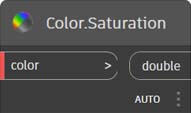
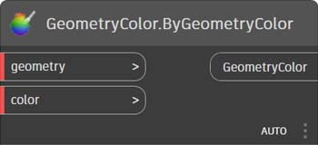
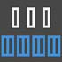
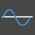
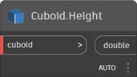
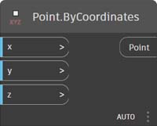

# Rejstřík uzlů

Tento rejstřík nabízí dodatečné informace o všech uzlech použitých v této příručce a také dalších komponentách, které mohou být užitečné. Jedná se pouze o představení některých z 500 uzlů dostupných v aplikaci Dynamo.

## Zobrazení

### Barva

|                                            |                                                                                                                       |                                                           |
| ------------------------------------------ | --------------------------------------------------------------------------------------------------------------------- | --------------------------------------------------------- |
|                                            | TVORBA                                                                                                                |                                                           |
|           | 
<strong>Color.ByARGB</strong> Umožňuje vytvořit barvu pomocí alfa, červené, zelené a modré složky.
                  |  (1) (1).jpg>) |
|              | 
<strong>Color Range</strong> Vrací barvu z barevného gradientu mezi počáteční a koncovou barvou.
      | .jpg)          |
|                                            | AKCE                                                                                                               |                                                           |
|       | 
<strong>Color.Brightness</strong> Vrací hodnotu jasu této barvy.
                                 | .jpg)     |
| .jpg>) | 
<strong>Color.Components</strong> Zobrazí seznam složek barvy v pořadí: alfa, červená, zelená a modrá.
 |            |
|       | 
<strong>Color.Saturation</strong> Vrací hodnotu sytosti této barvy.
                                  |           |
|              | 
<strong>Color.Hue</strong> Vrací hodnotu odstínu této barvy.
                                               |                  |
|                                            | DOTAZ                                                                                                                 |                                                           |
| .jpg>)     | 
<strong>Color.Alpha</strong> Umožňuje najít alfa složku barvy, 0 až 255.
                                 |                |
|             | 
<strong>Color.Blue</strong> Umožňuje zjistit modrou složku barvy, 0 až 255.
                                   |                 |
|            | 
<strong>Color.Green</strong> Umožňuje zjistit zelenou složku barvy, 0 až 255.
                                 |                |
|              | 
<strong>Color.Red</strong> Umožňuje zjistit červenou složku barvy, 0 až 255.
                                     |                  |

|                                                               |                                                                                           |                                                               |
| ------------------------------------------------------------- | ----------------------------------------------------------------------------------------- | ------------------------------------------------------------- |
|                                                               | TVORBA                                                                                    |                                                               |
|  (1) (1).jpg>) | 
<strong>GeometryColor.ByGeometryColor</strong> Zobrazit geometrii v barvě.
 |  |

### Watch

|                                 |                                                                               |                                                  |
| ------------------------------- | ----------------------------------------------------------------------------- | ------------------------------------------------ |
|                                 | AKCE                                                                       |                                                  |
|    | 
<strong>View.Watch</strong> Vizualizuje výstup uzlu.
           |        |
|  | 
<strong>View.Watch 3D</strong> Zobrazí dynamický náhled geometrie.
 |  |

## Vstup

|                                       |                                                                                                          |                                                |
| ------------------------------------- | -------------------------------------------------------------------------------------------------------- | ---------------------------------------------- |
|                                       | AKCE                                                                                                  |                                                |
|            | 
<strong>Boolean</strong> Výběr mezi hodnotami true a false.
                                   |        |
| .jpg>) | 
<strong>Code Block</strong> Umožňuje přímou tvorbu kódu DesignScript.
              |      |
|      | 
<strong>Directory Path</strong> Umožňuje vybrat adresář v systému a načíst jeho cestu.
 |  |
|           | 
<strong>File Path</strong> Umožňuje výběr souboru v systému a získá jeho název.
        |       |
|      | 
<strong>Integer Slider</strong> Posuvník, který vytváří celočíselné hodnoty.
                         |  |
|  (1).jpg>)   | 
<strong>Number</strong> Vytvoří číslo.
                                                      | .jpg)   |
|       | 
<strong>Number Slider</strong> Posuvník, který vytváří číselné hodnoty.
                          |   |
|  (1).jpg>)   | 
<strong>Řetězec</strong> Vytvoří řetězec.
                                                      |         |
|       | 
<strong>Object.IsNull</strong> Určuje, zda má zadaný objekt hodnotu null.
                         |   |

## Seznam

|                                            |                                                                                                                                                                                                                                               |                                                        |
| ------------------------------------------ | --------------------------------------------------------------------------------------------------------------------------------------------------------------------------------------------------------------------------------------------- | ------------------------------------------------------ |
|                                            | TVORBA                                                                                                                                                                                                                                        |                                                        |
|              | 
<strong>List.Create</strong> Vytvoří nový seznam ze zadaných vstupů.
                                                                                                                                                              |             |
|             | 
<strong>List.Combine</strong> Použije kombinátor na každý prvek ve dvou posloupnostech.
                                                                                                                                                 |            |
|                   | 
<strong>Number Range</strong> Vytvoří posloupnost čísel v zadaném rozsahu.
                                                                                                                                                  |  (1).jpg>)        |
|                | 
<strong>Number Sequence</strong> Vytvoří posloupnost čísel.
                                                                                                                                                                     |               |
|                                            | AKCE                                                                                                                                                                                                                                       |                                                        |
|                | 
<strong>List.Chop</strong> Rozdělí seznam do sady seznamů, z nichž každý obsahuje dané množství položek.
                                                                                                                               |               |
| .jpg)             | 
<strong>List.Count</strong> Vrací počet položek uložených v daném seznamu.
                                                                                                                                                   | (1) (1) (1).jpg>) |
|             | 
<strong>List.Flatten</strong> Vyrovná vnořený seznam seznamů o určitou hodnotu.
                                                                                                                                                  |            |
|    | 
<strong>List.FilterByBoolMask</strong> Filtruje posloupnost na základě vyhledávání příslušných indexů v samostatném seznamu logických hodnot.
                                                                                                       |   |
|      | 
<strong>List.GetItemAtIndex</strong> Vrací položku z daného seznamu, která se nachází na určeném indexu.
                                                                                                                        |     |
|                                            | 
<strong>List.Map</strong> Použije funkci na všechny prvky v seznamu, čím z výsledků vytvoří nový seznam.
                                                                                                                    |                |
|                                            | 
<strong>List.Reverse</strong> Vytvoří nový seznam obsahující položky daného seznamu, ale v obráceném pořadí.
                                                                                                                        |            |
|  | 
<strong>List.ReplaceItemAtIndex</strong> Nahradí položku z daného seznamu, která se nachází na daném indexu.
                                                                                                                  |     |
|        | 
<strong>List.ShiftIndices</strong> Posune indexy v seznamu doprava o zadané množství.
                                                                                                                                      |       |
|    | 
<strong>List.TakeEveryNthItem</strong> Načte položky ze zadaného seznamu na indexech, které jsou násobky dané hodnoty s daným odsazením.
                                                                                  |   |
|           | 
<strong>List.Transpose</strong> Prohodí řádky a sloupce v seznamu seznamů. Pokud jsou některé řádky kratší než jiné, budou jako zástupné znaky do výsledného pole vloženy hodnoty null, tak aby pole stále bylo pravoúhlé.
 |          |

## Logika

|                          |                                                                                                                                                                                                              |                                     |
| ------------------------ | ------------------------------------------------------------------------------------------------------------------------------------------------------------------------------------------------------------ | ----------------------------------- |
|                          | AKCE                                                                                                                                                                                                      |                                     |
|  | 
<strong>Pokud</strong> Podmíněný výraz. Zkontroluje booleovskou hodnotu testovacího vstupu. Pokud má testovací vstup hodnotu true, výsledný výstup bude mít hodnotu true, v opačném případě bude mít hodnotu false.
 |  |

## Matematika

|                                          |                                                                                                                              |                                                       |
| ---------------------------------------- | ---------------------------------------------------------------------------------------------------------------------------- | ----------------------------------------------------- |
|                                          | AKCE                                                                                                                      |                                                       |
|               | 
<strong>Math.Cos</strong> Vrací kosinus úhlu.
                                                            |               |
|  | 
<strong>Math.DegreesToRadians</strong> Převede úhel ve stupních na úhel v radiánech.
                        |  |
|               | 
<strong>Math.Pow</strong> Umocní číslo na danou mocninu.
                                                  |               |
|  | 
<strong>Math.RadiansToDegrees</strong> Převede úhel v radiánech na úhel ve stupních.
                        |  |
|        | 
<strong>Math.RemapRange</strong> Upraví rozsah seznamu čísel při zachování poměru rozložení.
   |        |
|               | 
<strong>Math.Sin</strong> Najde sinus úhlu.
                                                              |               |
|             | 
<strong>Formula</strong> Vyhodnocuje matematické vzorce. K vyhodnocení používá NCalc. Viz http://ncalc.codeplex.com
 |               |
| .jpg)             | 
<strong>Map</strong> Mapuje hodnotu do vstupního rozsahu.
                                                              |               |

## String

|                                    |                                                                                                                                                      |                                                          |
| ---------------------------------- | ---------------------------------------------------------------------------------------------------------------------------------------------------- | -------------------------------------------------------- |
|                                    | AKCE                                                                                                                                              |                                                          |
|    | 
<strong>String.Concat</strong> Zřetězí více řetězců do jediného řetězce.
                                                         |             |
|  | 
<strong>String.Contains</strong> Určuje, zda zadaný řetězec obsahuje daný dílčí řetězec.
                                              |           |
|      | 
<strong>String.Join</strong> Zřetězí více řetězců do jediného řetězce, přičemž vloží daný oddělovač mezi každý spojený řetězec.
 |  (1) (1).jpg>) |
|     | 
<strong>String.Split</strong> Rozdělí jeden řetězec na seznam řetězců, s dělením určeným podle daných oddělovacích řetězců.
    |              |
|  | 
<strong>String.ToNumber</strong> Převádí řetězec na celé číslo nebo hodnotu typu double.
                                                              |           |

## Geometrie

### Kružnice

|                                               |                                                                                                                                                          |                                                                  |
| --------------------------------------------- | -------------------------------------------------------------------------------------------------------------------------------------------------------- | ---------------------------------------------------------------- |
|                                               | TVORBA                                                                                                                                                   |                                                                  |
|  | 
<strong>Circle.ByCenterPointRadius</strong> Vytvoří kružnici se zadaným středem a poloměrem v globální rovině XY, s rovinou Z jako normálou.
 |  |
|        | 
<strong>Circle.ByPlaneRadius</strong> Vytvoří kružnici vystředěnou na počátku vstupní roviny (kořenu), ležící ve vstupní rovině, se zadaným poloměrem.
  |              |

|                                                                   |                                                                                                                                                                                                    |                                                                            |
| ----------------------------------------------------------------- | -------------------------------------------------------------------------------------------------------------------------------------------------------------------------------------------------- | -------------------------------------------------------------------------- |
|                                                                   | TVORBA                                                                                                                                                                                             |                                                                            |
|                       | 
<strong>CoordinateSystem.ByOrigin</strong> Vytvoří systém CoordinateSystem s počátkem ve vstupním bodu, s osami X a Y nastavenými jako osy X a Y v GSS.
                                               |                  |
| .jpg) | 
<strong>CoordinateSystem.ByCyclindricalCoordinates</strong> Vytvoří systém CoordinateSystem v zadaných válcových souřadnicových parametrech s ohledem na zadaný souřadnicový systém.
 |  |

### Cuboid

|                                                          |                                                                                                                                            |                                                                  |
| -------------------------------------------------------- | ------------------------------------------------------------------------------------------------------------------------------------------ | ---------------------------------------------------------------- |
|                                                          | TVORBA                                                                                                                                     |                                                                  |
|  (1) (1).jpg>)          | 
<strong>Cuboid.ByLengths</strong> Vytvoří kvádr vystředěný na počátek GSS, se šířkou, délkou a výškou.
                        |                  |
| .jpg)            | 
<strong>Cuboid.ByLengths</strong> (origin)

Vytvoří kvádr vystředěný na vstupním bodu, s určenou šířkou, délkou a výškou.
 |            |
| .jpg) | 
<strong>Cuboid.ByLengths</strong> (coordinateSystem)

Vytvoří kvádr vystředěný na počátek GSS, se šířkou, délkou a výškou.
  |  |
| .jpg)                 | 
<strong>Cuboid.ByCorners</strong>

Vytvoří kvádr s rozsahem od dolního bodu po horní bod.
                                      |                  |
|  (1) (1).jpg>)            | 
<strong>Cuboid.Length</strong>

Vrátí vstupní rozměry kvádru, NE skutečné globální rozměry prostoru. **
           |                     |
| .jpg)                     | 
<strong>Cuboid.Width</strong>

Vrátí vstupní rozměry kvádru, NE skutečné globální rozměry prostoru. **
            |                      |
|  (1).jpg>)                | 
<strong>Cuboid.Height</strong>

Vrátí vstupní rozměry kvádru, NE skutečné globální rozměry prostoru. **
           |                     |
|  (1) (1).jpg>)     | 
<strong>BoundingBox.ToCuboid</strong>

Získá hraniční kvádr jako objemový kvádr.
                                                  |              |

 **Jinými slovy, pokud vytvoříte šířku kvádru (osa X) o délce 10 a transformujete ji na souřadnicový systém s 2krát větším měřítkem v ose X, šířka bude stále 10. ASM neumožňuje extrahovat vrcholy tělesa v předvídatelném pořadí, takže po transformaci není možné určit rozměry. 

### Křivka

|                                           |                                                                                                                                                  |                                                        |
| ----------------------------------------- | ------------------------------------------------------------------------------------------------------------------------------------------------ | ------------------------------------------------------ |
|                                           | AKCE                                                                                                                                          |                                                        |
|           | 
<strong>Curve.Extrude</strong> (distance) Vysune křivku ve směru normálového vektoru.
                                             |           |
|  | 
<strong>Curve.PointAtParameter</strong> Získá bod na křivce v určeném parametru mezi objekty StartParameter() a EndParameter().
 |  |

### Modifikátory geometrie

|                                           |                                                                                                                                    |                                                        |
| ----------------------------------------- | ---------------------------------------------------------------------------------------------------------------------------------- | ------------------------------------------------------ |
|                                           | AKCE                                                                                                                            |                                                        |
|     | 
<strong>Geometry.DistanceTo</strong> Získá vzdálenost od této geometrie k jiné.
                                 |     |
|        | 
<strong>Geometry.Explode</strong> Rozdělí složené nebo neoddělené prvky do součástí jejich komponent.
                |        |
|  | 
<strong>Geometry.ImportFromSAT</strong> Seznam importovaných geometrií
                                                      |  |
|         | 
<strong>Geometry.Rotate</strong> (basePlane) Otočí objekt kolem počátku roviny a normály o zadaný počet stupňů.
 |         |
|      | 
<strong>Geometry.Translate</strong> Posune libovolný typ geometrie o zadanou vzdálenost v daném směru.
           |      |

### Čára

|                                                      |                                                                                                                                                          |                                                                  |
| ---------------------------------------------------- | -------------------------------------------------------------------------------------------------------------------------------------------------------- | ---------------------------------------------------------------- |
|                                                      | TVORBA                                                                                                                                                   |                                                                  |
|        | 
<strong>Line.ByBestFitThroughPoints</strong> Vytvoří čáru nejlépe aproximující rozptýlené vykreslení bodů.
                                       |       |
|   | 
<strong>Line.ByStartPointDirectionLength</strong> Vytvoří přímou čáru od počátečního bodu, která se prodlouží ve směru vektoru o zadanou délku.
 |  |
| .jpg>) | 
<strong>Line.ByStartPointEndPoint</strong> Vytvoří rovnou čáru mezi dvěma vstupními body.
                                                   |         |
|                    | 
<strong>Line.ByTangency</strong> Vytvoří tečnu ke vstupní křivce, umístěnou v bodu parametru vstupní křivky.
               |                   |
|                                                      | DOTAZ                                                                                                                                                    |                                                                  |
|                     | 
<strong>Line.Direction</strong> Směr křivky.
                                                                                    |                    |

### NurbsCurve

|                                               |                                                                                                               |                                                            |
| --------------------------------------------- | ------------------------------------------------------------------------------------------------------------- | ---------------------------------------------------------- |
|                                               | Tvorba                                                                                                        |                                                            |
|  | 
<strong>NurbsCurve.ByControlPoints</strong> Pomocí explicitních řídicích bodů vytvoří objekt BSplineCurve.
 |  |
|         | 
<strong>NurbsCurve.ByPoints</strong> Vytvoří objekt BSplineCurve pomocí interpolace mezi body.
          |         |

### NurbsSurface

|                                                 |                                                                                                                                                                                            |                                                              |
| ----------------------------------------------- | ------------------------------------------------------------------------------------------------------------------------------------------------------------------------------------------ | ------------------------------------------------------------ |
|                                                 | Tvorba                                                                                                                                                                                     |                                                              |
|  | 
<strong>NurbsSurface.ByControlPoints</strong> Vytvoří objekt NurbsSurface pomocí explicitních řídicích bodů se zadanými stupni U a V.
                                             |  |
|         | 
<strong>NurbsSurface.ByPoints</strong> Vytvoří objekt NurbsSurface s určenými interpolovanými body a stupni U a V. Výsledný povrch bude procházet všemi body.
 |         |

### Rovina

|                                         |                                                                                                                  |                                                      |
| --------------------------------------- | ---------------------------------------------------------------------------------------------------------------- | ---------------------------------------------------- |
|                                         | TVORBA                                                                                                           |                                                      |
|  | 
<strong>Plane.ByOriginNormal</strong> Vytvoří rovinu vystředěnou na kořenový bod pomocí vstupního normálového vektoru.
 |  |
|              | 
<strong>Plane.XY</strong> Vytvoří rovinu v prostoru XY.
                                              |              |

### Bod

|                                                 |                                                                                                                                           |                                                              |
| ----------------------------------------------- | ----------------------------------------------------------------------------------------------------------------------------------------- | ------------------------------------------------------------ |
|                                                 | TVORBA                                                                                                                                    |                                                              |
|  | 
<strong>Point.ByCartesianCoordinates</strong> Vytvoří bod v daném souřadnicovém systému pomocí 3 kartézských souřadnic.
          |  |
|         | 
<strong>Point.ByCoordinates</strong> (2d) Vytvoří bod v rovině XY pomocí dvou kartézských souřadnic. Komponenta Z je 0.
 |         |
|         | 
<strong>Point.ByCoordinates</strong> (3d) Vytvoří bod daný 3 kartézskými souřadnicemi.
                                           |         |
|                  | 
<strong>Point.Origin</strong> Získá bod počátku (0,0,0).
                                                                      |                  |
|                                                 | AKCE                                                                                                                                   |                                                              |
|                     | 
<strong>Point.Add</strong> Přidá k bodu vektor. Stejné jako Translate (Vector).
                                             |                     |
|                                                 | DOTAZ                                                                                                                                     |                                                              |
|                       | 
<strong>Point.X</strong> Získá komponentu X bodu.
                                                                         |                       |
|                       | 
<strong>Point.Y</strong> Získá komponentu Y bodu.
                                                                         |                       |
|                       | 
<strong>Point.Z</strong> Získá komponentu Z bodu.
                                                                         |                       |

### Polycurve

|                                       |                                                                                                                                                                                       |                                                    |
| ------------------------------------- | ------------------------------------------------------------------------------------------------------------------------------------------------------------------------------------- | -------------------------------------------------- |
|                                       | TVORBA                                                                                                                                                                                |                                                    |
|  | 
<strong>Polycurve.ByPoints</strong> Vytvoří objekt PolyCurve z posloupnosti čar propojujících body. U uzavřené křivky by měl poslední bod být ve stejném umístění jako počáteční bod.
 |  |

### Obdélník

|                                            |                                                                                                                                                                               |                                                         |
| ------------------------------------------ | ----------------------------------------------------------------------------------------------------------------------------------------------------------------------------- | ------------------------------------------------------- |
|                                            | TVORBA                                                                                                                                                                        |                                                         |
|  | 
<strong>Rectangle.ByWidthLength</strong> (Plane) Vytvoří obdélník vystředěný na kořen vstupní roviny se vstupní šířkou (délka osy X roviny) a délkou (délka osy Y roviny).
 |  |

### Koule

|                                               |                                                                                                                             |                                                            |
| --------------------------------------------- | --------------------------------------------------------------------------------------------------------------------------- | ---------------------------------------------------------- |
|                                               | TVORBA                                                                                                                      |                                                            |
|  | 
<strong>Sphere.ByCenterPointRadius</strong> Vytvoří těleso (kouli) vystředěné na vstupní bod se zadaným poloměrem.
 |  |

### Povrch

|                                                   |                                                                                                                                                      |                                                          |
| ------------------------------------------------- | ---------------------------------------------------------------------------------------------------------------------------------------------------- | -------------------------------------------------------- |
|                                                   | TVORBA                                                                                                                                               |                                                          |
| (1) (1) (5).jpg>) | 
<strong>Surface.ByLoft</strong> Vytvoří povrch pomocí šablonování mezi křivkami vstupního příčného řezu.
                                             |            |
| (1) (1) (4).jpg>) | 
<strong>Surface.ByPatch</strong> Vytvoří povrch vyplněním vnitřní části uzavřené hranice definované vstupními křivkami.
                 | .jpg)     |
|                                                   | AKCE                                                                                                                                              |                                                          |
|  (1) (1).jpg>)    | 
<strong>Surface.Offset</strong> Odsadí povrch ve směru normály povrchu o zadanou vzdálenost.
                                        |            |
| .jpg)  | 
<strong>Surface.PointAtParameter</strong> Vrátí bod v zadaných parametrech U a V.
                                              |  |
| .jpg)           | 
<strong>Surface.Thicken</strong> Rozšíří plochu na těleso vysunutím ve směru normál povrchu na obou stranách povrchu.
 |           |

### UV

|                                                  |                                                                           |                                                  |
| ------------------------------------------------ | ------------------------------------------------------------------------- | ------------------------------------------------ |
|                                                  | TVORBA                                                                    |                                                  |
|  (1) (1).jpg>) | 
<strong>UV.ByCoordinates</strong> Vytvoří prvek UV ze dvou hodnot typu double.
 |  |

### Vektor

|                                                      |                                                                                          |                                                      |
| ---------------------------------------------------- | ---------------------------------------------------------------------------------------- | ---------------------------------------------------- |
|                                                      | TVORBA                                                                                   |                                                      |
|  (1) (1).jpg>) | 
<strong>Vector.ByCoordinates</strong> Vytvoří vektor pomocí 3 euklidovských souřadnic.
 |  |
| .jpg)                 | 
<strong>Vector.XAxis</strong> Získá kanonický vektor osy X (1,0,0).
         |              |
| .jpg)                 | 
<strong>Vector.YAxis</strong> Získá kanonický vektor osy Y (0,1,0).
         |              |
| .jpg)                 | 
<strong>Vector.ZAxis</strong> Získá kanonický vektor osy Z (0,0,1).
         |              |
|                                                      | AKCE                                                                                  |                                                      |
|  (1) (1).jpg>)    | 
<strong>Vector.Normalized</strong> Získá normalizovanou verzi vektoru.
      |     |

## CoordinateSystem

|                                                                   |                                                                                                                                                                                                    |                                                                            |
| ----------------------------------------------------------------- | -------------------------------------------------------------------------------------------------------------------------------------------------------------------------------------------------- | -------------------------------------------------------------------------- |
|                                                                   | TVORBA                                                                                                                                                                                             |                                                                            |
|                       | 
<strong>CoordinateSystem.ByOrigin</strong> Vytvoří systém CoordinateSystem s počátkem ve vstupním bodu, s osami X a Y nastavenými jako osy X a Y v GSS.
                                               |                  |
| .jpg) | 
<strong>CoordinateSystem.ByCyclindricalCoordinates</strong> Vytvoří systém CoordinateSystem v zadaných válcových souřadnicových parametrech s ohledem na zadaný souřadnicový systém.
 |  |

## Operátory

|                                              |                                                                                                                         |                                                 |
| -------------------------------------------- | ----------------------------------------------------------------------------------------------------------------------- | ----------------------------------------------- |
| .jpg>)         | 
<strong>+</strong> Součet
                                                                                   |        |
| .jpg>)      | 
<strong>-</strong> Odečítání
                                                                                |     |
| .jpg>)   | 
<strong>*</strong> Součin
                                                                             |  |
| .jpg>)         | 
<strong>/</strong> Podíl
                                                                                   |        |
| .jpg)             | 
<strong>%</strong> Modulární dělení nalezne zbytek prvního vstupu po dělení druhým vstupem.
 |         |
| .jpg)            | 
<strong><</strong> Menší než
                                                                             |        |
|  (1) (1).jpg>) | 
<strong>></strong> Větší než
                                                                               |     |
|  (1) (1).jpg>)          | 
<strong>==</strong> Zkoušky rovnosti pro rovnost mezi dvěma hodnotami.
                                           |              |
