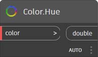
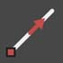
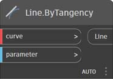

# Índice de nós

Este índice fornece informações adicionais sobre todos os nós usados neste manual de introdução, bem como outros componentes que você pode considerar úteis. Esta é apenas uma introdução a alguns dos 500 nós disponíveis no Dynamo.

## Exibição

### Cor

|                                               |                                                                                                                       |                                                                   |
| --------------------------------------------- | --------------------------------------------------------------------------------------------------------------------- | ----------------------------------------------------------------- |
|                                               | CRIAR                                                                                                                |                                                                   |
|  (1).jpg>)     | 
<strong>Color.ByARGB</strong> Crie uma cor usando os componentes alfa, vermelho, verde e azul.
                  |  (1).jpg>)             |
|                 | 
<strong>Faixa de cores</strong> Obtenha uma cor de um gradiente de cores entre uma cor inicial e uma cor final.
      |  (1) (1).jpg>)          |
|                                               | AÇÕES                                                                                                               |                                                                   |
|  (1).jpg>) | 
<strong>Color.Brightness</strong> Retorna o valor de brilho dessa cor.
                                 |  (1) (1) (1).jpg>) |
| .jpg>)      | 
<strong>Color.Components</strong> Lista os componentes da cor na ordem: alfa, vermelho, verde, azul.
 |                    |
|  (1).jpg>) | 
<strong>Color.Saturation</strong> Retorna o valor de saturação dessa cor.
                                  |                   |
| .jpg>)            | 
<strong>Color.Hue</strong> Retorna o valor de matiz desda cor.
                                               |                          |
|                                               | CONSULTA                                                                                                                 |                                                                   |
| (1) (1).jpg>)    | 
<strong>Color.Alpha</strong> Localize o componente alfa de uma cor, 0 a 255.
                                 |                        |
|  (1).jpg>)       | 
<strong>Color.Blue</strong> Localize o componente azul de uma cor, 0 a 255.
                                   |                         |
| (1) (1).jpg>)    | 
<strong>Color.Green</strong> Localize o componente verde de uma cor, 0 a 255.
                                 |                        |
|  (1).jpg>)        | 
<strong>Color.Red</strong> Localize o componente vermelho de uma cor, 0 a 255.
                                     |                          |

|                                                               |                                                                                           |                                                               |
| ------------------------------------------------------------- | ----------------------------------------------------------------------------------------- | ------------------------------------------------------------- |
|                                                               | CRIAR                                                                                    |                                                               |
|  (1) (1).jpg>) | 
<strong>GeometryColor.ByGeometryColor</strong> Exibe a geometria usando uma cor.
 |  |

### Inspeção

|                                 |                                                                               |                                                  |
| ------------------------------- | ----------------------------------------------------------------------------- | ------------------------------------------------ |
|                                 | AÇÕES                                                                       |                                                  |
|    | 
<strong>View.Watch</strong> Visualize a saída do nó.
           |        |
|  | 
<strong>View.Watch 3D</strong> Mostra uma visualização dinâmica da geometria.
 |  |

## Entrada

|                                             |                                                                                                          |                                                          |
| ------------------------------------------- | -------------------------------------------------------------------------------------------------------- | -------------------------------------------------------- |
|                                             | AÇÕES                                                                                                  |                                                          |
|                  | 
<strong>Booleano</strong> Seleção entre verdadeiro e falso.
                                   |                  |
| (1) (1).jpg>)   | 
<strong>Bloco de código</strong> Permite que o código DesignScript seja criado diretamente.
              |                |
|            | 
<strong>Caminho do diretório</strong> Permite selecionar um diretório no sistema para obter o caminho
 |            |
|                 | 
<strong>Caminho do arquivo</strong> Permite selecionar um arquivo no sistema para obter o nome do arquivo.
        |                 |
|            | 
<strong>Controle deslizante de números inteiros</strong> Um controle deslizante que produz valores inteiros.
                         |            |
|  (1) (1) (1).jpg>) | 
<strong>Número</strong> Cria um número.
                                                      |  (1) (1) (1).jpg>) |
|             | 
<strong>Controle deslizante de números</strong> Um controle deslizante que produz valores numéricos.
                          |             |
|  (1) (1) (1).jpg>) | 
<strong>Sequência de caracteres</strong> Cria uma cadeia de caracteres.
                                                      |                   |
|             | 
<strong>Object.IsNull</strong> Determina se o objeto determinado é nulo.
                         |             |

## Lista

|                                            |                                                                                                                                                                                                                                               |                                                            |
| ------------------------------------------ | --------------------------------------------------------------------------------------------------------------------------------------------------------------------------------------------------------------------------------------------- | ---------------------------------------------------------- |
|                                            | CRIAR                                                                                                                                                                                                                                        |                                                            |
|              | 
<strong>List.Create</strong> Cria uma nova lista com base nas entradas fornecidas.
                                                                                                                                                              |                 |
|             | 
<strong>List.Combine</strong> Aplica um combinador a cada elemento em duas sequências
                                                                                                                                                 |                |
|                   | 
<strong>Intervalo de números</strong> Cria uma sequência de números no intervalo especificado.
                                                                                                                                                  |  (1) (1).jpg>)        |
|                | 
<strong>Sequência de números</strong> Cria uma sequência de números.
                                                                                                                                                                     |                   |
|                                            | AÇÕES                                                                                                                                                                                                                                       |                                                            |
|                | 
<strong>List.Chop</strong> Divida uma lista em um conjunto de listas que contêm a quantidade determinada de itens.
                                                                                                                               |                   |
|  (1) (1) (1).jpg>) | 
<strong>List.Count</strong> Retorna o número de itens armazenados na lista determinada.
                                                                                                                                                   | (1) (1) (2) (6).jpg>) |
|             | 
<strong>List.Flatten</strong> Mescla uma lista de listas aninhada por um determinado valor.
                                                                                                                                                  |                |
|    | 
<strong>List.FilterByBoolMask</strong> Filtra uma sequência examinando os índices correspondentes em uma lista separada de booleanos.
                                                                                                       |       |
|      | 
<strong>List.GetItemAtIndex</strong> Retorna um item da lista fornecida que está localizada no índice especificado.
                                                                                                                        |         |
|                                            | 
<strong>List.Map</strong> Aplica uma função em todos os elementos de uma lista, gerando uma nova lista com base nos resultados
                                                                                                                    |                    |
|                                            | 
<strong>List.Reverse</strong> Cria uma nova lista que contém os itens da lista determinada, mas na ordem inversa
                                                                                                                        |                |
|  | 
<strong>List.ReplaceItemAtIndex</strong> Substitua um item da lista determinada que está localizada no índice especificado
                                                                                                                  |         |
|        | 
<strong>List.ShiftIndices</strong> Troca os índices da lista à direita pelo valor fornecido
                                                                                                                                      |           |
|    | 
<strong>List.TakeEveryNthItem</strong> Obtém os itens da lista fornecida em índices que são múltiplos do valor fornecido, após o deslocamento fornecido.
                                                                                  |       |
|           | 
<strong>List.Transpose</strong> Troca as linhas e as colunas de uma lista de listas. Se houver algumas linhas mais curtas do que outras, os valores nulos serão inseridos como espaços reservados na matriz resultante de forma que ela seja sempre retangular
 |              |

## Lógica

|                        |                                                                                                                                                                                                              |                                     |
| ---------------------- | ------------------------------------------------------------------------------------------------------------------------------------------------------------------------------------------------------------ | ----------------------------------- |
|                        | AÇÕES                                                                                                                                                                                                      |                                     |
|  | 
<strong>Se</strong> Declaração condicional. Verifica o valor booleano da entrada de teste. Se a entrada de teste for verdadeira, o resultado retornará a entrada verdadeira. Caso contrário, o resultado retornará a entrada falsa.
 |  |

## Matemática

|                                          |                                                                                                                              |                                                       |
| ---------------------------------------- | ---------------------------------------------------------------------------------------------------------------------------- | ----------------------------------------------------- |
|                                          | AÇÕES                                                                                                                      |                                                       |
|               | 
<strong>Math.Cos</strong> Retorna o cosseno de um ângulo.
                                                            |               |
|  | 
<strong>Math.DegreesToRadians</strong> Converte um ângulo em graus em um ângulo em radianos.
                        |  |
|               | 
<strong>Math.Pow</strong> Eleva um número à potência especificada.
                                                  |               |
|  | 
<strong>Math.RadiansToDegrees</strong> Converte um ângulo em radianos em um ângulo em graus.
                        |  |
|        | 
<strong>Math.RemapRange</strong> Ajusta o intervalo de uma lista de números, preservando o coeficiente de distribuição.
   |        |
|               | 
<strong>Math.Sin</strong> Localiza o seno de um ângulo.
                                                              |               |
|               | 
<strong>Fórmula</strong> Avalia fórmulas matemáticas. Usa NCalc para a avaliação. Consulte http://ncalc.codeplex.com
 |               |
|  (1) (1) (1).jpg>) | 
<strong>Mapa</strong> Mapeia um valor para um intervalo de entrada
                                                              |               |

## Sequência de caracteres

|                                    |                                                                                                                                                      |                                                          |
| ---------------------------------- | ---------------------------------------------------------------------------------------------------------------------------------------------------- | -------------------------------------------------------- |
|                                    | AÇÕES                                                                                                                                              |                                                          |
|    | 
<strong>String.Concat</strong> Concatena várias sequências de caracteres em uma única sequência de caracteres.
                                                         |             |
|  | 
<strong>String.Contains</strong> Determina se a sequência de caracteres fornecida contém a subsequência de caracteres determinada.
                                              |           |
|      | 
<strong>String.Join</strong> Concatena várias sequências de caracteres em uma única sequência de caracteres, inserindo o separador fornecido entre cada sequência de caracteres unida.
 |  (1) (2).jpg>) |
|     | 
<strong>String.Split</strong> Divide uma única sequência de caracteres em uma lista de sequência de caracteres, com as divisões determinadas pelas sequências de caracteres fornecidas do separador.
    |              |
|  | 
<strong>String.ToNumber</strong> Converte uma sequência de caracteres em um número inteiro ou um duplo.
                                                              |           |

## Geometria

### Circle

|                                               |                                                                                                                                                          |                                                                  |
| --------------------------------------------- | -------------------------------------------------------------------------------------------------------------------------------------------------------- | ---------------------------------------------------------------- |
|                                               | CRIAR                                                                                                                                                   |                                                                  |
|  | 
<strong>Circle.ByCenterPointRadius</strong> Cria um círculo com o ponto central de entrada e o raio no plano XY universal, com o Z universal como normal.
 |  |
|        | 
<strong>Circle.ByPlaneRadius</strong> Crie um círculo centralizado na origem do plano de entrada (raiz), que reside no plano de entrada, com o raio especificado.
  |              |

|                                                                               |                                                                                                                                                                                                    |                                                                            |
| ----------------------------------------------------------------------------- | -------------------------------------------------------------------------------------------------------------------------------------------------------------------------------------------------- | -------------------------------------------------------------------------- |
|                                                                               | CRIAR                                                                                                                                                                                             |                                                                            |
|                                   | 
<strong>CoordinateSystem.ByOrigin</strong> Crie um CoordinateSystem com origem no ponto de entrada, com os eixos X e Y definidos como eixos X e Y do sistema de coordenadas universal.
                                               |                  |
|  (1) (1) (1).jpg>) | 
<strong>CoordinateSystem.ByCyclindricalCoordinates</strong> Cria um CoordinateSystem nos parâmetros de coordenadas cilíndricas especificadas com relação ao sistema de coordenadas especificado
 |  |

### Cuboide

|                                                                  |                                                                                                                                            |                                                                  |
| ---------------------------------------------------------------- | ------------------------------------------------------------------------------------------------------------------------------------------ | ---------------------------------------------------------------- |
|                                                                  | CRIAR                                                                                                                                     |                                                                  |
|  (1) (1).jpg>)                  | 
<strong>Cuboid.ByLengths</strong> Cria um cuboide centralizado com origem no sistema de coordenadas universal e com largura, comprimento e altura.
                        |                  |
|  (1) (1) (1).jpg>)        | 
<strong>Cuboid.ByLengths</strong> (origem)

Crie um cuboide centralizado no ponto de entrada, com largura, comprimento e altura especificadas.
 |            |
|  (1) (1).jpg>) | 
<strong>Cuboid.ByLengths</strong> (coordinateSystem)

Cria um cuboide centralizado com origem no sistema de coordenadas universal e com largura, comprimento e altura.
  |  |
|  (1) (1) (1).jpg>)             | 
<strong>Cuboid.ByCorners</strong>

Cria um cuboide que se estende do ponto baixo ao ponto alto.
                                      |                  |
|  (1) (2).jpg>)                    | 
<strong>Cuboid.Length</strong>

Retorna as cotas de entrada do Cuboide e NÃO as cotas reais do espaço universal. **
           |                     |
|  (1) (1) (1).jpg>)                 | 
<strong>Cuboid.Width</strong>

Retorna as cotas de entrada do Cuboide e NÃO as cotas reais do espaço universal. **
            |                      |
|  (1) (1).jpg>)                    | 
<strong>Cuboid.Height</strong>

Retorna as cotas de entrada do Cuboide e NÃO as cotas reais do espaço universal. **
           |                     |
|  (1).jpg>)                 | 
<strong>BoundingBox.ToCuboid</strong>

Retorna a caixa delimitadora como um cuboide de sólido.
                                                  |              |

 **Em outras palavras, se você criar um comprimento de largura de Cuboide (eixo X) 10 e transformá-lo em um CoordinateSystem com dimensionamento de 2 vezes em X, a largura ainda será 10. O ASM não permite extrair os vértices de um corpo em nenhuma ordem previsível; portanto, é impossível determinar as cotas após uma transformação. 

### Curva

|                                           |                                                                                                                                                  |                                                        |
| ----------------------------------------- | ------------------------------------------------------------------------------------------------------------------------------------------------ | ------------------------------------------------------ |
|                                           | AÇÕES                                                                                                                                          |                                                        |
|           | 
<strong>Curve.Extrude</strong> (distância) Efetua a extrusão de uma curva na direção do vetor normal.
                                             |           |
|  | 
<strong>Curve.PointAtParameter</strong> Obtenha um ponto na curva com um parâmetro especificado entre StartParameter() e EndParameter().
 |  |

### Modificadores de geometria

|                                           |                                                                                                                                    |                                                        |
| ----------------------------------------- | ---------------------------------------------------------------------------------------------------------------------------------- | ------------------------------------------------------ |
|                                           | AÇÕES                                                                                                                            |                                                        |
|     | 
<strong>Geometry.DistanceTo</strong> Obtenha a distância dessa geometria até outra.
                                 |     |
|        | 
<strong>Geometry.Explode</strong> Separa elementos compostos ou não separados em suas partes do componente.
                |        |
|  | 
<strong>Geometry.ImportFromSAT</strong> Lista de geometrias importadas
                                                      |  |
|         | 
<strong>Geometry.Rotate</strong> (basePlane) Rotaciona o objeto em torno da origem e normal do plano por um grau especificado.
 |         |
|      | 
<strong>Geometry.Translate</strong> Converte qualquer tipo de geometria pela distância fornecida na direção determinada.
           |      |

### Linha

|                                                     |                                                                                                                                                          |                                                                  |
| --------------------------------------------------- | -------------------------------------------------------------------------------------------------------------------------------------------------------- | ---------------------------------------------------------------- |
|                                                     | CRIAR                                                                                                                                                   |                                                                  |
|       | 
<strong>Line.ByBestFitThroughPoints</strong> Cria uma linha que melhor se aproxima à dispersão de uma plotagem de pontos.
                                       |       |
|  | 
<strong>Line.ByStartPointDirectionLength</strong> Crie uma linha reta começando no ponto e estendendo-se na direção do vetor pelo comprimento especificado.
 |  |
| .jpg>)  | 
<strong>Line.ByStartPointEndPoint</strong> Cria uma linha reta entre dois pontos de entrada.
                                                   |         |
|                   | 
<strong>Line.ByTangency</strong> Crie uma linha tangente à curva de entrada, posicionada no ponto do parâmetro da curva de entrada.
               |                   |
|                                                     | CONSULTA                                                                                                                                                    |                                                                  |
|                    | 
<strong>Line.Direction</strong> A direção da curva.
                                                                                    |                    |

### NurbsCurve

|                                               |                                                                                                               |                                                            |
| --------------------------------------------- | ------------------------------------------------------------------------------------------------------------- | ---------------------------------------------------------- |
|                                               | Criar                                                                                                        |                                                            |
|  | 
<strong>NurbsCurve.ByControlPoints</strong> Crie uma BSplineCurve usando pontos de controle explícitos.
 |  |
|         | 
<strong>NurbsCurve.ByPoints</strong> Crie uma BSplineCurve interpolando entre os pontos
          |         |

### NurbsSurface

|                                                 |                                                                                                                                                                                            |                                                              |
| ----------------------------------------------- | ------------------------------------------------------------------------------------------------------------------------------------------------------------------------------------------ | ------------------------------------------------------------ |
|                                                 | Criar                                                                                                                                                                                     |                                                              |
|  | 
<strong>NurbsSurface.ByControlPoints</strong> Crie uma NurbsSurface usando pontos de controle explícitos com os graus U e V especificados.
                                             |  |
|         | 
<strong>NurbsSurface.ByPoints</strong> Cria uma NurbsSurface com os graus U e V e pontos interpolados especificados. A superfície resultante passará por todos os pontos.
 |         |

### Plano

|                                         |                                                                                                                  |                                                      |
| --------------------------------------- | ---------------------------------------------------------------------------------------------------------------- | ---------------------------------------------------- |
|                                         | CRIAR                                                                                                           |                                                      |
|  | 
<strong>Plane.ByOriginNormal</strong> Crie um plano centralizado no ponto raiz, com o vetor normal de entrada.
 |  |
|              | 
<strong>Plane.XY</strong> Cria um plano no XY universal
                                              |              |

### Ponto

|                                                 |                                                                                                                                           |                                                              |
| ----------------------------------------------- | ----------------------------------------------------------------------------------------------------------------------------------------- | ------------------------------------------------------------ |
|                                                 | CRIAR                                                                                                                                    |                                                              |
|  | 
<strong>Point.ByCartesianCoordinates</strong> Forme um ponto em um determinado sistema de coordenadas com três coordenadas cartesianas
          |  |
|         | 
<strong>Point.ByCoordinates</strong> (2d) Forme um ponto no plano XY com base em duas coordenadas cartesianas fornecidas. O componente Z é 0.
 |         |
|         | 
<strong>Point.ByCoordinates</strong> (3d) Forme um ponto com três coordenadas cartesianas fornecidas.
                                           |         |
|                  | 
<strong>Point.Origin</strong> Obtenha o ponto de origem (0,0,0)
                                                                      |                  |
|                                                 | AÇÕES                                                                                                                                   |                                                              |
|                     | 
<strong>Point.Add</strong> Adicione um vetor a um ponto. O mesmo que Converter (vetor).
                                             |                     |
|                                                 | CONSULTA                                                                                                                                     |                                                              |
|                       | 
<strong>Point.X</strong> Obtenha o componente X de um ponto
                                                                         |                       |
|                       | 
<strong>Point.Y</strong> Obtenha o componente Y de um ponto
                                                                         |                       |
|                       | 
<strong>Point.Z</strong> Obtenha o componente Z de um ponto
                                                                         |                       |

### Policurva

|                                       |                                                                                                                                                                                       |                                                    |
| ------------------------------------- | ------------------------------------------------------------------------------------------------------------------------------------------------------------------------------------- | -------------------------------------------------- |
|                                       | CRIAR                                                                                                                                                                                |                                                    |
|  | 
<strong>Polycurve.ByPoints</strong> Crie a PolyCurve com base na sequência de linhas que conectam os pontos. Para a curva fechada, o último ponto deve estar na mesma localização que o ponto inicial.
 |  |

### Retângulo

|                                            |                                                                                                                                                                               |                                                         |
| ------------------------------------------ | ----------------------------------------------------------------------------------------------------------------------------------------------------------------------------- | ------------------------------------------------------- |
|                                            | CRIAR                                                                                                                                                                        |                                                         |
|  | 
<strong>Rectangle.ByWidthLength</strong> (Plano) Crie um retângulo centralizado na raiz do plano de entrada, com a largura (tamanho do eixo X do plano) e o comprimento (tamanho do eixo Y do plano) de entrada.
 |  |

### Esfera

|                                               |                                                                                                                             |                                                            |
| --------------------------------------------- | --------------------------------------------------------------------------------------------------------------------------- | ---------------------------------------------------------- |
|                                               | CRIAR                                                                                                                      |                                                            |
|  | 
<strong>Sphere.ByCenterPointRadius</strong> Crie uma esfera sólida centralizada no ponto de entrada, com o raio especificado.
 |  |

### Superfície

|                                                          |                                                                                                                                                      |                                                              |
| -------------------------------------------------------- | ---------------------------------------------------------------------------------------------------------------------------------------------------- | ------------------------------------------------------------ |
|                                                          | CRIAR                                                                                                                                               |                                                              |
| (1) (1) (1) (1).jpg>)    | 
<strong>Surface.ByLoft</strong> Crie uma superfície efetuando a elevação entre as curvas de seção transversal de entrada.
                                             |                |
| (1) (1) (1) (2).jpg>)    | 
<strong>Surface.ByPatch</strong> Crie uma superfície preenchendo o interior de um contorno fechado definido por curvas de entrada.
                 |  (1) (1).jpg>) |
|                                                          | AÇÕES                                                                                                                                              |                                                              |
|  (1) (2).jpg>)           | 
<strong>Surface.Offset</strong> Desloque a superfície na direção da normal da superfície pela distância especificada.
                                        |                |
|  (1) (1).jpg>) | 
<strong>Surface.PointAtParameter</strong> Retorne o ponto nos parâmetros U e V especificados.
                                              |      |
|  (1) (1) (2).jpg>)      | 
<strong>Surface.Thicken</strong> Torne mais espessa a superfície em um sólido, efetuando a extrusão na direção de normais de superfície em ambos os lados da superfície.
 |               |

### UV

|                                                  |                                                                           |                                                  |
| ------------------------------------------------ | ------------------------------------------------------------------------- | ------------------------------------------------ |
|                                                  | CRIAR                                                                    |                                                  |
|  (1) (2).jpg>) | 
<strong>UV.ByCoordinates</strong> Crie um UV com base em dois duplos.
 |  |

### Vetor

|                                                  |                                                                                          |                                                      |
| ------------------------------------------------ | ---------------------------------------------------------------------------------------- | ---------------------------------------------------- |
|                                                  | CRIAR                                                                                   |                                                      |
|  (1).jpg>) | 
<strong>Vector.ByCoordinates</strong> Forme um vetor com três coordenadas euclidianas
 |  |
|  (1) (1) (1).jpg>) | 
<strong>Vector.XAxis</strong> Retorna o vetor do eixo X canônico (1,0,0)
         |              |
|  (1) (1) (1).jpg>) | 
<strong>Vector.YAxis</strong> Retorna o vetor do eixo Y canônico (0,1,0)
         |              |
|  (1) (1) (1).jpg>) | 
<strong>Vector.ZAxis</strong> Retorna o vetor do eixo Z canônico (0,0,1)
         |              |
|                                                  | AÇÕES                                                                                  |                                                      |
|  (1).jpg>)    | 
<strong>Vector.Normalized</strong> Obtenha a versão normalizada de um vetor
      |     |

## CoordinateSystem

|                                                                               |                                                                                                                                                                                                    |                                                                            |
| ----------------------------------------------------------------------------- | -------------------------------------------------------------------------------------------------------------------------------------------------------------------------------------------------- | -------------------------------------------------------------------------- |
|                                                                               | CRIAR                                                                                                                                                                                             |                                                                            |
|                                   | 
<strong>CoordinateSystem.ByOrigin</strong> Crie um CoordinateSystem com origem no ponto de entrada, com os eixos X e Y definidos como eixos X e Y do sistema de coordenadas universal.
                                               |                  |
|  (1) (1) (1).jpg>) | 
<strong>CoordinateSystem.ByCyclindricalCoordinates</strong> Cria um CoordinateSystem nos parâmetros de coordenadas cilíndricas especificadas com relação ao sistema de coordenadas especificado
 |  |

## Operadores

|                                                |                                                                                                                         |                                                 |
| ---------------------------------------------- | ----------------------------------------------------------------------------------------------------------------------- | ----------------------------------------------- |
| (1) (1).jpg>)       | 
<strong>+</strong> Adição
                                                                                   |        |
| (1) (1).jpg>)    | 
<strong>-</strong> Subtração
                                                                                |     |
| (1) (1).jpg>) | 
<strong>*</strong> Multiplicação
                                                                             |  |
| (1) (1).jpg>)       | 
<strong>/</strong> Divisão
                                                                                   |        |
|  (1) (1).jpg>)       | 
<strong>%</strong> A divisão modular localiza o resto da primeira entrada após dividir pela segunda entrada
 |         |
|  (1) (1).jpg>)      | 
<strong><</strong> Menor que
                                                                             |        |
|  (1).jpg>)       | 
<strong>></strong> Maior que
                                                                               |     |
|  (1).jpg>)                | 
<strong>==</strong> Testes de igualdade entre dois valores.
                                           |              |
