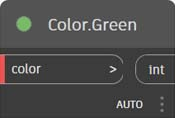
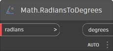
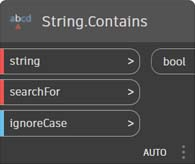
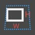

# 節點的索引

本索引提供此手冊中所用所有節點的附加資訊，以及您可能認為有用的其他元件。這只是 Dynamo 所提供 500 個節點中部分節點的簡介。

## 顯示

### 顏色

|                                               |                                                                                                                       |                                                                   |
| --------------------------------------------- | --------------------------------------------------------------------------------------------------------------------- | ----------------------------------------------------------------- |
|                                               | 建立                                                                                                                |                                                                   |
|  (1).jpg>)     | 
<strong>Color.ByARGB</strong> 依 Alpha、紅色、綠色與藍色等組成來建構顏色。
                  |  (1).jpg>)             |
|                 | 
<strong>Color Range</strong> 從開始顏色與結束顏色之間的顏色漸層取得顏色。
      |  (1) (1).jpg>)          |
|                                               | 動作                                                                                                               |                                                                   |
|  (1).jpg>) | 
<strong>Color.Brightness</strong> 取得此顏色的亮度值。
                                 |  (1) (1) (1).jpg>) |
| .jpg>)      | 
<strong>Color.Components</strong> 依照以下順序列示顏色組成：Alpha、紅色、綠色、藍色。
 |                    |
|  (1).jpg>) | 
<strong>Color.Saturation</strong> 取得此顏色的飽和度值
                                  |                   |
| .jpg>)            | 
<strong>Color.Hue</strong> 取得此顏色的色相值。
                                               |                          |
|                                               | 查詢                                                                                                                 |                                                                   |
| (1) (1).jpg>)    | 
<strong>Color.Alpha</strong> 找出顏色的 Alpha 組成 (0 到 255)。
                                 |                        |
|  (1).jpg>)       | 
<strong>Color.Blue</strong> 找出顏色的藍色組成 (0 到 255)。
                                   |                         |
| (1) (1).jpg>)    | 
<strong>Color.Green</strong> 找出顏色的綠色組成 (0 到 255)。
                                 |                        |
|  (1).jpg>)        | 
<strong>Color.Red</strong> 找出顏色的紅色組成 (0 到 255)。
                                     |                          |

|                                                               |                                                                                           |                                                               |
| ------------------------------------------------------------- | ----------------------------------------------------------------------------------------- | ------------------------------------------------------------- |
|                                                               | 建立                                                                                    |                                                               |
|  (1) (1).jpg>) | 
<strong>GeometryColor.ByGeometryColor</strong> 使用顏色顯示幾何圖形。
 |  |

### Watch

|                                 |                                                                               |                                                  |
| ------------------------------- | ----------------------------------------------------------------------------- | ------------------------------------------------ |
|                                 | 動作                                                                       |                                                  |
|    | 
<strong>View.Watch</strong> 視覺化節點的輸出。
           |        |
|  | 
<strong>View.Watch 3D</strong> 展示幾何圖形的動態預覽。
 |  |

## 輸入

|                                             |                                                                                                          |                                                          |
| ------------------------------------------- | -------------------------------------------------------------------------------------------------------- | -------------------------------------------------------- |
|                                             | 動作                                                                                                  |                                                          |
|                  | 
<strong>Boolean</strong> 在 true 與 false 之間進行選取。
                                   |                  |
| (1) (1).jpg>)   | 
<strong>Code Block</strong> 允許直接編寫 DesignScript 程式碼。
              |                |
|            | 
<strong>Directory Path</strong> 可讓您選取系統上的目錄，以取得其路徑
 |            |
|                 | 
<strong>File Path</strong> 可讓您選取系統中的檔案，以取得其檔名
        |                 |
|            | 
<strong>Integer Slider</strong> 產生整數值的滑棒。
                         |            |
|  (1) (1) (1).jpg>) | 
<strong>編號</strong> 建立數字。
                                                      |  (1) (1) (1).jpg>) |
|             | 
<strong>Number Slider</strong> 產生數值的滑棒。
                          |             |
|  (1) (1) (1).jpg>) | 
<strong>String</strong> 建立字串。
                                                      |                   |
|             | 
<strong>Object.IsNull</strong> 判定給定物件是否為空值。
                         |             |

## 清單

|                                            |                                                                                                                                                                                                                                               |                                                            |
| ------------------------------------------ | --------------------------------------------------------------------------------------------------------------------------------------------------------------------------------------------------------------------------------------------- | ---------------------------------------------------------- |
|                                            | 建立                                                                                                                                                                                                                                        |                                                            |
|              | 
<strong>List.Create</strong> 從給定的輸入製作新清單。
                                                                                                                                                              |                 |
|             | 
<strong>List.Combine</strong> 將結合器套用至兩個序列中的每個元素
                                                                                                                                                 |                |
|                   | 
<strong>Number Range</strong> 建立指定範圍內的一系列數字
                                                                                                                                                  |  (1) (1).jpg>)        |
|                | 
<strong>Number Sequence</strong> 建立一系列數字。
                                                                                                                                                                     |                   |
|                                            | 動作                                                                                                                                                                                                                                       |                                                            |
|                | 
<strong>List.Chop</strong> 將一個清單細分為一組清單 (其中每個清單包含指定數量的項目)。
                                                                                                                               |                   |
|  (1) (1) (1).jpg>) | 
<strong>List.Count</strong> 傳回給定清單中儲存的項目數目。
                                                                                                                                                   | (1) (1) (2) (6).jpg>) |
|             | 
<strong>List.Flatten</strong> 依特定數量展開清單的巢狀清單。
                                                                                                                                                  |                |
|    | 
<strong>List.FilterByBoolMask</strong> 查看個別布林清單中的對應索引來篩選順序。
                                                                                                       |       |
|      | 
<strong>List.GetItemAtIndex</strong> 取得給定清單中位於指定索引處的項目。
                                                                                                                        |         |
|                                            | 
<strong>List.Map</strong> 將函數套用至清單的所有元素，從結果產生新清單
                                                                                                                    |                    |
|                                            | 
<strong>List.Reverse</strong> 建立新的清單，其中包含給定清單的項目，但以逆向順序排列
                                                                                                                        |                |
|  | 
<strong>List.ReplaceItemAtIndex</strong> 取代給定清單中位於指定索引處的項目。
                                                                                                                  |         |
|        | 
<strong>List.ShiftIndices</strong> 將清單中的索引向右移動給定數量
                                                                                                                                      |           |
|    | 
<strong>List.TakeEveryNthItem</strong> 在給定的偏移之後，擷取給定清單中索引是給定值倍數的項目。
                                                                                  |       |
|           | 
<strong>List.Transpose</strong> 在清單的清單中交換列與欄。如果某些列短於其他列，會在結果陣列中插入空值作為預留位置，以便其永遠為矩形
 |              |

## 邏輯

|                        |                                                                                                                                                                                                              |                                     |
| ---------------------- | ------------------------------------------------------------------------------------------------------------------------------------------------------------------------------------------------------------ | ----------------------------------- |
|                        | 動作                                                                                                                                                                                                      |                                     |
|  | 
<strong>If</strong> 條件陳述式。檢查測試輸入的布林值。如果測試輸入為 true，結果會輸出真實的輸入，否則結果會輸出虛假的輸入。
 |  |

## 數學

|                                          |                                                                                                                              |                                                       |
| ---------------------------------------- | ---------------------------------------------------------------------------------------------------------------------------- | ----------------------------------------------------- |
|                                          | 動作                                                                                                                      |                                                       |
|               | 
<strong>Math.Cos</strong> 計算角度的餘弦值。
                                                            |               |
|  | 
<strong>Math.DegreesToRadians</strong> 將以度表示的角度轉換為以弳度表示的角度。
                        |  |
|               | 
<strong>Math.Pow</strong> 計算數值的指定次方。
                                                  |               |
|  | 
<strong>Math.RadiansToDegrees</strong> 將以弳度表示的角度轉換為以度表示的角度。
                        |  |
|        | 
<strong>Math.RemapRange</strong> 調整數字清單的範圍，同時保留分配比率。
   |        |
|               | 
<strong>Math.Sin</strong> 計算角度的正弦值。
                                                              |               |
|               | 
<strong>Formula</strong> 運算數學公式。使用 NCalc 進行運算。請參閱http://ncalc.codeplex.com
 |               |
|  (1) (1) (1).jpg>) | 
<strong>Map</strong> 將值對映到輸入範圍
                                                              |               |

## 字串

|                                    |                                                                                                                                                      |                                                          |
| ---------------------------------- | ---------------------------------------------------------------------------------------------------------------------------------------------------- | -------------------------------------------------------- |
|                                    | 動作                                                                                                                                              |                                                          |
|    | 
<strong>String.Concat</strong> 將多個字串連接成單一字串。
                                                         |             |
|  | 
<strong>String.Contains</strong> 判定給定的字串是否包含給定的子字串。
                                              |           |
|      | 
<strong>String.Join</strong> 將多個字串連接成單一字串，同時在接合的每個字串之間插入給定的分隔符號。
 |  (1) (2).jpg>) |
|     | 
<strong>String.Split</strong> 將單一字串分割為字串清單，分割位置由給定的分隔符號字串決定。
    |              |
|  | 
<strong>String.ToNumber</strong> 將字串轉換為整數或倍精數。
                                                              |           |

## 幾何圖形

### 圓

|                                               |                                                                                                                                                          |                                                                  |
| --------------------------------------------- | -------------------------------------------------------------------------------------------------------------------------------------------------------- | ---------------------------------------------------------------- |
|                                               | 建立                                                                                                                                                   |                                                                  |
|  | 
<strong>Circle.ByCenterPointRadius</strong> 使用輸入中心點和世界 XY 平面中的半徑，並以世界 Z 為法線，來建立一個圓。
 |  |
|        | 
<strong>Circle.ByPlaneRadius</strong> 在輸入平面建立一個中心點在輸入平面原點 (根)、具有給定半徑的圓。
  |              |

|                                                                               |                                                                                                                                                                                                    |                                                                            |
| ----------------------------------------------------------------------------- | -------------------------------------------------------------------------------------------------------------------------------------------------------------------------------------------------- | -------------------------------------------------------------------------- |
|                                                                               | 建立                                                                                                                                                                                             |                                                                            |
|                                   | 
<strong>CoordinateSystem.ByOrigin</strong> 建立一個原點在輸入點、X 與 Y 軸分別設定為 WCS X 軸與 Y 軸的座標系統
                                               |                  |
|  (1) (1) (1).jpg>) | 
<strong>CoordinateSystem.ByCyclindricalCoordinates</strong> 以相對於指定座標系統的指定圓柱座標參數，建立一個座標系統
 |  |

### 立方體

|                                                                  |                                                                                                                                            |                                                                  |
| ---------------------------------------------------------------- | ------------------------------------------------------------------------------------------------------------------------------------------ | ---------------------------------------------------------------- |
|                                                                  | 建立                                                                                                                                     |                                                                  |
|  (1) (1).jpg>)                  | 
<strong>Cuboid.ByLengths</strong> 建立一個中心點在 WCS 原點，且具有長度、寬度、高度的立方體。
                        |                  |
|  (1) (1) (1).jpg>)        | 
<strong>Cuboid.ByLengths</strong> (origin)

建立一個中心點在輸入點，具有指定寬度、長度及高度的立方體。
 |            |
|  (1) (1).jpg>) | 
<strong>Cuboid.ByLengths</strong> (coordinateSystem)

建立一個中心點在 WCS 原點，且具有長度、寬度、高度的立方體。
  |  |
|  (1) (1) (1).jpg>)             | 
<strong>Cuboid.ByCorners</strong>

建立一個從低點跨距到高點的立方體。
                                      |                  |
|  (1) (2).jpg>)                    | 
<strong>Cuboid.Length</strong>

傳回立方體的輸入尺寸，而不是實際世界的空間尺寸。
           |                     |
|  (1) (1) (1).jpg>)                 | 
<strong>Cuboid.Width</strong>

傳回立方體的輸入尺寸，而不是實際世界的空間尺寸。
            |                      |
|  (1) (1).jpg>)                    | 
<strong>Cuboid.Height</strong>

傳回立方體的輸入尺寸，而不是實際世界的空間尺寸。
           |                     |
|  (1).jpg>)                 | 
<strong>BoundingBox.ToCuboid</strong>

取得邊界框做為實體立方體
                                                  |              |

 **換句話說，如果您建立一個立方體寬度 (X 軸) 長度為 10，然後將其轉換為 X 軸 2 倍比例的座標系統，則寬度仍為 10。ASM 不允許您以任何可預測的順序擷取本體的頂點，因此在轉換後無法決定尺寸。


### 曲線

|                                           |                                                                                                                                                  |                                                        |
| ----------------------------------------- | ------------------------------------------------------------------------------------------------------------------------------------------------ | ------------------------------------------------------ |
|                                           | 動作                                                                                                                                          |                                                        |
|           | 
<strong>Curve.Extrude</strong> (distance) 在法線向量的方向擠出曲線。
                                             |           |
|  | 
<strong>Curve.PointAtParameter</strong> 取得曲線上位於 StartParameter() 與 EndParameter() 之間指定參數處的點。
 |  |

### 幾何圖形修改子

|                                           |                                                                                                                                    |                                                        |
| ----------------------------------------- | ---------------------------------------------------------------------------------------------------------------------------------- | ------------------------------------------------------ |
|                                           | 動作                                                                                                                            |                                                        |
|     | 
<strong>Geometry.DistanceTo</strong> 取得此幾何圖形與另一個幾何圖形的距離。
                                 |     |
|        | 
<strong>Geometry.Explode</strong> 將複合元素或非單獨元素分開為組成部分
                |        |
|  | 
<strong>Geometry.ImportFromSAT</strong> 匯入的幾何圖形的清單
                                                      |  |
|         | 
<strong>Geometry.Rotate</strong> (basePlane) 繞平面原點及法線將物件旋轉指定度數。
 |         |
|      | 
<strong>Geometry.Translate</strong> 將任何幾何圖形類型在給定方向平移給定距離。
           |      |

### 直線

|                                                     |                                                                                                                                                          |                                                                  |
| --------------------------------------------------- | -------------------------------------------------------------------------------------------------------------------------------------------------------- | ---------------------------------------------------------------- |
|                                                     | 建立                                                                                                                                                   |                                                                  |
|       | 
<strong>Line.ByBestFitThroughPoints</strong> 建立一條與點的散射圖最近似的線。
                                       |       |
|  | 
<strong>Line.ByStartPointDirectionLength</strong> 建立一條從某點開始，沿向量方向延伸指定長度的直線。
 |  |
| .jpg>)  | 
<strong>Line.ByStartPointEndPoint</strong> 在兩個輸入點之間建立一條直線。
                                                   |         |
|                   | 
<strong>Line.ByTangency</strong> 建立一條在輸入曲線的參數點位置與輸入曲線相切的線。
               |                   |
|                                                     | 查詢                                                                                                                                                    |                                                                  |
|                    | 
<strong>Line.Direction</strong> 曲線的方向。
                                                                                    |                    |

### NurbsCurve

|                                               |                                                                                                               |                                                            |
| --------------------------------------------- | ------------------------------------------------------------------------------------------------------------- | ---------------------------------------------------------- |
|                                               | 建立                                                                                                        |                                                            |
|  | 
<strong>NurbsCurve.ByControlPoints</strong> 使用明確控制點建立 BSplineCurve。
 |  |
|         | 
<strong>NurbsCurve.ByPoints</strong> 透過在點之間進行內插來建立 BSplineCurve
          |         |

### NurbsSurface

|                                                 |                                                                                                                                                                                            |                                                              |
| ----------------------------------------------- | ------------------------------------------------------------------------------------------------------------------------------------------------------------------------------------------ | ------------------------------------------------------------ |
|                                                 | 建立                                                                                                                                                                                     |                                                              |
|  | 
<strong>NurbsSurface.ByControlPoints</strong> 使用明確控制點建立一個具有指定 U 與 V 次數的 NurbsSurface。
                                             |  |
|         | 
<strong>NurbsSurface.ByPoints</strong> 建立一個具有指定內插點及 U 與 V 次數的 NurbsSurface。產生的曲面將通過所有點。
 |         |

### 平面

|                                         |                                                                                                                  |                                                      |
| --------------------------------------- | ---------------------------------------------------------------------------------------------------------------- | ---------------------------------------------------- |
|                                         | 建立                                                                                                           |                                                      |
|  | 
<strong>Plane.ByOriginNormal</strong> 建立一個中心點在根點，具有輸入法線向量的平面。
 |  |
|              | 
<strong>Plane.XY</strong> 在世界 XY 建立一個平面
                                              |              |

### 點

|                                                 |                                                                                                                                           |                                                              |
| ----------------------------------------------- | ----------------------------------------------------------------------------------------------------------------------------------------- | ------------------------------------------------------------ |
|                                                 | 建立                                                                                                                                    |                                                              |
|  | 
<strong>Point.ByCartesianCoordinates</strong> 在有 3 個直角座標的給定座標系統中產生一點
          |  |
|         | 
<strong>Point.ByCoordinates</strong> (2d) 在 XY 平面中給定 2 個直角座標產生一點。Z 分量是 0。
 |         |
|         | 
<strong>Point.ByCoordinates</strong> (3d) 給定 3 個直角座標產生一點。
                                           |         |
|                  | 
<strong>Point.Origin</strong> 取得原點 (0,0,0)
                                                                      |                  |
|                                                 | 動作                                                                                                                                   |                                                              |
|                     | 
<strong>Point.Add</strong> 對點加入向量。與 Translate (Vector) 相同。
                                             |                     |
|                                                 | 查詢                                                                                                                                     |                                                              |
|                       | 
<strong>Point.X</strong> 取得點的 X 分量
                                                                         |                       |
|                       | 
<strong>Point.Y</strong> 取得點的 Y 分量
                                                                         |                       |
|                       | 
<strong>Point.Z</strong> 取得點的 Z 分量
                                                                         |                       |

### Polycurve

|                                       |                                                                                                                                                                                       |                                                    |
| ------------------------------------- | ------------------------------------------------------------------------------------------------------------------------------------------------------------------------------------- | -------------------------------------------------- |
|                                       | 建立                                                                                                                                                                                |                                                    |
|  | 
<strong>Polycurve.ByPoints</strong> 根據連接點的一系列線建立 PolyCurve。若要取得封閉的曲線，最後一個點應該與起點位於相同的位置。
 |  |

### 矩形

|                                            |                                                                                                                                                                               |                                                         |
| ------------------------------------------ | ----------------------------------------------------------------------------------------------------------------------------------------------------------------------------- | ------------------------------------------------------- |
|                                            | 建立                                                                                                                                                                        |                                                         |
|  | 
<strong>Rectangle.ByWidthLength</strong> (Plane) 建立一個中心點在輸入平面根，具有輸入寬度 (平面 X 軸長度) 與長度 (平面 Y 軸長度) 的矩形。
 |  |

### 圓球

|                                               |                                                                                                                             |                                                            |
| --------------------------------------------- | --------------------------------------------------------------------------------------------------------------------------- | ---------------------------------------------------------- |
|                                               | 建立                                                                                                                      |                                                            |
|  | 
<strong>Sphere.ByCenterPointRadius</strong> 建立一個中心點在輸入點，具有給定半徑的實體圓球。
 |  |

### 曲面

|                                                          |                                                                                                                                                      |                                                              |
| -------------------------------------------------------- | ---------------------------------------------------------------------------------------------------------------------------------------------------- | ------------------------------------------------------------ |
|                                                          | 建立                                                                                                                                               |                                                              |
| (1) (1) (1) (1).jpg>)    | 
<strong>Surface.ByLoft</strong> 透過在輸入斷面曲線之間進行斷面混成來建立曲面
                                             |                |
| (1) (1) (1) (2).jpg>)    | 
<strong>Surface.ByPatch</strong> 透過填滿輸入曲線所定義之封閉邊界的內部來建立曲面。
                 |  (1) (1).jpg>) |
|                                                          | 動作                                                                                                                                              |                                                              |
|  (1) (2).jpg>)           | 
<strong>Surface.Offset</strong> 沿曲面法線方向，將曲面偏移指定的距離
                                        |                |
|  (1) (1).jpg>) | 
<strong>Surface.PointAtParameter</strong> 傳回指定的 U 與 V 參數處的點。
                                              |      |
|  (1) (1) (2).jpg>)      | 
<strong>Surface.Thicken</strong> 將曲面增厚為實體，沿曲面法線的方向朝曲面兩側擠出。
 |               |

### UV

|                                                  |                                                                           |                                                  |
| ------------------------------------------------ | ------------------------------------------------------------------------- | ------------------------------------------------ |
|                                                  | 建立                                                                    |                                                  |
|  (1) (2).jpg>) | 
<strong>UV.ByCoordinates</strong> 從兩個倍精數建立 UV。
 |  |

### 向量

|                                                  |                                                                                          |                                                      |
| ------------------------------------------------ | ---------------------------------------------------------------------------------------- | ---------------------------------------------------- |
|                                                  | 建立                                                                                   |                                                      |
|  (1).jpg>) | 
<strong>Vector.ByCoordinates</strong> 由 3 個歐幾里得座標形成一個向量
 |  |
|  (1) (1) (1).jpg>) | 
<strong>Vector.XAxis</strong> 取得標準 X 軸向量 (1,0,0)
         |              |
|  (1) (1) (1).jpg>) | 
<strong>Vector.YAxis</strong> 取得標準 Y 軸向量 (0,1,0)
         |              |
|  (1) (1) (1).jpg>) | 
<strong>Vector.ZAxis</strong> 取得標準 Z 軸向量 (0,0,1)
         |              |
|                                                  | 動作                                                                                  |                                                      |
|  (1).jpg>)    | 
<strong>Vector.Normalized</strong> 取得向量的正規化版本
      |     |

## 座標系統

|                                                                               |                                                                                                                                                                                                    |                                                                            |
| ----------------------------------------------------------------------------- | -------------------------------------------------------------------------------------------------------------------------------------------------------------------------------------------------- | -------------------------------------------------------------------------- |
|                                                                               | 建立                                                                                                                                                                                             |                                                                            |
|                                   | 
<strong>CoordinateSystem.ByOrigin</strong> 建立一個原點在輸入點、X 與 Y 軸分別設定為 WCS X 軸與 Y 軸的座標系統
                                               |                  |
|  (1) (1) (1).jpg>) | 
<strong>CoordinateSystem.ByCyclindricalCoordinates</strong> 以相對於指定座標系統的指定圓柱座標參數，建立一個座標系統
 |  |

## 運算子

|                                                |                                                                                                                         |                                                 |
| ---------------------------------------------- | ----------------------------------------------------------------------------------------------------------------------- | ----------------------------------------------- |
| (1) (1).jpg>)       | 
<strong>+</strong> 加
                                                                                   |        |
| (1) (1).jpg>)    | 
<strong>-</strong> 減
                                                                                |     |
| (1) (1).jpg>) | 
<strong>*</strong> 乘
                                                                             |  |
| (1) (1).jpg>)       | 
<strong>/</strong> 除
                                                                                   |        |
|  (1) (1).jpg>)       | 
<strong>%</strong> 模除會計算第一個輸入除以第二個輸入後的餘數
 |         |
|  (1) (1).jpg>)      | 
<strong><</strong> 小於
                                                                             |        |
|  (1).jpg>)       | 
<strong>></strong> 大於
                                                                               |     |
|  (1).jpg>)                | 
<strong>==</strong> 相等性會測試兩個值是否相等。
                                           |              |
