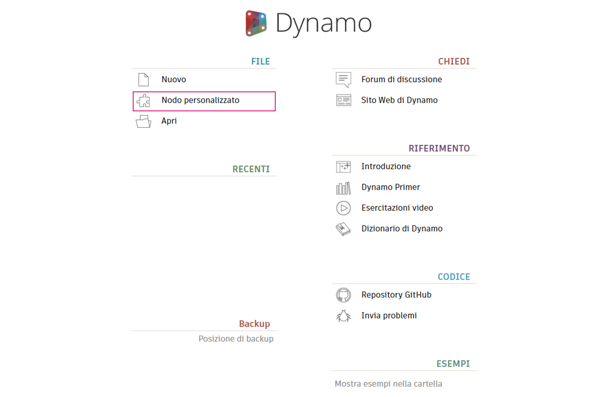
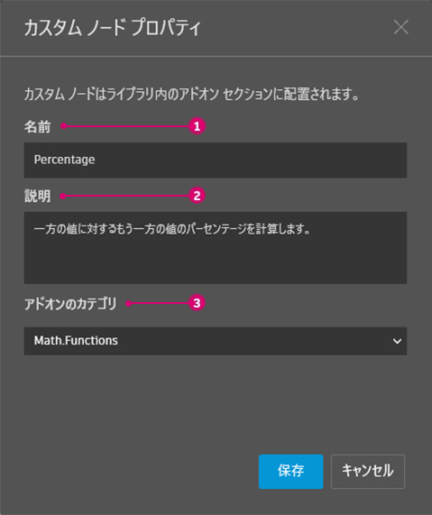
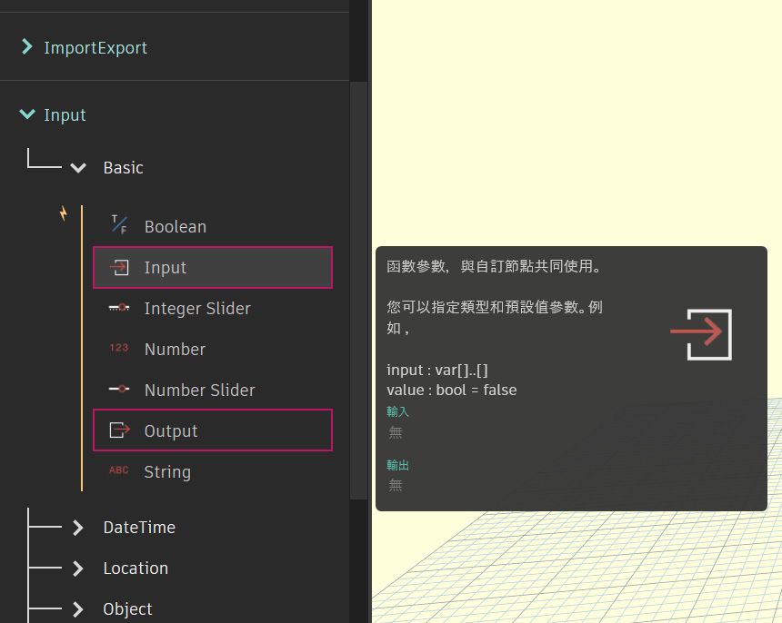
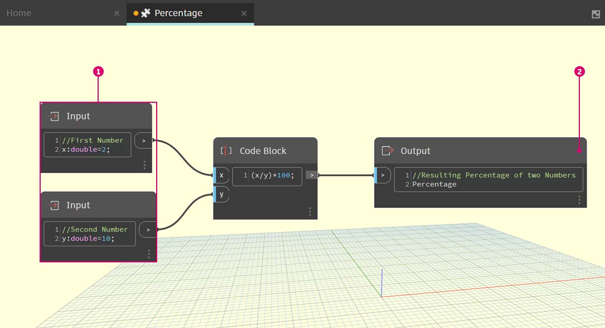
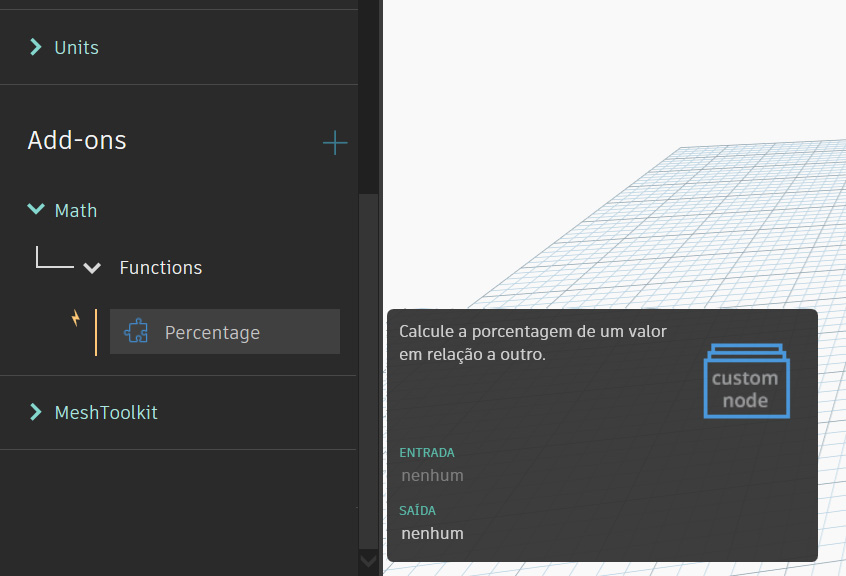

# Węzeł niestandardowy — wprowadzenie

Węzły niestandardowe są tworzone przez zagnieżdżanie innych węzłów i węzłów niestandardowych wewnątrz „węzła niestandardowego Dynamo”, który można traktować koncepcyjnie jako kontener. Gdy ten węzeł kontenera zostaje wykonany na wykresie, wykonywana jest cała jego zawartość, co umożliwia ponowne używanie i udostępnianie przydatnego połączenia węzłów.

### Przystosowywanie się do zmiany

Jeśli na wykresie znajduje się wiele kopii węzła niestandardowego, można zaktualizować je wszystkie, edytując podstawowy węzeł niestandardowy. Umożliwia to płynną aktualizację wykresu przez dostosowanie rozwiązania do zmian, które mogą wystąpić w procesie roboczym lub w projekcie.

### Współdzielenie pracy

Prawdopodobnie największą zaletą węzłów niestandardowych jest możliwość ich udostępniania. Jeśli „użytkownik zaawansowany” utworzy złożony wykres Dynamo i przekaże go projektantowi, który jest nowym użytkownikiem dodatku Dynamo, może on uprościć ten wykres do elementów najistotniejszych dla interakcji projektowych. Węzeł niestandardowy można otworzyć w celu edycji wewnętrznego wykresu, zachowując przy tym prostotę „kontenera”. Dzięki tej procedurze węzły niestandardowe umożliwiają użytkownikom dodatku Dynamo projektowanie wykresów, które będą przejrzyste i intuicyjne.

### Wiele sposobów tworzenia węzła

W dodatku Dynamo można tworzyć węzły niestandardowe na wiele sposobów. W przykładach w tym rozdziale utworzymy węzły niestandardowe bezpośrednio za pomocą interfejsu użytkownika dodatku Dynamo. Programista interesujący się formatowaniem C# lub Zero-Touch może skorzystać z [tej strony](https://github.com/DynamoDS/Dynamo/wiki/How-To-Create-Your-Own-Nodes) na stronie wiki dodatku Dynamo, aby zapoznać się z bardziej szczegółowym omówieniem.

### Środowisko węzłów niestandardowych i tworzenie pierwszego węzła niestandardowego

Przejdźmy do środowiska węzłów niestandardowych i utwórzmy prosty węzeł, aby obliczyć wartość procentową. Środowisko węzłów niestandardowych różni się od środowiska wykresu Dynamo, ale obsługuje się je zasadniczo tak samo. Utwórzmy więc pierwszy węzeł niestandardowy.

Aby utworzyć węzeł niestandardowy od podstaw, uruchom dodatek Dynamo i wybierz opcję Węzeł niestandardowy lub naciśnij kombinację klawiszy Ctrl+Shift+N w obszarze rysunku.

W oknie dialogowym Właściwości węzła niestandardowego przypisz nazwę, opis i kategorię.

> 1. **Nazwa:** Percentage
> 2. **Opis:** oblicza procent (ang. percentage) jednej wartości względem innej.
> 3. **Kategoria:** Math.Functions

Spowoduje to otwarcie obszaru rysunku z żółtym tłem, co oznacza, że użytkownik pracuje w węźle niestandardowym. W tym obszarze rysunku użytkownik ma dostęp do wszystkich podstawowych węzłów Dynamo oraz do węzłów Input i Output, które opisują dane wpływające do węzła niestandardowego i wypływające z niego. Można je znaleźć w obszarze Input (Dane wejściowe)>Basic (Podstawowe).

> 1. **Węzły Input:** węzły wejściowe tworzą porty wejściowe w węźle niestandardowym. Składnia węzła wejściowego to: _nazwa_węzła_wejściowego : datatype = wartość_domyślna (opcjonalnie)_.
> 2. **Węzły Output:** podobnie jak w przypadku węzłów wejściowych te węzły tworzą porty wyjściowe w węźle niestandardowym. Rozważ dodanie komentarza niestandardowego (**Custom Comment**) do portów wejściowych i wyjściowych, aby poinformować o typach danych wejściowych i wyjściowych. Więcej szczegółów znajduje się w sekcji [Tworzenie węzłów niestandardowych](2-creating.md).

Ten węzeł niestandardowy można zapisać jako plik .dyf (w przeciwieństwie do standardowego pliku .dyn), który zostanie automatycznie dodany do bieżącej sesji i przyszłych sesji. Ten węzeł niestandardowy można znaleźć w bibliotece w sekcji dodatków.

### Dalsze kroki

Teraz po utworzeniu pierwszego węzła niestandardowego w kolejnych sekcjach dokładniej omówimy funkcje węzłów niestandardowych i to, jak publikuje się ogólne procesy robocze. W kolejnej sekcji przyjrzymy się opracowywaniu węzła niestandardowego, który przenosi geometrię z jednej powierzchni do drugiej.
