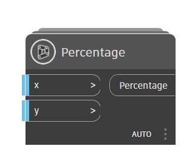

# Пользовательские узлы: введение

Пользовательские узлы создаются путем помещения стандартных и созданных разработчиками узлов в так называемый пользовательский узел Dynamo, который можно рассматривать как своего рода контейнер. При запуске такого узла-контейнера в графике происходит запуск всех содержащихся в нем компонентов. В результате получается удобная комбинация узлов для многократного использования и предоставления другим пользователям.

### Адаптация к изменениям

Если в графике присутствует несколько копий пользовательского узла, их все можно отредактировать одновременно, изменив базовый экземпляр этого узла. Это позволяет с легкостью редактировать график и адаптировать его к изменениям, которые могут возникнуть в проекте или рабочем процессе.

### Совместная работа

Главное преимущество пользовательских узлов — удобство совместной работы. Например, если опытный программист создает в Dynamo сложный график, который затем требуется передать проектировщику, не работавшему с Dynamo, то программист может упростить представление графика и сделать его максимально доступным для проектировщика. Пользовательский узел-контейнер, в который помещается график, можно открывать для редактирования его содержимого, однако внешний вид контейнера при этом может оставаться простым и аккуратным. Таким образом, пользовательские узлы позволяют делать графики Dynamo лаконичными и интуитивно понятными.

### Способы создания узлов

Создавать пользовательские узлы в Dynamo можно самыми разными способами. В примерах, которые приведены в этой главе, пользовательские узлы создаются с помощью функций интерфейса Dynamo. Программисты, интересующиеся возможностями форматирования в C# или Zero Touch, могут ознакомиться с подробным обзором на [этой странице](https://github.com/DynamoDS/Dynamo/wiki/How-To-Create-Your-Own-Nodes) справки Wiki по Dynamo.

### Среда пользовательских узлов и создание первого пользовательского узла

Перейдите в среду пользовательского узла, чтобы создать простой узел для расчета процентного соотношения. Среда пользовательского узла отличается от среды графика Dynamo, но работа в ней осуществляется на основе тех же принципов. Итак, пора создать первый пользовательский узел.

Чтобы создать пользовательский узел с нуля, запустите Dynamo и выберите «Пользовательский узел» или используйте сочетание клавиш CTRL + SHIFT + N в рабочей области.

Задайте имя, описание и категорию в диалоговом окне «Свойства пользовательского узла».

> 1. **Имя:** Percentage
> 2. **Описание:** расчет процентного соотношения между двумя значениями.
> 3. **Категория**: Math.Functions

Откроется рабочая область с желтым фоном, указывающим на то, что вы находитесь в среде пользовательского узла. В этом окне можно получить доступ ко всем стандартным узлам Dynamo, а также к узлам ввода и вывода, которые используются для обозначения данных, поступающих в пользовательский узел на входе и получаемых из него на выходе. Их можно найти в разделе «Input > Basic».

> 1. **Inputs**: узлы Input используются для настройки портов ввода пользовательского узла. Синтаксис узла ввода: _имя_ввода : тип_данных = значение_по_умолчанию (необязательно)_.
> 2. **Outputs:** аналогично узлам ввода узлы вывода используются для настройки портов вывода пользовательского узла. К портам ввода и вывода можно добавлять **пользовательские комментарии** для указания типа входных и выходных данных. Подробную информацию см. в разделе [Создание пользовательских узлов](2-creating.md).

Этот пользовательский узел можно сохранить в файле DYF (вместо стандартного формата DYN), после чего он автоматически станет доступен в текущем и будущих сеансах. Пользовательский узел находится в разделе Add-ons библиотеки.

### Дальнейшее изучение

После создания первого пользовательского узла можно переходить к дальнейшим разделам, в которых подробнее рассматриваются функциональные возможности пользовательских узлов и процесс публикации типовых рабочих процессов. В следующем разделе представлен процесс разработки пользовательского узла, позволяющего переносить геометрию с одной поверхности на другую.
