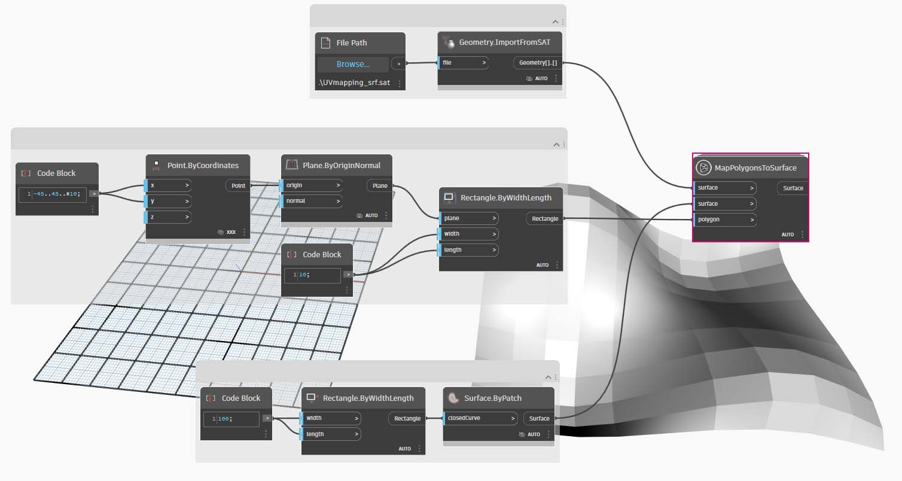

# Benutzerdefinierte Blöcke erstellen

Dynamo bietet mehrere Methoden zum Erstellen benutzerdefinierter Blöcke. Sie können benutzerdefinierte Blöcke neu, aus bestehenden Diagrammen oder explizit in C# erstellen. In diesem Abschnitt wird die Erstellung eines benutzerdefinierten Blocks in der Benutzeroberfläche von Dynamo aus einem bestehenden Diagramm beschrieben. Dieses Verfahren eignet sich ausgezeichnet dazu, den Arbeitsbereich übersichtlicher zu gestalten und Gruppen von Blöcken zur Wiederverwendung zusammenzufassen.

## Übung: Benutzerdefinierte Blöcke für die UV-Zuordnung

### Teil I: Beginnen mit einem Diagramm

In der unten gezeigten Abbildung wird ein Punkt aus einer Oberfläche mithilfe von UV-Koordinaten einer anderen zugeordnet. Nach diesem Prinzip erstellen Sie eine in Elemente aufgeteilte Oberfläche, die Kurven in der xy-Ebene referenziert. In diesem Fall erstellen Sie viereckige Elemente für die Unterteilung. Nach derselben Logik können Sie jedoch mithilfe der UV-Zuordnung eine große Vielfalt von Elementen erstellen. Es bietet sich an, hier einen benutzerdefinierten Block zu entwickeln, da Sie auf diese Weise ähnliche Vorgänge in diesem Diagramm oder in anderen Dynamo-Arbeitsabläufen leichter wiederholen können.

> Laden Sie die Beispieldatei herunter, indem Sie auf den folgenden Link klicken.
>
> Eine vollständige Liste der Beispieldateien finden Sie im Anhang.



Sie beginnen mit einem Diagramm, das in einem benutzerdefinierten Block verschachtelt werden soll. In diesem Beispiel erstellen Sie ein Diagramm, mit dem Polygone aus einer Basisoberfläche mithilfe von UV-Koordinaten einer Zieloberfläche zugeordnet werden. Diese UV-Zuordnung wird häufig verwendet. Sie bietet sich daher für einen benutzerdefinierten Block an. Weitere Informationen zu Oberflächen und UV-Raum finden Sie auf der Seite [Oberfläche](../../5\_essential\_nodes\_and\_concepts/5-2\_geometry-for-computational-design/5-surfaces.md). Das vollständige Diagramm ist _UVmapping_Custom-Node.dyn_ aus der oben heruntergeladenen ZIP-Datei.

> 1. **Code Block**: Verwenden Sie diese Zeile, um einen Bereich mit 10 Zahlen zwischen -45 und 45 zu erstellen. `45..45..#10;`
> 2. **Point.ByCoordinates**: Verbinden Sie die Ausgaben des **Codeblocks** mit den x- und y-Eingaben und legen Sie Kreuzprodukt als Vergitterung fest. Sie haben nun ein Raster von Punkten.
> 3. **Plane.ByOriginNormal**: Verbinden Sie die _Point_-Ausgabe mit der _origin_-Eingabe, um an jeder der Punktpositionen eine Ebene zu erstellen. Dabei wird der vorgegebene Normalenvektor (0,0,1) verwendet.
> 4. **Rectangle.ByWidthLength**: Verbinden Sie die Ebenen aus dem vorigen Schritt mit der _plane_-Eingabe und legen Sie mithilfe eines **Codeblocks** jeweils _10_ als Breite und Länge fest.

Daraufhin müsste ein Raster aus Rechtecken angezeigt werden. Diese Rechtecke ordnen Sie mithilfe von UV-Koordinaten einer Zieloberfläche zu.

> 1. **Polygon.Points**: Verbinden Sie die **Rectangle.ByWidthLength**-Ausgabe aus dem vorigen Schritt mit der _polygon_-Eingabe, um die Eckpunkte der einzelnen Rechtecke zu extrahieren. Diese Punkte werden wird dann der Zieloberfläche zuordnen.
> 2. **Rectangle.ByWidthLength**: Legen Sie mithilfe eines **Codeblocks** mit dem Wert _100_ die Breite und Länge eines Rechtecks fest. Dies definiert die Begrenzung der Basisfläche.
> 3. **Surface.ByPatch**: Verbinden Sie den **Rectangle.ByWidthLength**-Block aus dem vorigen Schritt mit der _closedCurve_-Eingabe, um eine Basisoberfläche zu erstellen.
> 4. **Surface.UVParameterAtPoint**: Verbinden Sie die _Point_-Ausgabe des **Polygon.Points**-Blocks und die _Surface_-Ausgabe des **Surface.ByPatch**-Blocks, um die UV-Parameter an den einzelnen Punkten zu erhalten.

Damit haben Sie eine Basisoberfläche und einen Satz UV-Koordinaten erstellt. Jetzt können Sie eine Zieloberfläche importieren und die Punkte auf den Oberflächen zuordnen.

> 1. **File Path**: Wählen Sie den Dateipfad der Oberfläche aus, den Sie importieren möchten. Die Datei muss eine SAT-Datei sein. Klicken Sie auf die Schaltfläche _Durchsuchen_ und navigieren Sie zur Datei _UVmapping_srf.sat_ aus der im oben beschriebenen Schritt heruntergeladenen ZIP-Datei.
> 2. **Geometry.ImportFromSAT**: Verbinden Sie den Dateipfad, um die Oberfläche zu importieren. Die importierte Oberfläche sollte in der Geometrievorschau angezeigt werden.
> 3. **UV**: Verbinden Sie die Ausgabe der UV-Parameter mit einem _UV.U_\- und einem _UV.V_-Block.
> 4. **Surface.PointAtParameter**: Verbinden Sie die importierte Oberfläche sowie die U- und V-Koordinaten. Damit sollte ein Raster von 3D-Punkten auf der Zieloberfläche angezeigt werden.

Der letzte Schritt besteht darin, mithilfe der 3D-Punkte rechteckige Oberflächenelemente zu erstellen.

> 1. **PolyCurve.ByPoints**: Verbinden Sie die Punkte auf der Oberfläche, um eine durch die Punkte verlaufende Polykurve zu konstruieren.
> 2. **Boolean**: Fügen Sie im Ansichtsbereich einen **Boolean**-Block hinzu, verbinden Sie ihn mit der _connectLastToFirst_-Eingabe und legen Sie True fest, um die Polykurven zu schließen. Die Oberfläche sollte jetzt in rechteckige Felder unterteilt sein.
> 3. **Surface.ByPatch**: Verbinden Sie die Polykurven mit der _closedCurve_-Eingabe, um die Oberflächenfelder zu erstellen.

### Teil II: Vom Diagramm zum benutzerdefinierten Block

Als Nächstes wählen Sie die Blöcke aus, die in einem benutzerdefinierten Block verschachtelt werden sollen, wobei Sie berücksichtigen, welche Ein- und Ausgaben Sie für Ihren Block benötigen. Der benutzerdefinierte Block soll so flexibel wie möglich sein, d. h., es sollten nicht nur Rechtecke, sondern beliebige Polygone zugeordnet werden können.

Wählen Sie die folgenden Blöcke (beginnend mit Polygon.Points) aus, klicken Sie mit der rechten Maustaste auf den Arbeitsbereich, und wählen Sie Benutzerdefinierten Block erstellen aus.

Weisen Sie im Dialogfeld Eigenschaften für den benutzerdefinierten Block einen Namen, eine Beschreibung und eine Kategorie zu.

> 1. Name: MapPolygonsToSurface
> 2. Beschreibung: Zuordnung von Polygonen von einer Basis- zu einer Zieloberfläche
> 3. Add-On-Kategorie: Geometry.Curve

Der Ansichtsbereich ist mit dem benutzerdefinierten Block wesentlich übersichtlicher. Den Namen der Ein- und Ausgaben wurden die entsprechenden Angaben aus den Originalblöcken zugrunde gelegt. Bearbeiten Sie den benutzerdefinierten Block, um aussagekräftigere Namen anzugeben.

Doppelklicken Sie auf den benutzerdefinierten Block, um ihn zu bearbeiten. Dadurch öffnen Sie einen Arbeitsbereich mit gelbem Hintergrund, der darauf hinweist, dass Sie im Inneren eines Blocks arbeiten.

> 1. **Eingaben**: Ändern Sie die Namen der Eingaben zu _baseSurface_ und _targetSurface_.
> 2. **Ausgaben**: Fügen Sie eine zusätzliche Ausgabe für die zugeordneten Polygone hinzu.

Speichern Sie den benutzerdefinierten Block, und kehren Sie zur Ausgangsansicht zurück. Beachten Sie, wie im **MapPolygonsToSurface**-Block die eben vorgenommenen Änderungen übernommen wurden.

Um den benutzerdefinierten Block noch zuverlässiger zu gestalten, können Sie außerdem **benutzerdefinierte Kommentare** hinzufügen. Kommentare können Aufschluss über den Typ der Ein- und Ausgaben geben oder Erläuterungen zur Funktionsweise des Blocks enthalten. Kommentare werden angezeigt, wenn der Benutzer den Cursor auf eine Eingabe oder Ausgabe eines benutzerdefinierten Blocks setzt.

Doppelklicken Sie auf den benutzerdefinierten Block, um ihn zu bearbeiten. Dadurch wird erneut der Arbeitsbereich mit dem gelben Hintergrund geöffnet.

> 1. Beginnen Sie mit der Bearbeitung des Eingabe-**Codeblocks**. Um mit einem Kommentar zu beginnen, geben Sie "//" und anschließend den Kommentartext ein. Geben Sie Informationen ein, die das Verständnis des Blocks erleichtern können. In diesem Fall wird _targetSurface_ beschrieben.
> 2. Legen Sie außerdem den Vorgabewert für _inputSurface_ fest, indem Sie als Eingabetyp einen Wert vorgeben. In diesem Fall wird als Vorgabewert das ursprüngliche **Surface.ByPatch** angegeben.

Kommentare können auch auf Ausgaben angewendet werden.

> Bearbeiten Sie den Text im Ausgabe-Codeblock. Geben Sie "//" gefolgt vom Kommentartext ein. In diesem Fall werden die Ausgaben _Polygons_ und _surfacePatches_ mit ausführlicheren Beschreibungen erläutert.

> 1. Setzen Sie den Cursor auf die Eingaben des benutzerdefinierten Blocks, um die Kommentare anzuzeigen.
> 2. Da für _inputSurface_ ein Vorgabewert festgelegt ist, können Sie die Definition auch ohne Eingabewert für die Oberfläche ausführen.
