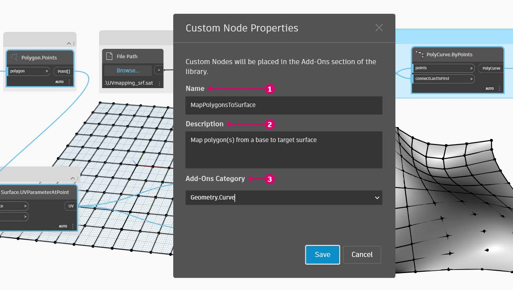
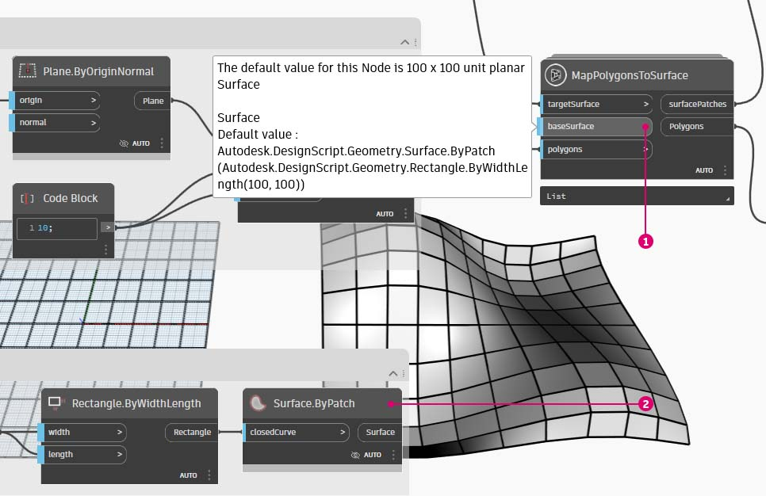

# Vytvoření vlastního uzlu

Aplikace Dynamo nabízí několik různých metod vytváření vlastních uzlů. Vlastní uzly můžete vytvořit zcela od začátku, z existujícího grafu nebo explicitně v jazyce C#. V této části se budeme zabývat vytvořením vlastního uzlu v uživatelském rozhraní aplikace Dynamo z existujícího grafu. Tato metoda je ideální k začištění pracovního prostoru a zabalení sekvence uzlů k opakovanému použití na jiném místě.

## Cvičení: Vlastní uzly pro mapování UV

### Část I: Začátek s grafem

Na obrázku níže namapujeme bod z jednoho povrchu na jiný pomocí souřadnic UV. Pomocí tohoto konceptu vytvoříme panelizovaný povrch, který odkazuje na křivky v rovině XY. Zde vytvoříme čtyřhranné panely pro naši panelizaci, ale pomocí stejné logiky můžeme vytvořit širokou řadu panelů s mapováním UV. Jedná se o skvělou příležitost k vývoji vlastního uzlu, protože v tomto grafu nebo v jiných pracovních postupech aplikace Dynamo budeme moci snadněji opakovat podobný proces.

> Kliknutím na odkaz níže si stáhněte vzorový soubor.
>
> Úplný seznam vzorových souborů najdete v dodatku.



Začneme vytvořením grafu, který chceme vnořit do vlastního uzlu. V tomto příkladu vytvoříme graf, který mapuje polygony ze základního povrchu na cílový povrch pomocí souřadnic UV. Tento proces mapování UV často používáme, proto je vhodným kandidátem pro vlastní uzel. Další informace o površích a prostoru UV naleznete na stránce [Povrch](../../5\_essential\_nodes\_and\_concepts/5-2\_geometry-for-computational-design/5-surfaces.md). Úplný graf je _UVmapping_Custom-Node.dyn_ ze souboru ZIP staženého výše.

> 1. **Code Block:** Pomocí tohoto řádku vytvořte rozsah 10 čísel v rozmezí -45 až 45: `45..45..#10;`.
> 2. **Point.ByCoordinates:** Připojte výstup uzlu **Code Block** ke vstupům „x“ a „y“ a nastavte vázání na kartézský součin. Nyní byste měli mít osnovu bodů.
> 3. **Plane.ByOriginNormal:** Spojením výstupu _Point_ se vstupem _origin_ vytvořte rovinu v každém z bodů. Bude použit výchozí normálový vektor (0,0,1).
> 4. **Rectangle.ByWidthLength:** Spojte roviny z předchozího kroku do vstupu _plane_ a pomocí uzlu **Code Block** s hodnotou _10_ určete šířku a délku.

Nyní byste měli vidět osnovu obdélníků. Tyto obdélníky namapujeme na cílový povrch pomocí souřadnic UV.

> 1. **Polygon.Points:** Spojením výstupu uzlu **Rectangle.ByWidthLength** z předchozího kroku se vstupem _polygon_ extrahujte rohové body každého obdélníku. Jedná se o body, které namapujeme na cílový povrch.
> 2. **Rectangle.ByWidthLength:** Pomocí uzlu **Code Block** s hodnotou _100_ určete šířku a délku obdélníku. Toto bude hranice našeho základního povrchu.
> 3. **Surface.ByPatch:** Připojte uzel **Rectangle.ByWidthLength** z předchozího kroku ke vstupu _closedCurve_ a vytvořte tak základní povrch.
> 4. **Surface.UVParameterAtPoint:** Připojte výstup _Point_ uzlu **Polygon.Points** a výstup _Surface_ uzlu **Surface.ByPatch** k vrácení parametru UV v každém bodu.

Nyní, když máme základní povrch a sadu souřadnic UV, můžete importovat cílový povrch a mapovat body mezi povrchy.

> 1. **File Path:** Vyberte cestu k souboru povrchu, který chcete importovat. Typ souboru by měl být .SAT. Klikněte na tlačítko _Procházet_ a přejděte k souboru _UVmapping_srf.sat_ ze souboru .zip staženého výše.
> 2. **Geometry.ImportFromSAT:** Připojte cestu k souboru a importujte povrch. Importovaný povrch uvidíte v náhledu geometrie.
> 3. **UV:** Připojte výstup parametru UV k uzlu _UV.U_ a _UV.V_.
> 4. **Surface.PointAtParameter:** Připojte importovaný povrch a také souřadnice U a V. Nyní byste měli na cílovém povrchu vidět rastr 3D bodů.

Posledním krokem je použití 3D bodů k vytvoření pravoúhlých záplat povrchů.

> 1. **PolyCurve.ByPoints:** Spojením bodů na povrchu se vytvoří objekt polycurve procházející body.
> 2. **Boolean:** Do pracovního prostoru přidejte uzel **Boolean**, připojte jej ke vstupu _connectLastToFirst_ a přepnutím na hodnotu True uzavřete objekt polycurve. Nyní byste měli vidět obdélníky namapované na povrch.
> 3. **Surface.ByPatch:** Propojte objekty polycurve se vstupem _closedCurve_ a vytvořte tak záplaty povrchů.

### Část II: Od grafu k vlastního uzlu

Nyní vybereme uzly, které chceme vnořit do vlastního uzlu, a zvážíme, co chceme použít jako vstupy a výstupy našeho uzlu. Chceme, aby byl vlastní uzel co nejflexibilnější, a proto by měl být schopen mapovat libovolné polygony, nikoli pouze obdélníky.

Vyberte následující uzly (počínaje uzlem Polygon.Points), klikněte pravým tlačítkem na pracovní prostor a vyberte možnost Vytvořit vlastní uzel.

V dialogu Vlastnosti vlastního uzlu přiřaďte k vlastnímu uzlu název, popis a kategorii.

> 1. Název: MapPolygonsToSurface
> 2. Popis: Mapuje polygony ze základního na cílový povrch.
> 3. Kategorie doplňků: Geometry.Curve

Vlastní uzel výrazně začistil pracovní prostor. Vstupy a výstupy byly pojmenovány na základě původních uzlů. Upravte vlastní uzel, aby byly názvy popisnější.

Dvakrát klikněte na vlastní uzel, který chcete upravit. Tím se otevře pracovní prostor se žlutým pozadím, které představuje vnitřek uzlu.

> 1. **Vstupy:** Změňte názvy vstupů na _baseSurface_ a _targetSurface_.
> 2. **Výstupy:** Přidejte další výstup pro mapované polygony.

Uložte vlastní uzel a vraťte se do domovského pracovního prostoru. Všimněte si, že uzel **MapPolygonsToSurface** odráží změny, které jsme právě provedli.

Robustnost vlastního uzlu lze také zvýšit přidáním **vlastních komentářů**. Komentáře mohou pomoci u typů vstupů a výstupů nebo vysvětlovat funkci uzlu. Komentáře se zobrazí, když uživatel umístí kurzor nad vstup, nebo výstup vlastního uzlu.

Dvakrát klikněte na vlastní uzel, který chcete upravit. Tím se znovu otevře pracovní prostor se žlutým pozadím.

> 1. Začněte upravovat vstupní **kód bloku**. Chcete-li vytvořit komentář, zadejte výraz "//" následovaný textem komentáře. Zadejte vše, co může pomoci objasnit uzel – zde budeme popisovat položku _targetSurface_.
> 2. Také nastavíme výchozí hodnotu _inputSurface_ nastavením typu vstupu rovnajícího se hodnotě. Zde nastavíme výchozí hodnotu na původní nastavení **Surface.ByPatch**.

Komentáře lze použít také na výstupy.

> Začněte upravovat text ve výstupním bloku kódu. Zadejte „//“ a za ním text komentáře. Zde vyjasníme výstupy _Polygons_ a _surfacePatches_ přidáním podrobnějšího popisu.

> 1. Přesunutím kurzoru nad vstupy vlastního uzlu zobrazíte komentáře.
> 2. S výchozí hodnotou nastavenou pro položku _inputSurface_ můžeme také spustit definici bez zadání povrchu.
