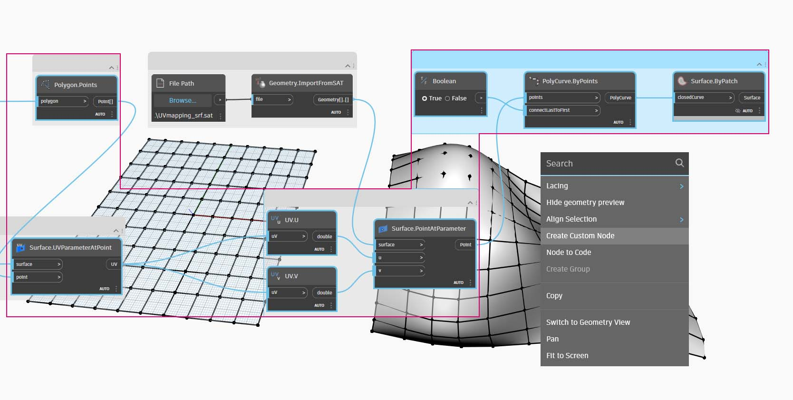

# Создание пользовательских узлов

В Dynamo предусмотрено несколько способов создания пользовательских узлов. Их можно создавать с нуля на основе существующего графика или непосредственно на языке C#. В этом разделе рассматривается создание пользовательского узла в интерфейсе Dynamo на основе существующего графика. Этот метод идеально подходит для очистки рабочего пространства, а также для упаковки последовательности узлов с целью их повторного использования в другом месте.

## Упражнение «Пользовательские узлы для UV-наложения»

### Часть I. Начало работы с графиком

На изображении ниже точка одной поверхности сопоставляется с другой точкой с помощью UV-координат. Этот принцип будет использоваться для создания панелей поверхности, ссылающихся на кривые в плоскости XY. В данном случае сформируем прямоугольные панели, но этим же способом можно создавать разнообразные панели с использованием UV-наложения. Это отличная возможность для разработки пользовательских узлов, так как данную процедуру можно повторять в этом же графике или в других рабочих процессах Dynamo.

> Скачайте файл примера, щелкнув указанную ниже ссылку.
>
> Полный список файлов примеров можно найти в приложении.



Начните с создания графика, который будет вложен в пользовательский узел. В этом примере с помощью UV-координат мы создадим график, который сопоставляет полигоны базовой поверхности с целевой поверхностью. Эта процедура UV-наложения используется часто, благодаря чему хорошо подходит для создания пользовательских узлов. Дополнительную информацию о поверхностях и UV-пространстве см. на странице [Поверхность](../../5\_essential\_nodes\_and\_concepts/5-2\_geometry-for-computational-design/5-surfaces.md). Готовый график — _UVmapping\_Custom-Node.dyn_ из скачанного ранее файла ZIP.

> 1. **Code Block**. Используйте эту строку для создания диапазона из 10 чисел от –45 до 45 `45..45..#10;`.
> 2. **Point.ByCoordinates**. Соедините выходные данные узла **Code Block** с входными данными x и y, выбрав в качестве переплетения перекрестную ссылку. При этом будет создана сетка точек.
> 3. **Plane.ByOriginNormal**. Соедините выходные данные _Point_ с входными данными _origin_, чтобы создать плоскость в каждой из точек. Будет использован вектор нормали по умолчанию (0,0,1).
> 4. **Rectangle.ByWidthLength**. Соедините плоскости из предыдущего шага с выходными данными _plane_ и с помощью узла **Code Block** со значением _10_ задайте ширину и длину.

При этом появится сетка прямоугольников. Сопоставьте эти прямоугольники с целевой поверхностью, используя UV-координаты.

> 1. **Polygon.Points**. Соедините выходные данные **Rectangle.ByWidthLength** из предыдущего шага с входными данными _polygon_, чтобы извлечь угловые точки каждого прямоугольника. Именно эти точки будут сопоставляться с целевой поверхностью.
> 2. **Rectangle.ByWidthLength**. С помощью узла **Code Block** со значением _100_ задайте ширину и длину прямоугольника. Это будет граница базовой поверхности.
> 3. **Surface.ByPatch**. Соедините **Rectangle.ByWidthLength** из предыдущего шага с входными данными _closedCurve_ для создания базовой поверхности.
> 4. **Surface.UVParameterAtPoint**. Соедините выходные данные _Point_ узла **Polygon.Points** с выходными данными _Surface_ узла **Surface.ByPatch** для получения параметра UV в каждой точке.

Теперь, имея базовую поверхность и набор UV-координат, можно импортировать целевую поверхность и сопоставить точки между поверхностями.

> 1. **File Path**. Выберите путь к файлу поверхности, которую требуется импортировать. Файл должен иметь тип SAT. Нажмите кнопку _Обзор..._ и перейдите к файлу _UVmapping_srf.sat_ из скачанного ранее файла ZIP.
> 2. **Geometry.ImportFromSAT**. Для импорта поверхности присоедините путь к файлу. При этом в области предварительного просмотра геометрии должна появиться импортированная поверхность.
> 3. **UV**. Соедините выходные данные параметра UV с узлами _UV.U_ и _UV.V_.
> 4. **Surface.PointAtParameter**. Присоедините импортированную поверхность, а также координаты u и v. Теперь на целевой поверхности должна появиться сетка 3D-точек.

Последний шаг — построение прямоугольных участков поверхности с помощью 3D-точек.

> 1. **PolyCurve.ByPoints**. Соедините точки на поверхности, чтобы построить сложную кривую через точки.
> 2. **Boolean**. Добавьте в рабочее пространство узел **Boolean** и соедините его с входными данными _connectLastToFirst_, задав значение True, чтобы замкнуть сложные кривые. При этом должны появиться прямоугольники, сопоставленные с поверхностью.
> 3. **Surface.ByPatch**. Соедините сложные кривые с входными данными _closedCurve_ для создания участков поверхности.

### Часть II. От графика к пользовательскому узлу

Теперь выберите узлы, которые необходимо вложить в пользовательский узел, учитывая, какие входные и выходные данные должны быть у конечного узла. Пользовательский узел должен быть максимально гибким и пригодным для сопоставления любых полигонов, а не только прямоугольников.

Выберите следующие узлы (начиная с Polygon.Points), щелкните правой кнопкой мыши рабочее пространство и выберите «Создание пользовательского узла».

В диалоговом окне «Свойства пользовательского узла» присвойте пользовательскому узлу имя, введите описание и укажите категорию.

> 1. Имя: MapPolygonsToSurface
> 2. Описание: сопоставление полигонов из базы с целевой поверхностью
> 3. Категория в разделе «Надстройки»: Geometry.Curve

Пользовательский узел в значительной мере очистил рабочее пространство. Обратите внимание, что входным и выходным данным были присвоены имена, соответствующие исходным узлам. Отредактируйте пользовательский узел, чтобы сделать имена более описательными.

Дважды щелкните пользовательский узел, чтобы отредактировать его. Откроется рабочее пространство с желтым фоном, представляющее собой внутреннюю часть узла.

> 1. **Inputs**. Измените имена входных параметров, задав _baseSurface_ и _targetSurface_.
> 2. **Outputs**. Добавьте дополнительный выходной параметр для сопоставленных многоугольников.

Сохраните пользовательский узел и вернитесь в исходное рабочее пространство. Внесенные изменения отражаются в узле **MapPolygonsToSurface**.

Для наглядности можно добавить к узлу **Пользовательские комментарии**. В комментариях можно указать сведения о типах входных и выходных данных или разъяснить функции узла. Комментарии отображаются при наведении курсора на входной или выходной параметр пользовательского узла.

Дважды щелкните пользовательский узел, чтобы отредактировать его. Снова откроется рабочее пространство с желтым фоном.

> 1. Начните редактировать блок **Code Block** Input. Чтобы создать комментарий, введите символы «//», а затем текст комментария. Добавьте любые пояснения к узлу. В данном случае будет дано описание входного параметра _targetSurface_.
> 2. Кроме того, задайте значение по умолчанию для входного параметра _inputSurface_, указав это значение в качестве типа входных данных. В данном случае в качестве значения по умолчанию будет задан исходный набор **Surface.ByPatch**.

Комментарии также можно применить к выходным параметрам.

> Отредактируйте текст блока «Code Block» Output. Введите «//», а затем текст комментария. Добавьте пояснения к выходным параметрам _Polygons_ и _surfacePatches_ путем ввода для них подробного описания.

> 1. Наведите курсор на пользовательский узел Inputs, чтобы просмотреть комментарии.
> 2. Так как для входного параметра _inputSurface_ задано значение по умолчанию, при запуске определения можно не вводить значение поверхности.
