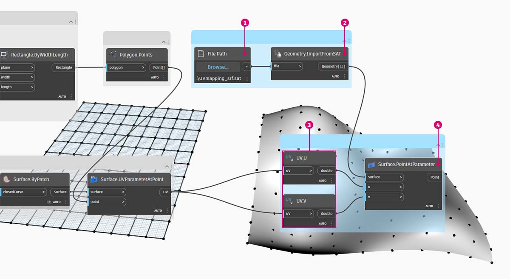
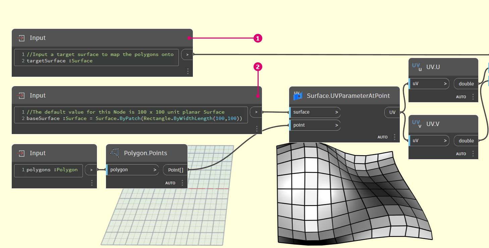

# Creazione di un nodo personalizzato

Dynamo offre diversi metodi per la creazione di nodi personalizzati. È possibile creare nodi personalizzati da zero, da un grafico esistente o esplicitamente in C#. In questa sezione verrà descritta la creazione di un nodo personalizzato nell'interfaccia utente di Dynamo da un grafico esistente. Questo metodo è ideale per la pulizia dell'area di lavoro, nonché per la creazione di una sequenza di nodi da riutilizzare altrove.

## Esercizio: Nodi personalizzati per il mappaggio UV

### Parte I: Inizio con un grafico

Nell'immagine seguente, viene associato un punto da una superficie ad un'altra utilizzando le coordinate UV. Questo concetto verrà utilizzato per creare una superficie a pannelli che faccia riferimento alle curve nel piano XY. Qui verranno creati pannelli quadrangolari per la suddivisione in pannelli, ma utilizzando la stessa logica, è possibile creare una vasta gamma di pannelli con il mappaggio UV. Si tratta di un'ottima opportunità per lo sviluppo di nodi personalizzati perché si potrà ripetere più facilmente un processo simile in questo grafico o in altri workflow di Dynamo.

> Scaricare il file di esempio facendo clic sul collegamento seguente.
>
> Un elenco completo di file di esempio è disponibile nell'Appendice.



Iniziare creando un grafico che si desidera nidificare in un nodo personalizzato. In questo esempio, verrà creato un grafico che associa i poligoni da una superficie di base ad una superficie di destinazione utilizzando le coordinate UV. Questo processo di mappaggio UV è un metodo utilizzato di frequente, il che lo rende un buon candidato per un nodo personalizzato. Per ulteriori informazioni sulle superfici e sullo spazio UV, fare riferimento alla pagina [Superficie ](../../5\_essential\_nodes\_and\_concepts/5-2\_geometry-for-computational-design/5-surfaces.md). Il grafico completo è _UVmapping_Custom-Node.dyn_ dal file .zip scaricato in precedenza.

> 1. **Code Block:** utilizzare questa linea per creare un intervallo di 10 numeri compreso tra -45 e 45`45..45..#10;`.
> 2. **Point.ByCoordinates:** collegare l'output di **Code Block** agli input x e y e impostare il collegamento su Globale. Ora dovrebbe essere presente una griglia di punti.
> 3. **Plane.ByOriginNormal:** collegare l'output _Point_ all'input _origin_ per creare un piano in corrispondenza di ciascuno dei punti. Verrà utilizzato il vettore normale di default (0,0,1).
> 4. **Rectangle.ByWidthLength:** collegare i piani del passaggio precedente all'input _plane_ e utilizzare un **Code Block** con un valore di _10_ per specificare la larghezza e la lunghezza.

Ora dovrebbe essere visibile una griglia di rettangoli. Associare questi rettangoli ad una superficie di destinazione utilizzando le coordinate UV.

> 1. **Polygon.Points:** collegare l'output **Rectangle.ByWidthLength** del passaggio precedente all'input _polygon_ per estrarre i punti degli angoli di ogni rettangolo. Questi sono i punti che verranno associati alla superficie di destinazione.
> 2. **Rectangle.ByWidthLength:** utilizzare un **Code Block** con un valore di _100_ per specificare la larghezza e la lunghezza di un rettangolo. Sarà il contorno della superficie di base.
> 3. **Surface.ByPatch:** collegare l'output **Rectangle.ByWidthLength** del passaggio precedente all'input _closedCurve_ per creare una superficie di base.
> 4. **Surface.UVParameterAtPoint:** collegare l'output _Point_ del nodo **Polygon.Points** e l'output _Surface_ del nodo **Surface.ByPatch** per restituire il parametro UV in ogni punto.

Ora che sono presenti una superficie di base e un gruppo di coordinate UV, è possibile importare una superficie di destinazione e associare i punti tra le superfici.

> 1. **File Path:** selezionare il percorso del file della superficie che si desidera importare. Il tipo di file deve essere .SAT. Fare clic sul pulsante _Sfoglia..._ e individuare il file _UVmapping_srf.sat_ nel file .zip scaricato in precedenza.
> 2. **Geometry.ImportFromSAT:** collegare il percorso del file per importare la superficie. La superficie importata dovrebbe essere visualizzata nell'anteprima della geometria.
> 3. **UV:** collegare l'output del parametro UV ad un nodo _UV.U_ e _UV.V_.
> 4. **Surface.PointAtParameter:** collegare la superficie importata, nonché le coordinate u e v. Ora dovrebbe essere visualizzata una griglia di punti 3D sulla superficie di destinazione.

Il passaggio finale consiste nell'utilizzare i punti 3D per costruire superfici di chiusura rettangolari.

> 1. **PolyCurve.ByPoints:** collegare i punti sulla superficie per costruire una PolyCurve attraverso i punti.
> 2. **Boolean:** aggiungere un valore **Boolean** all'area di lavoro e collegarlo all'input _connectLastToFirst_ e attivare True per chiudere le PolyCurve. Ora dovrebbero essere visualizzati i rettangoli associati alla superficie.
> 3. **Surface.ByPatch:** collegare le PolyCurve all'input _"closedCurve"_ per costruire superfici di chiusura.

### Parte II: Dal grafico al nodo personalizzato

A questo punto, selezionare i nodi che si desidera nidificare in un nodo personalizzato, pensando agli input e agli output del nodo stesso. Si desidera che il nodo personalizzato sia il più flessibile possibile, pertanto dovrebbe essere associabile ad eventuali poligoni, non solo ai rettangoli.

Selezionare i seguenti nodi (a partire da Polygon.Points), fare clic con il pulsante destro del mouse sull'area di lavoro e selezionare Crea nodo personalizzato.

Nella finestra di dialogo Proprietà nodo personalizzato, assegnare un nome, una descrizione e una categoria al nodo personalizzato.

> 1. Nome: MapPolygonsToSurface
> 2. Descrizione: mappare i poligoni da una base ad una superficie di destinazione
> 3. Categoria di Moduli aggiuntivi: Geometry.Curve

Il nodo personalizzato ha notevolmente ripulito l'area di lavoro. Notare che gli input e gli output sono stati denominati in base ai nodi originali. Modificare il nodo personalizzato per rendere i nomi più descrittivi.

Fare doppio clic sul nodo personalizzato per modificarlo. Verrà aperta un'area di lavoro con uno sfondo giallo che rappresenta l'interno del nodo.

> 1. **Input:** modificare i nomi di input in _baseSurface_ e _targetSurface_.
> 2. **Output:** aggiungere un altro output ai poligoni associati.

Salvare il nodo personalizzato e tornare all'area di lavoro iniziale. Tenere presente che il nodo **MapPolygonsToSurface** riflette le modifiche appena apportate.

È inoltre possibile potenziare la robustezza del nodo personalizzato mediante l'aggiunta di **commenti personalizzati**. I commenti possono aiutare a visualizzare suggerimenti sui tipi di input e output o spiegare le funzionalità del nodo. I commenti vengono visualizzati quando l'utente posiziona il cursore del mouse su un input o un output di un nodo personalizzato.

Fare doppio clic sul nodo personalizzato per modificarlo. Verrà riaperta l'area di lavoro con lo sfondo giallo.

> 1. Iniziare a modificare il **Code Block** Input. Per iniziare a scrivere un commento, digitare "//" seguito dal testo del commento. Digitare tutto ciò che potrebbe essere utile per chiarire il nodo. Qui verrà descritto l'input _targetSurface_.
> 2. Definire inoltre il valore di default per _inputSurface_ impostando il tipo di input uguale ad un valore. Qui, si imposterà il valore di default sul nodo **Surface.ByPatch** originale impostato.

I commenti possono essere applicati anche agli output.

> Modificare il testo nel Code Block Output. Digitare "//" seguito dal testo del commento. Qui verranno chiariti gli output _Polygons_ e _surfacePatches_ aggiungendo una descrizione più approfondita.

> 1. Posizionare il cursore del mouse sugli input del nodo personalizzato per visualizzare i commenti.
> 2. Con il valore di default impostato su _inputSurface_, è inoltre possibile eseguire la definizione senza un input Surface.
