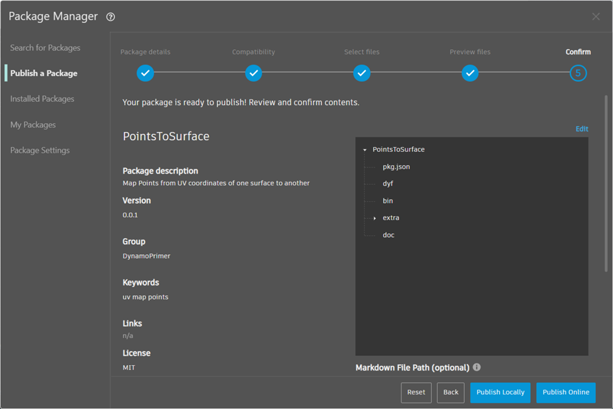
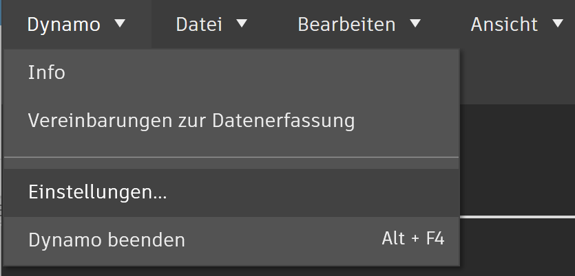
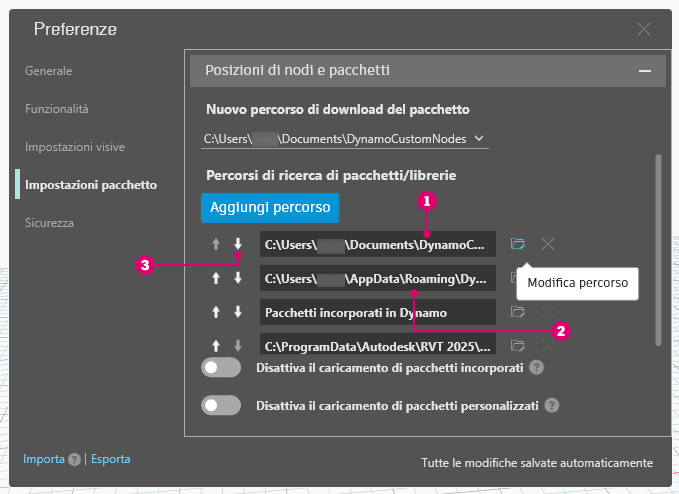
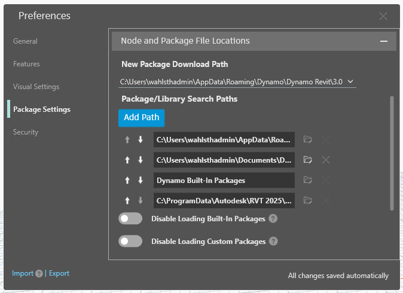

# Публикация узлов в библиотеку

Вы создали пользовательский узел и применили его к определенному процессу на графике Dynamo. Это очень полезный узел, поэтому его надо сохранить в библиотеке Dynamo для использования в других графиках. Для этого нужно опубликовать узел локально. Этот процесс аналогичен публикации пакета, который будет рассмотрен подробнее в следующей главе.

Узел, опубликованный локально, станет доступен в библиотеке Dynamo после запуска нового сеанса. Если пользовательский узел не опубликован, его необходимо разместить в папке графика Dynamo, ссылающегося на этот узел (либо этот узел нужно импортировать в Dynamo с помощью меню _Файл > Импорт библиотеки_).

 Пользовательские узлы и пакеты из Dynamo Sandbox можно публиковать в версии 2.17 и более поздних, если они не имеют зависимостей основного API. В более ранних версиях пользовательские узлы и пакеты можно публиковать только в Dynamo for Revit и Dynamo for Civil 3D. 

## Упражнение «Локальная публикация пользовательского узла»

> Скачайте файл примера, щелкнув указанную ниже ссылку.
>
> Полный список файлов примеров можно найти в приложении.



Продолжайте работу с пользовательским узлом, созданным в предыдущем разделе. После открытия пользовательского узла PointsToSurface график отображается в редакторе пользовательских узлов Dynamo. Пользовательский узел также можно открыть, дважды щелкнув его в редакторе графиков Dynamo.

\

Чтобы опубликовать пользовательский узел локально, щелкните правой кнопкой мыши в рабочей области и выберите _Опубликовать данный пользовательский узел..._

\

Введите все необходимые сведения, как показано на изображении выше, и выберите _Опубликовать локально_. Обратите внимание, что в поле «Группа» задается основной элемент, который будет доступен в меню Dynamo.

<figure><figcaption></figcaption></figure>

Выберите папку для хранения всех пользовательских узлов, которые планируется опубликовать локально. Приложение Dynamo будет проверять эту папку каждый раз при загрузке, поэтому она должна находиться в постоянном расположении. Перейдите к этой папке и нажмите _Выбрать папку_. Пользовательский узел Dynamo опубликован локально и теперь будет отображаться в библиотеке Dynamo при каждой загрузке программы.

\.jpg>)

Чтобы проверить расположение папки пользовательского узла, откройте меню _Dynamo > Настройки > Параметры пакета > Пути к узлу и пакету._

<figure><figcaption></figcaption></figure>

В этом окне отображается список путей.

<figure><figcaption></figcaption></figure>

> 1. _Documents\\DynamoCustomNodes..._ — расположение пользовательских узлов, которые были опубликованы локально.
> 2. _AppData\\Roaming\\Dynamo..._ — путь по умолчанию к пакетам Dynamo, установленным из интернета.
> 3. Рекомендуется переместить путь к локальной папке вниз по списку (для этого щелкните стрелку вниз на панели слева от строки с путем). Верхняя папка всегда по умолчанию используется как расположение для установки пакетов. Поэтому если в качестве верхней папки будет указан путь для установки пакетов Dynamo, все полученные через интернет пакеты будут храниться отдельно от узлов, опубликованных локально

Порядок путей к папкам изменен, чтобы в качестве пути по умолчанию в Dynamo использовалась папка установки пакетов.

<figure><figcaption></figcaption></figure>

Перейдите в эту локальную папку. Исходный пользовательский узел находится в папке _.dyf_, имя которой является расширением для файлов пользовательских узлов Dynamo. Если отредактировать файл в этой папке, соответствующий узел будет обновлен в пользовательском интерфейсе. Кроме того, можно добавить дополнительные узлы в главную папку _DynamoCustomNode_, и после перезапуска Dynamo они появятся в библиотеке.

\

Теперь при каждой загрузке Dynamo узел PointsToSurface будет отображаться в группе DynamoPrimer библиотеки Dynamo.

\
