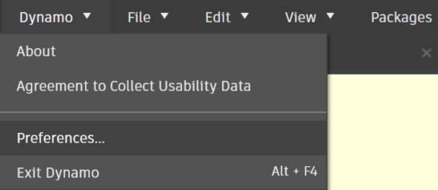
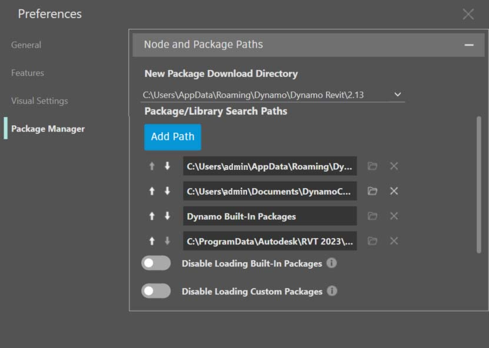
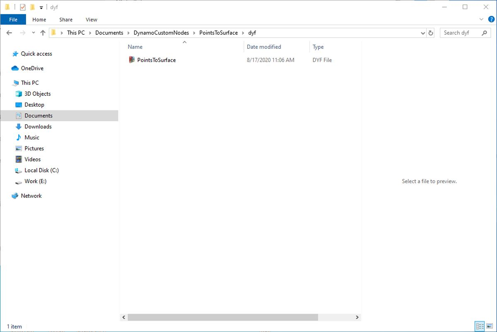

# Publication dans votre bibliothèque

Vous venez de créer un nœud personnalisé et de l'appliquer à un processus spécifique dans le graphique Dynamo. Vous souhaitez en outre conserver ce nœud dans la bibliothèque Dynamo pour établir des références à d'autres graphiques. Pour ce faire, vous allez publier le nœud localement. Cette procédure est semblable à celle utilisée pour publier un package, que vous verrez plus en détail dans le chapitre suivant.

Avec la publication locale, le nœud sera accessible dans votre bibliothèque Dynamo lorsque vous ouvrirez une nouvelle session. Si le nœud n’est pas publié, un graphique Dynamo qui fait référence à un nœud personnalisé doit également comporter ce nœud personnalisé dans son dossier (ou le nœud personnalisé doit être importé dans Dynamo à l’aide de l’option _Fichier > Importer une bibliothèque_).

 La publication d’un nœud personnalisé est activée uniquement dans Dynamo for Revit et Dynamo pour Civil 3D. Dynamo Sandbox ne dispose pas de la fonctionnalité de publication. 

## Exercice : Publication locale d’un nœud personnalisé

> Téléchargez le fichier d’exemple en cliquant sur le lien ci-dessous.
>
> Vous trouverez la liste complète des fichiers d'exemple dans l'annexe.



Nous allons avancer à l'aide du nœud personnalisé que vous avez créé dans la section précédente. Une fois le nœud PointsToSurface personnalisé ouvert, le graphique s’affiche dans l’éditeur de nœuds personnalisés Dynamo. Vous pouvez également ouvrir un nœud personnalisé en double-cliquant dessus dans l’éditeur graphique Dynamo.

Pour publier un nœud personnalisé localement, cliquez simplement avec le bouton droit de la souris sur la zone de dessin et choisissez _« Publier ce nœud personnalisé… »_.

Remplissez les informations pertinentes comme dans l’image ci-dessus et choisissez _« Publier localement »_ Notez que le champ Groupe définit l’élément principal accessible à partir du menu Dynamo.

Choisissez un dossier pour héberger tous les nœuds personnalisés que vous envisagez de publier localement. Dynamo consultera ce dossier à chaque chargement. Par conséquent, assurez-vous que le dossier réside dans un emplacement permanent. Accédez à ce dossier et choisissez _« Sélectionner un dossier »._ Votre nœud Dynamo est désormais publié localement et restera dans votre barre d’outils Dynamo chaque fois que vous chargez le programme.

Pour vérifier l’emplacement du dossier de nœud personnalisé, accédez à _Dynamo > Préférences > Gestionnaire de package > Chemins d’accès de nœud et de package_

Cette fenêtre contient une liste de chemins.

> 1. _Documents\\DynamoCustomNodes…_ fait référence à l’emplacement des nœuds personnalisés publiés localement.
> 2. _AppData\\Roaming\\Dynamo…_ fait référence à l’emplacement par défaut des packages Dynamo installés en ligne.
> 3. Vous pouvez déplacer le chemin d’accès au dossier local vers le bas dans la liste affichée ci-dessus (en sélectionnant le chemin d’accès au dossier et en cliquant sur la flèche vers le bas située à gauche des noms de chemin). Le dossier racine est le chemin par défaut des installations de package. Ainsi, en conservant le chemin d'installation par défaut du package Dynamo comme dossier par défaut, les packages en ligne sont séparés des nœuds publiés localement.

Nous avons changé l’ordre des noms de chemin pour que le chemin par défaut de Dynamo devienne l’emplacement d’installation du package.

En accédant à ce dossier local, vous trouvez le nœud personnalisé d’origine dans le dossier _« .dyf »_, qui est l’extension d’un fichier de nœud personnalisé Dynamo. Vous pouvez modifier le fichier dans ce dossier et le nœud sera mis à jour dans l’interface utilisateur. Vous pouvez également ajouter des nœuds au dossier _DynamoCustomNode_ principal et Dynamo les ajoutera à votre bibliothèque au redémarrage.

Dynamo se charge désormais à chaque fois avec « PointsToSurface » dans le groupe « DynamoPrimer » de votre bibliothèque Dynamo.

