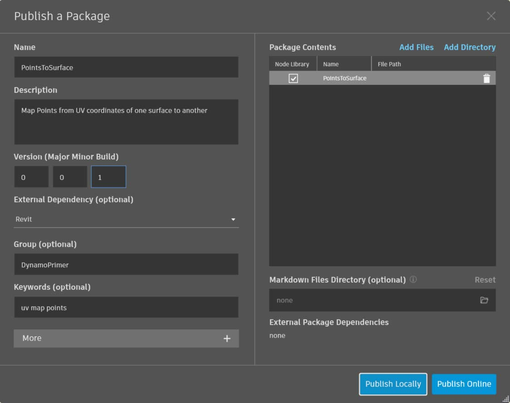

# Publicación en la biblioteca

Acabamos de crear un nodo personalizado y lo hemos aplicado a un proceso específico en el gráfico de Dynamo. Y nos gusta tanto este nodo que deseamos conservarlo en nuestra biblioteca de Dynamo para hacer referencia a él en otros gráficos. Para ello, publicaremos el nodo localmente. Este es un proceso similar al de la publicación de un paquete, que se explicará con más detalle en el siguiente capítulo.

Al publicar un nodo localmente, se podrá acceder a este en la biblioteca de Dynamo cuando se abra una nueva sesión. Si no se publica un nodo, un gráfico de Dynamo que haga referencia a un nodo personalizado deberá incluir ese nodo personalizado en su carpeta (o este deberá importarse a Dynamo mediante _Archivo > Importar biblioteca_).

 La publicación de nodos personalizados solo está activada en Dynamo para Revit y Dynamo para Civil 3D. Dynamo Sandbox no incluye funciones de publicación. 

## Ejercicio: publicación local de un nodo personalizado

> Descargue el archivo de ejemplo. Para ello, haga clic en el vínculo siguiente.
>
> En el Apéndice, se incluye una lista completa de los archivos de ejemplo.



Avancemos con el nodo personalizado que hemos creado en la sección anterior. Una vez abierto el nodo personalizado PointsToSurface, se muestra el gráfico en el editor de nodos personalizados de Dynamo. También puede abrir un nodo personalizado haciendo doble clic en él en el editor de gráficos de Dynamo.

Para publicar localmente un nodo personalizado, haga clic con el botón derecho en el lienzo y seleccione _"Publicar este nodo personalizado"_.

Rellene la información pertinente similar a la imagen anterior y seleccione _"Publicar localmente"_. Observe que el campo Grupo define el elemento principal al que se puede acceder desde el menú de Dynamo.

Seleccione una carpeta para alojar todos los nodos personalizados que tiene previsto publicar localmente. Dynamo comprobará esta carpeta cada vez que se cargue, por lo que debe asegurarse de que esta se encuentre en una ubicación permanente. Vaya a esta carpeta y elija _"Seleccionar carpeta"_. El nodo de Dynamo se publica ahora localmente y permanecerá en la barra de herramientas de Dynamo cada vez que cargue el programa.

Para comprobar la ubicación de la carpeta de nodos personalizados, vaya a _Dynamo > Preferencias > Package Manager > Rutas de nodos y paquetes_.

En esta ventana, se muestra una lista de rutas.

> 1. _Documents\\DynamoCustomNodes..._ hace referencia a la ubicación de los nodos personalizados que se han publicado localmente.
> 2. _AppData\\Roaming\\Dynamo.._. hace referencia a la ubicación por defecto de los paquetes de Dynamo instalados en línea.
> 3. Es posible que desee desplazar la ruta de carpeta local hacia abajo en el orden de la lista anterior. (Para ello, seleccione la ruta de carpeta y haga clic en la flecha hacia abajo situada a la izquierda de los nombres de ruta). La carpeta superior es la ruta por defecto para las instalaciones de paquetes. Por lo tanto, al mantener la ruta de instalación por defecto de paquetes de Dynamo como la carpeta por defecto, los paquetes en línea se separarán de los nodos publicados localmente.

Cambiamos el orden de los nombres de ruta para que la ruta por defecto de Dynamo sea la ubicación de instalación de paquetes.

Al acceder a esta carpeta local, podemos encontrar el nodo personalizado original en la carpeta _".dyf"_, que es la extensión de un archivo de nodo personalizado de Dynamo. Podemos editar el archivo en esta carpeta; el nodo se actualizará en la interfaz de usuario. También podemos añadir más nodos a la carpeta principal de _DynamoCustomNode_; Dynamo los añadirá a la biblioteca al reiniciar.

Dynamo ahora se cargará cada vez con PointsToSurface en el grupo DynamoPrimer de la biblioteca de Dynamo.

