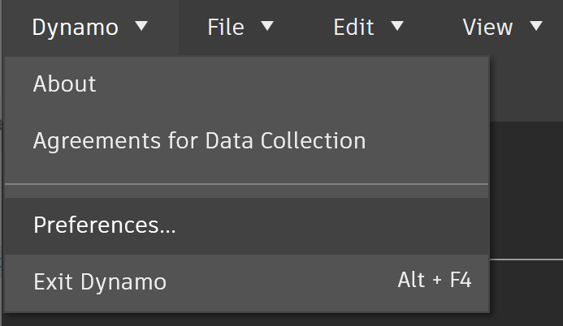

# ライブラリへのパブリッシュ

ここまでの手順で、カスタム ノードを作成して Dynamo グラフ内の特定のプロセスに適用しました。このセクションでは、このノードを他の Dynamo グラフでも参照できるように、このノードをライブラリに保存します。これを実行するには、目的のノードをローカルにパブリッシュします。これは、パッケージをパブリッシュする場合と同様の手順です。パッケージのパブリッシュについては、次の章で詳しく説明します。

ノードをローカルにパブリッシュすると、新しいセッションを開いたときに、Dynamo ライブラリからそのノードにアクセスできるようになります。ノードをパブリッシュせずに Dynamo グラフからカスタム ノードを参照する場合、グラフのフォルダ内に、そのカスタム ノードを含めておく必要があります。または、_[ファイル] > [ライブラリを読み込み]_ を使用してカスタム ノードを Dynamo に読み込む必要があります。

 ホスト API の依存関係がない限り、バージョン 2.17 以降で Dynamo Sandbox からカスタム ノードとパッケージをパブリッシュすることができます。旧バージョンでは、カスタム ノードとパッケージのパブリッシュは、Revit 用の Dynamo と Dynamo for Civil 3D でのみ有効です。 

## 演習: カスタム ノードをローカルにパブリッシュする

> 下のリンクをクリックして、サンプル ファイルをダウンロードします。
>
> すべてのサンプルファイルの一覧については、付録を参照してください。



前のセクションで作成したカスタム ノードを使用して、次の手順に進みましょう。PointsToSurface カスタム ノードを開くと、Dynamo のカスタム ノード エディタにグラフが表示されます。または、Dynamo グラフ エディタ内でカスタム ノードをダブルクリックしてカスタム ノードを開くこともできます。

カスタム ノードをローカルにパブリッシュするには、キャンバス上で右クリックして、[_このカスタム ノードをパブリッシュ..._]を選択します。

上図のように、関連情報を入力して[_ローカルにパブリッシュ_]を選択します。[グループ]フィールドで、Dynamo メニューからアクセスできる主要な要素を定義します。

<figure><figcaption></figcaption></figure>

ローカルにパブリッシュするすべてのカスタム ノードを格納するフォルダを 1 つ選択します。Dynamo を読み込むたびにこのフォルダが確認されるため、このフォルダの場所は変更しないでください。このフォルダにナビゲートし、[_フォルダを選択_]を選択します。これで、Dynamo ノードがローカルにパブリッシュされ、プログラムを読み込むたびに、このフォルダが Dynamo ライブラリに表示されるようになります。

カスタム ノードのフォルダの場所を確認するには、_[Dynamo] > [基本設定] > [パッケージ設定] > [ノードとパッケージのパス]_ に移動します。

<figure><figcaption></figcaption></figure>

このウィンドウには、パスのリストが表示されます。

<figure><figcaption></figcaption></figure>

> 1. _Documents\\DynamoCustomNodes..._ は、ローカルにパブリッシュされたカスタム ノードの場所を参照します。
> 2. _AppData\\Roaming\\Dynamo..._ は、オンラインでインストールされる Dynamo パッケージの既定の場所を示しています。
> 3. リスト内でローカル フォルダ パスを下に移動する場合は、パス名の左側にある下向き矢印をクリックします。一番上に表示されているフォルダが、パッケージがインストールされる既定のパスになります。そのため、Dynamo パッケージの既定のインストール パスを既定のフォルダのままにすると、オンライン パッケージをローカルにパブリッシュしたノードと区別することができます。

Dynamo の既定のパスをパッケージのインストール場所に設定するため、パス名の順序を変更しました。

<figure><figcaption></figcaption></figure>

このローカル フォルダにナビゲートすると、Dynamo のカスタム ノード ファイルの拡張である元のカスタム ノードが _.dyf_ フォルダに表示されます。このフォルダ内のファイルを編集すると、UI 上でノードが更新されます。また、メインの _DynamoCustomNode_ フォルダにノードを追加すると、Dynamo の再起動時に、それらのノードがライブラリに追加されます。

これで、Dynamo を読み込むたびに、PointsToSurface ノードが Dynamo ライブラリの[DynamoPrimer]グループに表示されるようになります。

