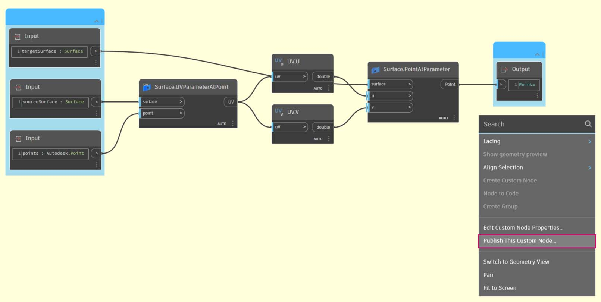
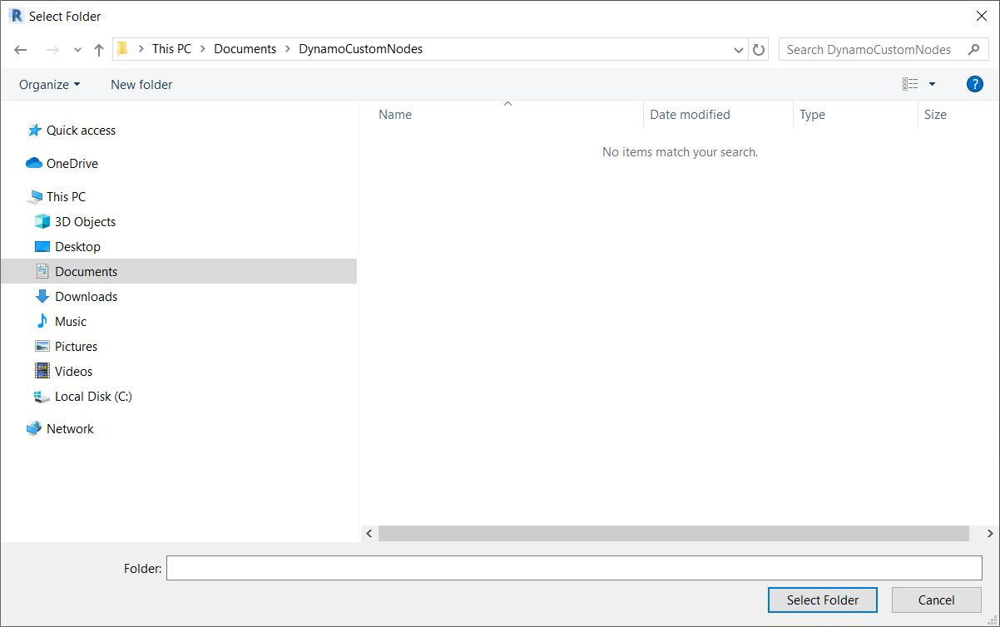
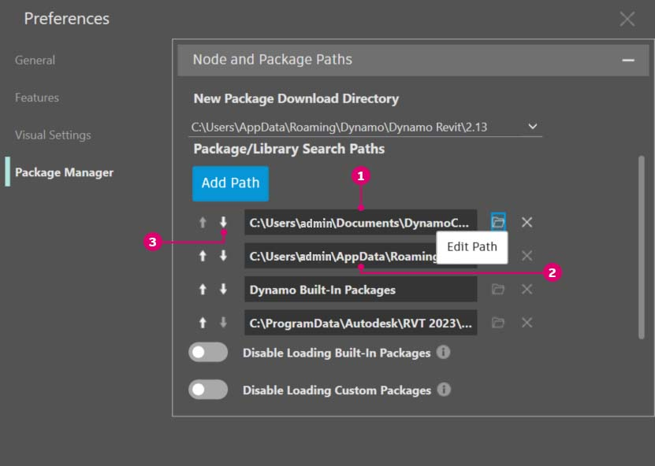

# Pubblicazione nella libreria

È stato appena creato un nodo personalizzato ed è stato applicato ad un processo specifico nel grafico di Dynamo. E dato che questo nodo è ben riuscito, si desidera mantenerlo nella libreria di Dynamo come riferimento in altri grafici. Per eseguire questa operazione, il nodo verrà pubblicato localmente. Questo è un processo simile alla pubblicazione di un pacchetto, che sarà esaminata più in dettaglio nel prossimo capitolo.

Se si pubblica un nodo localmente, questo sarà accessibile nella libreria di Dynamo quando si apre una nuova sessione. Senza pubblicare un nodo, un grafico di Dynamo che fa riferimento ad un nodo personalizzato deve anche contenere tale nodo personalizzato nella relativa cartella (o il nodo personalizzato deve essere importato in Dynamo utilizzando _File > Importa libreria_).

 La pubblicazione del nodo personalizzato è abilitata solo in Dynamo for Revit e Dynamo for Civil 3D. Dynamo Sandbox non dispone di funzionalità di pubblicazione. 

## Esercizio: Pubblicazione locale di un nodo personalizzato

> Scaricare il file di esempio facendo clic sul collegamento seguente.
>
> Un elenco completo di file di esempio è disponibile nell'Appendice.



Procedere con il nodo personalizzato creato nella sezione precedente. Una volta aperto il nodo personalizzato PointsToSurface, viene visualizzato il grafico nell'Editor nodi personalizzati di Dynamo. È inoltre possibile aprire un nodo personalizzato facendovi doppio clic nell'editor dei grafici di Dynamo.

Per pubblicare un nodo personalizzato localmente, è sufficiente fare clic con il pulsante destro del mouse sull'area di disegno e selezionare _Pubblica questo nodo personalizzato_.

Compilare le informazioni pertinenti simili a quelle mostrate nell'immagine riportata sopra e selezionare _Pubblica localmente_. Notare che il campo Gruppo (facoltativo) definisce l'elemento principale accessibile dal menu di Dynamo.

Scegliere una cartella in cui memorizzare tutti i nodi personalizzati che si prevede di pubblicare localmente. In Dynamo viene controllata questa cartella ad ogni caricamento del programma, quindi verificare che si trovi in una posizione permanente. Individuare la cartella e scegliere _Seleziona cartella_. Il nodo di Dynamo viene ora pubblicato localmente e rimarrà sulla barra degli strumenti di Dynamo ogni volta che si carica il programma.

Per verificare il percorso della cartella dei nodi personalizzati, accedere a _Dynamo > Preferenze > Package Manager > Percorsi di nodi e pacchetti_.

In questa finestra viene visualizzato un elenco di percorsi.

> 1. _Documents\\DynamoCustomNodes..._ si riferisce alla posizione dei nodi personalizzati pubblicati localmente.
> 2. _AppData\\Roaming\\Dynamo..._ si riferisce alla posizione di default dei pacchetti di Dynamo installati in linea.
> 3. È possibile spostare il percorso della cartella locale in basso nell'ordine dell'elenco indicato sopra (selezionando il percorso della cartella e facendo clic sulla freccia giù a sinistra dei nomi dei percorsi). La cartella superiore è il percorso di default per le installazioni di pacchetti. Pertanto, se si mantiene il percorso di installazione di default del pacchetto di Dynamo come cartella di default, i pacchetti in linea verranno separati dai nodi pubblicati localmente.

È stato cambiato l'ordine dei nomi dei percorsi in modo da avere il percorso di default di Dynamo come posizione di installazione del pacchetto.

Accedendo a questa cartella locale, è possibile trovare il nodo personalizzato originale nella cartella _dyf_, che è l'estensione del file di un nodo personalizzato di Dynamo. Si può modificare il file in questa cartella e il nodo verrà aggiornato nell'interfaccia utente. È inoltre possibile aggiungere altri nodi alla cartella _DynamoCustomNodes_ principale. In Dynamo verranno aggiunti alla libreria al riavvio.

Dynamo ora viene caricato ogni volta con PointsToSurface nel gruppo DynamoPrimer della libreria di Dynamo.

