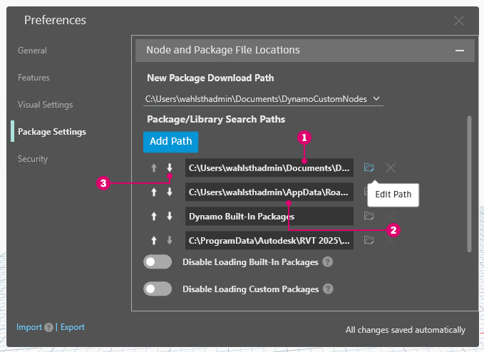

# Publikování do knihovny

Vytvořili jsme vlastní uzel a použili jej na proces v grafu aplikace Dynamo. Nyní tento uzel chceme zachovat v knihovně aplikace Dynamo pro později použití v dalších grafech. Z tohoto důvodu provedeme místní publikování uzlu. Tento postup je podobný jako publikování balíčku, další informace budou uvedeny v další kapitole.

Po místním publikování uzlu bude uzel dostupný v knihovně aplikace Dynamo po otevřené nové relace. Pokud by uzel publikován nebyl, graf aplikace Dynamo odkazující na vlastní uzel by musel tento uzel obsahovat ve své složce (další možností je uzel importovat do aplikace Dynamo pomocí možnosti _Soubor > Importovat knihovnu_).

 Vlastní uzly a balíčky z aplikace Dynamo Sandbox ve verzi 2.17 a novějších můžete publikovat, pokud nemají žádné závislosti na hostitelském rozhraní API. Ve starších verzích je publikování vlastních uzlů a balíčků povoleno pouze v aplikacích Dynamo pro aplikaci Revit a Dynamo for Civil 3D. 

## Cvičení: Místní publikování vlastního uzlu

> Kliknutím na odkaz níže si stáhněte vzorový soubor.
>
> Úplný seznam vzorových souborů najdete v dodatku.



V této části budeme pokračovat v práci s vlastním uzlem vytvořeným dříve. Po otevření vlastního uzlu PointsToSurface se graf zobrazí v Editoru uživatelských uzlů aplikace Dynamo. Vlastní uzel je možné otevřít také dvojitým kliknutím v Editoru grafu aplikace Dynamo.

Chcete-li provést místní publikování vlastního uzlu, klikněte pravým tlačítkem myši na pracovní plochu a vyberte možnost _Publikovat tento vlastní uzel_.

Vyplňte informace podle obrázku výše a klikněte na tlačítko _Publikovat místně_. Všimněte si, že pole Skupina určuje místo v nabídce aplikace Dynamo, kde bude uzel dostupný.

<figure><figcaption></figcaption></figure>

Vyberte složku, ve které se budou nacházet všechny místně publikované vlastní uzly. Aplikace Dynamo bude tuto složku kontrolovat při každém spuštění, proto by se mělo jednat o trvalé umístění. Přejděte do této složky a klikněte na tlačítko _Vybrat složku_. Uzel aplikace Dynamo je nyní místně publikován a bude k dispozici v knihovně aplikace Dynamo po každém spuštění aplikace.

Chcete-li zjistit umístění složky vlastních uzlů, klikněte na nabídku _Dynamo > Předvolby > Nastavení balíčku > Cesty uzlů a balíčků_.

<figure><figcaption></figcaption></figure>

V tomto okně se zobrazí seznam cest.

<figure><figcaption></figcaption></figure>

> 1. _Dokumenty\\DynamoCustomNodes..._ odkazuje na umístění místně publikovaných vlastních uzlů.
> 2. _AppData\\Roaming\\Dynamo..._ odkazuje na výchozí umístění balíčků aplikace Dynamo nainstalovaných online.
> 3. Cestu k vaší místní složce můžete v seznamu přesunout dolů (výběrem cesty ke složce a kliknutím na šipku dolů). Složka uvedená nejvýše se používá jako výchozí složka pro instalace balíčků. Pokud jako výchozí složku nastavíte výchozí cestu pro instalaci balíčků aplikace Dynamo, online balíčky budou odděleny od místně publikovaných uzlů.

Změnili jsme pořadí cest, aby se pro instalaci balíčků použila výchozí cesta aplikace Dynamo.

<figure><figcaption></figcaption></figure>

Pokud přejdete do této místní složky, ve složce _„.dyf“_ (což je přípona pro soubor vlastního uzlu aplikace Dynamo) naleznete původní vlastní uzel. Po úpravě souborů v této složce se uzly aktualizují v uživatelském rozhraní. Do složky _DynamoCustomNode_ je možné přidat další uzly a aplikace Dynamo je přidá do knihovny po restartování.

Aplikace Dynamo se nyní pokaždé načte s uzlem PointsToSurface ve skupině DynamoPrimer v knihovně.

