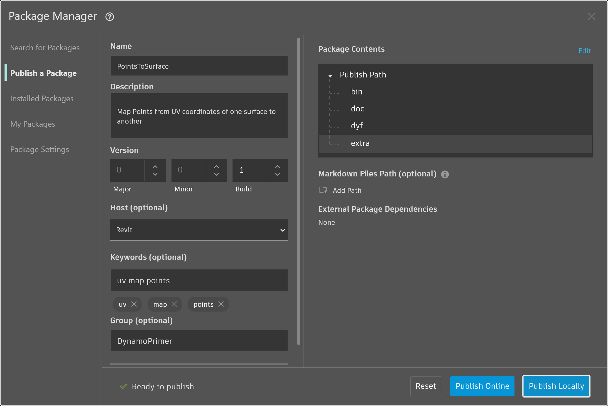

# Publicar na biblioteca

Acabamos de criar um nó personalizado e aplicá-lo a um processo específico em nosso gráfico do Dynamo. Gostamos tanto desse nó, por isso queremos mantê-lo em nossa biblioteca do Dynamo para usar como referência em outros gráficos. Para fazer isso, vamos publicar o nó localmente. Este é um processo semelhante ao de publicar um pacote, que iremos mostrar em mais detalhes no próximo capítulo.

Quando publicar um nó localmente, o nó estará acessível na biblioteca do Dynamo quando você abrir uma nova sessão. Se nenhum nó for publicado, o gráfico do Dynamo que faz referência a um nó personalizado também deverá ter aquele nó personalizado em sua pasta (ou o nó personalizado deverá ser importado para o Dynamo usando _Arquivo > Importar biblioteca_).

 É possível publicar nós e pacotes personalizados do Dynamo Sandbox na versão 2.17 e mais recentes, desde que não tenham dependências de APIs do hospedeiro. Em versões anteriores, a publicação de nós e pacotes personalizados somente estava ativada no Dynamo for Revit e no Dynamo for Civil 3D. 

## Exercício: Publicar um nó personalizado localmente

> Faça o download do arquivo de exemplo clicando no link abaixo.
>
> É possível encontrar uma lista completa de arquivos de exemplo no Apêndice.



Vamos avançar com o nó personalizado que criamos na seção anterior. Quando o nó personalizado PointsToSurface é aberto, vemos o gráfico no Editor de nós personalizados do Dynamo. Também é possível abrir um nó personalizado clicando duas vezes nele no Editor de gráficos do Dynamo.

Para publicar um nó personalizado localmente, basta clicar com o botão direito do mouse na tela e selecionar _“Publicar este nó personalizado...”_

Preencha as informações relevantes de forma similar à imagem acima e selecione _“Publicar localmente”_. Observe que o campo Grupo define o elemento principal acessível no menu do Dynamo.

<figure><figcaption></figcaption></figure>

Escolha uma pasta para armazenar todos os nós personalizados que você planeja publicar localmente. O Dynamo verificará essa pasta sempre que ela for carregada, portanto, certifique-se de que a pasta esteja em um local permanente. Navegue até essa pasta e escolha _“Selecionar pasta”_. O nó do Dynamo agora é publicado localmente e permanecerá na biblioteca do Dynamo cada vez que você carregar o programa.

Para verificar a localização da pasta de nós personalizados, vá para _Dynamo > Preferências > Configurações do pacote > Caminhos de nós e pacotes._

<figure><figcaption></figcaption></figure>

Nessa janela, vemos uma lista de caminhos.

<figure><figcaption></figcaption></figure>

> 1. _Documentos\\DynamoCustomNodes..._ refere-se à localização dos nós personalizados que publicamos localmente.
> 2. _AppData\\Roaming\\Dynamo..._ refere-se à localização padrão dos pacotes do Dynamo instalados on-line.
> 3. Você pode desejar mover o caminho da pasta local para baixo na ordem da lista (clicando na seta para baixo à esquerda do nome do caminho). A pasta superior é o caminho padrão para a instalação do pacote. Portanto, mantendo o caminho de instalação do pacote do Dynamo padrão como a pasta padrão, os pacotes on-line serão separados dos nós publicados localmente.

Alteramos a ordem dos nomes de caminhos para que o caminho padrão do Dynamo seja o local de instalação do pacote.

<figure><figcaption></figcaption></figure>

Navegando para essa pasta local, poderemos encontrar o nó personalizado original na pasta _“.dyf”_, que é a extensão de arquivo de nós personalizados do Dynamo. Podemos editar o arquivo nessa pasta e o nó será atualizado na interface do usuário. Também é possível adicionar mais nós à pasta principal _DynamoCustomNode_ e o Dynamo os adicionará à biblioteca ao ser reiniciado.

O Dynamo agora será carregado sempre com “PointsToSurface” no grupo “DynamoPrimer” da biblioteca do Dynamo.

