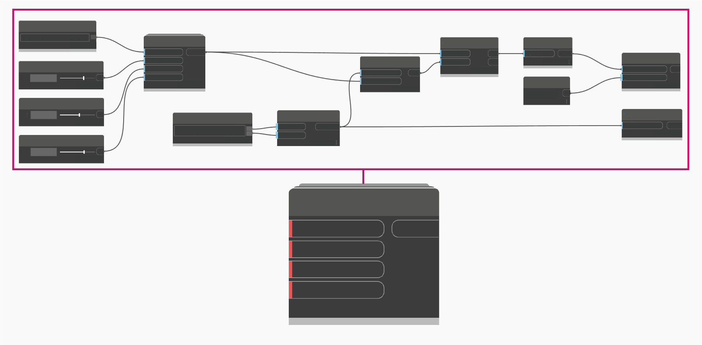

# Nodi personalizzati

Dynamo offre molti nodi principali per un'ampia gamma di attività di programmazione visiva. A volte una soluzione più rapida, più elegante o più facilmente condivisa consiste nella creazione di nodi personalizzati. Questi possono essere riutilizzati tra diversi progetti, rendono i grafici più chiari e più ordinati, possono essere trasmessi a Package Manager e condivisi con la comunità di Dynamo globale.

