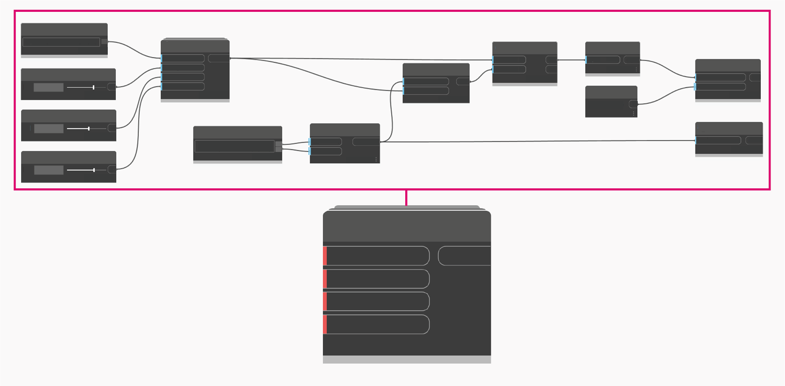

# カスタム ノード

Dynamo には、ビジュアル プログラミングのさまざまなタスクで使用できる多くのコア ノードが用意されています。ただし、独自のノードを作成した方が、より迅速で効率的、またはより簡単に共有できる解決策となる場合があります。これらの独自のノードは複数の異なるプロジェクトで再利用できるため、グラフが見やすくなります。これらのノードを Package Manager にプッシュして、世界中の Dynamo コミュニティと共有することもできます。

