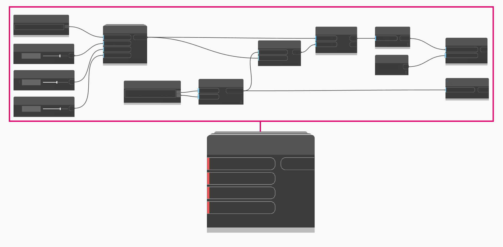

# Custom Nodes

You can use custom nodes to reuse and organize your dynamo logic. In this section you will find:

* [Custom Node Introduction](1-introduction.md)
* [Creating a Custom Node](2-creating.md)
* [Publishing to Your Library](3-library.md)

