# Pakiet — wprowadzenie

Dodatek Dynamo udostępnia wiele funkcji gotowych do użycia oraz obszerną bibliotekę pakietów, które mogą znacznie zwiększyć możliwości dodatku. Pakiet jest zbiorem węzłów niestandardowych lub dodatkowych funkcji. Dynamo Package Manager to portal dla społeczności umożliwiający pobranie dowolnego pakietu, który został opublikowany online. Te zestawy narzędzi zostały opracowane przez strony trzecie w celu rozszerzenia podstawowej funkcjonalności dodatku Dynamo i są dostępne dla wszystkich. Są gotowe do pobrania przez kliknięcie przycisku.

Projekt open-source, taki jak dodatek Dynamo, rozwija się dzięki takiemu zaangażowaniu społeczności. Dzięki zaangażowanym programistom zewnętrznym dodatek Dynamo może rozszerzyć zasięg na procesy robocze w różnych branżach. Z tego powodu zespół dodatku Dynamo podjął skoncentrowane wysiłki w celu usprawnienia opracowywania i publikowania pakietów (zostanie to omówione bardziej szczegółowo w kolejnych sekcjach).

### Instalowanie pakietu

Najprostszym sposobem instalacji pakietu jest użycie opcji menu Pakiety w interfejsie dodatku Dynamo. Przejdźmy od razu do rzeczy i zainstalujmy pakiet teraz. W tym szybkim przykładzie zainstalujemy popularny pakiet umożliwiający tworzenie paneli czworokątnych na siatce.

W dodatku Dynamo przejdź do obszaru _Pakiety > Menedżer pakietów_.

<figure>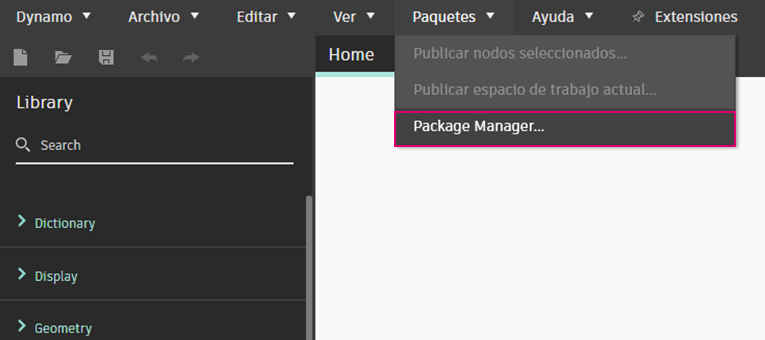<figcaption></figcaption></figure>

Na pasku wyszukiwania wyszukaj frazę „quads from rectangular grid”. Po kilku chwilach powinny pojawić się wszystkie pakiety zgodne z tym zapytaniem. Wybierzmy pierwszy pakiet z pasującą nazwą.

Kliknij przycisk Zainstaluj, aby dodać ten pakiet do biblioteki, a następnie zaakceptuj potwierdzenie. Gotowe.

<figure>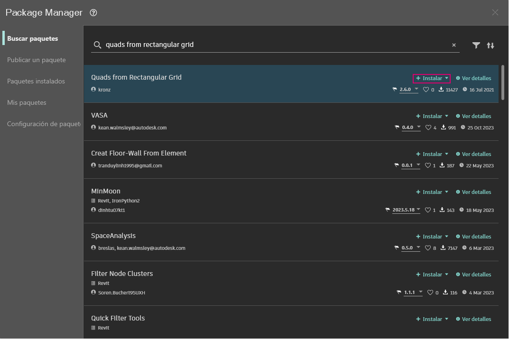<figcaption></figcaption></figure>

Zwróć uwagę, że w bibliotece Dynamo pojawiła się kolejna grupa o nazwie „buildz”. Ta nazwa odnosi się do programisty pakietu, a węzeł niestandardowy zostaje umieszczony w tej grupie. Możemy od razu zacząć z niego korzystać.

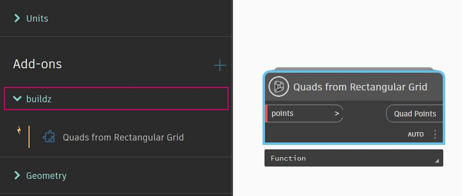

Użyj węzła **Code Block**, aby szybko zdefiniować prostokątną siatkę, zapisać wynik w węźle **Polygon.ByPoints**, a następnie użyj węzła **Surface.ByPatch**, aby wyświetlić listę właśnie utworzonych prostokątnych paneli.

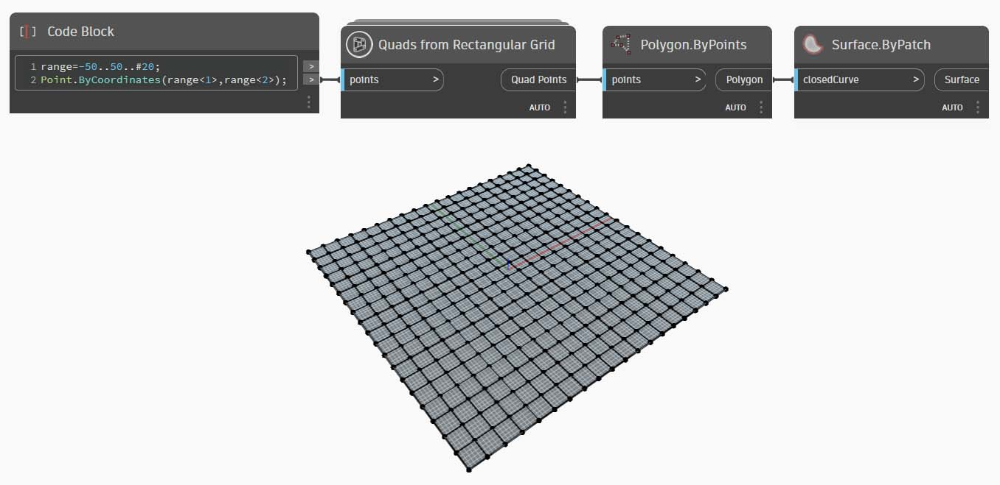

### Instalowanie folderu pakietu — DynamoUnfold

W powyższym przykładzie skupiono się na pakiecie z jednym węzłem niestandardowym, ale ten sam proces jest używany do pobierania pakietów z kilkoma węzłami niestandardowymi i plikami danych pomocniczych. Zademonstrujmy to teraz z wszechstronniejszym pakietem: Dynamo Unfold.

Tak jak w przykładzie powyżej, rozpocznij od wybrania opcji _Pakiety > Menedżer pakietów_.

Tym razem poszukamy jednego słowa, _„DynamoUnfold”_. Po wyświetleniu pakietów pobierz je, klikając przycisk Zainstaluj, aby dodać składniki Dynamo Unfold do biblioteki Dynamo.

<figure>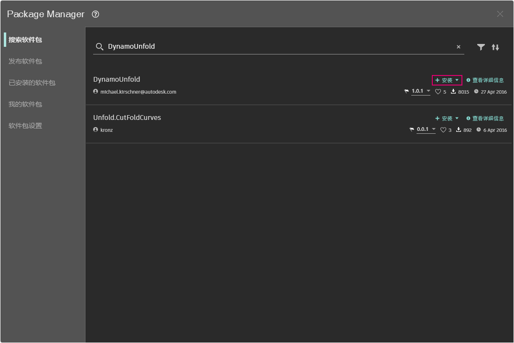<figcaption></figcaption></figure>

W bibliotece Dynamo dostępna jest grupa _DynamoUnfold_ z wieloma kategoriami i węzłami niestandardowymi.

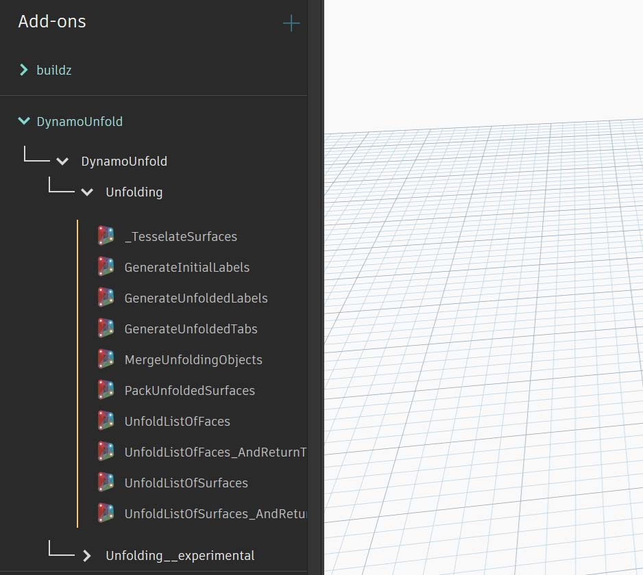

Spójrzmy teraz na strukturę plików pakietu. 

1. Najpierw przejdź do obszaru Pakiety > Menedżer pakietów > Zainstalowane pakiety.
2. Obok węzła DynamoUnfold wybierz menu opcji .
3. Następnie kliknij opcję Pokaż katalog główny, aby otworzyć folder główny dla tego pakietu.

<figure>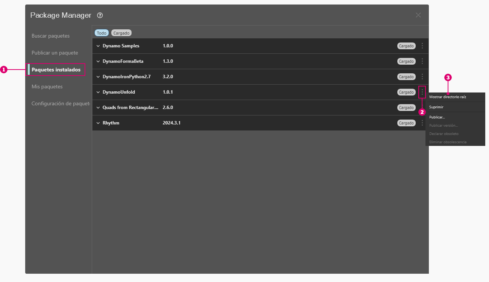<figcaption></figcaption></figure>

Spowoduje to przejście do katalogu głównego pakietu. Zwróć uwagę, że mamy 3 foldery i plik.

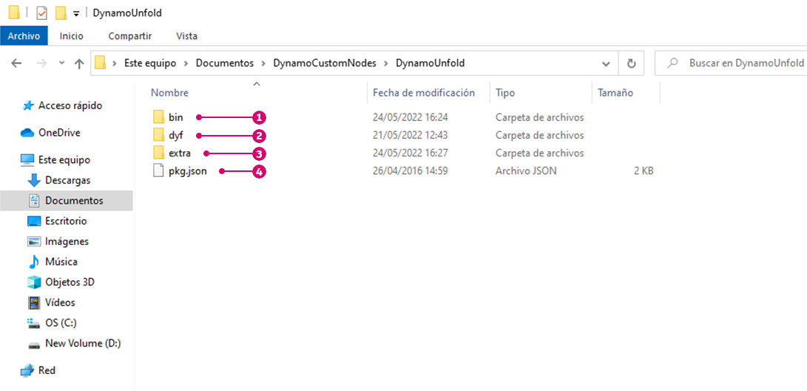

> 1. Folder _bin_ zawiera pliki .dll. Ten pakiet Dynamo został opracowany przy użyciu narzędzia Zero-Touch, więc węzły niestandardowe są przechowywane w tym folderze.
> 2. Folder _dyf_ zawiera węzły niestandardowe. Ten pakiet nie został opracowany przy użyciu węzłów niestandardowych Dynamo, dlatego ten folder jest w przypadku tego pakietu pusty.
> 3. Ten dodatkowy folder zawiera wszystkie dodatkowe pliki, w tym pliki przykładowe.
> 4. Plik pkg jest podstawowym plikiem tekstowym definiującym ustawienia pakietu. Na razie możemy to zignorować.

Po otwarciu folderu „extra” zostaje wyświetlona seria plików przykładowych, które zostały pobrane wraz z instalacją. Nie wszystkie pakiety zawierają pliki przykładowe, ale jeśli są one częścią pakietu, można je znaleźć tutaj.

Otwórzmy plik „SphereUnfold”.

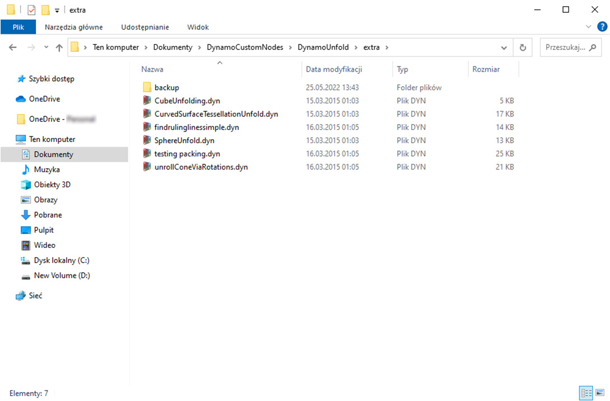

Po otwarciu pliku i naciśnięciu przycisku „Uruchom” w solwerze dostępna jest rozwinięta sfera. Pliki przykładowe są przydatne do nauki pracy z nowym pakietem Dynamo.

\ (2).jpg>)

### Przeglądanie i wyświetlanie informacji o pakiecie

W Menedżerze pakietów można odszukiwać pakiety, korzystając z opcji sortowania i filtrowania na karcie Wyszukaj pakiety. Dostępnych jest kilka filtrów dotyczących programu nadrzędnego, statusu (nowy, nieaktualny lub z cofniętą nieaktualnością) oraz tego, czy pakiet ma zależności.

Sortując pakiety, można zidentyfikować pakiety wysoko oceniane lub najczęściej pobierane albo znaleźć pakiety z najnowszymi aktualizacjami. 

Aby uzyskać dostęp do większej ilości szczegółowych informacji dotyczących danego pakietu, kliknij przycisk Wyświetl szczegóły. Spowoduje to otwarcie panelu bocznego w Menedżerze pakietów, w którym można znaleźć takie dane, jak obsługa wersji i zależności, adres URL witryny lub repozytorium, informacje o licencji itp.

### Witryna Dynamo Package Manager

Innym sposobem odkrywania pakietów Dynamo jest przeglądanie witryny [Dynamo Package Manager](http://dynamopackages.com). W tym miejscu można znaleźć zależności pakietów i informacje o zgodności hosta/wersji udostępnione przez autorów pakietów. Pliki pakietu można również pobrać z Menedżera pakietów Dynamo, ale robienie tego bezpośrednio z poziomu dodatku Dynamo stanowi płynniejszy proces.

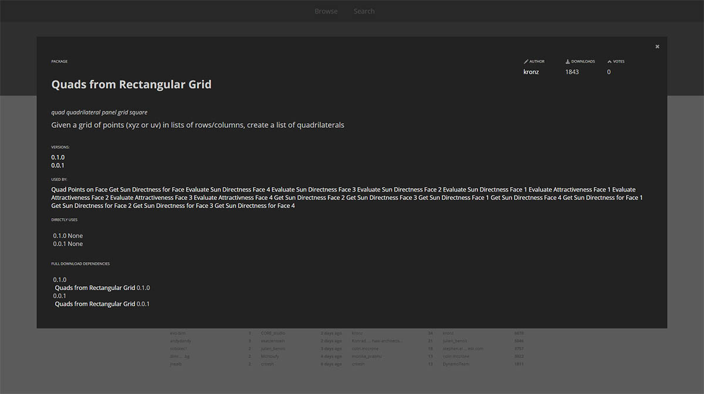

### Gdzie lokalnie są przechowywane pliki pakietów?

Jeśli chcesz zobaczyć, gdzie przechowywane są pliki pakietu, w górnym obszarze nawigacji kliknij kolejno opcje Dynamo > Preferencje > Ustawienia pakietów > Lokalizacje plików węzłów i pakietów. Tutaj znajdziesz bieżący katalog główny.

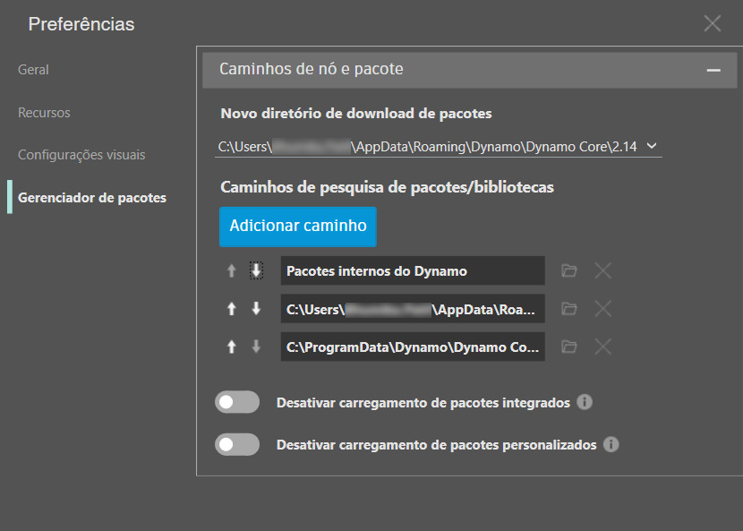

Domyślnie pakiety są instalowane w położeniu podobnym do tej ścieżki folderu: _C:/Users/[nazwa_użytkownika]/AppData/Roaming/Dynamo/[wersja dodatku Dynamo]_.

### Konfigurowanie lokalizacji współdzielonej pakietów w biurze

Dla użytkowników pytających, czy można wdrożyć dodatek Dynamo (w dowolnej postaci) ze wstępnie dołączonymi pakietami: sposobem na rozwiązanie tego problemu i zapewnienie kontroli w centralnym położeniu dla wszystkich użytkowników z instalacjami dodatku Dynamo jest dodanie do każdej instalacji niestandardowej ścieżki pakietów.

**Dodawanie folderu sieciowego, w którym menedżer BIM lub inne osoby mogą nadzorować umieszczanie w folderze pakietów zatwierdzonych przez biuro**  

W interfejsie użytkownika osobnej aplikacji przejdź do obszaru *Dynamo -> Preferencje -> Ustawienia pakietów -> Lokalizacje plików węzłów i pakietów*. W oknie dialogowym naciśnij przycisk „Dodaj ścieżkę” i przejdź do lokalizacji sieciowej zasobu pakietów współdzielonych. 
 
Ponieważ proces jest zautomatyzowany, obejmuje dodanie informacji do pliku konfiguracyjnego instalowanego razem z dodatkiem Dynamo:  
 `C:\Users\[Username]\AppData\Roaming\Dynamo\Dynamo Revit\[Dynamo Version]\DynamoSettings.xml`

Domyślna konfiguracja dodatku Dynamo dla programu Revit to:
 
 
`<CustomPackageFolders>`  

`<string>C:\Users\[Username]\AppData\Roaming\Dynamo\Dynamo Revit\[Dynamo Version]</string>`  

`</CustomPackageFolders>`

Dodanie lokalizacji niestandardowej wyglądałoby następująco:  

`<CustomPackageFolders>`  

`<string>C:\Users\[Username]\AppData\Roaming\Dynamo\Dynamo Revit\[Dynamo Version]</string>`  

`<string>N:\OfficeFiles\Dynamo\Packages_Limited</string>`  

`</CustomPackageFolders>`

Centralnym zarządzaniem tym folderem można również sterować poprzez ustawienie go jako tylko do odczytu.

### Wczytywanie pakietów z plikami binarnymi z lokalizacji sieciowej

#### Scenariusz

Organizacja może chcieć ustandaryzować pakiety instalowane przez różne stacje robocze i użytkowników. Sposobem na to może być instalowanie tych pakietów za pomocą narzędzia *Dynamo -> Preferencje -> Ustawienia pakietów -> Lokalizacje plików węzłów i pakietów*, wybranie folderu sieciowego jako lokalizacji instalacji i dodanie tej ścieżki na stacjach roboczych do `Manage Node and Package Paths`.

#### Problem

Chociaż ten scenariusz działa poprawnie w przypadku pakietów zawierających tylko węzły niestandardowe, może nie sprawdzać się w przypadku pakietów zawierających pliki binarne, takich jak węzły Zero Touch. Ten problem jest spowodowany przez [mechanizmy zabezpieczeń](https://stackoverflow.com/questions/5328274/load-assembly-from-network-location) platformy .NET Framework używane w przypadku wczytywania zespołów pochodzących z lokalizacji sieciowej. Niestety użycie elementu konfiguracyjnego `loadFromRemoteSources`, jak sugeruje się w wątku dostępnym za pośrednictwem linku, nie jest możliwym rozwiązaniem dla dodatku Dynamo, ponieważ jest on dystrybuowany jako komponent, a nie jako aplikacja.

#### Obejście problemu:

Jednym z możliwych obejść tego problemu jest użycie zamapowanego dysku sieciowego wskazującego lokalizację sieciową i skonfigurowanie na stacjach roboczych odwołania do tej ścieżki. Czynności umożliwiające utworzenie zamapowanego dysku sieciowego opisano [tutaj](https://support.microsoft.com/en-us/help/4026635/windows-10-map-a-network-drive).

### Dalsze kroki z pakietami

Społeczność dodatku Dynamo stale rośnie i ewoluuje. Przeglądając Menedżera pakietów Dynamo od czasu do czasu, znajdziesz nowe interesujące rozwiązania. W poniższych sekcjach przyjrzymy się dokładniej pakietom: od perspektywy użytkownika końcowego po perspektywę twórcy własnego pakietu Dynamo.
