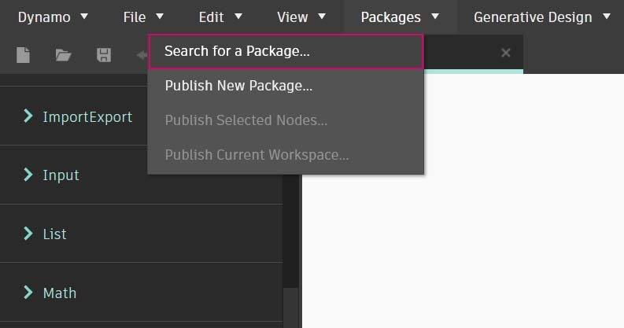

# パッケージの概要 

簡単に説明すると、パッケージとはカスタム ノードの集合のことです。Dynamo Package Manager は、オンラインでパブリッシュされたパッケージをダウンロードするためのコミュニティ ポータルです。これらのツールセットは、Dynamo の基本機能を拡張するためにサード パーティによって開発されたもので、すべてのユーザがアクセスでき、ボタンをクリックするだけでダウンロードすることができます。

Dynamo のようなオープンソース プロジェクトは、このようなコミュニティによって成長しています。サード パーティの専任開発者の取り組みにより、Dynamo はさまざまな業界のワークフローで採用されています。そのため、Dynamo チームは、パッケージの開発とパブリッシュの合理化を連携して進めています。これについては、以降のセクションで詳しく説明します。

### パッケージをインストールする

パッケージを最も簡単にインストールする方法は、Dynamo インタフェースの[パッケージ]ツールバーを使用する方法です。では、実際にインストールしてみましょう。ここでは、次に示す簡単な例を使用して、グリッド上に四角いパネルを作成するためのパッケージをインストールします。

Dynamo で、_[パッケージ] > [パッケージの検索...]_ に移動します。

[検索]バーで、「quads from rectangular grid」を検索してみましょう。しばらくすると、この検索クエリーに一致するパッケージがすべて表示されます。一致する名前を持つ最初のパッケージを選択します。

このパッケージをライブラリに追加するには、[インストール]をクリックします。以上です。

Dynamo ライブラリに「buildz」という名前の新しいグループが表示されます。この名前は、パッケージの開発者を参照して付けられます。また、カスタム ノードはこのグループ内に配置されます。このグループは、すぐに使用することができます。

**Code Block** ノードを使用して長方形のグリッドをすばやく定義し、その結果を **Polygon.ByPoints** ノードに、続いて **Surface.ByPatch** ノードに出力して、作成した長方形のパネルのリストを表示します。

### パッケージ フォルダをインストールする - DynamoUnfold

上記の例では、1 つのカスタム ノードが含まれているパッケージを使用しましたが、複数のカスタム ノードやサポート データ ファイルが含まれているパッケージをダウンロードする場合も、同じプロセスを実行します。ここでは、より包括的な Dynamo Unfold パッケージを使用して手順を説明します。

上記の例と同様に、_[パッケージ] > [パッケージの検索...]_ を選択します。

ここでは、「_DynamoUnfold_」という 1 つの単語を、大文字と小文字を区別して検索します。パッケージが表示されたら、[インストール]をクリックして Dynamo Unfold をダウンロードし、Dynamo ライブラリに追加します。

Dynamo ライブラリに _DynamoUnfold_ グループが表示されます。このグループに、複数のカテゴリとカスタム ノードが含まれているのがわかります。

ここで、パッケージのファイル構造を確認しましょう。まず、[Dynamo] > [基本設定]を選択します

[基本設定]のポップアップから、[Package Manager]を開き、[DynamoUnfold]の横の縦ドットのメニュー  > [ルート フォルダを表示]を選択するとルート フォルダが表示されるので、このパッケージのフォルダを開きます。

この操作により、パッケージのルート フォルダが表示されます。このルート フォルダには、3 つのフォルダと 1 つのファイルが格納されています。

> 1. _bin_ フォルダには .dll ファイルが格納されます。この Dynamo パッケージは Zero-Touch を使用して開発されているため、カスタム ノードはこのフォルダに格納されます。
> 2. _dyf_ フォルダにはカスタム ノードが格納されます。このパッケージは Dynamo カスタム ノードを使用して開発されたものではないため、このフォルダには格納されません。
> 3. extra フォルダには、サンプル ファイルを含め、すべての追加ファイルが格納されます。
> 4. pkg ファイルは、パッケージの設定を定義する基本のテキスト ファイルです。ここでは、このファイルは無視してかまいません。

extra フォルダを開くと、インストール時にダウンロードされた多数のサンプル ファイルが格納されていることがわかります。すべてのパッケージにサンプル ファイルが付属しているわけではありませんが、付属のサンプル ファイルはこのフォルダに格納されています。

ここで、SphereUnfold ファイルを開いてみましょう。

ファイルを開いてからソルバで[実行]をクリックすると、展開された球形が表示されます。これらのサンプル ファイルは、新しい Dynamo パッケージの使用方法を理解するのに役立ちます。

.jpg>)

### Dynamo Package Manager

Dynamo パッケージの仕組みを理解する別の方法として、[Dynamo Package Manager](http://dynamopackages.com) をオンラインで参照する方法もあります。これは、パッケージを参照するのに便利な方法です。リポジトリにより、ダウンロード回数と人気度に応じて、パッケージが並べ替えられます。また、パッケージの最新の更新プログラムに関する情報を簡単に収集することもできます。一部の Dynamo パッケージは、Dynamo ビルドのバージョン管理と依存関係の影響を受けます。

Dynamo Package Manager で[_Quads from Rectangular Grid_]をクリックすると、説明、バージョン、開発者、依存関係を確認することができます。

また、Dynamo Package Manager からパッケージ ファイルをダウンロードすることもできますが、Dynamo から直接ダウンロードした方が簡単です。

### ローカルでのパッケージ ファイルの保存場所

Dynamo Package Manager からファイルをダウンロードするか、すべてのパッケージ ファイルの保存場所を確認する場合は、[Dynamo] > [Package Manager] > [ノードとパッケージのパス]をクリックすると、ここから現在のルート フォルダを検索できます。

既定では、パッケージは _C:/Users/[ユーザ名]/AppData/Roaming/Dynamo/[Dynamo バージョン]_ というフォルダ パスにインストールされます。

### パッケージの拡張

Dynamo コミュニティは、常に成長と進化を続けています。Dynamo Package Manager を定期的に確認して、便利な新機能を発見してください。これ以降のセクションでは、エンドユーザの視点から見た独自の Dynamo パッケージの作成など、パッケージについてより詳しく確認していきます。
