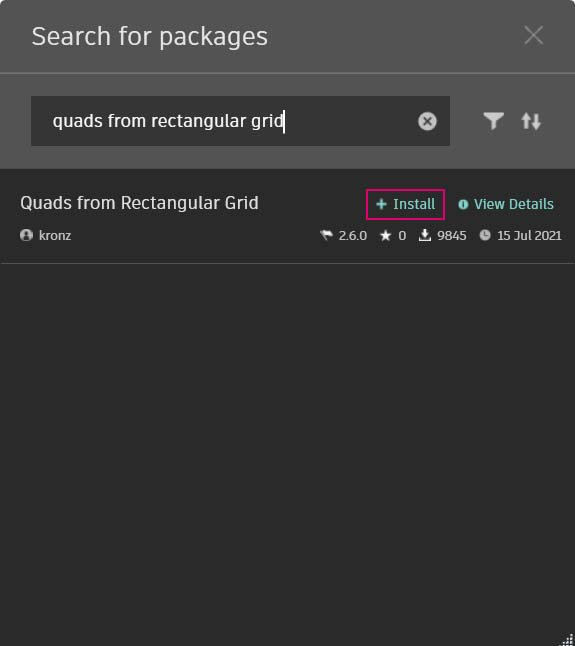
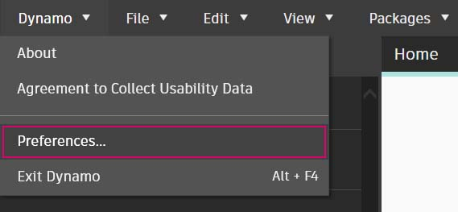
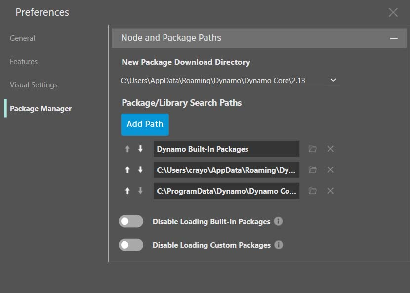

# Introdução aos pacotes

Em resumo, um pacote é uma coleção de nós personalizados. O Dynamo Package Manager é um portal para a comunidade a fim de efetuar o download de qualquer pacote que tenha sido publicado on-line. Esses conjuntos de ferramentas são desenvolvidos por terceiros para ampliar a funcionalidade principal do Dynamo, são acessíveis a todos e estão prontos para download com um clique no botão.

Um projeto de código aberto, como o Dynamo, prospera com esse tipo de envolvimento da comunidade. Com desenvolvedores de terceiros dedicados, o Dynamo é capaz de estender seu alcance para os fluxos de trabalho em uma variedade de setores. Por esse motivo, a equipe do Dynamo tem feito esforços em conjunto para simplificar o desenvolvimento e a publicação de pacotes (que serão discutidos mais detalhadamente nas seções a seguir).

### Instalar um pacote

A forma mais fácil de instalar um pacote é usando a barra de ferramentas Pacotes na interface do Dynamo. Vamos começar imediatamente e instalar um agora. Neste exemplo rápido, vamos instalar um pacote popular para criar painéis quadrados em uma grade.

No Dynamo, vá para _Pacotes> Procurar um pacote..._

Na barra de pesquisa, vamos procurar “quadrados na grade retangular”. Após alguns momentos, você deverá ver todos os pacotes que correspondem a essa consulta de pesquisa. Queremos selecionar o primeiro pacote com o nome correspondente.

Clique em Instalar para adicionar esse pacote à biblioteca. Concluído.

Observe que agora temos outro grupo em nossa biblioteca do Dynamo, chamado “buildz”. Esse nome se refere ao desenvolvedor do pacote e o nó personalizado é colocado nesse grupo. Podemos começar a usá-lo imediatamente.

Use **Bloco de código** para definir rapidamente uma grade retangular, gere a saída do resultado para um nó **Polygon.ByPoints** e, subsequentemente, um nó **Surface.ByPatch** para visualizar a lista de painéis retangulares que você acabou de criar.

### Pasta Instalar pacote – DynamoUnfold

O exemplo acima se concentra em um pacote com um nó personalizado, mas você usa o mesmo processo para fazer o download de pacotes com diversos nós personalizados e arquivos de dados de suporte. Vamos demonstrar isso agora, com um pacote mais abrangente: o Dynamo Unfold.

Como no exemplo acima, comece selecionando _Pacotes>Procurar um pacote..._.

Desta vez, vamos procurar _“DynamoUnfold”_, uma só palavra, com distinção de maiúsculas e minúsculas. Quando os pacotes forem exibidos, faça o download clicando em Instalar para adicionar o Dynamo Unfold à biblioteca do Dynamo.

Na biblioteca do Dynamo, temos um grupo _DynamoUnfold_ com várias categorias e vários nós personalizados.

Agora, vamos analisar a estrutura de arquivos do pacote. Primeiro, selecione Dynamo > Preferências

Na janela pop-up Preferências, abra o Gerenciador de pacotes > ao lado de DynamoUnfold, selecione o menu de pontos verticais  > Mostrar diretório raiz para abrir a pasta raiz deste pacote.

Isso nos leva ao diretório raiz do pacote. Observe que temos três pastas e um arquivo.

> 1. A pasta _bin_ contém os arquivos .dll. Esse pacote do Dynamo foi desenvolvido usando a funcionalidade Sem toque; por isso, os nós personalizados são mantidos nessa pasta.
> 2. A pasta _dyf_ contém os nós personalizados. Esse pacote não foi desenvolvido usando os nós personalizados do Dynamo; portanto, a pasta está vazia para esse pacote.
> 3. A pasta extra contém todos os arquivos adicionais, inclusive os arquivos de exemplo.
> 4. O arquivo pkg é um arquivo de texto básico que define as configurações do pacote. Podemos ignorar isso por enquanto.

Abrindo a pasta “extra”, vemos muitos arquivos de exemplo que foram obtidos por download com a instalação. Nem todos os pacotes têm arquivos de exemplo, mas será possível encontrá-los se fizerem parte de um pacote.

Vamos abrir “SphereUnfold”.

Após abrir o arquivo e pressionar “Executar” no solucionador, teremos uma esfera desdobrada. Arquivos de exemplo como esses são úteis para saber como trabalhar com um novo pacote do Dynamo.

\.jpg>)

### Gerenciador de pacotes do Dynamo

Outra forma de descobrir os pacotes do Dynamo é explorando o [Gerenciador de pacotes do Dynamo](http://dynamopackages.com) on-line. Essa é uma ótima maneira de procurar pacotes, pois o repositório classifica os pacotes em ordem de popularidade e número de downloads. Além disso, é uma forma fácil de coletar informações sobre atualizações recentes de pacotes, pois alguns pacotes do Dynamo estão sujeitos a controle de versão e dependências das compilações do Dynamo.

Clicando em _“Quadrados da grade retangular”_ no Gerenciador de pacotes do Dynamo, será possível ver as descrições, as versões, o desenvolvedor e as possíveis dependências.

Também é possível fazer o download dos arquivos do pacote no Gerenciador de pacotes do Dynamo, mas fazer isso diretamente no Dynamo é um processo mais intuitivo.

### Onde estão armazenados os arquivos dos pacotes localmente?

Se você fizer o download dos arquivos no Gerenciador de pacotes do Dynamo ou se quiser ver onde todos os arquivos dos pacotes são mantidos, clique em Dynamo > Gerenciador de pacotes > Caminhos de nó e pacote, e será possível encontrar o diretório da pasta raiz atual aqui.

Por padrão, os pacotes são instalados em uma localização similar a este caminho de pasta: _C:/Usuários/[nome de usuário]/AppData/Roaming/Dynamo/[versão do Dynamo]_.

### Aprofundar o conhecimento sobre pacotes

A comunidade do Dynamo está crescendo e evoluindo constantemente. Explorando o Dynamo Package Manager periodicamente, você encontrará alguns novos desenvolvimentos empolgantes. Nas seções a seguir, analisaremos com mais detalhes os pacotes, da perspectiva do usuário final até a criação do seu próprio pacote do Dynamo.
