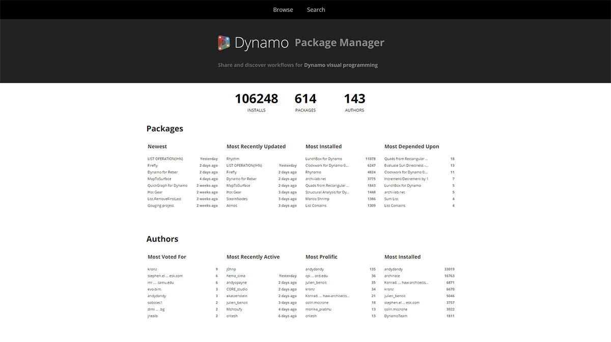
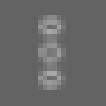
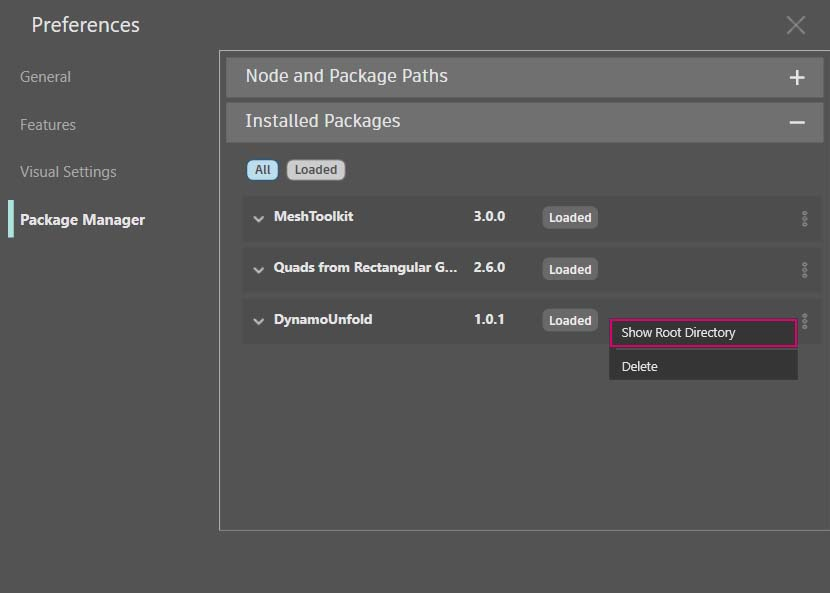

# Úvod do práce s balíčky

Stručně řečeno, balíček je kolekce uživatelských uzlů. Nástroj Dynamo Package Manager je portál pro komunitu, kde lze stáhnout všechny balíčky, které byly publikovány online. Tyto sady nástrojů jsou vyvinuty třetími stranami, aby bylo možné rozšířit základní funkce aplikace Dynamo, jsou přístupné všem a připraveny ke stažení kliknutím na tlačítko.

Projektu s otevřeným zdrojovým kódem, jako je Dynamo, tento druh zapojení komunity prospívá. Díky specializovaným vývojářům třetích stran je aplikace Dynamo schopna rozšířit svůj dosah na pracovní postupy napříč různými odvětvími. Z tohoto důvodu tým aplikace Dynamo vyvinul společné úsilí, aby zefektivnil vývoj a zveřejňování balíčků (které budou podrobněji popsány v následujících částech).

### Instalace balíčku

Nejjednodušším způsobem instalace balíčku je použití panelu nástrojů Balíčky v rozhraní aplikace Dynamo. Pojďme se do toho hned pustit a nainstalovat ho. V tomto rychlém příkladu nainstalujeme oblíbený balíček k vytvoření čtyřúhelníkových panelů v osnově.

V aplikaci Dynamo přejděte na kartu _Balíčky > Vyhledat balíček_.

Na panelu hledání vyhledejte „quads from rectangular grid“. Za chvíli by se měly zobrazit všechny balíčky, které odpovídají tomuto vyhledávacímu dotazu. Chceme vybrat první balíček s odpovídajícím názvem.

Kliknutím na tlačítko Instalovat přidáte tento balíček do knihovny. Hotovo!

Všimněte si, že v knihovně aplikace Dynamo je nyní k dispozici další skupina s názvem „buildz“. Tento název odkazuje na vývojáře balíčku a uživatelský uzel je umístěn do této skupiny. Můžete ji začít ihned používat.

Pomocí uzlu **Code Block** rychle definujte pravoúhlou osnovu, výsledek odešlete do uzlu **Polygon.ByPoints** a následně do uzlu **Surface.ByPatch**, čímž zobrazíte seznam právě vytvořených obdélníkových panelů.

### Instalace složky balíčku – DynamoUnfold

Výše uvedený příklad se zaměřuje na balíček s jedním uživatelským uzlem, ale stejný postup se používá ke stahování balíčků s několika uživatelskými uzly a podpůrnými datovými soubory. Nyní si předvedeme složitější balíček: Dynamo Unfold.

Stejně jako ve výše uvedeném příkladu začněte výběrem položek _Balíčky > Vyhledat balíček_.

Tentokrát vyhledáme výraz _DynamoUnfold_. Jedná se o jedno slovo, dbejte na velikost písmen. Když se balíčky zobrazí, stáhněte je kliknutím na tlačítko Instalovat a přidejte balíček Dynamo Unfold do své knihovny aplikace Dynamo.

V knihovně aplikace Dynamo je k dispozici skupina aplikace _DynamoUnfold_ s více kategoriemi a s vlastními uzly.

Nyní se podíváme na strukturu souborů balíčku. Nejprve vyberte nabídku Dynamo > Předvolby.

V rozbalovacím okně Předvolby otevřete Package Manager > vedle položky DynamoUnfold a výběrem vertikální nabídky bodů  > Zobrazit kořenový adresář otevřete kořenovou složku pro tento balíček.

Tak se dostaneme do kořenového adresáře balíčku. Všimněte si, že máme tři složky a soubor.

> 1. Složka _bin_ slouží k ukládání souborů .dll. Tento balíček Dynamo byl vyvinut pomocí možnosti Zero-Touch, proto jsou vlastní uzly uloženy v této složce.
> 2. Složka _dyf_ slouží k umístění vlastních uzlů. Tento balíček nebyl vytvořen pomocí vlastních uzlů aplikace Dynamo, proto je tato složka pro tento balíček prázdná.
> 3. Složka extra obsahuje všechny další soubory včetně vzorových souborů.
> 4. Soubor pkg je základní textový soubor, který definuje nastavení balíčku. Můžeme ho zatím ignorovat.

Při otevření složky extra se zobrazí několik vzorových souborů, které byly staženy spolu s instalací. Ne všechny balíčky mají vzorové soubory, ale zde je můžete najít, pokud jsou součástí balíčku.

Otevřeme položku SphereUnfold.

Po otevření souboru a stisknutí tlačítka Spustit na řešiči máme rozvinutou kouli. Ukázkové soubory, jako jsou tyto, jsou užitečné při studiu práce s novým balíčkem Dynamo.

.jpg>)

### Nástroj Dynamo Package Manager

Další způsob, jak objevovat balíčky aplikace Dynamo, je prozkoumat online nástroj [Dynamo Package Manager](http://dynamopackages.com). To je dobrý způsob, jak procházet balíčky, protože úložiště třídí balíčky podle počtu stažení a popularity. Také je snadné získat informace o nejnovějších aktualizacích pro balíčky, protože některé balíčky aplikace Dynamo mají více verzí závislých na sestavě aplikace Dynamo.

Kliknutím na možnost _Quads from Rectangular Grid_ v nástroji Dynamo Package Manager můžete zobrazit jejich popisy, verze, informace o vývojáři a možné závislosti.

Soubory balíčku můžete také stáhnout z aplikace Dynamo Package Manager, ale přímo z aplikace Dynamo je proces jednodušší.

### Kde jsou soubory balíčků uloženy místně?

Pokud stahujete soubory z nástroje Dynamo Package Manager nebo pokud chcete zjistit, kde jsou uloženy všechny soubory balíčků, klikněte na nabídku Dynamo > Package Manager > Cesty uzlů a balíčků. Zde najdete aktuální adresář kořenové složky.

Ve výchozím nastavení jsou balíčky nainstalovány do umístění podobného této cestě: _C:/Users/[uživatelské jméno]/AppData/Roaming/Dynamo/[verze aplikace Dynamo]_.

### Další práce s balíčky

Komunita aplikace Dynamo neustále roste a vyvíjí se. Průběžně prohlížením aplikace Dynamo Package Manager najdete nové zajímavé informace. V následujících částech se podrobněji podíváme na balíčky, z pohledu koncového uživatele na tvorbu vlastního balíčku aplikace Dynamo.
