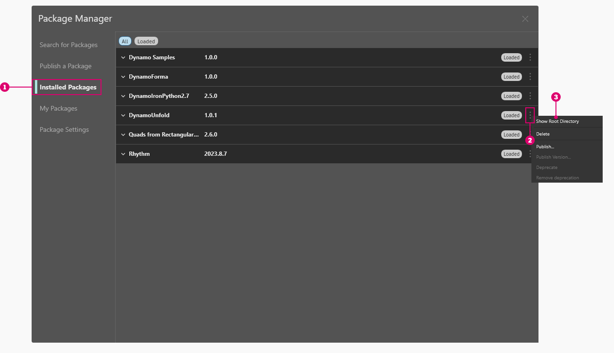

# パッケージの概要

Dynamo には豊富な機能が用意されており、Dynamo の機能を大幅に拡張できる広範なパッケージ ライブラリも保持されています。パッケージは、カスタム ノードまたは追加機能のコレクションです。Dynamo Package Manager は、オンラインでパブリッシュされたパッケージをダウンロードするためのコミュニティ ポータルです。これらのツールセットは、Dynamo の基本機能を拡張するためにサード パーティによって開発されたもので、すべてのユーザがアクセスでき、ボタンをクリックするだけでダウンロードすることができます。

Dynamo のようなオープンソース プロジェクトは、このようなコミュニティによって成長しています。サード パーティの専任開発者の取り組みにより、Dynamo はさまざまな業界のワークフローで採用されています。そのため、Dynamo チームは、パッケージの開発とパブリッシュの合理化を連携して進めています。これについては、以降のセクションで詳しく説明します。

### パッケージをインストールする

パッケージを最も簡単にインストールするには、Dynamo インタフェースの[パッケージ]メニュー オプションを使用します。では、実際にパッケージをインストールしてみましょう。ここでは、次に示す簡単な例を使用して、グリッド上に四角いパネルを作成するためのパッケージをインストールします。

Dynamo で、_[パッケージ] > [Package Manager...]_ に移動します。

<figure><figcaption></figcaption></figure>

[検索]バーで、「quads from rectangular grid」を検索してみましょう。しばらくすると、この検索クエリーに一致するパッケージがすべて表示されます。一致する名前を持つ最初のパッケージを選択します。

[インストール]をクリックしてこのパッケージをライブラリに追加し、確認を承諾します。以上です。

<figure><figcaption></figcaption></figure>

Dynamo ライブラリに「buildz」という名前の新しいグループが表示されます。この名前は、パッケージの開発者を参照して付けられます。また、カスタム ノードはこのグループ内に配置されます。このグループは、すぐに使用することができます。

**Code Block** ノードを使用して長方形のグリッドをすばやく定義し、その結果を **Polygon.ByPoints** ノードに、続いて **Surface.ByPatch** ノードに出力して、作成した長方形のパネルのリストを表示します。

### パッケージ フォルダをインストールする - DynamoUnfold

上記の例では、1 つのカスタム ノードが含まれているパッケージを使用しましたが、複数のカスタム ノードやサポート データ ファイルが含まれているパッケージをダウンロードする場合も、同じプロセスを実行します。ここでは、より包括的な Dynamo Unfold パッケージを使用して手順を説明します。

上記の例と同様に、_[パッケージ] > [Package Manager...]_ を選択します。

今回は、_「DynamoUnfold」_ という、スペースを入れない 1 つの単語を検索します。パッケージが表示されたら、[インストール]をクリックして Dynamo Unfold をダウンロードし、Dynamo ライブラリに追加します。

<figure><figcaption></figcaption></figure>

Dynamo ライブラリに _DynamoUnfold_ グループが表示されます。このグループに、複数のカテゴリとカスタム ノードが含まれているのがわかります。

ここで、パッケージのファイル構造を確認しましょう。

1. まず、[パッケージ] > [Package Manager] > [インストール済みパッケージ]に移動します。
2. DynamoUnfold の横にあるオプション メニュー  を選択します。
3. 次に、[ルート フォルダを表示]をクリックして、このパッケージのルート フォルダを開きます。

<figure><figcaption></figcaption></figure>

この操作により、パッケージのルート フォルダが表示されます。このルート フォルダには、3 つのフォルダと 1 つのファイルが格納されています。

> 1. _bin_ フォルダには .dll ファイルが格納されます。この Dynamo パッケージは Zero-Touch を使用して開発されているため、カスタム ノードはこのフォルダに格納されます。
> 2. _dyf_ フォルダにはカスタム ノードが格納されます。このパッケージは Dynamo カスタム ノードを使用して開発されたものではないため、このフォルダには格納されません。
> 3. extra フォルダには、サンプル ファイルを含め、すべての追加ファイルが格納されます。
> 4. pkg ファイルは、パッケージの設定を定義する基本のテキスト ファイルです。ここでは、このファイルは無視してかまいません。

extra フォルダを開くと、インストール時にダウンロードされた多数のサンプル ファイルが格納されていることがわかります。すべてのパッケージにサンプル ファイルが付属しているわけではありませんが、付属のサンプル ファイルはこのフォルダに格納されています。

ここで、SphereUnfold ファイルを開いてみましょう。

ファイルを開いてからソルバで[実行]をクリックすると、展開された球形が表示されます。これらのサンプル ファイルは、新しい Dynamo パッケージの使用方法を理解するのに役立ちます。

 (2).jpg>)

### パッケージ情報を参照、表示する

Package Manager では、[パッケージの検索]タブで並べ替えとフィルタ オプションを使用してパッケージを参照できます。ホスト プログラム、ステータス(新規、非推奨、非推奨解除)、およびパッケージに依存関係があるかどうかを示すフィルタがいくつかあります。

パッケージを並べ替えることで、評価の高いパッケージや最もダウンロードされているパッケージを特定したり、最新の更新プログラムが適用されたパッケージを検索することができます。

[詳細を表示]をクリックして、各パッケージの詳細にアクセスすることもできます。これにより、Package Manager のサイド パネルが開き、バージョン情報や依存関係、Web サイトまたはリポジトリの URL、ライセンス情報などの情報を検索できます。

### Dynamo Package Manager の Web サイト

Dynamo パッケージの仕組みを理解する別の方法として、[Dynamo Package Manager](http://dynamopackages.com) の Web サイトを参照する方法もあります。ここでは、パッケージ作成者が提供するパッケージの依存関係とホスト/バージョンの互換性情報を確認することができます。また、Dynamo Package Manager からパッケージ ファイルをダウンロードすることもできますが、Dynamo から直接ダウンロードした方が簡単です。

### ローカルでのパッケージ ファイルの保存場所

パッケージ ファイルの保存場所を確認する場合は、一番上のナビゲーションで[Dynamo] > [基本設定] > [パッケージ設定] > [ノードとパッケージ ファイルの場所]をクリックします。ここから現在のルート フォルダを見つけることができます。

既定では、パッケージは _C:/Users/[ユーザ名]/AppData/Roaming/Dynamo/[Dynamo バージョン]_ というフォルダ パスにインストールされます。

### Office でパッケージの共有場所を設定する

事前にパッケージがアタッチされた Dynamo を(任意の形式で)配置できるかどうかを確認する場合: この問題を解決し、Dynamo をインストールしたすべてのユーザが一元管理できるようにする方法は、各インストールにカスタム パッケージ パスを追加することです。

**BIM 管理者などが、Office 認定パッケージが入ったフォルダの保管を監督できるネットワーク フォルダを追加する**  

個々のアプリケーションの UI で、*[Dynamo] -> [基本設定] -> [パッケージ設定] -> [ノードとパッケージ ファイルの場所]* に移動します。ダイアログで[パスを追加] ボタンを押し、共有パッケージ リソースのネットワークの場所を参照します。 
 
自動化されたプロセスとして、Dynamo と共にインストールされる設定ファイルにも情報を追加します。  
 `C:\Users\[Username]\AppData\Roaming\Dynamo\Dynamo Revit\[Dynamo Version]\DynamoSettings.xml`

既定では、Revit 用の Dynamo の設定は次のとおりです。
 
 
`<CustomPackageFolders>`  

`<string>C:\Users\[Username]\AppData\Roaming\Dynamo\Dynamo Revit\[Dynamo Version]</string>`  

`</CustomPackageFolders>`

カスタムの場所を追加すると、次のようになります。  

`<CustomPackageFolders>`  

`<string>C:\Users\[Username]\AppData\Roaming\Dynamo\Dynamo Revit\[Dynamo Version]</string>`  

`<string>N:\OfficeFiles\Dynamo\Packages_Limited</string>`  

`</CustomPackageFolders>`

このフォルダの一元管理は、フォルダを読み取り専用にすることでも制御できます。

### ネットワーク上の保存場所からバイナリを含むパッケージをロードする

#### シナリオ

組織においては、異なるワークステーションやユーザによってインストールされるパッケージを標準化したい場合があります。これを行う方法として、[*Dynamo*] > [基本設定] > [パッケージ設定] > [ノードとパッケージ ファイルの場所]からそれらのパッケージをインストールし、インストール場所としてネットワーク フォルダを選択して、そのパスを `Manage Node and Package Paths` に追加するためにワークステーションを取得することが考えられます。

#### 問題

このシナリオは、カスタム ノードのみを含むパッケージでは適切に機能しますが、ZeroTouch ノードなどのバイナリを含むパッケージでは機能しない可能性があります。この問題は、.NET Framework がネットワーク上の場所からアセンブリのロードを過剰に実行する[セキュリティ対策](https://stackoverflow.com/questions/5328274/load-assembly-from-network-location)が原因で発生します。残念ながら、リンクされたスレッドで提案されている `loadFromRemoteSources` 構成要素の使用は、アプリケーションではなくコンポーネントとして配布されるため、Dynamo の利用可能な解決策ではありません。

#### 回避策

利用可能な回避策の 1 つは、ネットワークの場所を指すマップされたネットワーク ドライブを使用し、ワークステーションが代わりにそのパスを参照するようにすることです。マップされたネットワーク ドライブを作成する手順については、[こちら](https://support.microsoft.com/ja-jp/help/4026635/windows-10-map-a-network-drive)を参照してください。

### パッケージの拡張

Dynamo コミュニティは、常に成長と進化を続けています。Dynamo Package Manager を定期的に確認して、便利な新機能を発見してください。これ以降のセクションでは、エンドユーザの視点から見た独自の Dynamo パッケージの作成など、パッケージについてより詳しく確認していきます。
