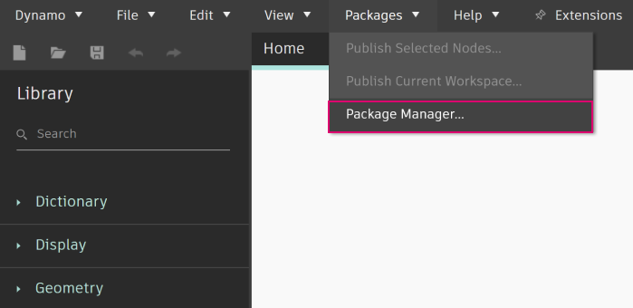

# 套件簡介

Dynamo 提供大量即裝即用的功能，並維護了豐富的套件資源庫，可顯著擴充 Dynamo 的功能。套件是自訂節點或其他功能的集合。Dynamo Package Manager 是一個入口網站，可讓社群下載已在線上發佈的套件。這些工具集由協力廠商開發，可擴充 Dynamo 的核心功能，任何人都能存取，按一下按鈕即可下載。

開放原始碼專案 (例如 Dynamo) 在此類型的社群參與下蓬勃發展。使用專屬的協力廠商開發人員，Dynamo 可以將其適用範圍延伸到一系列產業的工作流程中。因此，Dynamo 團隊齊心協力簡化套件的開發與發佈 (在後續各節中將更詳細地討論這一點)。

### 安裝套件

最簡易的套件安裝方式是使用 Dynamo 介面中的「套件」功能表選項。現在，讓我們直接開始安裝套件。在此簡單範例中，我們將安裝某個常見套件，在格線上建立四邊形板。

在 Dynamo 中，前往 _「套件」>「Package Manager...」_

<figure><figcaption></figcaption></figure>

在搜尋列中，我們搜尋「quads from rectangular grid」。片刻之後，您應該會看到符合此搜尋查詢的所有套件。我們要選取具有相符名稱的第一個套件。

按一下「安裝」，將此套件加入至您的資源庫，系統請您確認時，請接受。完成！

<figure><figcaption></figcaption></figure>

請注意，Dynamo 資源庫中現在有另一個群組稱為「buildz」。此名稱是指套件的開發人員，此群組中已放置自訂節點。我們可以立即開始使用。

使用 **Code Block** 可快速定義矩形格線，將結果輸出至 **Polygon.ByPoints** 節點，然後輸出至 **Surface.ByPatch** 節點，以檢視您剛剛建立的矩形板清單。

### 安裝套件資料夾 - DynamoUnfold

上述範例著重針對具有一個自訂節點的套件，不過您可以使用相同程序下載具有多個自訂節點的套件並支援資料檔案。現在使用更全面的套件 DynamoUnfold 示範。

如同上述範例，首先請選取 _「套件」>「Package Manager...」_。

這次我們要搜尋 _「DynamoUnfold」_，這是一個字，沒有空格。當我們看到套件時，按一下「安裝」下載，將 DynamoUnfold 加入您的 Dynamo 資源庫。

<figure><figcaption></figcaption></figure>

在 Dynamo 資源庫中，我們有一個 _DynamoUnfold_ 群組，當中有多個品類和自訂節點。

現在，我們看一下套件的檔案結構。

1. 請先前往「套件」>「Package Manager」>「已安裝的套件」。
2. 在 DynamoUnfold 旁邊，選取選項功能表 。
3. 然後按一下「展示根目錄」，以開啟此套件的根資料夾。

<figure><figcaption></figcaption></figure>

這會將我們帶到套件的根目錄。請注意，我們有 3 個資料夾和 1 個檔案。

> 1. _bin_ 資料夾包含 .dll 檔案。此 Dynamo 套件使用 Zero-Touch 進行開發，因此自訂節點保留在此資料夾中。
> 2. _dyf_ 資料夾包含自訂節點。此套件不是使用 Dynamo 自訂節點進行開發，所以此套件的此資料夾是空的。
> 3. extra 資料夾包含所有其他檔案 (包括範例檔案)。
> 4. pkg 檔案是定義套件設定的基本文字檔案。現在我們可以忽略該檔案。

開啟「extra」資料夾，我們可以看到隨安裝而下載的一系列範例檔案。並非所有套件都有範例檔案，但此若套件有範例檔案，您可以在此處找到這些檔案。

接下來開啟「SphereUnfold」。

開啟檔案並按一下求解器上的「執行」後，就會看到一個展開的圓球！諸如此類的範例檔案有助於學習如何使用新的 Dynamo 套件。

 (2).jpg>)

### 瀏覽和檢視套件資訊

在「Package Manager」中，您可以使用「搜尋套件」頁籤中的排序和篩選選項來瀏覽套件。該頁籤提供數種篩選，包含主程式、狀態 (新的、已棄用或取消棄用)，以及套件是否具有相依性。

透過排序套件，您可以找出高評等或下載次數最多的套件，或尋找最近更新的套件。

您也可以按一下「檢視詳細資料」，針對每個套件取得更多詳細資料。這會開啟 Package Manager 中的側面板，您可以在其中尋找資訊，例如版本管理和相依性、網站或儲存庫 URL、授權資訊等。

### Dynamo Package Manager 網站

探索 Dynamo 套件的另一種方式是探索 [Dynamo Package Manager](http://dynamopackages.com) 網站。您在這裡可以找到套件作者提供的套件相依性和主體程式/版本相容性資訊。您也可以從 Dynamo Package Manager 下載套件檔案，但是從 Dynamo 直接執行會更順暢。

### 套件儲存在本端的什麼位置？

如果您想要查看套件檔案的儲存位置，請在頂端導覽中按一下「Dynamo」>「偏好」>「套件設定」>「節點和套件檔案位置」。您可以在這裡找到您目前的根資料夾目錄。

套件預設安裝在與以下資料夾路徑類似的位置：_C:/Users/[使用者名稱]/AppData/Roaming/Dynamo/[Dynamo 版本]_。

### 在辦公室中設定套件的共用位置

對於詢問是否可以使用預先附加的套件 (以任何形式) 部署 Dynamo 的使用者：解決此問題並允許所有安裝 Dynamo 的使用者在一個中央位置進行控制的方法，是為每個安裝增加一個自訂的套件路徑。

**增加一個網路資料夾，BIM 管理員或其他人可以監督包含辦公室核准套件的資料夾儲存過程**  

在個別應用程式的使用者介面中，移至*「Dynamo」->「偏好」->「套件設定」->「節點和套件檔案位置」*。在對話方塊中，按「加入路徑」按鈕並瀏覽到共用套件資源的網路位置。 
 
自動程序會將資訊加到隨 Dynamo 安裝的規劃檔中：  
 `C:\Users\[Username]\AppData\Roaming\Dynamo\Dynamo Revit\[Dynamo Version]\DynamoSettings.xml`

Dynamo for Revit 的規劃預設為：
 
 
`<CustomPackageFolders>`  

`<string>C:\Users\[Username]\AppData\Roaming\Dynamo\Dynamo Revit\[Dynamo Version]</string>`  

`</CustomPackageFolders>`

新增自訂位置將如下所示：  

`<CustomPackageFolders>`  

`<string>C:\Users\[Username]\AppData\Roaming\Dynamo\Dynamo Revit\[Dynamo Version]</string>`  

`<string>N:\OfficeFiles\Dynamo\Packages_Limited</string>`  

`</CustomPackageFolders>`

也可以透過將資料夾設定為唯讀，來控制此資料夾的集中管理。

### 從網路位置載入包含二進位檔的套件

#### 情境

組織可能希望將不同工作站和使用者安裝的套件標準化。達成此目標的一種方法，是從 *「Dynamo」->「偏好」->「套件設定」->「節點和套件檔案位置」* 安裝這些套件，選取網路資料夾作為安裝位置，然後讓工作站將該路徑加到「`Manage Node and Package Paths`」中。

#### 問題

雖然此情境適用於只包含自訂節點的套件，但可能不適用於包含二進位檔的套件 (例如 zero-touch 節點)。此問題是 .NET Framework 在針對載入網路位置的組合時採取的[安全措施](https://stackoverflow.com/questions/5328274/load-assembly-from-network-location)所導致。遺憾的是，按照連結討論串中的建議，使用 `loadFromRemoteSources` 規劃元素不是適用於 Dynamo 的可能解決方案，因為它是以元件而不是以應用程式分發。

#### 解決方法

一種可能的權宜辦法是，使用指向網路位置的對應網路磁碟機，讓工作站改為參考該路徑。[這裡](https://support.microsoft.com/zh-tw/help/4026635/windows-10-map-a-network-drive)介紹建立對應網路磁碟機的步驟。

### 進一步使用套件

Dynamo 社群在不斷成長與發展。透過不時地探索 Dynamo Package Manager，您會發現一些激動人心的新開發功能。在以下各節，我們將從終端使用者的視角到建立您自己的 Dynamo 套件，更深入地查看套件。
