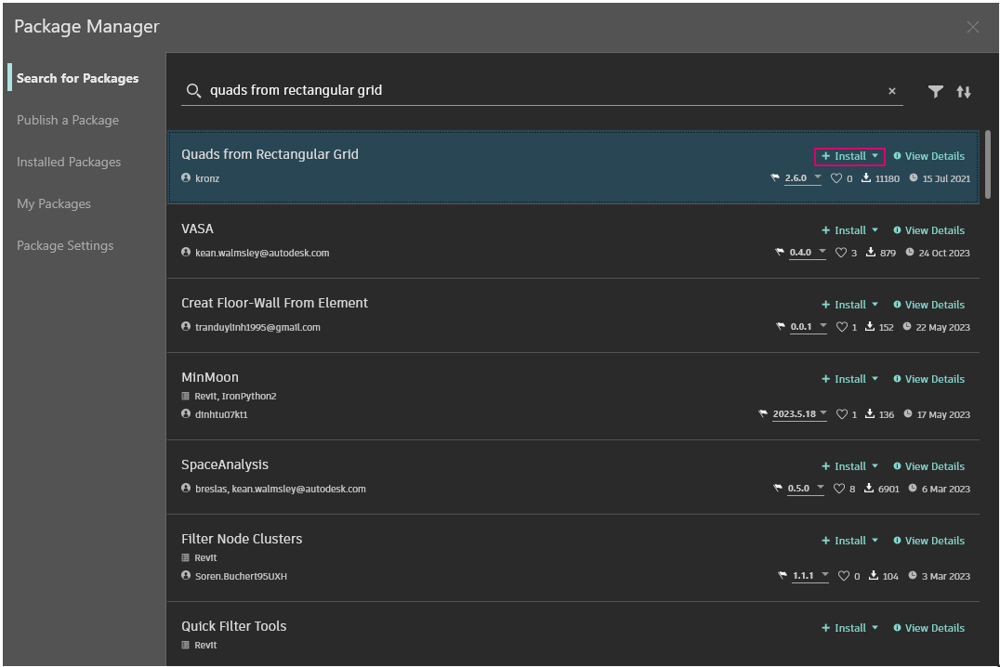

# Pakete - Einführung

Dynamo bietet eine große Anzahl sofort einsatzbereiter Funktionen und verfügt außerdem über eine umfangreiche Paketbibliothek, mit der sich die Funktionen von Dynamo erheblich erweitern lassen. Ein Paket ist eine Sammlung benutzerdefinierter Blöcke oder zusätzlicher Funktionen. Der Dynamo Package Manager ist ein Community-Portal, aus dem Sie beliebige Pakete herunterladen können, die online publiziert wurden. Diese Toolsets werden von externen Anbietern entwickelt und stellen Erweiterungen der Hauptfunktionen von Dynamo dar. Sie stehen für alle Benutzer zur Verfügung und können durch einfaches Klicken auf eine Schaltfläche heruntergeladen werden.

Community-Engagement wie dieses ist die Grundlage des Erfolgs von Open Source-Projekten wie Dynamo. Dank der Arbeit dieser hochmotivierten externen Entwickler kann Dynamo für Arbeitsabläufe in zahlreichen verschiedenen Branchen genutzt werden. Aus diesem Grund hat das Dynamo-Team sich geschlossen bemüht, die Entwicklung und Veröffentlichung von Paketen zu vereinheitlichen. (Dies wird in den folgenden Abschnitten detaillierter beschrieben.)

### Installation eines Pakets

Die einfachste Methode zum Installieren eines Pakets ist die Verwendung der Menüoption Pakete in der Dynamo-Benutzeroberfläche. Diese Methode wird im Folgenden beschrieben. In diesem Beispiel installieren Sie ein häufig verwendetes Paket zum Erstellen viereckiger Felder in einem Raster.

Wechseln Sie in Dynamo zu _Pakete > Package Manager..._

<figure><figcaption></figcaption></figure>

Suchen Sie mithilfe der Suchleiste nach "quads from rectangular grid". Nach kurzer Zeit sollten alle Pakete, die dieser Suchabfrage entsprechen, angezeigt werden. Sie müssen in diesem Fall das erste Paket mit passendem Namen auswählen.

Klicken Sie auf Installieren, um dieses Paket zu Ihrer Bibliothek hinzuzufügen, und bestätigen Sie anschließend den Vorgang. Fertig!

<figure><figcaption></figcaption></figure>

In der Dynamo-Bibliothek wird jetzt eine weitere Gruppe namens buildz angezeigt. Dieser Name bezieht sich auf den Entwickler des Pakets und der benutzerdefinierte Block wird in dieser Gruppe abgelegt. Sie können ihn sofort verwenden.

Verwenden Sie den **Codeblock**, um schnell ein rechteckiges Raster zu definieren, und geben Sie das Ergebnis als **Polygon.ByPoints**-Block und anschließend als **Surface.ByPatch**-Block aus, um die Liste der rechteckigen Elemente anzuzeigen, die Sie gerade erstellt haben.

### Paketordner wird installiert - DynamoUnfold

Das Paket im vorigen Beispiel enthält nur einen benutzerdefinierten Block. Pakete, die mehrere benutzerdefinierte Blöcke und die unterstützenden Datendateien enthalten, werden jedoch auf dieselbe Weise heruntergeladen. Dies wird hier an einem umfassenderen Paket demonstriert: Dynamo Unfold.

Beginnen Sie wie im Beispiel oben, indem Sie _Pakete > Package Manager..._ wählen.

Dieses Mal suchen wir nach _DynamoUnfold_ (in einem Wort geschrieben). Wenn die Pakete angezeigt werden, laden Sie sie herunter, indem Sie auf Installieren klicken, um Dynamo Unfold Ihrer Dynamo-Bibliothek hinzuzufügen.

<figure><figcaption></figcaption></figure>

Die Dynamo-Bibliothek enthält jetzt die Gruppe _DynamoUnfold_ mit mehreren Kategorien und benutzerdefinierten Blöcken.

Als Nächstes betrachten Sie die Dateistruktur des Pakets genauer.

1. Navigieren Sie zunächst zu Pakete > Package Manager > Installierte Pakete.
2. Wählen Sie neben DynamoUnfold das Optionsmenü  aus.
3. Klicken Sie anschließend auf Stammverzeichnis anzeigen, um den Stammordner für dieses Paket zu öffnen.

<figure><figcaption></figcaption></figure>

Dadurch gelangen Sie zum Stammverzeichnis des Pakets. Hier sind drei Ordner und eine Datei vorhanden.

> 1. Im Ordner _bin_ werden DLL-Dateien gespeichert. Dieses Dynamo-Paket wurde mit Zero-Touch entwickelt, d. h., die benutzerdefinierten Blöcke wurden in diesem Ordner abgelegt.
> 2. Im Ordner _dyf_ befinden sich die benutzerdefinierten Blöcke. Da dieses Paket nicht mithilfe benutzerdefinierter Dynamo-Blöcke entwickelt wurde, ist dieser Ordner in diesem Paket leer.
> 3. Der Ordner extra enthält alle zusätzlichen Dateien, darunter Ihre Beispieldateien.
> 4. Die Datei pkg ist eine einfache Textdatei, die die Einstellungen des Pakets definiert. Sie können diese Datei für den Augenblick ignorieren.

Wenn Sie den Ordner extra öffnen, sehen Sie eine Reihe von Beispieldateien, die mit der Installation heruntergeladen wurden. Beispieldateien stehen nicht in allen Paketen zur Verfügung. Falls sie jedoch vorhanden sind, finden Sie sie in diesem Ordner.

Öffnen Sie SphereUnfold.

Nachdem Sie die Datei geöffnet und im Solver auf Ausführen geklickt haben, erhalten Sie das Netz einer Kugel! Beispieldateien wie diese erleichtern den Einstieg in die Arbeit mit einem neuen Dynamo-Paket.

 (2).jpg>)

### Durchsuchen und Anzeigen von Paketinformationen

Mithilfe der Sortier- und Filteroptionen auf der Registerkarte Nach Paketen suchen können Sie im Package Manager nach Paketen suchen. Es stehen verschiedene Filter für das Host-Programm und den Status (neu, veraltet oder nicht veraltet) zur Verfügung, bzw. dafür, ob das Paket Abhängigkeiten aufweist.

Durch Sortieren der Pakete können Sie die hoch bewerteten oder die am häufigsten heruntergeladenen Pakete ermitteln bzw. Pakete mit aktuellen Updates suchen.

Sie können auch auf weitere Details zu jedem Paket zugreifen, indem Sie auf Details anzeigen klicken. Dadurch wird eine Seitenleiste im Package Manager geöffnet, in der Sie Informationen wie Versionierung und Abhängigkeiten, Website- oder Repository-URL, Lizenzinformationen usw. finden.

### Dynamo Package Manager-Website

Sie können auch auf der [Dynamo Package Manager-Website](http://dynamopackages.com) nach Dynamo-Paketen suchen. Hier finden Sie Paketabhängigkeiten und Informationen zur Host-/Versionskompatibilität, die von den Paketautoren bereitgestellt wurden. Sie können die Paketdateien auch über den Dynamo Package Manager herunterladen, der direkte Download in Dynamo ist jedoch ein nahtloserer Ablauf.

### Wo werden die Paketdateien lokal gespeichert?

Wenn Sie wissen möchten, wo Ihre Paketdateien gespeichert sind, klicken Sie in der oberen Navigationsleiste auf Dynamo > Voreinstellungen > Paketeinstellungen > Dateispeicherorte für Blöcke und Pakete. Hier finden Sie das aktuelle Stammordnerverzeichnis.

Pakete werden vorgabemäßig unter einem Speicherort ähnlich dem folgenden installiert: _C:/Benutzer/[Benutzername]/AppData/Roaming/Dynamo/[Dynamo-Version]_.

### Einrichten eines freigegebenen Speicherorts für Pakete in einem Büro

Für Benutzer, die wissen möchten, ob es möglich ist, Dynamo (in beliebiger Form) mit vorinstallierten Paketen einzurichten: Der Ansatz, der dieses Problem löst und allen Benutzern mit einer Dynamo-Installation die Steuerung an einem zentralen Ort ermöglicht, besteht darin, jeder Installation einen benutzerdefinierten Paketpfad hinzuzufügen.

**Hinzufügen eines Netzwerkordners, in dem der BIM-Manager oder andere Benutzer die Bestückung des Ordners mit vom Büro genehmigten Paketen überwachen können**

Wechseln Sie in der Benutzeroberfläche einer einzelnen Anwendung zu _Dynamo -> Voreinstellungen -> Paketeinstellungen -> Dateispeicherorte für Blöcke und Pakete_. Klicken Sie im Dialogfeld auf die Schaltfläche Pfad hinzufügen, und navigieren Sie zum Netzwerkspeicherort für die freigegebene Paketressource.

Dieser automatisierte Vorgang umfasst das Hinzufügen von Informationen zur Konfigurationsdatei, die mit Dynamo installiert wird: \
 `C:\Benutzer\[Benutzername]\AppData\Roaming\Dynamo\Dynamo Revit\[Dynamo-Version]\DynamoSettings.xml`

Die Konfiguration für Dynamo for Revit lautet vorgabemäßig wie folgt:

`<CustomPackageFolders>`

`<string>C:\Users\[Username]\AppData\Roaming\Dynamo\Dynamo Revit\[Dynamo Version]</string>`

`</CustomPackageFolders>`

Das Hinzufügen eines benutzerdefinierten Speicherorts würde wie folgt aussehen:

`<CustomPackageFolders>`

`<string>C:\Users\[Username]\AppData\Roaming\Dynamo\Dynamo Revit\[Dynamo Version]</string>`

`<string>N:\OfficeFiles\Dynamo\Packages_Limited</string>`

`</CustomPackageFolders>`

Die zentrale Verwaltung dieses Ordners kann auch gesteuert werden, indem Sie den Ordner einfach mit Schreibschutz versehen.

### Laden von Paketen mit Binärdateien aus einem Netzwerkspeicherort

#### Szenario

Ein Unternehmen möchte möglicherweise die Pakete standardisieren, die von verschiedenen Arbeitsstationen und Benutzern installiert werden. Eine Möglichkeit hierfür könnte darin bestehen, diese Pakete über _Dynamo -> Voreinstellungen -> Paketeinstellungen -> Dateispeicherorte für Blöcke und Pakete_ zu installieren, einen Netzwerkordner als Installationsverzeichnis auszuwählen und diesen Pfad auf den Arbeitsstationen zu `Manage Node and Package Paths` hinzuzufügen.

#### Problem

Während das Szenario für Pakete, die nur benutzerdefinierte Blöcke enthalten, ordnungsgemäß funktioniert, funktioniert es möglicherweise nicht für Pakete, die Binärdateien enthalten, wie z. B. Zero-Touch-Blöcke. Dieses Problem wird durch [Sicherheitsmaßnahmen](https://stackoverflow.com/questions/5328274/load-assembly-from-network-location) verursacht, die .NET Framework beim Laden von Assemblys anwendet, wenn diese aus einem Netzwerkspeicherort stammen. Leider ist die Verwendung des Konfigurationselements `loadFromRemoteSources`, wie im verknüpften Thread vorgeschlagen, keine mögliche Lösung für Dynamo, da es als Komponente und nicht als Anwendung verteilt wird.

#### Problembehandlung

Eine mögliche Umgehungslösung besteht darin, ein zugeordnetes Netzwerklaufwerk zu verwenden, das auf den Netzwerkspeicherort verweist, und dafür zu sorgen, dass die Arbeitsstationen stattdessen diesen Pfad referenzieren. Die Schritte zum Erstellen eines zugeordneten Netzlaufwerks werden [hier](https://support.microsoft.com/de-de/help/4026635/windows-10-map-a-network-drive) beschrieben.

### Weitere Schritte mit Paketen

Die Dynamo-Community wächst laufend und entwickelt sich dabei weiter. Besuchen Sie Dynamo Package Manager von Zeit zu Zeit, um über neue inspirierenden Entwicklungen auf dem Laufenden zu bleiben. In den folgenden Abschnitten werden Pakete eingehender behandelt, wobei sowohl auf die Perspektive des Endbenutzers eingegangen als auch die Entwicklung eigener Dynamo-Pakete behandelt wird.
