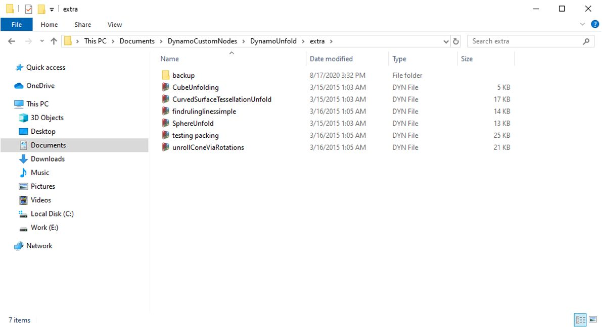

# Introduzione ai pacchetti

In breve, un pacchetto è una raccolta di nodi personalizzati. Dynamo Package Manager è un portale che consente alla comunità di scaricare qualsiasi pacchetto pubblicato online. Questi set di strumenti sono stati sviluppati da terze parti per estendere le funzionalità principali di Dynamo, sono accessibili a tutti e sono pronti per il download con un semplice clic.

Un progetto open source, come Dynamo, si basa su questo tipo di coinvolgimento della comunità. Grazie a sviluppatori di terze parti dedicati, Dynamo è in grado di estendere il suo ambito di applicazione ai workflow di diversi settori. Per questo motivo, il team di Dynamo ha compiuto sforzi concertati per snellire lo sviluppo e la pubblicazione dei pacchetti (che saranno discussi in modo più dettagliato nelle sezioni seguenti).

### Installazione di un pacchetto

Il modo più semplice per installare un pacchetto consiste nell'utilizzare la barra degli strumenti Pacchetti nell'interfaccia di Dynamo. Adesso si può passare direttamente al pacchetto e installarne uno. In questo esempio rapido, verrà installato un comune pacchetto per la creazione di pannelli quadrangolari su una griglia.

In Dynamo, accedere a _Pacchetti > Cerca pacchetto_.

Sulla barra di ricerca, cercare "quads from rettangular grid". Dopo alcuni minuti, si dovrebbero vedere tutti i pacchetti che corrispondono alla query di ricerca. Si desidera selezionare il primo pacchetto con il nome corrispondente.

Fare clic su Ínstalla per aggiungere questo pacchetto alla libreria. Fatto.

Notare che ora è presente un altro gruppo nella libreria di Dynamo denominato "buildz". Questo nome si riferisce allo sviluppatore del pacchetto e il nodo personalizzato viene posizionato in questo gruppo. È possibile iniziare ad utilizzarlo immediatamente.

Utilizzare **Code Block** per definire rapidamente una griglia rettangolare, generare il risultato in un nodo **Polygon.ByPoints**, quindi in un nodo **Surface.ByPatch** per visualizzare l'elenco di pannelli rettangolari appena creati.

### Installazione della cartella di pacchetti - DynamoUnfold

L'esempio riportato sopra si concentra su un pacchetto con un nodo personalizzato, ma si utilizza lo stesso processo per il download di pacchetti con diversi nodi personalizzati e file di dati di supporto. Ora si dimostrerà ciò con un pacchetto più completo: DynamoUnfold.

Come nell'esempio precedente, iniziare selezionando _Pacchetti > Cerca pacchetto_.

Questa volta, si cercherà _"DynamoUnfold"_, una parola, facendo attenzione alle lettere maiuscole. Quando vengono visualizzati i pacchetti, scaricarli facendo clic su Installa per aggiungere DynamoUnfold alla libreria di Dynamo.

Nella libreria di Dynamo, è presente un gruppo _DynamoUnfold_ con più categorie e nodi personalizzati.

Ora, si può dare un'occhiata alla struttura dei file del pacchetto. Selezionare innanzitutto Dynamo > Preferenze.

Dalla finestra popup Preferenze, aprire Package Manager > accanto a DynamoUnfold, selezionare il menu con i puntini verticali  > Mostra directory principale per aprire la cartella principale per questo pacchetto.

Verrà aperta la directory principale del pacchetto. Notare che sono presenti 3 cartelle e un file.

> 1. La cartella _bin_ contiene i file .dll. Questo pacchetto di Dynamo è stato sviluppato utilizzando la funzionalità zero-touch, pertanto i nodi personalizzati sono contenuti in questa cartella.
> 2. La cartella _dyf_ contiene i nodi personalizzati. Questo pacchetto non è stato sviluppato utilizzando nodi personalizzati di Dynamo, pertanto questa cartella è vuota per questo pacchetto.
> 3. La cartella extra contiene tutti i file aggiuntivi, inclusi i file di esempio.
> 4. Il file pkg è un file di testo di base che definisce le impostazioni del pacchetto. Lo si può ignorare per adesso.

Aprendo la cartella "extra", si notano alcuni file di esempio scaricati con l'installazione. Non tutti i pacchetti dispongono di file di esempio, ma è possibile trovarli se fanno parte di un pacchetto.

Aprire "SphereUnfold".

Dopo aver aperto il file e aver fatto clic su "Esegui" nel risolutore, è presente una sfera spiegata. File di esempio come questi sono utili per imparare ad utilizzare un nuovo pacchetto di Dynamo.

\.jpg>)

### Dynamo Package Manager

Un altro modo per scoprire i pacchetti di Dynamo consiste nell'esplorare [Dynamo Package Manager](http://dynamopackages.com) online. Si tratta di un ottimo modo per cercare i pacchetti, poiché il repository dispone i pacchetti in ordine di conteggio dei download e popolarità. Inoltre, è un modo semplice per raccogliere informazioni sugli aggiornamenti recenti per i pacchetti, poiché alcuni pacchetti di Dynamo sono soggetti al controllo delle versioni e alle dipendenze delle build di Dynamo.

Facendo clic su _"Quads from Rectangular Grid"_ in Dynamo Package Manager, è possibile visualizzarne le descrizioni, le versioni, lo sviluppatore e le possibili dipendenze.

È inoltre possibile scaricare i file di pacchetto da Dynamo Package Manager, ma eseguire questa operazione direttamente da Dynamo è un processo più agevole.

### Dove vengono memorizzati i file di pacchetti in locale?

Se si scaricano i file da Package Manager di Dynamo o si desidera vedere dove sono mantenuti tutti i file di pacchetti, fare clic su Dynamo > Package Manager > Percorsi di nodi e pacchetti; è possibile trovare la directory principale corrente delle cartelle da qui.

Per default, i pacchetti vengono installati in una posizione simile a questo percorso delle cartelle: _C:/Utenti/[nome utente]/AppData/Roaming/Dynamo/[versione di Dynamo]_.

### Ulteriori informazioni sui pacchetti

La comunità di Dynamo è in costante crescita e in continua evoluzione. Esplorando di tanto in tanto Dynamo Package Manager, si noteranno alcuni nuovi e interessanti miglioramenti. Nelle seguenti sezioni, verranno esaminati in modo più approfondito i pacchetti, dalla prospettiva dell'utente finale fino al programmatore del pacchetto di Dynamo.
