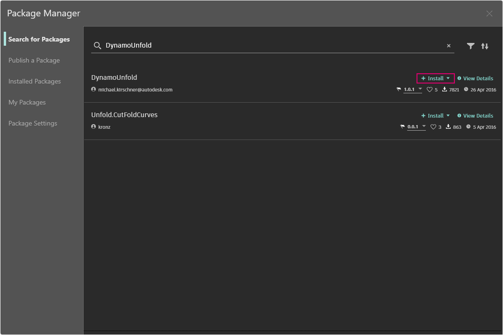
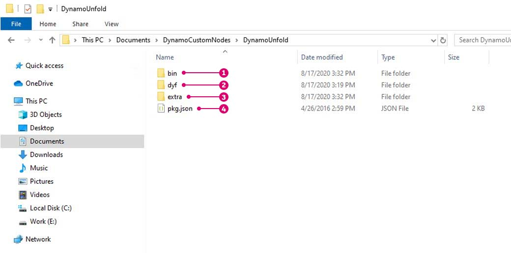

# Introdução aos pacotes

O Dynamo oferece um grande número de recursos prontos para uso e também mantém uma ampla biblioteca de pacotes que pode estender significativamente a capacidade do Dynamo. Um pacote é uma coleção de nós personalizados ou funcionalidades adicionais. O Dynamo Package Manager é um portal para a comunidade fazer download de qualquer pacote que tenha sido publicado on-line. Esses conjuntos de ferramentas são desenvolvidos por terceiros para estender a funcionalidade central do Dynamo, acessível a todos, e prontos para download com o clique do botão.

Um projeto de código aberto, como o Dynamo, prospera com esse tipo de envolvimento da comunidade. Com desenvolvedores de terceiros dedicados, o Dynamo é capaz de estender seu alcance para os fluxos de trabalho em uma variedade de setores. Por esse motivo, a equipe do Dynamo tem feito esforços em conjunto para simplificar o desenvolvimento e a publicação de pacotes (que serão discutidos mais detalhadamente nas seções a seguir).

### Instalar um pacote

A maneira mais fácil de instalar um pacote é usando a opção de menu Pacotes na interface do Dynamo. Vamos entrar nele e instalar um pacote agora. Neste exemplo rápido, vamos instalar um pacote popular para criar painéis quadrados em uma grade.

No Dynamo, vá para _Pacotes > Package Manager..._

<figure><figcaption></figcaption></figure>

Na barra de pesquisa, vamos procurar “quadrados na grade retangular”. Após alguns momentos, você deverá ver todos os pacotes que correspondem a essa consulta de pesquisa. Queremos selecionar o primeiro pacote com o nome correspondente.

Clique em Instalar para adicionar esse pacote à biblioteca e, em seguida, aceite a confirmação. Concluído.

<figure><figcaption></figcaption></figure>

Observe que agora temos outro grupo em nossa biblioteca do Dynamo, chamado “buildz”. Esse nome se refere ao desenvolvedor do pacote e o nó personalizado é colocado nesse grupo. Podemos começar a usá-lo imediatamente.

Use **Bloco de código** para definir rapidamente uma grade retangular, gere a saída do resultado para um nó **Polygon.ByPoints** e, subsequentemente, um nó **Surface.ByPatch** para visualizar a lista de painéis retangulares que você acabou de criar.

### Pasta Instalar pacote – DynamoUnfold

O exemplo acima se concentra em um pacote com um nó personalizado, mas você usa o mesmo processo para fazer o download de pacotes com diversos nós personalizados e arquivos de dados de suporte. Vamos demonstrar isso agora, com um pacote mais abrangente: o Dynamo Unfold.

Como no exemplo acima, comece selecionando _Pacotes > Package Manager..._

Desta vez, vamos procurar _“DynamoUnfold”_, uma palavra. Quando os pacotes forem exibidos, faça o download clicando em Instalar para adicionar o Dynamo Unfold à biblioteca do Dynamo.

<figure><figcaption></figcaption></figure>

Na biblioteca do Dynamo, temos um grupo _DynamoUnfold_ com várias categorias e vários nós personalizados.

Agora, vamos analisar a estrutura de arquivos do pacote.

1. Primeiro, vá para Pacotes > Package Manager > Pacotes instalados.
2. Ao lado de DynamoUnfold, selecione o menu de opções .
3. Em seguida, clique em Mostrar diretório raiz para abrir a pasta raiz desse pacote.

<figure><figcaption></figcaption></figure>

Isso nos leva ao diretório raiz do pacote. Observe que temos três pastas e um arquivo.

> 1. A pasta _bin_ contém os arquivos .dll. Esse pacote do Dynamo foi desenvolvido usando a funcionalidade Sem toque; por isso, os nós personalizados são mantidos nessa pasta.
> 2. A pasta _dyf_ contém os nós personalizados. Esse pacote não foi desenvolvido usando os nós personalizados do Dynamo; portanto, a pasta está vazia para esse pacote.
> 3. A pasta extra contém todos os arquivos adicionais, inclusive os arquivos de exemplo.
> 4. O arquivo pkg é um arquivo de texto básico que define as configurações do pacote. Podemos ignorar isso por enquanto.

Abrindo a pasta “extra”, vemos muitos arquivos de exemplo que foram obtidos por download com a instalação. Nem todos os pacotes têm arquivos de exemplo, mas será possível encontrá-los se fizerem parte de um pacote.

Vamos abrir “SphereUnfold”.

Após abrir o arquivo e pressionar “Executar” no solucionador, teremos uma esfera desdobrada. Arquivos de exemplo como esses são úteis para saber como trabalhar com um novo pacote do Dynamo.

 (2).jpg>)

### Procurar e visualizar informações dos pacotes

No Package Manager, é possível procurar pacotes usando as opções de classificação e filtragem na guia Procurar pacotes. Há vários filtros disponíveis para o programa hospedeiro, status (novo, obsoleto ou não) e se o pacote tem dependências.

Através da classificação de pacotes, é possível identificar os pacotes com alta classificação ou aqueles com mais downloads, ou encontrar pacotes com atualizações recentes.

Também é possível acessar mais detalhes em cada pacote clicando em Exibir detalhes. Isso abre um painel lateral no Package Manager, onde é possível encontrar informações como controle de versão e dependências, URL do site ou do repositório, informações de licença etc.

### Site do Dynamo Package Manager

Outra forma de descobrir pacotes do Dynamo é explorar o site do [Dynamo Package Manager](http://dynamopackages.com). Aqui, você pode encontrar dependências do pacote e informações de compatibilidade de hospedeiros/versões fornecidas pelos autores do pacote. Também é possível fazer o download dos arquivos do pacote no Dynamo Package Manager, mas fazer isso diretamente no Dynamo é um processo mais intuitivo.

### Onde estão armazenados os arquivos dos pacotes localmente?

Se você quiser ver onde os arquivos dos pacotes estão armazenados, na parte superior da navegação, clique em Dynamo > Preferências > Configurações do pacote > Localizações dos arquivos de nós e pacotes. Você poderá encontrar o diretório da pasta raiz atual aqui.

Por padrão, os pacotes são instalados em uma localização similar a este caminho de pasta: _C:/Usuários/[nome de usuário]/AppData/Roaming/Dynamo/[versão do Dynamo]_.

### Configurar uma localização compartilhada para pacotes em um escritório

Para usuários que estão perguntando se é possível implantar o Dynamo (de qualquer forma) com pacotes pré-anexados: a abordagem que resolverá esse problema e permitirá o controle em um local central para todos os usuários com instalações do Dynamo é adicionar um caminho de pacote personalizado a cada instalação.

**Adicionar uma pasta de rede, onde o gerente de BIM ou outros possam supervisionar o armazenamento da pasta com pacotes aprovados pelo escritório**

Na interface do usuário de um aplicativo individual, vá para _Dynamo -> Preferências -> Configurações do pacote -> Localizações dos arquivos de nós e pacotes_. Na caixa de diálogo, pressione o botão “Adicionar caminho” e navegue até o local de rede do recurso do pacote compartilhado.

Como um processo automatizado, isso envolveria adicionar informações ao arquivo de configuração instalado com o Dynamo:\
 `C:\Users\[Username]\AppData\Roaming\Dynamo\Dynamo Revit\[Dynamo Version]\DynamoSettings.xml`

Por padrão, a configuração do Dynamo para Revit é:

`<CustomPackageFolders>`

`<string>C:\Users\[Username]\AppData\Roaming\Dynamo\Dynamo Revit\[Dynamo Version]</string>`

`</CustomPackageFolders>`

A adição de uma localização personalizada teria esta aparência:

`<CustomPackageFolders>`

`<string>C:\Users\[Username]\AppData\Roaming\Dynamo\Dynamo Revit\[Dynamo Version]</string>`

`<string>N:\OfficeFiles\Dynamo\Packages_Limited</string>`

`</CustomPackageFolders>`

Também é possível controlar o gerenciamento central dessa pasta tornando a pasta somente leitura.

### Carregar pacotes com binários de uma localização de rede

#### Cenário

Uma organização pode desejar padronizar os pacotes instalados por diferentes estações de trabalho e usuários. Uma maneira de fazer isso pode ser instalar esses pacotes em _Dynamo -> Preferências -> Configurações do pacote -> Localizações dos arquivos de nós e pacotes_, selecionando uma pasta de rede como localização de instalação e fazer com que as estações de trabalho adicionem esse caminho a `Manage Node and Package Paths`.

#### Problema

Embora o cenário funcione corretamente para pacotes que contêm apenas nós personalizados, ele pode não funcionar para pacotes que contêm binários, como nós sem toque. Esse problema é causado por [medidas de segurança](https://stackoverflow.com/questions/5328274/load-assembly-from-network-location) que o .NET Framework coloca sobre o carregamento de montagens quando eles vêm de uma localização de rede. Infelizmente, usar o elemento de configuração `loadFromRemoteSources`, como sugerido no thread vinculado, não é uma solução possível para o Dynamo, pois ele é distribuído como um componente em vez de um aplicativo.

#### Solução

Uma solução possível é usar uma unidade de rede mapeada apontando para a localização de rede e, em vez disso, fazer com que as estações de trabalho façam referência a esse caminho. As etapas para criar uma unidade de rede mapeada estão descritas [aqui](https://support.microsoft.com/pt-br/help/4026635/windows-10-map-a-network-drive).

### Conhecer mais sobre pacotes

A comunidade do Dynamo está crescendo e evoluindo constantemente. Explorando o Dynamo Package Manager periodicamente, você encontrará alguns novos desenvolvimentos empolgantes. Nas seções a seguir, analisaremos com mais detalhes os pacotes, da perspectiva do usuário final até a criação do seu próprio pacote do Dynamo.
