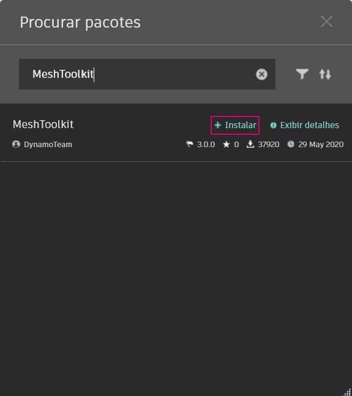
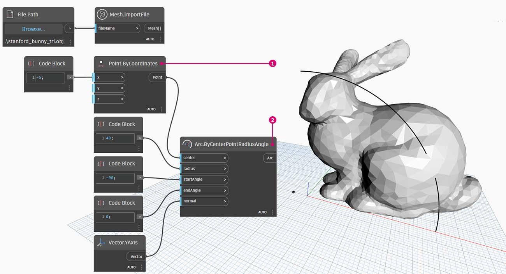
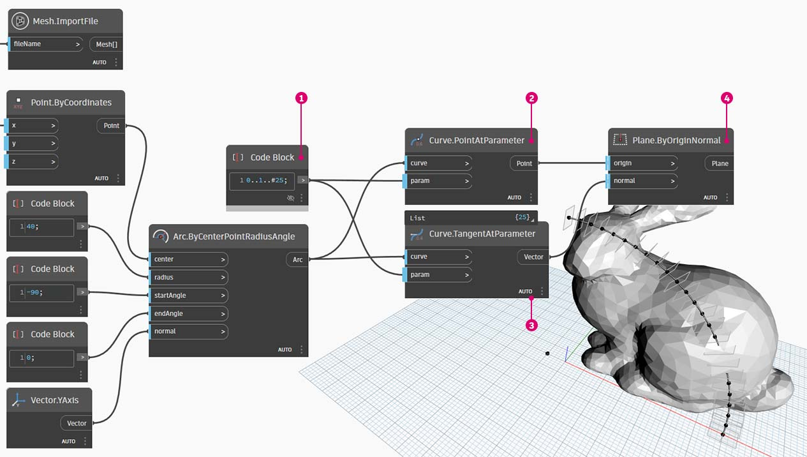
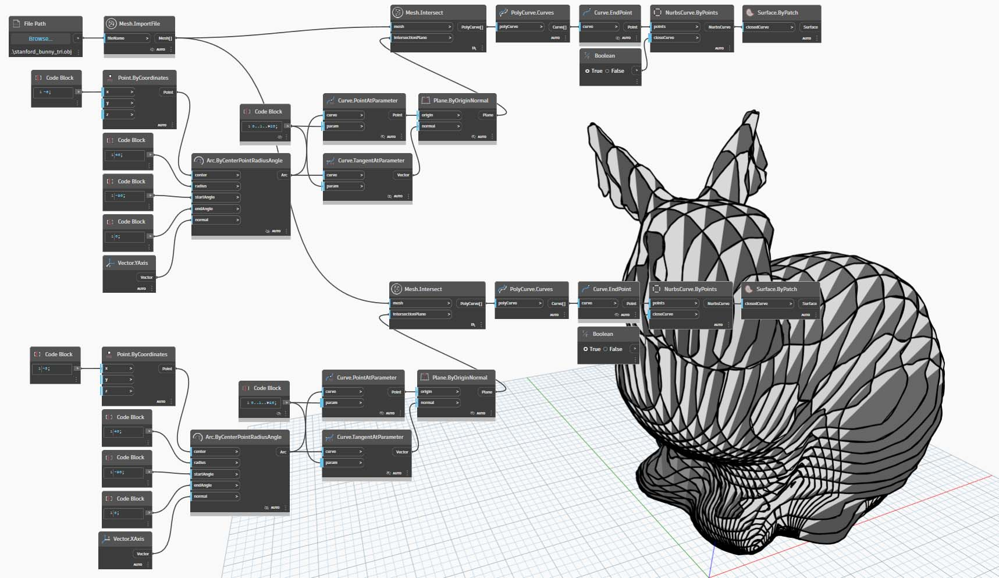

# 软件包案例研究 - Mesh Toolkit

Dynamo Mesh Toolkit 包提供了多种工具，可从外部文件格式输入网格、从 Dynamo 几何体对象创建网格，以及按顶点和索引手动构建网格。该库还提供了一些工具，可用于修改网格、修复网格或提取水平切片以在制造中使用。

Dynamo Mesh Toolkit 是 Autodesk 持续网格研究的一部分，因此在未来几年内将继续增长。希望新方法经常出现在工具包中，您可以随时与 Dynamo 团队联系并提供评论、错误和新功能建议。

### 网格与实体

以下练习演示了使用 Mesh Toolkit 的一些基本网格操作。在该练习中，我们将网格与一系列平面相交，这可能需要使用实体进行大量的计算。与实体不同，网格有设置的“分辨率”，且不是以数学方式而是以拓扑方式定义，我们可以基于手头的任务定义此分辨率。有关网格与实体关系的详细信息，可参见本入门中的[“用于计算设计的几何图形”](../../a-closer-look-at-dynamo-essential-nodes-and-concepts/5\_geometry-for-computational-design/)一章。要更全面的了解 Mesh Toolkit，可以参见 [Dynamo Wiki 页面](https://github.com/DynamoDS/Dynamo/wiki/Dynamo-Mesh-Toolkit)。接下来，我们跳至下面练习中的软件包。

### 安装 Mesh Toolkit

在 Dynamo 中，转到顶部菜单栏中的 _“软件包”>“搜索软件包...”_。在搜索字段中，键入 _“MeshToolkit”_，全部写为一个单词并注意大小写。单击“安装”以开始下载。就这么简单！

## 练习：使网格相交

> 单击下面的链接下载示例文件。
>
> 可以在附录中找到示例文件的完整列表。



在此示例中，我们将查看网格工具包中的“相交”节点。我们将导入网格并与一系列输入平面相交以创建切片。这是准备模型以在激光刀具、水射流刀具或 CNC 铣削上进行加工的起点。

首先，在 Dynamo 中打开 _“Mesh-Toolkit_Intersect-Mesh.dyn”_。

> 1. **File Path**：找到要输入的网格文件（_“stanford_bunny_tri.obj”_）。支持的文件类型包括 .mix 和 .obj
> 2. **Mesh.ImportFile**：连接文件路径以输入网格

> 1. **Point.ByCoordinates**：构造点 - 这将是圆弧的中心。
> 2. **Arc.ByCenterPointRadiusAngle**：围绕点构造圆弧。此曲线将用于定位一系列平面。设置如下所示：`radius: 40, startAngle: -90, endAngle:0`

创建一系列沿圆弧定向的平面。

> 1. **代码块**：创建 25 个介于 0 和 1 之间的数字。
> 2. **Curve.PointAtParameter**：将圆弧连接到 _“curve”_ 输入，将代码块输出连接到 _“param”_ 输入以沿曲线提取一系列点。
> 3. **Curve.TangentAtParameter**：连接与上一个节点相同的输入。
> 4. **Plane.ByOriginNormal**：将点连接到 _“origin”_ 输入并将向量连接到 _“normal”_ 输入，以在每个点处创建一系列平面。

接下来，我们将使用这些平面来与网格相交。

> 1. **Mesh.Intersect**：使平面与输入的网格相交，从而创建一系列复合线轮廓。在节点上单击鼠标右键并将连缀设置为最长
> 2. **PolyCurve.Curves**：将复合线断开为其曲线片段。
> 3. **Curve.EndPoint**：提取每条曲线的端点。
> 4. **NurbsCurve.ByPoints**：使用点来构建 NURBS 曲线。使用设定为 _True_ 的布尔节点闭合曲线。

在继续操作之前，请关闭某些节点（例如：Mesh.ImportFile、Curve.EndPoint、Plane.ByOriginNormal 和 Arc.ByCenterPointRadiusAngle）的预览，以便更好地查看结果。

> 1. **Surface.ByPatch**：为每个轮廓构造曲面面片以创建网格的“切片”。

为一个格子/卵形木箱效果添加第二组切片。

您可能已注意到，相交操作通过网格与类似实体进行更快的计算。此练习中演示的工作流适合于与网格结合使用。
