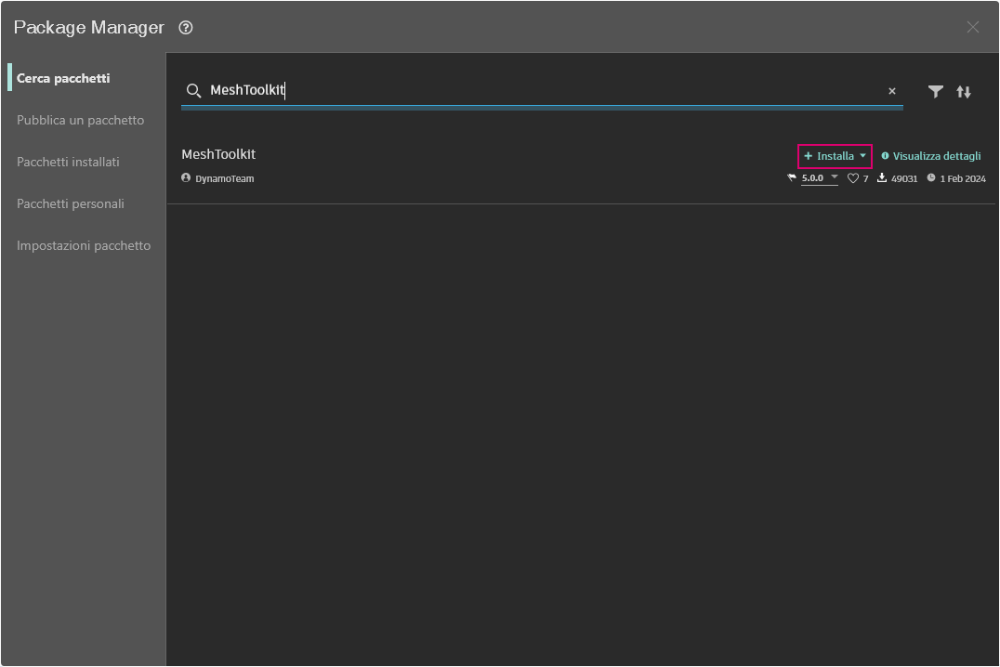

# パッケージのケース スタディ - Mesh Toolkit

Dynamo Mesh Toolkit は、外部ファイル形式からメッシュを読み込む機能、Dynamo のジオメトリ オブジェクトからメッシュを作成する機能、頂点とインデックスからメッシュを手動で作成する機能を提供するライブラリです。このライブラリには、メッシュの変更や修復を行うためのツールや、製造処理で使用する水平方向のスライスを抽出するためのツールも用意されています。

\.jpg>)

Dynamo Mesh Toolkit は、オートデスクによるメッシュ研究の一環として開発されているため、今後も拡張を続けていきます。このツールキットには、頻繁に新しいメソッドが追加される予定になっています。コメント、バグの報告、新機能の提案については、お気軽に Dynamo チームまでご連絡ください。

### メッシュとソリッドとの比較

次の演習では、Mesh Toolkit を使用して、いくつかの基本的なメッシュ操作を説明します。この演習では、メッシュを一連の平面と交差させます。この操作でメッシュではなくソリッドを使用すると、計算量が多くなります。ソリッドとは異なり、メッシュには「解像度」の集合があります。現在の作業に応じて、この解像度を定義することができます。メッシュは、数学的にではなく位相幾何学的に定義されています。メッシュとソリッドとの関係について詳しくは、この手引の「[計算設計用のジオメトリ](../../5\_essential\_nodes\_and\_concepts/5-2\_geometry-for-computational-design/)」の章を参照してください。Mesh Toolkit の詳細な説明については、[Dynamo Wiki ページ](https://github.com/DynamoDS/Dynamo/wiki/Dynamo-Mesh-Toolkit)を参照してください。次の演習で、パッケージの内容を確認してみましょう。

### Mesh Toolkit をインストールする

Dynamo で、上部メニュー バーの[パッケージ] > [Package Manager]に移動します。検索フィールドに「MeshToolkit」と入力します。スペースを入れずに 1 つの単語として入力してください。[インストール]をクリックし、確認を承諾してダウンロードを開始します。非常に簡単です。

<figure><figcaption></figcaption></figure>

## 演習: メッシュを交差させる

> 下のリンクをクリックして、サンプル ファイルをダウンロードします。
>
> すべてのサンプル ファイルの一覧については、付録を参照してください。



この例では、Mesh Toolkit の Intersection ノードについて説明します。メッシュを読み込み、そのメッシュを一連の入力面と交差させてスライスを作成します。レーザー カッター、ウォータージェット カッター、CNC ミルなどの製造用モデルを作成する場合は、最初にこの操作を実行することになります。

最初に、_Dynamo で Mesh-Toolkit_Intersect-Mesh.dyn_ を開きます。

> 1. **File Path** ノードで、読み込むメッシュ ファイル(_stanford_bunny_tri.obj_)の場所を指定します。サポートされるファイル タイプは、.mix と .obj です。
> 2. **Mesh.ImportFile** ノードに File Path ノードを接続して、メッシュを読み込みます。

> 1. **Point.ByCoordinates** ノードで、点を作成します。この点が、円弧の中心になります。
> 2. **Arc.ByCenterPointRadiusAngle** ノードで、上記の点を中心とする円弧を作成します。この曲線を使用して、一連の面が配置されます。 __設定は次のとおりです。__ `radius: 40, startAngle: -90, endAngle:0`

円弧に沿って方向付けられた一連の平面を作成します。

> 1. **Code Block** ノードで、0 から 1 までの 25 個の数値を入力します。
> 2. **Curve.PointAtParameter** ノードの _curve_ 入力に Arc.ByCenterPointRadiusAngle ノードの Arc 出力を接続し、_param_ 入力に Code Block ノードの出力を接続します。これにより、曲線に沿って一連の点が抽出されます。
> 3. **Curve.TangentAtParameter** ノードの curve 入力に、Arc.ByCenterPointRadiusAngle ノードの Arc 出力を接続します。
> 4. **Plane.ByOriginNormal** ノードの _origin_ 入力に Curve.PointAtParameter ノードの Point 出力を接続し、_normal_ 入力に Curve.TangentAtParameter ノードの Vector 出力を接続します。これにより、各点に一連の平面が作成されます。

次に、これらの平面を使用してメッシュを交差させます。

> 1. **Mesh.Intersect** ノードで、読み込んだメッシュと平面を交差させ、一連のポリカーブの輪郭線を作成します。ノードを右クリックして、レーシングを最長に設定します。
> 2. **PolyCurve.Curves** ノードで、ポリカーブを曲線のフラグメントに分割します。
> 3. **Curve.EndPoint** ノードで、各曲線の終了点を抽出します。
> 4. **NurbsCurve.ByPoints** ノードで、点群を使用して NURBS 曲線を作成します。次に、Boolean ノードを _True_ に設定して曲線を閉じます。

続行する前に、Mesh.ImportFile、Curve.EndPoint、Plane.ByOriginNormal および Arc.ByCenterPointRadiusAngle など、一部のノードのプレビューをオフにして、結果を見やすくします。

> 1. **Surface.ByPatch** ノードで、各輪郭線に対してサーフェスを作成して、メッシュの「スライス」を作成します。

2 つ目のスライスの集合を追加すると、2 種類のスライスが格子のように表示されます。

メッシュを使用すると、交差の演算がソリッドよりも高速になることがわかります。この演習で紹介したようなワークフローには、メッシュが適しています。
