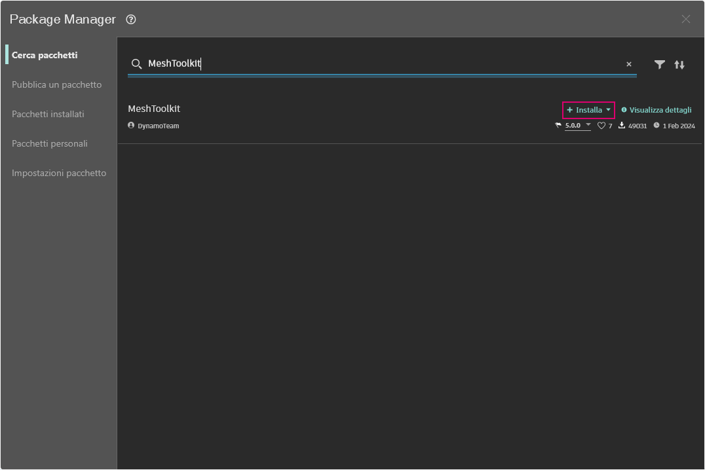

# Практикум по работе с пакетом: Mesh Toolkit

Dynamo Mesh Toolkit содержит инструменты для импорта сетей из внешних файлов других форматов, создания сетей из геометрических объектов Dynamo и построения сетей вручную по вершинам и индексам. В библиотеке также содержатся инструменты для редактирования и восстановления сетей, а также для извлечения горизонтальных срезов, используемых в ходе изготовления изделий.

\

Пакет Dynamo Mesh Toolkit — это результат непрерывной работы специалистов Autodesk, направленной на исследование сетей. В ближайшие годы функциональные возможности пакета будут постоянно улучшаться и пополняться. Разработчики Dynamo с нетерпением ждут ваших отзывов и предложений по новым функциям, а также сообщений об обнаруженных ошибках.

### Сети и тела

В упражнении ниже демонстрируются некоторые базовые операции с сетями, выполняемые с помощью Mesh Toolkit. В этом упражнении сеть рассекается на несколько частей при помощи плоскостей, что при использовании тел потребовало бы больших вычислительных мощностей. Сеть, в отличие от тела, имеет заданное «разрешение». Кроме того, она определяется не математически, а топологически. Благодаря этому определение сети можно адаптировать в соответствии с поставленной задачей. Дополнительные сведения о взаимосвязях сетей и тел см. в разделе [Геометрия для автоматизированного проектирования](../../5_essential_nodes_and_concepts/5-2_geometry-for-computational-design/) данного руководства. Подробный обзор пакета Mesh Toolkit см. на [странице справки Wiki по Dynamo](https://github.com/DynamoDS/Dynamo/wiki/Dynamo-Mesh-Toolkit). Выполните следующее упражнение, чтобы узнать, как использовать этот пакет на практике.

### Установка Mesh Toolkit

В Dynamo в верхней строке меню выберите «Пакеты» > «Package Manager». В поле поиска введите MeshToolkit одним словом (без пробелов). Нажмите кнопку «Установить» и подтвердите действие, чтобы начать скачивание. Проще простого.

<figure><figcaption></figcaption></figure>

## Упражнение «Пересечение сети»

> Скачайте файл с примером, щелкнув ссылку ниже.
>
> Полный список файлов примеров можно найти в приложении.



В этом примере рассматривается работа с узлом Intersect в составе MeshToolkit. Вам потребуется импортировать сеть, а затем рассечь ее с использованием нескольких входных плоскостей для получения срезов. Это первый этап подготовки модели изделия к изготовлению с помощью лазерной или водоструйной резки либо фрезерного станка с ЧПУ.

Для начала откройте в Dynamo файл _Mesh-Toolkit_Intersect-Mesh.dyn_.

\

> 1. **File Path:** найдите файл сети для импорта (_stanford_bunny_tri.obj_). Поддерживаются файлы MIX и OBJ.
> 2. **Mesh.ImportFile:** соедините этот узел с узлом File Path, чтобы импортировать сеть.

\

> 1. **Point.ByCoordinates:** создайте точку, которая станет центром дуги.
> 2. **Arc.ByCenterPointRadiusAngle**: создайте дугу на основе заданной точки. Эта кривая будет использоваться для размещения серии плоскостей. __ Параметры: __ `radius: 40, startAngle: -90, endAngle:0`

Создайте серию плоскостей, ориентированных вдоль дуги.

\

> 1. **Code Block**: создайте 25 чисел в диапазоне от 0 до 1.
> 2. **Curve.PointAtParameter:** соедините порт вывода Arc с портом ввода _curve_, а порт вывода Code Block — с портом ввода _param_, чтобы получить набор точек вдоль кривой.
> 3. **Curve.TangentAtParameter:** соедините порты этого узла аналогично портам предыдущего.
> 4. **Plane.ByOriginNormal:** соедините порт вывода Point с портом ввода _origin_, а порт вывода Vector — с портом ввода _normal_, чтобы создать набор плоскостей на основе полученных точек.

Рассеките сеть с помощью этих плоскостей.

\

> 1. **Mesh.Intersect:** плоскости рассекают импортированную сеть, в результате чего создается набор контуров, состоящих из сложных кривых. Щелкните правой кнопкой мыши узел и задайте для переплетения значение «Самый длинный».
> 2. **PolyCurve.Curves:** сложные кривые разбиваются на свои фрагменты кривых.
> 3. **Curve.EndPoint:** извлеките значения конечных точек для каждой кривой.
> 4. **NurbsCurve.ByPoints:** постройте NURBS-кривую на основе полученных точек. Добавьте узел Boolean и установите для него значение _True_, чтобы замкнуть кривые.

Теперь отключите предварительный просмотр для некоторых узлов, таких как Mesh.ImportFile, Curve.EndPoint, Plane.ByOriginNormal и Arc.ByCenterPointRadiusAngle, чтобы лучше рассмотреть результат.

\

> 1. **Surface.ByPatch:** создайте участки поверхности для каждого контура, чтобы сформировать срезы сети.

Добавьте второй набор срезов для получения «вафельного» эффекта.

\

Как вы могли заметить, операции пересечения при работе с сетями выполняются гораздо быстрее, чем при работе с аналогичным телом. Использование сетей позволяет ускорить многие рабочие процессы, подобные представленному в этом упражнении.
