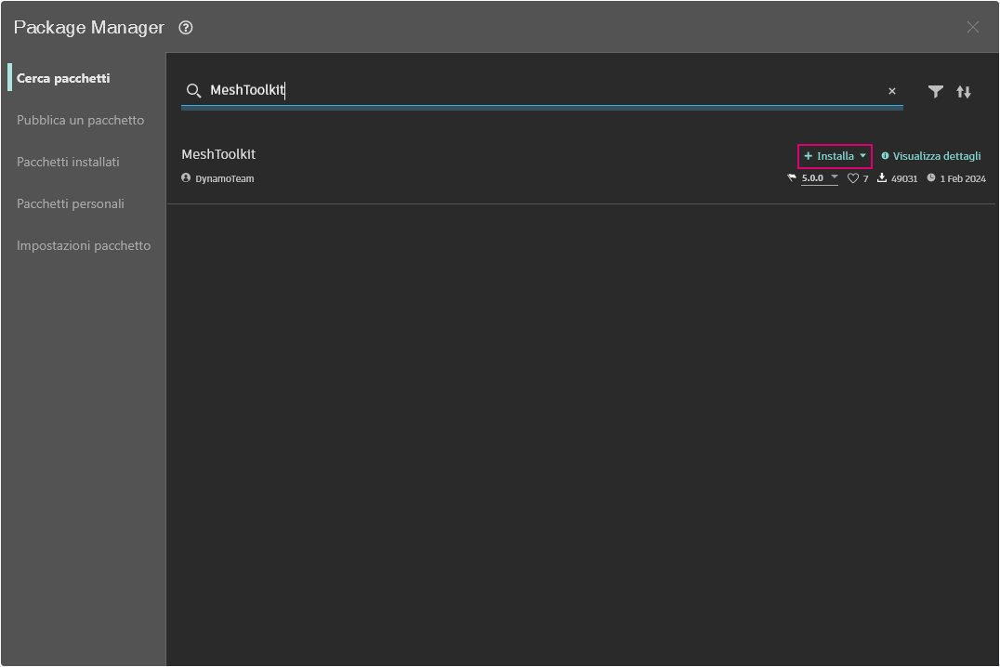

# Étude de cas de package : Mesh Toolkit

La boîte à outils de maillage Dynamo fournit des outils permettant de créer des maillages à partir d’objets de géométrie Dynamo et de construire manuellement des maillages à partir de leurs sommets et de leurs index. La bibliothèque fournit également des outils permettant de modifier et de réparer les maillages, ainsi que d’extraire des sections horizontales à utiliser lors de la fabrication. Bien que cette boîte à outils puisse également être utilisée pour importer et interroger des fichiers de maillage externes, dans cet exemple le maillage est inclus dans le script sous la forme d’un ensemble de sommets et d’index, de sorte qu’aucun fichier supplémentaire n’est nécessaire. Au lieu d’un fichier de maillage externe, le graphique fourni utilise des nœuds **Data.Remember** afin de stocker toutes les informations nécessaires pour reconstruire le célèbre maillage du lapin de Stanford.

\

Le package Dynamo Mesh Toolkit s’inscrit dans le cadre des recherches en cours d’Autodesk sur les maillages, et il continuera à évoluer au cours des prochaines années. Attendez-vous à voir apparaître fréquemment de nouvelles méthodes applicables à ce package, et n'hésitez pas à faire parvenir à l'équipe de Dynamo vos commentaires, bogues et suggestions en vue d'intégrer de nouvelles fonctionnalités.

### Maillages et solides

L'exercice ci-dessous présente certaines opérations de maillage de base à l'aide de Mesh Toolkit. Dans l’exercice, vous calculez l’intersection d’un maillage avec une série de plans, une opération qui peut s’avérer coûteuse en ressources informatiques si elle est effectuée avec des solides. Contrairement à un solide, un maillage possède une « résolution » définie et n’est pas décrit mathématiquement mais topologiquement. Cette résolution peut être définie en fonction de la tâche à accomplir. Pour plus d’informations sur les relations entre les maillages et les solides, reportez-vous au chapitre [Géométrie pour la conception informatique](../../5_essential_nodes_and_concepts/5-2_geometry-for-computational-design/) de ce guide. Pour en savoir plus sur le package Mesh Toolkit, vous pouvez consulter la page [wiki de Dynamo.](https://github.com/DynamoDS/Dynamo/wiki/Dynamo-Mesh-Toolkit) Nous allons aborder le package dans l’exercice ci-dessous.

### Installation de Mesh Toolkit

Dans Dynamo, allez dans Packages > Gestionnaire de package... dans la barre de menu supérieure. Dans le champ de recherche, tapez MeshToolkit, en un mot. Cliquez sur Installer et confirmez pour lancer le téléchargement. C’est aussi simple que ça !

<figure><figcaption></figcaption></figure>

## Exercice : Entrecouper le maillage

> Téléchargez le fichier d’exemple en cliquant sur le lien ci-dessous.
>
> Vous trouverez la liste complète des fichiers d’exemple dans l’annexe.



Dans cet exemple, vous allez examiner le nœud Intersect dans Mesh Toolkit. Vous allez générer un maillage à partir des sommets stockés et l’intersecter avec une série de plans d’entrée pour créer des sections. Il s’agit du point de départ pour préparer le modèle pour la fabrication sur un découpeur au laser, une machine de coupe à jet d’eau ou une fraiseuse commandée par ordinateur.

Commencez par ouvrir _Mesh-Toolkit_Intersect-Mesh.dyn dans Dynamo._

\

> 1. **Data.Remember :** ces deux nœuds contiennent les sommets du maillage, stockés sous forme de points, et les index du maillage, qui sont une série d’entiers. Ensemble, ils fournissent toutes les informations nécessaires pour reconstruire le maillage.
> 2. **Mesh.ByVerticesAndIndices :** connectez les sommets et les index issus des nœuds de données pour créer le maillage.

\

> 1. **Point.ByCoordinates :** crée un point. Il s’agit du centre d’un arc.
> 2. **Arc.ByCenterPointRadiusAngle :** crée un arc autour du point. Cette courbe sera utilisée pour positionner une série de plans. __ Les paramètres sont les suivants : __ `radius: 40, startAngle: -90, endAngle:0`

Créez une série de plans orientés le long de l’arc.

\

> 1. **Code Block** : créez 25 nombres compris entre 0 et 1.
> 2. **Curve.PointAtParameter :** connectez l’arc à l’entrée _« curve »_ et le bloc de code de sortie à l’entrée _« param »_ pour extraire une série de points le long de la courbe.
> 3. **Curve.TangentAtParameter :** connectez les mêmes entrées que le nœud précédent.
> 4. **Plan.ByOriginNormal :** connectez les points à l’entrée _« origin »_ et les vecteurs à l’entrée _« normal »_ pour créer une série de plans à chaque point.

Vous allez ensuite utiliser ces plans pour entrecouper le maillage.

\

> 1. **Mesh.Intersect :** intersectez les plans avec le maillage généré, ce qui crée une série de contours de polycourbes. Cliquez avec le bouton droit de la souris sur Nœud et définissez la combinaison sur la plus longue
> 2. **PolyCurve.Curves :** divisez les polycourbes en fragments de courbe.
> 3. **Curve.EndPoint :** extrayez les points de fin de chaque courbe.
> 4. **NurbsCurve.ByPoints :** utilisez les points pour construire une courbe Nurbs. Utilisez un nœud booléen défini sur _Vrai (True)_ pour fermer les courbes.

Avant de continuer, désactivez l’aperçu de certains nœuds, tels que Mesh.ByVerticesAndIndices, Curve.EndPoint, Plane.ByOriginNormal et Arc.ByCenterPointRadiusAngle, pour mieux voir le résultat.

\

> 1. **Surface.ByPatch :** créez des corrections de surface pour chaque contour afin de créer des « sections » du maillage.

Ajoutez un deuxième jeu de sections pour un effet gaufré/alvéolé.

\

Vous avez peut-être remarqué que les opérations d’intersection sont calculées plus rapidement avec un maillage plutôt qu’avec un solide comparable. Les workflows tels que ceux présentés dans cet exercice se prêtent bien à l'utilisation de maillages.
