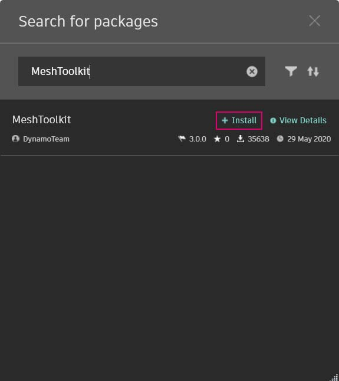

# Case study di un pacchetto - Mesh Toolkit

Dynamo Mesh Toolkit fornisce strumenti per importare mesh da formati di file esterni, creare mesh da oggetti della geometria di Dynamo e generare manualmente mesh in base ai vertici e agli indici. La libreria fornisce inoltre strumenti per modificare e correggere mesh o estrarre sezioni orizzontali da utilizzare nella fabbricazione.

.jpg>)

Dynamo Mesh Toolkit fa parte del costante programma di ricerca sulle mesh di Autodesk e, come tale, continuerà a crescere nei prossimi anni. Si prevede di aggiungere frequentemente nuovi metodi nel toolkit e pertanto gli utenti sono invitati a contattare il team di Dynamo per eventuali commenti, bug e suggerimenti per le nuove funzionalità.

### Confronto tra mesh e solidi

Nel seguente esercizio sono illustrate alcune operazioni di base sulle mesh mediante Mesh Toolkit. Nell'esercizio, si interseca una mesh con una serie di piani, il che può risultare complesso dal punto di vista computazionale se si utilizzano solidi. A differenza di un solido, una mesh presenta una risoluzione impostata e non è definita matematicamente, ma topologicamente; è possibile definire questa risoluzione in base all'attività in corso. Per ulteriori dettagli sulle relazioni tra mesh e solidi, è possibile fare riferimento al capitolo [Geometria per la progettazione computazionale](../../a-closer-look-at-dynamo-essential-nodes-and-concepts/5\_geometry-for-computational-design/) di questa guida introduttiva. Per un esame più approfondito di Mesh Toolkit, è possibile fare riferimento alla [pagina Wiki di Dynamo.](https://github.com/DynamoDS/Dynamo/wiki/Dynamo-Mesh-Toolkit) Passare al pacchetto nell'esercizio riportato di seguito.

### Installazione di Mesh Toolkit

In Dynamo, accedere a _Pacchetti > Cerca pacchetto..._ sulla barra dei menu superiore. Nel campo di ricerca, digitare _MeshToolkit_, tutta una parola, facendo attenzione alle maiuscole. Fare clic su Installa per avviare il download. È semplicissimo.

## Esercizio: Intersezione di mesh

> Scaricare il file di esempio facendo clic sul collegamento seguente.
>
> Un elenco completo di file di esempio è disponibile nell'Appendice.



In questo esempio, si esaminerà il nodo Intersect in Mesh Toolkit. Si importerà una mesh e la si intersecherà con una serie di piani di input per creare sezioni. Questo è il punto di partenza per la preparazione del modello per la fabbricazione su un taglierino laser, un taglierino a getto d'acqua o una fresa CNC.

Iniziare aprendo _Mesh-Toolkit_Intersect-Mesh.dyn in Dynamo._

> 1. **File Path:** individuare il file mesh da importare (_stanford_bunny_tri.obj_). I tipi di file supportati sono .mix e .obj.
> 2. **Mesh.ImportFile:** collegare il percorso del file per importare la mesh.

> 1. **Point.ByCoordinates:** creare un punto, che sarà il centro di un arco.
> 2. **Arc.ByCenterPointRadiusAngle:** creare un arco attorno al punto. Questa curva verrà utilizzata per posizionare una serie di piani. __ Di seguito vengono descritte le impostazioni disponibili: __ `radius: 40, startAngle: -90, endAngle:0`

Creare una serie di piani orientati lungo l'arco.

> 1. **Code Block**: consente di creare 25 numeri compresi tra 0 e 1.
> 2. **Curve.PointAtParameter:** collegare l'arco all'input _curve_ e l'output del blocco di codice all'input _param_ per estrarre una serie di punti lungo la curva.
> 3. **Curve.TangentAtParameter:** collegare gli stessi input del nodo precedente.
> 4. **Plane.ByOriginNormal:** collegare i punti all'input _origin_ e i vettori all'input _normal_ per creare una serie di piani in corrispondenza di ogni punto.

Quindi, si utilizzeranno questi piani per intersecare la mesh.

> 1. **Mesh.Intersect:** intersecare i piani con la mesh importata, creando una serie di contorni di PolyCurve. Fare clic con il pulsante destro del mouse sul nodo e impostare il collegamento sul più lungo.
> 2. **PolyCurve.Curves:** dividere le PolyCurve nei relativi frammenti di curva.
> 3. **Curve.EndPoint:** estrarre i punti finali di ogni curva.
> 4. **NurbsCurve.ByPoints:** utilizzare i punti per costruire una curva NURBS. Utilizzare un nodo booleano impostato su _True_ per chiudere le curve.

Prima di continuare, disattivare l'anteprima per alcuni nodi, ad esempio: Mesh.ImportFile, Curve.EndPoint, Plane.ByOriginNormal e Arc.ByCenterPointRadiusAngle per vedere meglio il risultato.

> 1. **Surface.ByPatch:** costruire superfici chiuse per ogni contorno per creare sezioni della mesh.

Aggiungere un secondo insieme di sezioni per un effetto di waffle/cassa delle uova.

Si potrebbe notare che le operazioni di intersezione vengono calcolate più rapidamente con una mesh rispetto ad un solido confrontabile. I workflow, come quello illustrato in questo esercizio, si prestano anche all'utilizzo delle mesh.
