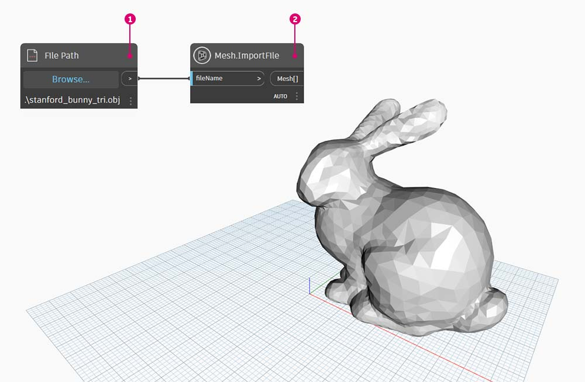

# Étude de cas de package – Mesh Toolkit

Le package Dynamo Mesh Toolkit fournit des outils permettant d'importer des maillages à partir de formats de fichiers externes, de créer un maillage à partir d'objets de géométrie Dynamo et de créer manuellement des maillages à partir de leurs sommets et index. La bibliothèque fournit également des outils permettant de modifier et de réparer les maillages, ainsi que d’extraire des sections horizontales à utiliser lors de la fabrication.

\.jpg>)

Le package Dynamo Mesh Toolkit s’inscrit dans le cadre des recherches en cours d’Autodesk sur les maillages, et il continuera à évoluer au cours des prochaines années. Attendez-vous à voir apparaître fréquemment de nouvelles méthodes applicables à ce package, et n'hésitez pas à faire parvenir à l'équipe de Dynamo vos commentaires, bogues et suggestions en vue d'intégrer de nouvelles fonctionnalités.

### Maillages et solides

L'exercice ci-dessous présente certaines opérations de maillage de base à l'aide de Mesh Toolkit. Dans l'exercice, nous allons entrecouper un maillage avec une série de plans, une opération qui peut s'avérer coûteuse en ressources informatiques si elle est effectuée avec des solides. Contrairement à un solide, un maillage a une « résolution » établie et n’est pas défini sur un plan mathématique, mais topologique. Cette résolution peut être définie sur la base de la tâche en cours. Pour plus d’informations sur les relations entre les maillages et les solides, reportez-vous au chapitre [Géométrie pour la conception informatique](../../a-closer-look-at-dynamo-essential-nodes-and-concepts/5\_geometry-for-computational-design/) de ce guide. Pour en savoir plus sur le package Mesh Toolkit, vous pouvez consulter la page [wiki de Dynamo.](https://github.com/DynamoDS/Dynamo/wiki/Dynamo-Mesh-Toolkit) Nous allons aborder le package dans l’exercice ci-dessous.

### Installation de Mesh Toolkit

Dans Dynamo, accédez à _Packages > Rechercher un package…_ dans la barre de menus supérieure. Dans le champ de recherche, tapez _« MeshToolkit »_ en un mot, en gardant les majuscules. Cliquez sur Installer pour lancer le téléchargement. C’est aussi simple que ça !

## Exercice : Entrecouper le maillage

> Téléchargez le fichier d’exemple en cliquant sur le lien ci-dessous.
>
> Vous trouverez la liste complète des fichiers d'exemple dans l'annexe.



Dans cet exemple, nous allons examiner le nœud Intersect dans Mesh Toolkit. Nous allons importer un maillage et l'entrecouper avec une série de plans d'entrée pour créer des sections. Il s’agit du point de départ pour préparer le modèle pour la fabrication sur un découpeur au laser, une machine de coupe à jet d’eau ou une fraiseuse commandée par ordinateur.

Commencez par ouvrir _Mesh-Toolkit_Intersect-Mesh.dyn dans Dynamo._

> 1. **Chemin d’accès au fichier :** recherchez le fichier de maillage à importer (_stanford_bunny_tri.obj_). Les types de fichiers pris en charge sont .mix et .obj.
> 2. **Mesh.ImportFile :** associez le chemin d’accès au fichier pour importer le maillage.

> 1. **Point.ByCoordinates :** crée un point. Il s’agit du centre d’un arc.
> 2. **Arc.ByCenterPointRadiusAngle :** crée un arc autour du point. Cette courbe sera utilisée pour positionner une série de plans. __ Les paramètres sont les suivants : __ `radius: 40, startAngle: -90, endAngle:0`

Créez une série de plans orientés le long de l’arc.

> 1. **Code Block** : créez 25 nombres compris entre 0 et 1.
> 2. **Curve.PointAtParameter :** connectez l’arc à l’entrée _« curve »_ et le bloc de code de sortie à l’entrée _« param »_ pour extraire une série de points le long de la courbe.
> 3. **Curve.TangentAtParameter :** connectez les mêmes entrées que le nœud précédent.
> 4. **Plan.ByOriginNormal :** connectez les points à l’entrée _« origin »_ et les vecteurs à l’entrée _« normal »_ pour créer une série de plans à chaque point.

Vous allez ensuite utiliser ces plans pour entrecouper le maillage.

> 1. **Mesh.Intersect :** entrecoupez les plans avec le maillage importé, ce qui crée une série de contours de polycourbe. Cliquez avec le bouton droit de la souris sur Nœud et définissez la liaison sur la plus longue.
> 2. **PolyCurve.Curves :** divisez les polycourbes en fragments de courbe.
> 3. **Curve.EndPoint :** extrayez les points de fin de chaque courbe.
> 4. **NurbsCurve.ByPoints :** utilisez les points pour construire une courbe Nurbs. Utilisez un nœud booléen défini sur _Vrai (True)_ pour fermer les courbes.

Avant de continuer, désactivez l’aperçu de certains nœuds, tels que Mesh.ImportFile, Curve.EndPoint, Plane.ByOriginNormal et Arc.ByCenterPointRadiusAngle, pour mieux voir le résultat.

> 1. **Surface.ByPatch :** créez des corrections de surface pour chaque contour afin de créer des « sections » du maillage.

Ajoutez un deuxième jeu de sections pour un effet gaufré/alvéolé.

Vous avez peut-être remarqué que les opérations d’intersection sont calculées plus rapidement avec un maillage plutôt qu’avec un solide comparable. Les workflows tels que ceux présentés dans cet exercice se prêtent bien à l'utilisation de maillages.
