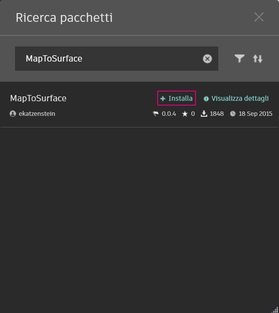
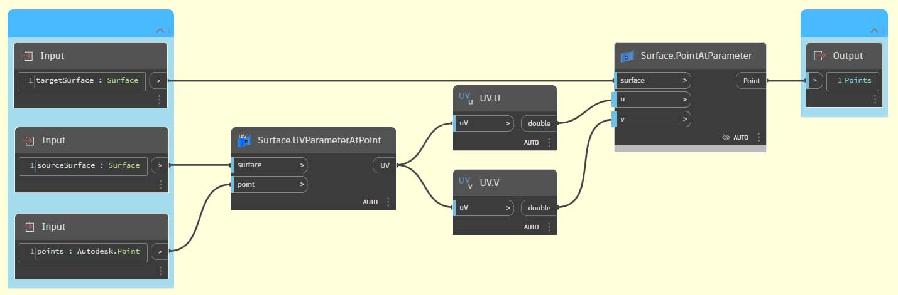
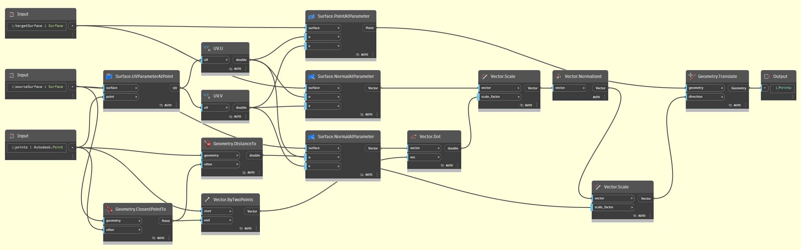
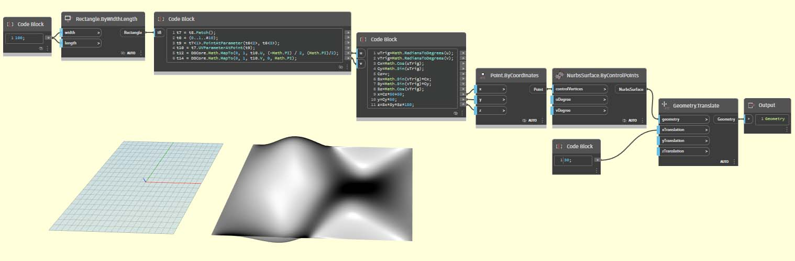
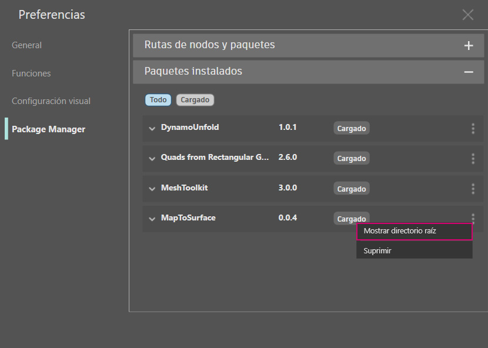
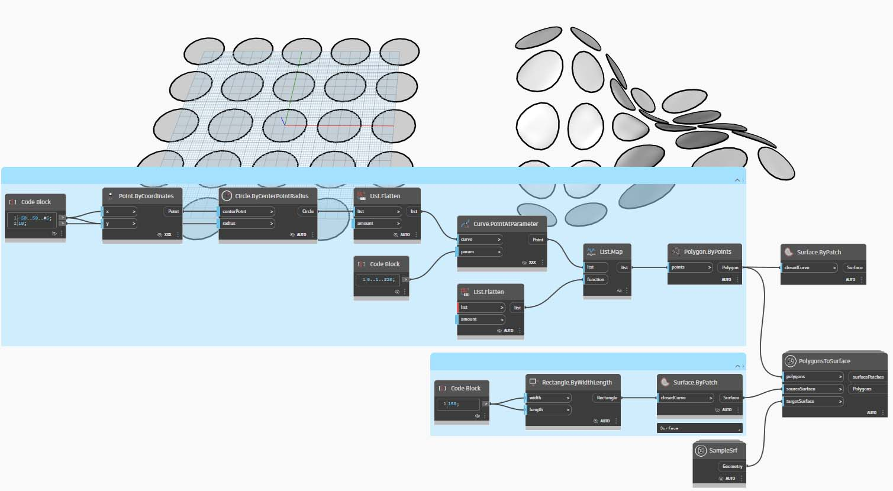
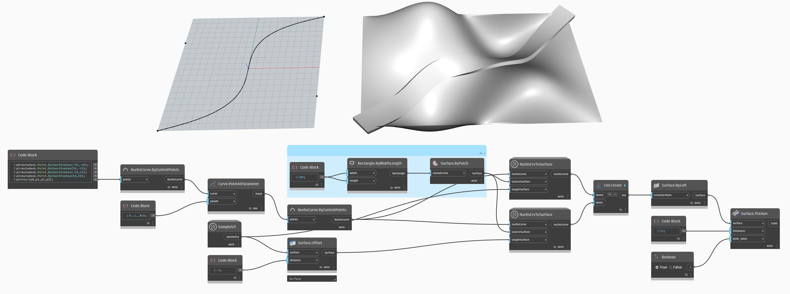
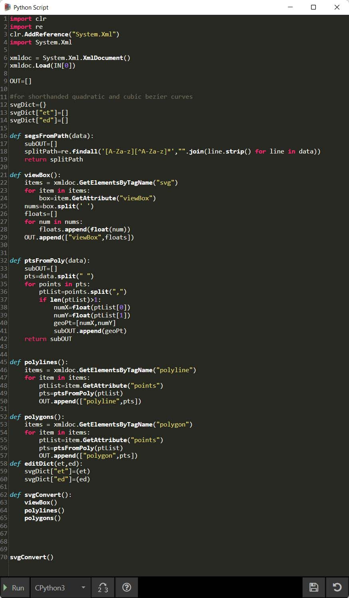

# Développement d'un package

Dynamo offre de nombreuses méthodes de création de package en vue d'un usage personnel ou d'un partage avec la communauté Dynamo. Dans l'étude de cas ci-dessous, vous allez découvrir comment un package est configuré en déconstruisant un package existant. Cette étude de cas s'appuie sur les leçons du chapitre précédent, fournissant un ensemble de nœuds personnalisés pour la géométrie de mappage, en fonction des coordonnées UV, d'une surface Dynamo à une autre.

## Package MapToSurface

Vous allez travailler avec un exemple de package qui illustre le mappage UV des points d’une surface à une autre. Vous avez déjà intégré les concepts de base de l’outil dans la section [Création d’un nœud personnalisé](../6-1\_custom-nodes/2-creating.md) de ce guide. Les fichiers ci-dessous montrent comment vous pouvez utiliser le concept du mappage UV et développer un jeu d’outils pour une bibliothèque publiable.

Dans cette image, un point d'une surface est mappé sur une autre surface à l'aide des coordonnées UV. Le package est fondé sur ce concept, mais avec une géométrie plus complexe.

### Installation du package

Dans le chapitre précédent, vous avez étudié les méthodes de contruction de panneaux sur une surface dans Dynamo en fonction des courbes définies dans le plan XY. Cette étude de cas étend ces concepts pour davantage de cotes de géométrie. Vous allez installer ce package tel qu'il a été conçu pour montrer comment il a été développé. Dans la section suivante, vous allez découvrir comment ce package a été publié.

Dans Dynamo, cliquez sur _Packages>Rechercher un package… et recherchez le package « MapToSurface » (en un mot). Cliquez sur Installer pour lancer le téléchargement et ajouter le package à votre bibliothèque.

Une fois l’installation terminée, les nœuds personnalisés sont disponibles sous la section Compléments > Guide Dynamo.

 (2) (2).jpg>)

Une fois le package installé, voyons comment il est configuré.

### Nœuds personnalisés

Le package créé utilise cinq nœuds personnalisés créés pour référence. Vous découvrirez ci-dessous le fonctionnement de chaque nœud. Certains nœuds personnalisés sont créés à partir d'autres nœuds personnalisés, et la disposition des graphiques permet aux autres utilisateurs de comprendre rapidement.

Il s'agit d'un package simple de cinq nœuds personnalisés. Les étapes ci-dessous présentent brièvement la configuration de chaque nœud personnalisé.

 (1) (1).jpg>)

#### **PointsToSurface**

Il s’agit d’un nœud personnalisé de base, sur lequel tous les autres nœuds de mappage reposent. Autrement dit, le nœud mappe un point à partir d'une coordonnée UV de la surface source vers l'emplacement de la coordonnée UV de la surface cible. Étant donné que les points constituent la géométrie la plus basique à partir de laquelle une géométrie plus complexe est créée, vous pouvez utiliser cette logique pour mapper une géométrie 2D, voire 3D, d’une surface à une autre.

#### **PolygonsToSurface**

La logique d’extension des points mappés de la géométrie 1D à la géométrie 2D est simplement présentée ici avec des polygones. Le nœud _« PointsToSurface »_ est imbriqué dans ce nœud personnalisé. De cette manière, vous pouvez mapper les points de chaque polygone sur la surface, puis régénérer le polygone à partir de ces points mappés. En conservant la structure de données appropriée (une liste de listes de points), vous pouvez conserver les polygones séparés une fois réduits à un ensemble de points.

#### **NurbsCrvtoSurface**

La même logique s’applique ici, ainsi que dans le nœud _« PolygonsToSurface »_. Au lieu de mapper des points polygonaux, vous allez mapper les points de contrôle d’une courbe NURBS.

**OffsetPointsToSurface**

Ce nœud devient un peu plus complexe, mais le concept est simple. Comme le nœud _« PointsToSurface »_, ce nœud mappe des points d’une surface à une autre. Toutefois, il prend également en compte les points qui ne sont pas sur la surface source d’origine, extrait leur distance par rapport au paramètre UV le plus proche et mappe cette distance par rapport à la normale de surface cible au niveau des coordonnées UV correspondantes. Regardez les fichiers d’exemple pour comprendre.

#### **SampleSrf**

Il s’agit d’un nœud simple qui crée une surface paramétrique à mapper de la grille source à une surface ondulée dans les fichiers d’exemple.

### Fichiers d’exemple

Les fichiers d’exemple se trouvent dans le dossier racine du package. Cliquez sur Dynamo > Préférences > Package Manager

En regard de MapToSurface, cliquez sur le menu des trois points verticaux > Afficher le répertoire racine.

Ensuite, ouvrez le dossier _« extra »_, qui contient tous les fichiers du package qui ne sont pas des nœuds personnalisés. C’est là que sont stockés les fichiers d’exemple (s’ils existent) des packages Dynamo. Les captures d’écran ci-dessous décrivent les concepts présentés dans chaque fichier d’exemple.

#### **01-PanelingWithPolygons**

Ce fichier d’exemple montre comment vous pouvez utiliser _« PointsToSurface »_ pour créer des panneaux sur une surface en fonction d’une grille de rectangles. Ce processus vous paraît sûrement familier, car un workflow similaire est présenté dans le [chapitre précédent](../6-1\_custom-nodes/2-creating.md).

#### **02-PanelingWithPolygons-II**

À l’aide d’un workflow similaire, ce fichier d’exercice présente une configuration permettant de mapper des cercles (ou des polygones représentant des cercles) d’une surface à une autre. Cette option utilise le nœud _PolygonsToSurface_.

#### **03-NurbsCrvsAndSurface**

Ce fichier d’exemple ajoute de la complexité en exploitant le nœud « NurbsCrvToSurface ». La surface cible est décalée d'une distance donnée, et la courbe NURBS est mappée sur la surface cible d'origine et la surface décalée. À partir de là, les deux courbes mappées sont lissées pour créer une surface, qui est ensuite épaissie. Le solide qui en résulte comporte une ondulation représentative des normales de la surface cible.

#### **04-PleatedPolysurface-OffsetPoints**

Ce fichier d’exemple montre comment mapper une polysurface plissée entre une surface source et une surface cible. Les surfaces source et cible sont une surface rectangulaire qui s’étend sur la grille et une surface de révolution, respectivement.

Polysurface source mappée entre la surface source et la surface cible.

#### **05-SVG-Import**

Puisque les nœuds personnalisés sont en mesure de mapper différents types de courbes, ce dernier fichier fait référence à un fichier SVG exporté à partir d’Illustrator et mappe les courbes importées avec une surface cible.

L’analyse de la syntaxe d’un fichier .svg permet de convertir les courbes au format .xml en polycourbes Dynamo.

Les courbes importées sont mappées avec une surface cible. Cela vous permet de concevoir de manière explicite (pointer-cliquer) une contruction de panneaux dans Illustrator, de l’importer dans Dynamo et de l’appliquer à une surface cible.

