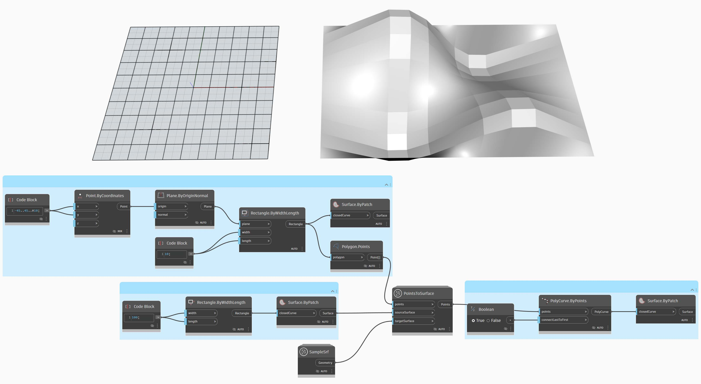

# Developing a Package

Dynamo offers a variety of ways to create a package for your personal use or for sharing with the Dynamo community. In the case study below, we'll walk through how a package is set up by deconstructing an existing one. This case study builds on lessons from the previous chapter, providing a set of custom nodes for mapping geometry, by UV coordinates, from one Dynamo surface to another.

## MapToSurface Package

We're going to work with a sample package which demonstrates the UV mapping of points from one surface to another. We've already built the fundamentals of the tool in the [Creating a Custom Node](../10\_custom-nodes/10-2\_creating.md) section of this primer. The files below demonstrate how we can take the concept of UV Mapping and develop a set of tools for a publishable library.

In this image, we map a point from one surface to another using UV coordinates. The package is based on this concept, but with more complex geometry.

### Installing the Package

In the previous chapter, we explored ways for panelizing a surface in Dynamo based on curves defined in the XY plane. This case study extends these concepts for more dimensions of geometry. We're going to install this package as built in order to demonstrate how it was developed. In the next section, we'll demonstrate how this package was published.

In Dynamo, click \_Packages>Search for a Package... and s\_earch for the package "MapToSurface" (all one word). Click Install to start the download and add the package to your library.

After installing, the custom nodes should be available under the Add-ons > Dynamo Primer section.

(1).jpg)

With the package now installed, let's walk through how it's set up.

### Custom Nodes

The package we're creating uses five custom nodes that we've built for reference. Let's walk through what each node does below. Some custom nodes build off of other custom nodes, and the graphs have a layout for other users to understand in a straightforward manner.

This is a simple package with five custom nodes. In the steps below, we'll briefly talk about each custom node's setup.

(1).jpg)

#### **PointsToSurface**

This is a basic custom node, and one from which all of the other mapping nodes are based. Simply put, the node maps a point from a source surface UV coordinate to the location of the target surface UV coordinate. And since points are the most primitive geometry, from which more complex geometry is built, we can use this logic to map 2D, and even 3D geometry from one surface to another.

#### **PolygonsToSurface**

The logic of extending mapped points from 1D geometry to 2D geometry is demonstrated simply with polygons here. Notice that we have nested the _"PointsToSurface"_ node into this custom node. This way we can map the points of each polygon to the surface, and then regenerate the polygon from those mapped points. By maintaining the proper data structure (a list of lists of points), we're able to keep the polygons separate after they're reduced to a set of points.

#### **NurbsCrvtoSurface**

The same logic applies here as in the _"PolygonsToSurface"_ node. But instead of mapping polygonal points, we're mapping control points of a nurbs curve.

**OffsetPointsToSurface**

This node gets a little more complex, but the concept is simple: like the _"PointsToSurface"_ node, this node maps points from one surface to another. However, it also considers points which are not on the original source surface, gets their distance to the closest UV parameter, and maps this distance to the target surface normal at the corresponding UV coordinate. This will make more sense when looking at the example files.

#### **SampleSrf**

This is a simple node which creates a parametric surface to map from the source grid to an undulating surface in the example files.

### Example Files

The example files can be found in the package's root folder. Click Dynamo > Preferences > Package Manager

Next to MapToSurface, click verticle dots menu > Show Root Directory

Next, open the _"extra"_ folder, which houses all of the files in the package which are not custom nodes. This is where examples files (if they exist) are stored for Dynamo packages. The screenshots below discuss the concepts demonstrated in each example file.

#### **01-PanelingWithPolygons**

This example file demonstrates how _"PointsToSurface"_ may be used to panelize a surface based on a grid of rectangles. This should look familiar, as we demonstrated a similar workflow in the [previous chapter](../10\_custom-nodes/10-2\_creating.md).

#### **02-PanelingWithPolygons-II**

Using a similar workflow, this exercise file shows a setup for mapping circles (or polygons representing circles) from one surface to another. This uses the _"PolygonsToSurface"_ node.

#### **03-NurbsCrvsAndSurface**

This example file adds some complexity by working with the "NurbsCrvToSurface" node. The target surface is offset a given distance and the nurbs curve is mapped to the original target surface and the offset surface. From there, the two mapped curves are lofted to create a surface, which is then thickened. This resulting solid has an undulation that is representative of the target surface normals.

#### **04-PleatedPolysurface-OffsetPoints**

This example file demonstrates how to map a pleated polysurface from a source surface to a target surface. The source and target surface are a rectangular surface spanning the grid and a revolved surface, respectively.

The source polysurface mapped from the source surface to the target surface.

#### **05-SVG-Import**

Since the custom nodes are able to map different types of curves, this last file references an SVG file exported from Illustrator and maps the imported curves to a target surface.

By parsing through the syntax of a .svg file, curves are translated from .xml format to Dynamo polycurves.

The imported curves are mapped to a target surface. This allows us to explicitly (point-and-click) design a panelization in Illustrator, import into Dynamo, and apply to a target surface.

