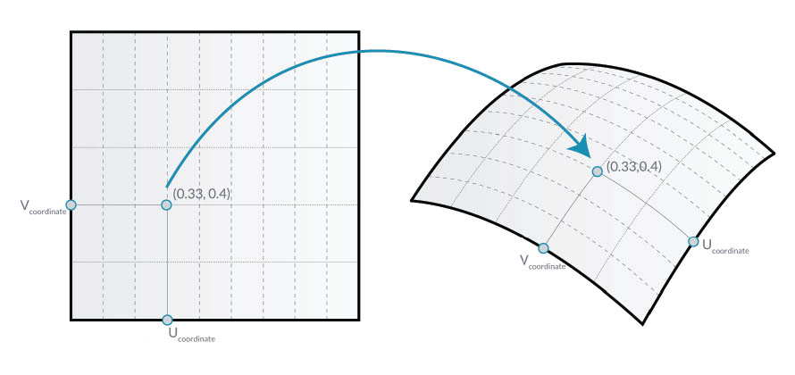
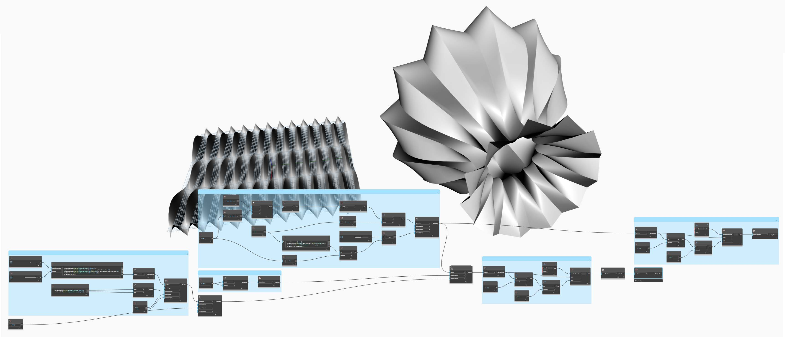

# Vývoj balíčku

Aplikace Dynamo nabízí řadu způsobů, jak vytvořit balíček pro vaše osobní použití nebo sdílení s komunitou aplikace Dynamo. V níže uvedené případové studii si rozebráním existujícího balíčku projdeme, jak je balíček vytvořen. Tato případová studie vychází ze zkušeností z předchozí kapitoly a poskytuje sadu vlastních uzlů pro mapování geometrie podle souřadnic UV, z jednoho povrchu aplikace Dynamo do jiného.

## Balíček MapToSurface

Budeme pracovat se vzorovým balíčkem, který demonstruje mapování UV bodů z jednoho povrchu do druhého. Základy nástroje jsme již vytvořili v části [Vytvoření vlastního uzlu](../6-1\_custom-nodes/2-creating.md) tohoto cvičení. Níže uvedené soubory ukazují, jak můžeme využít koncepci mapování UV a vytvořit sadu nástrojů pro publikovatelnou knihovnu.

Na tomto obrázku namapujeme bod z jednoho povrchu na jiný pomocí souřadnic UV. Balíček je založen na tomto konceptu, ale se složitější geometrií.

### Instalace balíčku

V předchozí kapitole jsme prozkoumali způsoby panelizace povrchu v aplikaci Dynamo podle křivek definovaných v rovině XY. Tato případová studie tyto koncepty rozšiřuje o další kóty geometrie. Tento balíček nainstalujeme, tak jak byl vytvořen, abychom ukázali, jak byl vyvinut. V další části ukážeme, jak byl tento balíček publikován.

V aplikaci Dynamo klikněte na nabídku Balíčky > Vyhledat balíček a vyhledejte balíček „MapToSurface“ (jedno slovo). Kliknutím na tlačítko Instalovat zahájíte stahování a přidáte balíček do své knihovny.

Po instalaci by měly být vlastní uzly dostupné v části Doplňky > Dynamo Primer.

 (2) (2).jpg>)

S instalovaným balíčkem projdeme to, jak ho nastavit.

### Uživatelské uzly

Balíček, který vytváříme, používá pět uživatelských uzlů, které jsme vytvořili pro referenci. Projdeme si, co každý uzel dělá níže. Některé vlastní uzly jsou sestaveny z jiných uživatelských uzlů a grafy mají rozvržení, které je pro ostatní uživatele snadno pochopitelné.

Toto je jednoduchý balíček s pěti vlastními uzly. V níže uvedených krocích si stručně promluvíme o nastavení jednotlivých vlastních uzlů.

 (1) (1).jpg>)

#### **PointsToSurface**

Toto je základní vlastní uzel, ze kterého vychází všechny ostatní uzly mapování. Jednoduše řečeno, uzel mapuje bod ze zdrojového povrchu souřadnice UV do umístění souřadnic cílového povrchu UV. Protože jsou body nejprimitivnější geometrií, ze které je vytvořena složitější geometrie, můžeme tuto logiku použít k mapování 2D a dokonce 3D geometrie z jednoho povrchu do druhého.

#### **PolygonsToSurface**

Logika rozšíření mapovaných bodů z 1D geometrie na 2D geometrii je zde jednoduše znázorněna pomocí polygonů. Všimněte si, že jsme do tohoto vlastního uzlu vnořili uzel _PointsToSurface_. Tímto způsobem lze namapovat body každého polygonu na povrch a poté polygon z těchto namapovaných bodů znovu vygenerovat. Zachováním správné datové struktury (seznam seznamů bodů) můžeme polygony ponechat oddělené, poté co jsou redukovány na sadu bodů.

#### **NurbsCrvtoSurface**

Používá se zde stejná logika jako v uzlu _PolygonToSurface_. Místo mapování polygonálních bodů však mapujeme řídicí body křivky nurbs.

**OffsetPointsToSurface**

Tento uzel je trochu složitější, ale koncept je jednoduchý: Podobně jako uzel _PointsToSurface_ tento uzel mapuje body z jednoho povrchu na druhý. Bere však v úvahu také body, které nejsou na původním zdrojovém povrchu, jejich vzdálenost k nejbližšímu parametru UV a mapuje tuto vzdálenost na normálu cílového povrchu v odpovídající souřadnici UV. To dává větší smysl při prohlížení vzorových souborů.

#### **SampleSrf**

Toto je jednoduchý uzel, který vytvoří parametrický povrch k mapování ze zdrojové osnovy na vlnitý povrch v souborech příkladů.

### Vzorové soubory

Vzorové soubory naleznete v kořenové složce balíčku. Klikněte na nabídku Dynamo > Předvolby > Package Manager.

Vedle položky MapToSurface klikněte na nabídku se svislými tečkami > Zobrazit kořenový adresář.

Nyní otevřete složku _extra_, která obsahuje všechny soubory v balíčku, které nejsou vlastními uzly. Zde jsou uloženy vzorové soubory (pokud existují) pro balíčky aplikace Dynamo. Níže uvedené snímky obrazovky popisují koncepty demonstrované v jednotlivých vzorových souborech.

#### **01-PanelingWithPolygons**

Tento vzorový soubor ukazuje, jak lze pomocí uzlu _PointsToSurface_ panelizovat povrch na základě osnovy obdélníků. Mělo by vám to připadat povědomé, protože jsme viděli podobný pracovní postup v [předchozí kapitole](../6-1\_custom-nodes/2-creating.md).

#### **02-PanelingWithPolygons-II**

Pomocí podobného pracovního postupu se v tomto souboru cvičení zobrazí nastavení pro mapování kružnic (nebo polygonů reprezentujících kružnice) z jednoho povrchu na druhý. Používá se uzel _PolygonsToSurface_.

#### **03-NurbsCrvsAndSurface**

Tento vzorový soubor přidává určitou složitost při práci s uzlem NurbsCrvToSurface. Cílový povrch je odsazen o danou vzdálenost a křivka nurbs je mapována na původní cílový povrch a odsazený povrch. Od této chvíle jsou obě mapované křivky šablonovány, aby vytvořily povrch, který bude poté zesílen. Výsledné těleso má zaoblení, které je reprezentativní pro normály cílového povrchu.

#### **04-PleatedPolysurface-OffsetPoints**

Tento vzorový soubor ukazuje, jak mapovat skládaný objekt polysurface ze zdrojového povrchu na cílový povrch. Zdrojový a cílový povrch je pravoúhlý povrch pokrývající rastr a orotovaný povrch.

Zdrojový objekt polysurface mapovaný ze zdrojového povrchu na cílový povrch.

#### **05-SVG-Import**

Protože vlastní uzly mohou mapovat různé typy křivek, odkazuje tento poslední soubor na soubor SVG exportovaný z aplikace Illustrator a mapuje importované křivky na cílový povrch.

Analýzou syntaxe souboru .svg se oblouky převedou z formátu .xml na objekty polycurve aplikace Dynamo.

Importované křivky jsou mapovány na cílový povrch. To nám umožňuje přímo navrhnout panelizaci (klikáním) v aplikaci Illustrator, importovat do aplikace Dynamo a použít na cílový povrch.

