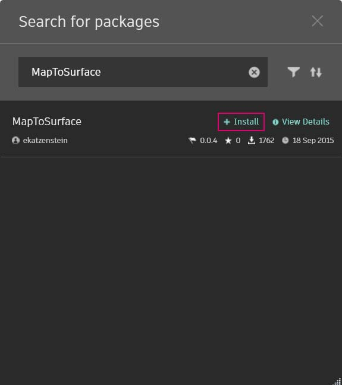

# Opracowywanie pakietu

Dodatek Dynamo udostępnia różne sposoby tworzenia pakietu do użytku osobistego lub do udostępnienia społeczności dodatku Dynamo. W poniższej analizie przypadku omówimy sposób konfigurowania pakietu przez dekonstrukcję istniejącego. Ta analiza przypadku opiera się na lekcjach z poprzedniego rozdziału — z udostępnieniem zestawu węzłów niestandardowych do odwzorowania geometrii, za pomocą współrzędnych UV, z jednej powierzchni Dynamo na inną.

## Pakiet MapToSurface

Będziemy pracować z przykładowym pakietem demonstrującym odwzorowywanie punktów UV z jednej powierzchni na inną. W sekcji [Tworzenie węzła niestandardowego](../10\_custom-nodes/10-2\_creating.md) tego podręcznika utworzyliśmy już podstawy narzędzia. W poniższych plikach przedstawiono, w jaki sposób można wykorzystać koncepcję odwzorowywania UV i opracować zestaw narzędzi dla publikowalnej biblioteki.

Na tej ilustracji odwzorowujemy punkt z jednej powierzchni na drugą za pomocą współrzędnych UV. Pakiet jest oparty na tej koncepcji, ale z bardziej złożoną geometrią.

### Instalowanie pakietu

W poprzednim rozdziale omówiliśmy sposoby panelowania powierzchni w dodatku Dynamo na podstawie krzywych zdefiniowanych na płaszczyźnie XY. W tej analizie przypadku rozszerzono zakres tych pojęć o więcej wymiarów geometrii. Zainstalujemy ten pakiet jako wbudowany, aby zademonstrować, w jaki sposób został on opracowany. W następnej sekcji pokażemy, jak ten pakiet opublikowano.

W dodatku Dynamo kliknij opcje _Pakiety>Wyszukaj pakiet... i wy_szukaj pakiet „MapToSurface” (jest to jeden wyraz). Kliknij przycisk Zainstaluj, aby rozpocząć pobieranie i dodać pakiet do biblioteki.

Po zainstalowaniu węzły niestandardowe powinny być dostępne w sekcji Dodatki > Przewodnik Dynamo Primer.

(1).jpg)

Po zainstalowaniu pakietu przeanalizujmy jego konfigurację.

### Węzły niestandardowe

Tworzony pakiet zawiera pięć węzłów niestandardowych utworzonych na potrzeby odniesienia. Poniżej przeanalizujemy funkcjonowanie poszczególnych węzłów. Niektóre węzły niestandardowe utworzone na podstawie innych węzłów niestandardowych oraz wykresy mają układ łatwo zrozumiały dla innych użytkowników.

To jest prosty pakiet z pięcioma węzłami niestandardowymi. W poniższych krokach omówiono krótko konfigurację każdego węzła niestandardowego.

(1).jpg)

#### **PointsToSurface**

Jest to podstawowy węzeł niestandardowy, na którym oparto wszystkie pozostałe węzły odwzorowania. Mówiąc prościej: węzeł odwzorowuje punkt ze współrzędnej UV powierzchni źródłowej na położenie współrzędnej UV powierzchni docelowej. Ponieważ punkty są najbardziej elementarną geometrią, z której zbudowana jest bardziej złożona geometria, za pomocą tej logiki można odwzorować geometrię 2D — a nawet geometrię 3D — z jednej powierzchni na inną.

#### **PolygonsToSurface**

Logika wydłużania odwzorowanych punktów z geometrii 1D do geometrii 2D została prosto przedstawiona tutaj za pomocą wieloboków. Należy zwrócić uwagę, że zagnieździliśmy węzeł _„PointsToSurface”_ w tym węźle niestandardowym. W ten sposób można odwzorować punkty każdego wieloboku na powierzchnię, a następnie ponownie wygenerować wielobok z tych odwzorowanych punktów. Zachowując właściwą strukturę danych (listę list punktów), możemy zachować osobne wieloboki po zredukowaniu ich do zbioru punktów.

#### **NurbsCrvtoSurface**

Tutaj ma zastosowanie ta sama logika co w węźle _„PolygonsToSurface”_. Jednak zamiast odwzorowywać punkty wieloboków, odwzorowujemy punkty kontrolne krzywej nurbs.

**OffsetPointsToSurface**

Ten węzeł staje się nieco bardziej złożony, ale koncepcja jest prosta: podobnie jak węzeł _„PointsToSurface”_ węzeł ten odwzorowuje punkty z jednej powierzchni na inną. Jednak uwzględnia również punkty, które nie znajdują się na oryginalnej powierzchni źródłowej, pobiera ich odległość do najbliższego parametru UV i odwzorowuje tę odległość na wektor normalny powierzchni docelowej w odpowiedniej współrzędnej UV. Będzie to bardziej zrozumiałe podczas analizowania plików przykładowych.

#### **SampleSrf**

Jest to prosty węzeł, który tworzy powierzchnię parametryczną do odwzorowania z siatki źródłowej na powierzchnię falistą w plikach przykładowych.

### Pliki przykładowe

Pliki przykładowe można znaleźć w folderze głównym pakietu. Kliknij opcje Dynamo > Preferencje > Menedżer pakietów

Obok pozycji MapToSurface kliknij menu w postaci pionowych kropek > Pokaż katalog główny

Następnie otwórz folder _„extra”_ zawierający wszystkie pliki w pakiecie, które nie są węzłami niestandardowymi. W tym miejscu przechowywane są pliki przykładowe (jeśli istnieją) dla pakietów Dynamo. Zrzuty ekranu poniżej ilustrują koncepcje przedstawione w poszczególnych plikach przykładowych.

#### **01-PanelingWithPolygons**

Za pomocą tego pliku przykładowego przedstawiono, jak można wykorzystać węzeł _„PointsToSurface”_ do panelowania powierzchni w oparciu o siatkę prostokątów. Powinno to wyglądać znajomo, ponieważ podobny proces roboczy został przedstawiony w [poprzednim rozdziale](../10\_custom-nodes/10-2\_creating.md).

#### **02-PanelingWithPolygons-II**

Za pomocą podobnego procesu roboczego w tym pliku ćwiczeniowym przedstawiono konfigurację odwzorowywania okręgów (lub wieloboków reprezentujących okręgi) między powierzchniami. Wykorzystywany jest węzeł _„PolygonsToSurface”_.

#### **03-NurbsCrvsAndSurface**

Ten plik przykładowy zwiększa złożoność dzięki współdziałaniu z węzłem „NurbsCrvToSurface”. Powierzchnia docelowa jest odsunięta o daną odległość, a krzywa nurbs jest odwzorowana na oryginalną powierzchnię docelową i powierzchnię odsunięcia. Z tego miejsca dwie odwzorowane krzywe są wyciągane w celu utworzenia powierzchni, która następnie zostaje pogrubiona. Ta wynikowa bryła ma pofalowanie, które jest reprezentacją wektorów normalnych powierzchni docelowej.

#### **04-PleatedPolysurface-OffsetPoints**

W tym pliku przykładowym przedstawiono sposób odwzorowania powierzchni PolySurface z zakładką z powierzchni źródłowej na powierzchnię docelową. Powierzchnie źródłowa i docelowa są prostokątną powierzchnią łączącą odpowiednio siatkę i powierzchnię obrotową.

Powierzchnia PolySurface odwzorowana z powierzchni źródłowej na powierzchnię docelową.

#### **05-SVG-Import**

Ponieważ węzły niestandardowe mogą odwzorowywać różne typy krzywych, ten ostatni plik odnosi się do pliku SVG wyeksportowanego z programu Illustrator i odwzorowuje zaimportowane krzywe na powierzchnię docelową.

Przez przeanalizowanie składni pliku .svg krzywe są przekształcane z formatu .xml na krzywe PolyCurve dodatku Dynamo.

Zaimportowane krzywe są odwzorowane na powierzchnię docelową. Dzięki temu można jawnie (punkt-i-kliknięcie) projektować panelowanie w programie Illustrator, importować je do dodatku Dynamo i stosować do powierzchni docelowej.

