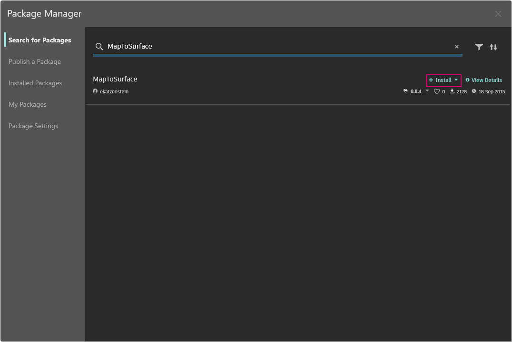
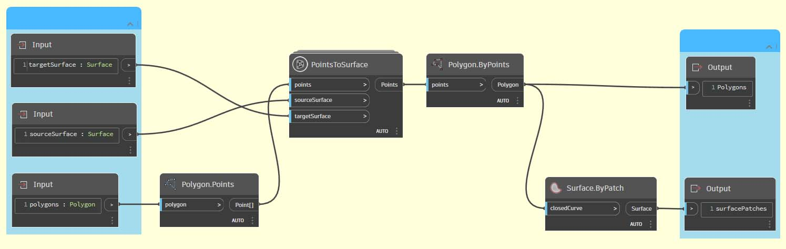

# Разработка пакетов

Dynamo поддерживает различные способы создания пакетов как с целью личного использования, так и для обмена с участниками сообщества Dynamo. Ниже рассматривается структура пакетов на примере разбора содержимого существующего пакета. Данный пример основан на упражнениях предыдущей главы, где был создан набор пользовательских узлов для сопоставления геометрии одной поверхности Dynamo с другой с помощью UV-координат.

## Пакет MapToSurface

Для иллюстрации воспользуемся примером пакета для UV-наложения точек с одной поверхности на другую. Основные возможности инструмента были рассмотрены в разделе [Создание пользовательских узлов](../6-1\_custom-nodes/2-creating.md) данного руководства. Приведенные ниже файлы показывают, как можно применить принцип UV-наложения к разработке набора инструментов для библиотеки с возможностью публикации.

На данном изображении точка одной поверхности сопоставляется с точкой другой поверхности с помощью UV-координат. Эта же концепция лежит в основе работы данного пакета, однако он рассчитан на более сложную геометрию.

### Установка пакета

В предыдущей главе рассматривались способы создания панелей поверхности в Dynamo на основе кривых, заданных в плоскости XY. В этой главе те же принципы рассматриваются более подробно, охватывая другие размеры и геометрические объекты. Чтобы показать, каким образом осуществлялась разработка пакета, он будет установлен в исходном состоянии. В следующем разделе будет рассматриваться публикация этого пакета.

В Dynamo выберите «Пакеты» > «Package Manager» и найдите пакет MapToSurface (одним словом,без пробелов). Нажмите кнопку «Установить», чтобы скачать и добавить пакет в библиотеку.

<figure><figcaption></figcaption></figure>

После установки пользовательские узлы должны быть доступны в разделе «Надстройки» > DynamoPrimer.

\ (2) (2).jpg>)

Теперь рассмотрим структуру пакета.

### Пользовательские узлы

В разрабатываемом пакете есть пять пользовательских узлов, которые были созданы в качестве базовых. Ниже рассмотрим назначение каждого узла. Некоторые пользовательские узлы строятся на основе других пользовательских узлов, а графики имеют структуру, позволяющую другим пользователям легко понять их.

Перед нами простой пакет с пятью пользовательскими узлами. Ниже кратко рассматривается структура каждого из них.

\ (1) (1).jpg>)

#### **PointsToSurface**

Это базовый пользовательский узел, на основе которого создаются все остальные узлы сопоставления. Говоря простым языком, данный узел сопоставляет точку UV-координаты исходной поверхности с местоположением UV-координаты целевой поверхности. Поскольку точки представляют собой простейшие геометрические объекты, на основе которых строится более сложная геометрия, этот принцип можно использовать для сопоставления 2D- и даже 3D-геометрии одной поверхности с другой.

#### **PolygonsToSurface**

В данном случае для демонстрации преобразования сопоставляемых точек из одномерной геометрии в двухмерную используются обычные полигоны. Обратите внимание, что в этот пользовательский узел вложен узел _PointsToSurface_. Таким образом можно сопоставить точки каждого полигона с поверхностью, а затем заново сгенерировать полигон по этим точкам. При сохранении надлежащей структуры данных (список списков точек) полигоны будут располагаться отдельно после их уменьшения до набора точек.

#### **NurbsCrvtoSurface**

Здесь работает тот же принцип, что и с узлом _PolygonsToSurface_. Однако вместо сопоставления полигональных точек сопоставляются управляющие точки NURBS-кривой.

**OffsetPointsToSurface**

Этот узел немного сложнее, но, как и узел _PointsToSurface_, сопоставляет точки одной поверхности с другой. Однако в этом случае узел учитывает точки, которые отсутствуют на исходной поверхности, вычисляет расстояние от них до ближайшего UV-параметра и сопоставляет это расстояние с нормалью целевой поверхности в соответствующей UV-координате. Это будет проще объяснить с помощью файлов примеров.

#### **SampleSrf**

Это простой узел, который позволяет создать параметрическую поверхность на основе исходной сетки для сопоставления с волнистой поверхностью в файлах примеров.

### Файлы примеров

Файлы примеров находятся в корневой папке пакета. Выберите «Package Manager» > «Установленные пакеты».

Рядом с MapToSurface нажмите значок с вертикальными точками и выберите «Показать корневую папку».

<figure><figcaption></figcaption></figure>

Затем перейдите в папку _extra_, в которой содержатся все файлы пакета, не являющиеся пользовательскими узлами. В этой папке хранятся файлы примеров (при наличии) для пакетов Dynamo. На снимках экрана ниже показаны принципы, реализованные в файлах примеров.

#### **01-PanelingWithPolygons**

В этом файле демонстрируется, как с помощью узла _PointsToSurface_ создавать панели поверхности на основе сетки из прямоугольников. Этот принцип вам, скорее всего, уже знаком, так как аналогичный рабочий процесс был представлен в [предыдущей главе](../6-1\_custom-nodes/2-creating.md).

#### **02-PanelingWithPolygons-II**

В данном файле, где используется похожий рабочий процесс, показан алгоритм сопоставления окружностей (или полигонов, представляющих окружности) одной поверхности с окружностями другой. При этом используется узел _PolygonsToSurface_.

#### **03-NurbsCrvsAndSurface**

Это более сложный файл примера, так как в нем используется узел NurbsCrvToSurface. Целевая поверхность смещена на заданное расстояние, а NURBS-кривая сопоставлена с исходной целевой поверхностью и смещенной поверхностью. К двум сопоставленным кривым применяется функция лофтинга для создания поверхности, толщина которой затем увеличивается. Полученное тело имеет неровность, соответствующую нормалям целевой поверхности.

#### **04-PleatedPolysurface-OffsetPoints**

В этом файле примера показано, как сопоставить исходную гофрированную полиповерхность с целевой поверхностью. Исходная и целевая поверхности представляют собой прямоугольную поверхность, которая проходит по сетке и поверхности вращения соответственно.

Исходная полиповерхность, сопоставленная с целевой поверхностью.

#### **05-SVG-Import**

Так как с помощью пользовательских узлов можно сопоставлять различные типы кривых, последний файл ссылается на файл SVG, экспортированный из Illustrator, и сопоставляет импортированные кривые с целевой поверхностью.

В результате синтаксического анализа файла SVG кривые преобразуются из формата XML в сложные кривые Dynamo.

Импортированные кривые сопоставляются с целевой поверхностью. Это позволяет явным образом (с помощью указателя) создавать панели поверхности в приложении Illustrator, импортировать их в Dynamo и применять к целевой поверхности.

