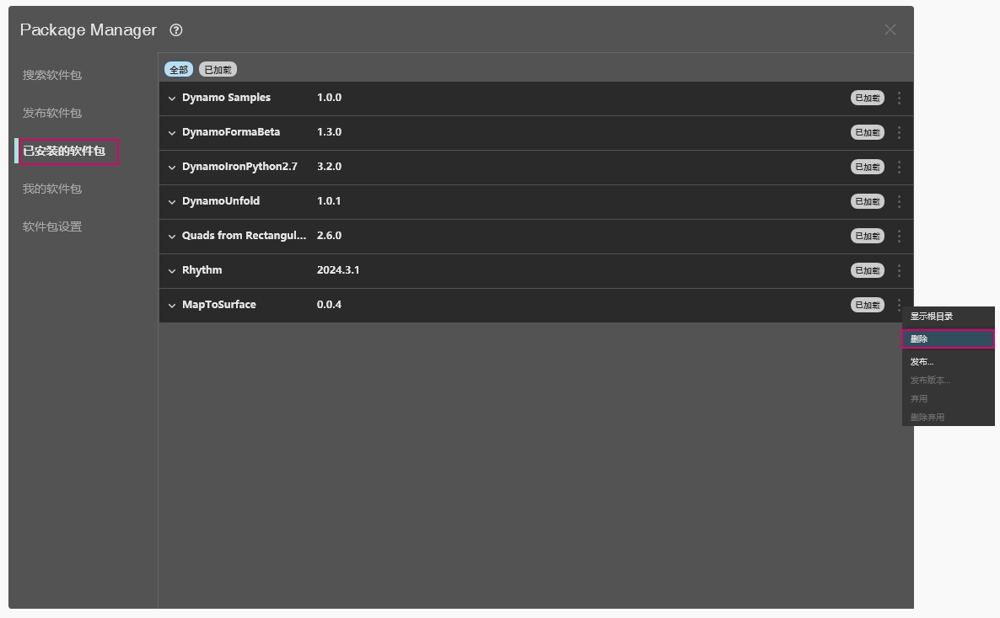
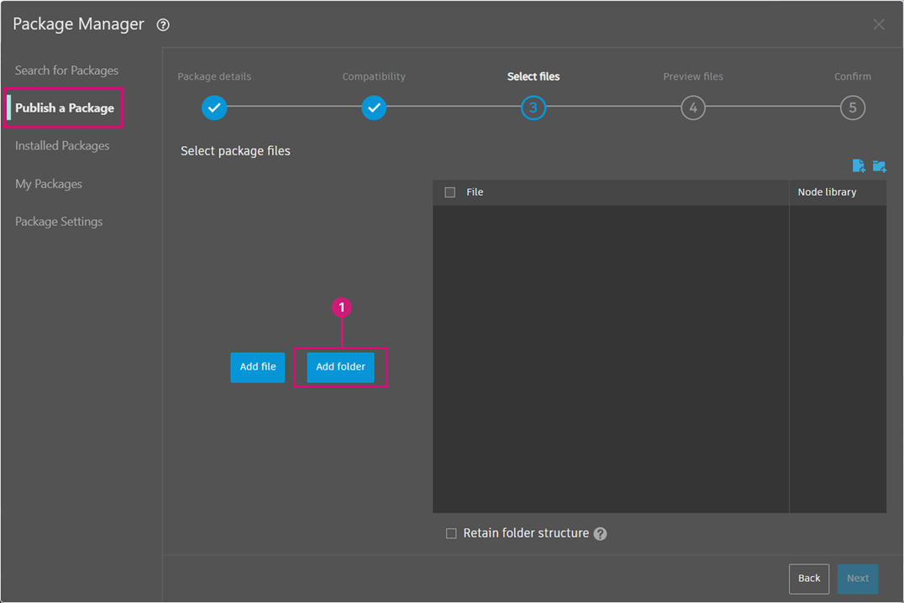
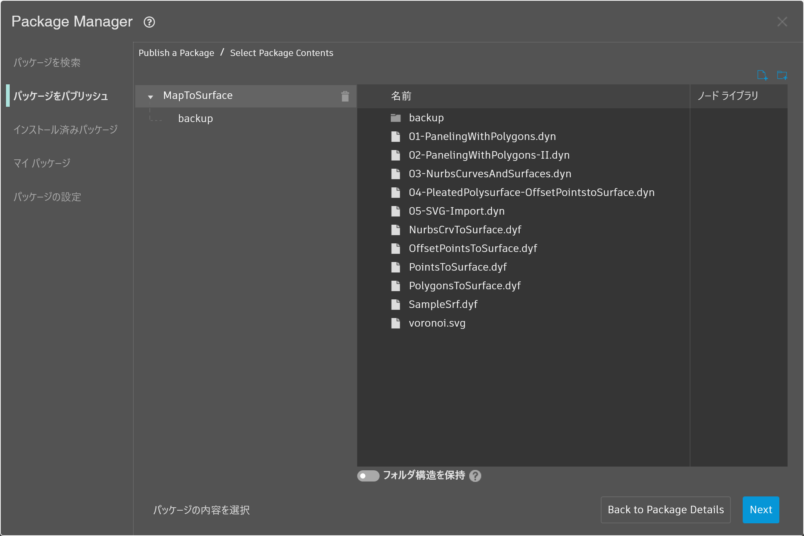
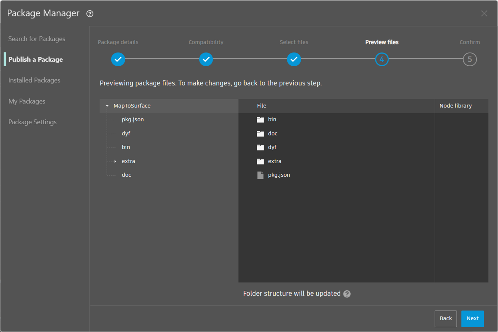
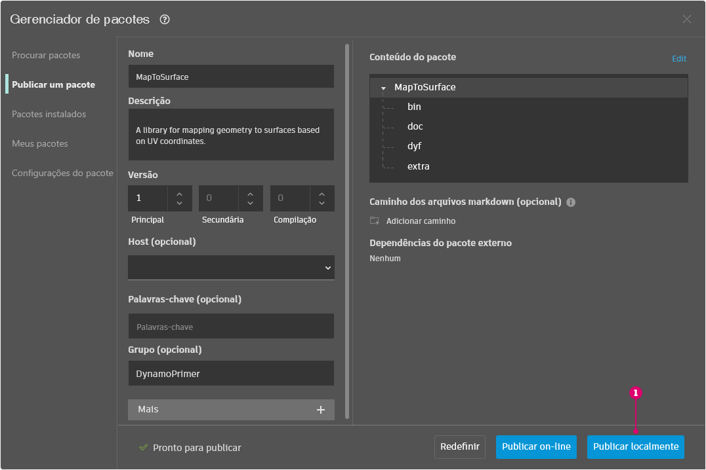
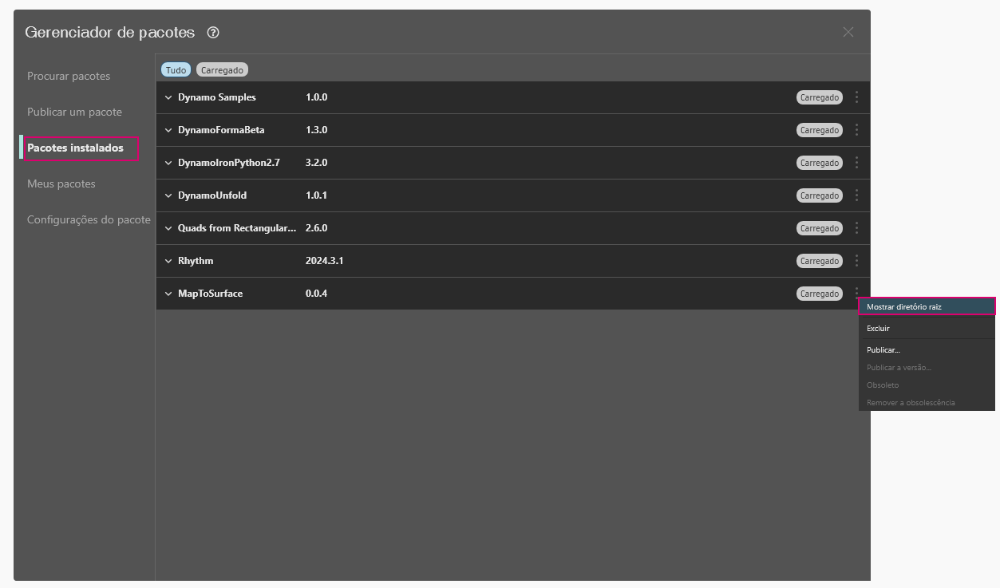
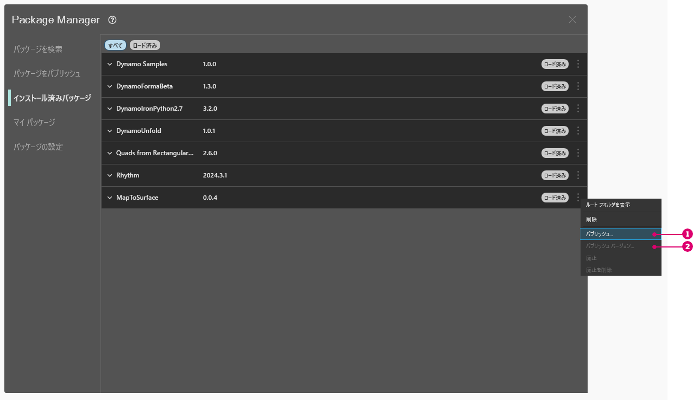

# Publication d’un package

Dans les sections précédentes, vous avez découvert en détail comment configurer le package _MapToSurface_ avec des nœuds personnalisés et des fichiers d’exemple. Mais comment publier un package développé localement ? Cette étude de cas montre comment publier un package à partir d’un ensemble de fichiers dans un dossier local.

\ (1).jpg>)

Il existe plusieurs façons de publier un package. Voici le processus recommandé :**publier localement, développer localement, puis publier en ligne**. Vous allez commencer par un dossier contenant tous les fichiers du package.

### Désinstallation d'un package

Avant de commencer la publication du package MapToSurface, si vous avez installé le package à partir de la leçon précédente, désinstallez-le afin de ne pas utiliser les mêmes packages.

Commencez par aller dans Packages > Gestionnaire de package > onglet Packages installés > à côté de MapToSurface, cliquez sur le menu des points verticaux > Supprimer.

<figure><figcaption></figcaption></figure>

Ensuite, redémarrez Dynamo. Lors de la réouverture, vérifiez la fenêtre _« Gérer les packages »_ : le package _MapToSurface_ ne doit plus être présent. Vous pouvez désormais commencer !

### Publication locale d’un package

 Vous pouvez publier des nœuds et des packages personnalisés à partir de Dynamo Sandbox dans la version 2.17 et les versions ultérieures, tant qu’ils n’ont pas de dépendances de l’API hôte. Dans les versions plus anciennes, la publication de nœuds et de packages personnalisés n’est possible que dans Dynamo for Revit et Dynamo for Civil 3D. 

> Téléchargez le fichier d’exemple en cliquant sur le lien ci-dessous.
>
> Vous trouverez la liste complète des fichiers d'exemple dans l'annexe.



Il s'agit de la première soumission du package, et tous les fichiers d'exemple et les nœuds personnalisés sont placés dans un dossier unique. Maintenant que ce dossier est prêt, vous pouvez effectuer le chargement dans le gestionnaire de package Dynamo.

> 1. Ce dossier contient cinq nœuds personnalisés (.dyf).
> 2. Ce dossier contient également cinq fichiers d'exemple (.dyn) et un fichier vectoriel importé (.svg). Ces fichiers serviront d’exercices préliminaires pour montrer à l’utilisateur comment utiliser les nœuds personnalisés.

Dans Dynamo, commencez par cliquer sur l’onglet _Packages > Gestionnaire de package > Publier un nouveau package_.

Dans l’onglet _Publier un package_, remplissez les champs pertinents dans la partie gauche de la fenêtre.

<figure><figcaption></figcaption></figure>

Ensuite, nous allons ajouter des fichiers de package. Vous pouvez ajouter des fichiers un par un ou des dossiers entiers en sélectionnant Ajouter un répertoire (1). Pour ajouter des fichiers qui ne sont pas des fichiers .dyf, veillez à modifier le type de fichier dans la fenêtre du navigateur en **« Tous les fichiers(**_._**) »**. Notez que nous ajouterons chaque fichier, nœud personnalisé (.dyf) ou fichier d’exemple (.dyn), sans distinction. Dynamo classe ces éléments lors de la publication du package.

<figure><figcaption></figcaption></figure>

Une fois que vous avez sélectionné le dossier MapToSurface, le gestionnaire de package vous montre le contenu du dossier. Si vous chargez votre propre package avec une structure de dossiers complexe, et que vous ne voulez pas que Dynamo apporte des changements à votre structure de dossiers, vous pouvez cocher la case « Conserver la structure des dossiers ». Cette option est destinée aux utilisateurs avancés, et si votre package n’est pas délibérément configuré d’une manière spécifique, il est préférable de laisser cette option désactivée et de permettre à Dynamo d’organiser les fichiers selon les besoins. Cliquez sur Suivant pour continuer.

<figure><figcaption></figcaption></figure>

Ici, vous avez la possibilité de voir comment Dynamo organisera vos fichiers de package avant de les publier. Cliquez sur Terminer pour continuer.

<figure><figcaption></figcaption></figure>

Publiez en cliquant sur « Publier localement » (1). Si vous suivez, veillez à cliquer sur _« Publier localement »_ et **non** _« Publier en ligne » pour éviter_ d’avoir un groupe de packages en double dans le gestionnaire de package.

Une fois la publication terminée, les nœuds personnalisés doivent être disponibles sous le groupe « DynamoPrimer » ou votre bibliothèque Dynamo.

\ (1).jpg>)

Examinez maintenant le répertoire racine pour découvrir comment Dynamo a mis en forme le package créé. Pour ce faire, allez dans l’onglet Packages installés > à côté de MapToSurface, cliquez sur le menu des points verticaux > sélectionnez Afficher le répertoire racine.

<figure><figcaption></figcaption></figure>

Le répertoire racine se trouve à l’emplacement local de votre package (n’oubliez pas que vous avez publié le package « localement »). Dynamo utilise actuellement ce dossier pour lire les nœuds personnalisés. Il est donc important de publier localement le répertoire dans un emplacement permanent (par exemple, pas sur votre bureau). Voici la répartition du dossier du package Dynamo :

> 1. Le dossier _bin_ contient les fichiers .dll créés avec des bibliothèques C# ou Zero Touch. Étant donné qu’il n’en existe pas pour ce package, ce dossier est vide pour cet exemple.
> 2. Le dossier _dyf_ contient les nœuds personnalisés. L’ouverture de ce dossier permet d’afficher tous les nœuds personnalisés (fichiers .dyf) de ce package.
> 3. Le dossier supplémentaire contient tous les fichiers supplémentaires. Il est probable que ces fichiers soient des fichiers Dynamo (.dyn) ou d'autres fichiers requis (.svg, .xls, .jpeg, .sat, etc.).
> 4. Le fichier pkg est un fichier texte de base qui définit les paramètres du package. Cette opération est automatisée dans Dynamo, mais elle peut être modifiée si vous souhaitez obtenir des détails.

### Publication d’un package en ligne

Remarque : ne suivez pas cette étape, sauf si vous publiez réellement un package de votre choix. 

<figure><figcaption></figcaption></figure>

1. Lorsque vous êtes prêt à publier, dans la fenêtre Packages > Gestionnaire de package > Packages installés, sélectionnez le bouton situé à droite du package que vous souhaitez publier et choisissez Publier.
2. Si vous mettez à jour un package qui a déjà été publié, choisissez « Publier la version » et Dynamo mettra à jour votre package en ligne en fonction des nouveaux fichiers contenus dans le répertoire racine de ce package. C’est aussi simple que ça !

#### Test du serveur du gestionnaire de packages
Lorsque vous testez le gestionnaire de packages, n’envoyez pas vos packages de test au serveur de production. Utilisez le serveur intermédiaire. Cela permet d’éviter que vos packages ne polluent l’activité et les packages réels. Il est facile de configurer Dynamo pour utiliser le serveur intermédiaire. 

Pour plus d’informations à ce sujet, veuillez vous référer à la page Wiki [Test du serveur du gestionnaire de packages](https://github.com/DynamoDS/Dynamo/wiki/Testing-the-Package-Manager-Server).

### Version de publication…

Lorsque vous mettez à jour les fichiers dans le dossier racine de votre package publié, vous pouvez également publier une nouvelle version du package en sélectionnant _« Publier la version… »_ dans l’onglet _Mes packages_. Cette méthode vous permet d’apporter les mises à jour nécessaires à votre contenu et de le partager en toute transparence avec la communauté. La _version de publication_ fonctionne uniquement si vous êtes le gestionnaire du package.
