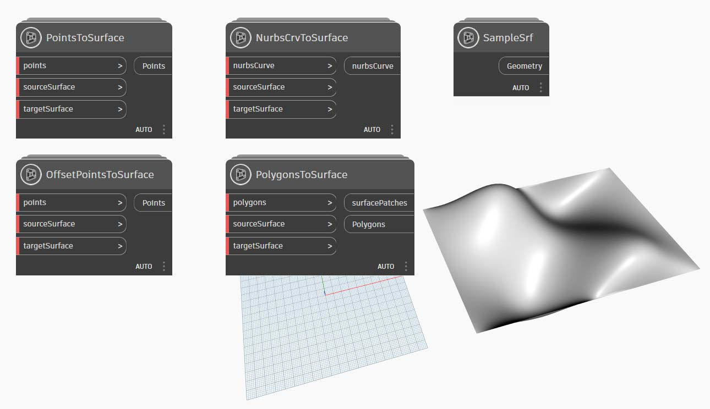

# パッケージをパブリッシュする

前のセクションでは、カスタム ノードとサンプル ファイルを使用して _MapToSurface _パッケージを設定する方法について確認しました。では、ローカルで作成したパッケージはどのようにパブリッシュすればよいでしょうか。このケース スタディでは、ローカル フォルダ内のファイル セットを使用してパッケージをパブリッシュする方法について確認します。

パッケージは、さまざまな方法でパブリッシュすることができます。ここでは、**パッケージをローカルにパブリッシュして作成し、オンラインでパブリッシュする**方法を確認していきます。最初に、パッケージ内のすべてのファイルを格納するフォルダを作成します。

### パッケージをアンインストールする

前の演習で MapToSurface パッケージをインストールした場合は、同じパッケージを使用しないようにするため、このパッケージをアンインストールしてください。

まず、[Dynamo] > [基本設定] > [Package Manager] > [MapToSurface]の横にある縦ドット メニューをクリックして[削除]を選択します。

次に、Dynamo を再起動します。[_パッケージを管理_]ウィンドウをもう一度開いて、_MapToSurface_ が表示されていないことを確認してください。これで、作業を開始する準備ができました。

### パッケージをローカルにパブリッシュする

 Dynamo パッケージのパブリッシュは、Dynamo for Revit および Dynamo for Civil 3D でのみ有効です。Dynamo Sandbox には、パブリッシュ機能は用意されていません。

> 下のリンクをクリックして、サンプル ファイルをダウンロードします。
>
> すべてのサンプルファイルの一覧については、付録を参照してください。



この演習で、パッケージを初めて送信することになります。サンプル ファイルとカスタム ノードは、すべて 1 つのフォルダ内に格納されています。このフォルダが作成されていれば、Dynamo Package Manager にパッケージをアップロードすることができます。

> 1. このフォルダには、5 つのカスタム ノード(.dyf)が格納されています。
> 2. このフォルダには、5 つのサンプル ファイル(.dyn)と、1 つの読み込み済みベクトル ファイル(.svg)も格納されています。これらのファイルは、カスタム ノードの使用方法を理解するための演習用のファイルです。

Dynamo で、_[パッケージ] > [新しいパッケージをパブリッシュ...]_ をクリックします。

[_Dynamo パッケージをパブリッシュ_]ウィンドウの左側には、関連フォームが既に入力されています。

> 1. [_ファイルを追加_]をクリックすると、画面の右側にあるフォルダ構造から既にファイルが追加されています。.dyf ファイル以外のファイルを追加するには、ブラウザ ウィンドウのファイル タイプを **[すべてのファイル(**_**.**_**)]** に変更してください。カスタム ノード(.dyf)やサンプル ファイル(.dyn)など、すべてのファイルが追加されていることを確認してください。パッケージをパブリッシュすると、Dynamo によってこれらのファイルが分類されます。
> 2. [グループ]フィールドを使用して、Dymano UI でカスタム ノードを検索するためのグループを定義します。
> 3. [ローカルにパブリッシュ]をクリックして、パッケージをパブリッシュします。次に、[_オンラインでパブリッシュ_]**ではなく**[_ローカルにパブリッシュ_]をクリックします。これは、多数の複製パッケージを Package Manager にパブリッシュしないようにするためです。

パブリッシュが完了すると、DynamoPrimer グループまたは Dynamo ライブラリで目的のカスタム ノードを使用できるようになります。

次に、ルート フォルダを開き、作成したパッケージが Dymano でどのようにフォーマットされているかを確認します。これを行うには、[Dynamo] > [基本設定] > [Package Manager] > [MapToSurface]の横にある縦ドット メニューをクリックし、[ルート フォルダを表示]を選択します。

ルート フォルダは、パッケージのローカルの場所にあります(ここまでの手順で、パッケージはローカルにパブリッシュされています)。Dynamo は、このフォルダを参照してカスタム ノードを読み込みます。そのため、このフォルダを保存する場合は、デスクトップではなく、ローカルの永続的な場所に保存する必要があります。Dynamo パッケージ フォルダの内容は次のとおりです。

> 1. _bin_ フォルダには、C# ライブラリまたは Zero-Touch ライブラリを使用して作成された .dll ファイルが格納されます。このパッケージにはこうしたファイルがないため、このフォルダは空になっています。
> 2. _dyf_ フォルダにはカスタム ノードが格納されます。このフォルダを開くと、このパッケージのすべてのカスタム ノード(.dyf ファイル)が表示されます。
> 3. extra フォルダには、すべての追加ファイルが格納されます。通常、これらのファイルは、Dynamo ファイル(.dyn)または必須の追加ファイル(.svg、.xls、.jpeg、.sat など)です。
> 4. pkg ファイルは、パッケージの設定を定義する基本のテキスト ファイルです。このファイルは Dynamo によって自動的に作成されますが、必要な場合は編集することができます。

### パッケージをオンラインでパブリッシュする

注: 独自のパッケージを実際にパブリッシュしない場合は、この手順を実行しないでください。

> 1. パブリッシュの準備が整ったら、[基本設定] > [Package Manager] ウィンドウで[MapToSurface]の右側にあるボタンを選択し、[_パブリッシュ..._]を選択します。
> 2. 既にパブリッシュされているパッケージを更新する場合、[パブリッシュ バージョン]を選択すると、パッケージのルート フォルダ内の新しいファイルに基づいて、パッケージがオンラインで更新されます。

### [パブリッシュ バージョン...]オプション

パブリッシュしたパッケージのルート フォルダ内にあるファイルを更新した場合、[_パッケージを管理_]ウィンドウで[_パブリッシュ バージョン..._]を選択すると、新しいバージョンのパッケージをパブリッシュすることができます。この方法により、シームレスにコンテンツを更新してコミュニティ間で共有することできます。[_パブリッシュ バージョン_]オプションは、ユーザがパッケージを保守している場合にのみ機能します。
