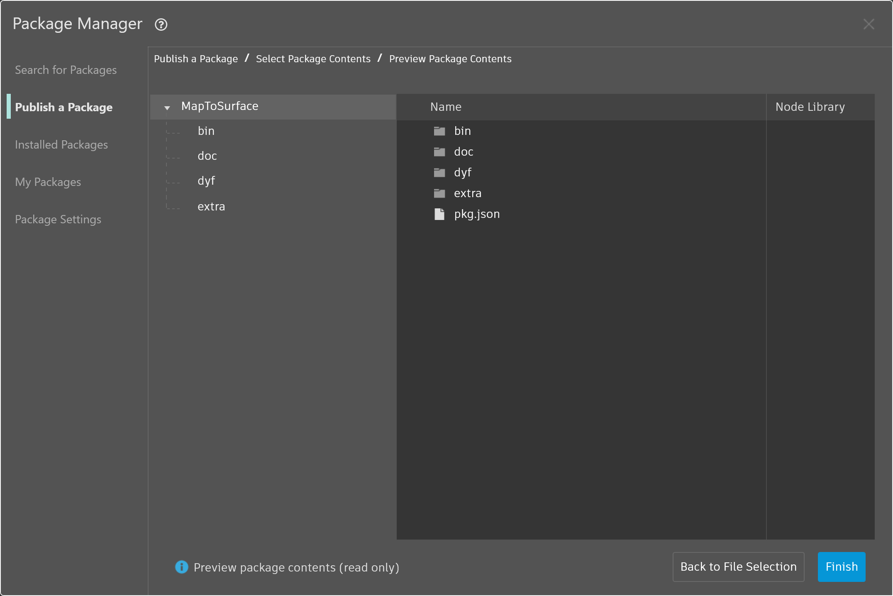

# Publishing a Package

In the previous sections, we dove into the details of how our _MapToSurface_ package is set up with custom nodes and example files. But how do we publish a package that has been developed locally? This case study demonstrates how to publish a package from a set of files in a local folder.

 (1).jpg>)

There are many ways to publish a package. Below is the process that we advise: **publish locally, develop locally, and then publish online**. We'll start with a folder containing all of the files in the package.

### Uninstalling a Package

Before we jump into publishing the MapToSurface package, if you installed the package from the previous lesson, uninstall it so that you're not working with identical packages.

Begin by going to Packages > Package Manager > Installed Packages tab > next to MapToSurface click the vertical dots menu > Delete.

<figure><figcaption></figcaption></figure>

Then restart Dynamo. When reopening, when you check the _"Manage Packages"_ window, the _MapToSurface_ should no longer be there. Now we're ready to start from the beginning!

### Publishing a Package Locally


You can publish custom nodes and packages from Dynamo Sandbox in version 2.17 and newer, as long as they have no host API dependencies. In older versions, publishing custom nodes and packages is only enabled in Dynamo for Revit and Dynamo for Civil 3D.


> Download the example file by clicking on the link below.
>
> A full list of example files can be found in the Appendix.



This is the first submission for our package, and we've placed all of the example files and custom nodes into one folder. With this folder prepared, we're ready to upload to the Dynamo Package Manager.

> 1. This folder contains five custom nodes (.dyf).
> 2. This folder also contains five example files (.dyn) and one imported vector file (.svg). These files will serve as introductory exercises to show the user how to work with the custom nodes.

In Dynamo, begin by clicking _Packages > Package Manager > Publish New Package_ tab.

In the _Publish a Package_ tab, fill out the relevant fields on the left side of the window.

<figure><figcaption></figcaption></figure>

Next, we’ll add package files. You can add files one by one or entire folders by selecting Add Directory (1). To add files that are not .dyf files, be sure to change your file type in the browser window to **"All Files(**_._**)"**. Notice that we’ll be adding every file, custom node (.dyf) or example file (.dyn), indiscriminately. Dynamo will categorize these items when we publish the package.

<figure><figcaption></figcaption></figure>

Once you’ve selected the MapToSurface folder, Package Manager shows you the folder contents. If you are uploading your own package with a complex folder structure, and you do not want Dynamo to make changes to your folder structure, you can enable the “Retain folder structure” toggle. This option is for advanced users, and if your package isn’t deliberately set up in a specific way, it’s best to leave this toggle off and allow Dynamo to organize the files as needed. Click Next to proceed.

<figure><figcaption></figcaption></figure>

Here, you have a chance to preview how Dynamo will organize your package files prior to publishing. Click Finish to proceed.

<figure><figcaption></figcaption></figure>

Publish by clicking "Publish Locally" (1). If you're following along, be certain to click _"Publish Locally"_ and **not** _"Publish Online” to avoid having_ a bunch of duplicate packages in the Package Manager.

After publishing, the custom nodes should be available under the "DynamoPrimer" group or your Dynamo Library.

 (1).jpg>)

Now let's look at the root directory to see how Dynamo has formatted the package we just created. Do this by going to the Installed Packages tab > next to MapToSurface, click on the vertical dots menu > select Show Root Directory.

<figure><figcaption></figcaption></figure>

Notice that the root directory is in the local location of your package (remember, we published the package "locally"). Dynamo is currently referencing this folder to read custom nodes. It's therefore important to locally publish the directory to a permanent folder location (i.e., not your desktop). Here is the Dynamo package folder breakdown.

> 1. The _bin_ folder houses .dll files created with C# or Zero-Touch libraries. We don't have any for this package so this folder is blank for this example.
> 2. The _dyf_ folder houses the custom nodes. Opening this will reveal all of the custom nodes (.dyf files) for this package.
> 3. The extra folder houses all additional files. These files are likely to be Dynamo Files (.dyn) or any additional files required (.svg, .xls, .jpeg, .sat, etc.).
> 4. The pkg file is a basic text file defining the package settings. This is automated in Dynamo, but can be edited if you want to get into the details.

### Publishing a Package Online


Note: please do not follow along with this step unless you are actually publishing a package of your own!


<figure><figcaption></figcaption></figure>

1. When you're ready to publish, in the Packages > Package Manager > Installed Packages window, select the button the right of the package you want to publish and choose Publish.
2. If you're updating a package that has already been published, choose "Publish Version" and Dynamo will update your package online based on the new files in that package's root directory. Simple as that!

### Publish Version...

When you update the files in your published package's root folder, you can also publish a new version of the package by selecting _"Publish Version..."_ in the _My Packages_ tab. This is a seamless way to make necessary updates to your content and share with the community. _Publish Version_ will only work if you're the maintainer of the package.

### Transferring Ownership of a Package

Currently, you cannot transfer package ownership via the Package Manager. You can ask the Dynamo team to add an additional owner. Note we cannot remove existing owners, only add more maintainers of the package. If you wish to add an account as an owner to your existing package, please send an email to [dynamoteam@dynamobim.org](mailto:dynamoteam@dynamobim.org). Make sure to provide the package name and the account name you wish to add.
