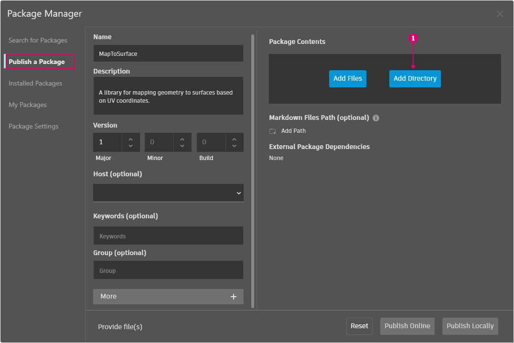
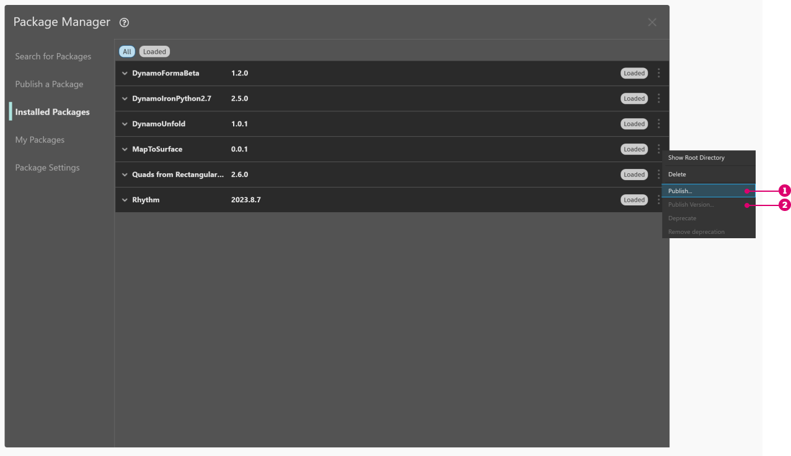

# 패키지 게시하기

이전 섹션에서는 사용자 노드 및 예제 파일을 사용하여 _MapToSurface_ 패키지를 설정하는 방법을 자세히 살펴보았습니다. 하지만 로컬로 개발된 패키지를 게시하려면 어떻게 해야 할까요? 이 성공 사례에서는 로컬 폴더의 파일 세트에서 패키지를 게시하는 방법을 보여 줍니다.

 (1).jpg>)

패키지를 게시하는 방법에는 여러 가지가 있습니다. 권장되는 프로세스는 **로컬로 게시하고 로컬로 개발한 후 온라인으로 게시**하는 것입니다. 패키지에 모든 파일이 포함된 폴더로 시작하겠습니다.

### 패키지 제거하기

이전 단원에서 패키지를 설치한 경우에는 동일한 패키지로 작업하는 일이 없도록 MapToSurface 패키지를 게시하기 전에 제거합니다.

먼저 패키지 > Package Manager > 설치된 패키지 탭으로 이동하고 MapToSurface 옆에 있는 세로 점 메뉴를 클릭하고 삭제를 클릭합니다.

<figure><figcaption></figcaption></figure>

그런 다음, Dynamo를 다시 시작합니다. 다시 열 때 _"패키지 관리"_ 창을 선택하면 _MapToSurface_ 가 더 이상 해당 창에 표시되지 않습니다. 이제 처음부터 새로 시작할 준비가 되었습니다.

### 패키지를 로컬로 게시하기

 호스트 API 종속성이 없는 경우 Dynamo Sandbox 2.17 이후 버전에서 사용자 노드 및 패키지를 게시할 수 있습니다. 이전 버전에서는 Dynamo for Revit 및 Dynamo for Civil 3D에서만 사용자 노드 및 패키지 게시를 사용할 수 있습니다. 

> 아래 링크를 클릭하여 예제 파일을 다운로드하십시오.
>
> 전체 예시 파일 리스트는 부록에서 확인할 수 있습니다.



이는 패키지에 대한 첫 번째 제출이며, 모든 예시 파일 및 사용자 노드를 하나의 폴더에 배치했습니다. 이 폴더가 준비되면 Dynamo Package Manager로 업로드할 준비가 된 것입니다.

> 1. 이 폴더에는 5개의 사용자 노드(.dyf)가 포함되어 있습니다.
> 2. 또한 이 폴더에는 5개의 예시 파일(.dyn)과 1개의 가져온 벡터 파일(.svg)도 포함되어 있습니다. 이러한 파일은 사용자에게 사용자 노드를 사용하는 방법을 보여 주기 위해 입문 연습으로 사용됩니다.

Dynamo에서 _패키지 > Package Manager > 새 패키지 게시_ 탭을 클릭합니다.

_패키지 게시_ 탭에서 창 왼쪽에 있는 관련 필드를 채웁니다.

<figure><figcaption></figcaption></figure>

다음으로, 패키지 파일을 추가하겠습니다. 파일을 하나씩 추가하거나 디렉토리 추가(1)를 선택하여 전체 폴더를 추가할 수 있습니다. .dyf 파일이 아닌 파일을 추가하려면 탐색기 창에서 파일 유형을 **"모든 파일(**_._**)"** 로 변경합니다. 모든 파일, 사용자 노드(.dyf) 또는 예제 파일(.dyn)을 별다른 구분 없이 추가하겠습니다. 패키지를 게시하면 Dynamo에서는 이러한 항목을 분류합니다.

<figure><figcaption></figcaption></figure>

MapToSurface 폴더를 선택한 후에는 Package Manager에 폴더 내용이 표시됩니다. 폴더 구조가 복잡한 자체 패키지를 업로드하는 경우 Dynamo에서 폴더 구조를 변경하지 않도록 하려면 "폴더 구조 유지" 토글을 활성화하면 됩니다. 이 옵션은 고급 사용자를 위한 옵션으로, 패키지가 의도적으로 특정 방식으로 설정되지 않은 경우 이 토글을 해제하고 Dynamo에서 필요에 따라 파일을 구성할 수 있도록 하는 것이 좋습니다. 다음을 클릭하여 계속 진행합니다.

<figure><figcaption></figcaption></figure>

여기에서는 게시하기 전에 Dynamo에서 패키지 파일을 구성하는 방법을 미리 볼 수 있습니다. 완료를 클릭하여 계속 진행합니다.

<figure><figcaption></figcaption></figure>

"로컬로 게시"(1)를 클릭하여 게시합니다. 이 작업을 따라 진행하고 있는 경우 Package Manager에 중복된 패키지를 포함하지 않기 위해 _"로컬로 게시"_ 는 클릭하고, _"온라인으로 게시"_ 는 클릭하지 **않아야 합니다**.

게시하고 나면 "DynamoPrimer" 그룹 또는 Dynamo 라이브러리에서 사용자 노드를 사용할 수 있게 됩니다.

 (1).jpg>)

이제 루트 디렉토리를 확인하여 Dynamo에서 방금 작성한 패키지의 형식을 어떻게 지정했는지 살펴보겠습니다. 이렇게 하려면 설치된 패키지 탭으로 이동하고 MapToSurface 옆에 있는 세로 점 메뉴를 클릭하고 루트 디렉토리 표시를 선택합니다.

<figure><figcaption></figcaption></figure>

루트 디렉토리는 패키지의 로컬 위치에 있습니다(패키지를 "로컬"로 게시함). Dynamo에서는 현재 이 폴더를 참조하여 사용자 노드를 읽고 있습니다. 따라서 영구적인 폴더 위치(예: 데스크톱 아님)에 디렉토리를 로컬로 게시하는 것이 중요합니다. 다음은 Dynamo 패키지 폴더를 분석한 것입니다.

> 1. _bin_ 폴더에는 C# 또는 Zero-Touch 라이브러리로 작성된 .dll 파일이 있습니다. 이 패키지에 대한 항목은 없으므로 이 예에서는 이 폴더가 비어 있습니다.
> 2. _dyf_ 폴더에는 사용자 노드가 있습니다. 이 폴더를 열면 이 패키지의 모든 사용자 노드(.dyf 파일)가 표시됩니다.
> 3. 추가 폴더에는 모든 추가 파일이 포함됩니다. 이러한 파일은 Dynamo 파일(.dyn) 또는 필요한 추가 파일(.svg, .xls, .jpeg, .sat 등)일 가능성이 큽니다.
> 4. pkg 파일은 패키지 설정을 정의하는 기본 텍스트 파일입니다. 이 작업은 Dynamo에서 자동화되어 있지만, 자세히 확인해 보고 싶은 경우 편집할 수 있습니다.

### 패키지를 온라인으로 게시하기

 참고: 실제로 자체 패키지를 게시하지 않는 한, 이 단계에 따라 작업하지 마십시오. 

<figure><figcaption></figcaption></figure>

1. 게시할 준비가 되면 패키지 > Package Manager > 설치된 패키지 창에서 게시할 패키지 오른쪽에 있는 버튼을 선택하고 게시를 선택합니다.
2. 이미 게시된 패키지를 업데이트하는 경우 "버전 게시"를 선택하면 Dynamo에서는 해당 패키지의 루트 디렉토리에 있는 새 파일을 기반으로 하여 온라인으로 패키지를 업데이트합니다. 아주 간단합니다.

### 버전 게시...

게시된 패키지의 루트 폴더에서 파일을 업데이트하는 경우 _내 패키지_ 탭에서 _"버전 게시..."_ 를 선택하여 새 버전의 패키지를 게시할 수도 있습니다. 이렇게 하면 원활하게 필요에 따라 컨텐츠를 업데이트하고 커뮤니티와 공유할 수 있습니다. _버전 게시_ 는 패키지의 유지 담당자인 경우에만 작동합니다.
