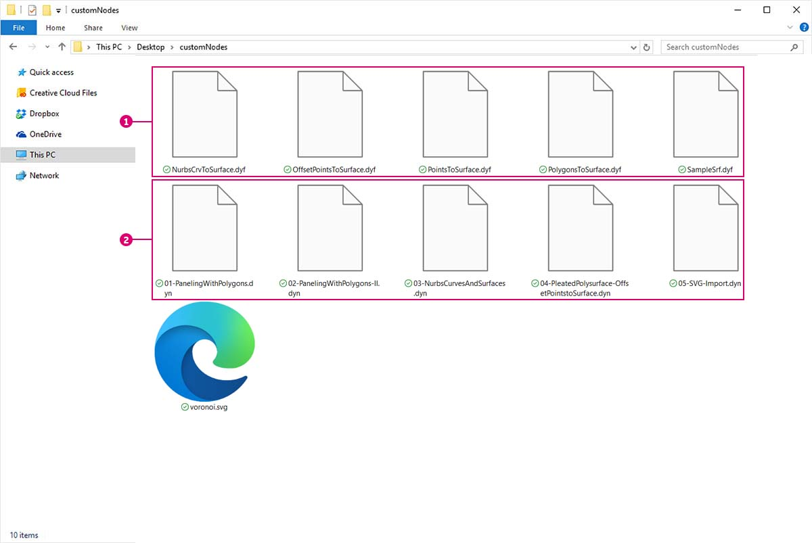

# Publicación de un paquete

En las secciones anteriores, examinamos cómo se configura el paquete de _MapToSurface_ con nodos personalizados y archivos de ejemplo. Pero, ¿cómo publicamos un paquete que se ha desarrollado localmente? En este caso real, se muestra cómo publicar un paquete a partir de un conjunto de archivos en una carpeta local.

Hay muchas formas de publicar un paquete. A continuación, se indica el proceso recomendado: **publique localmente, desarrolle localmente y, a continuación, publique en línea**. Comenzaremos con una carpeta que contiene todos los archivos del paquete.

### Desinstalación de un paquete

Antes de pasar a la publicación del paquete MapToSurface, si ha instalado el paquete en una lección anterior, desinstálelo para que no trabaje con paquetes idénticos.

Vaya primero a Dynamo > Preferencias > Package Manager > junto a MapToSurface, haga clic en el menú de puntos verticales > Suprimir.

A continuación, reinicie Dynamo. Al volver a abrirlo, cuando active la ventana _"Gestionar paquetes"_, _MapToSurface_ ya no debería aparecer. Ya estamos listos para empezar desde el principio.

### Publicación local de un paquete

 La publicación de paquetes de Dynamo solo está activada para Dynamo para Revit y Dynamo para Civil 3D. Dynamo Sandbox no incluye funciones de publicación. 

> Descargue el archivo de ejemplo. Para ello, haga clic en el vínculo siguiente.
>
> En el Apéndice, se incluye una lista completa de los archivos de ejemplo.



Este es el primer envío del paquete y se han incluido todos los nodos personalizados y los archivos de ejemplo en una única carpeta. Con esta carpeta preparada, ya podemos realizar la carga en Dynamo Package Manager.

> 1. Esta carpeta contiene cinco nodos personalizados (.dyf).
> 2. Esta carpeta también contiene cinco archivos de ejemplo (.dyn) y un archivo de vectores importado (.svg). Estos archivos se utilizarán como ejercicios de introducción para mostrar al usuario cómo trabajar con los nodos personalizados.

En Dynamo, vaya primero a _Paquetes > Publicar paquete nuevo_.

En la ventana _"Publicar un paquete de Dynamo"_, hemos rellenado los formularios correspondientes a la izquierda.

> 1. Al hacer clic en _"Añadir archivo"_, también hemos añadido los archivos de la estructura de carpetas en la parte derecha de la pantalla (para añadir archivos que no sean .dyf, asegúrese de cambiar el tipo de archivo en la ventana del navegador a **"Todos los archivos(**_**.**_**)".** Observe que se han añadido sin distinción todos los archivos, los nodos personalizados (.dyf) o los archivos de ejemplo (.dyn). Dynamo clasificará estos elementos cuando publiquemos el paquete.
> 2. El campo "Grupo" define el grupo en el que buscar los nodos personalizados en la interfaz de usuario de Dynamo.
> 3. Para publicar, haga clic en "Publicar localmente". Si sigue este proceso, asegúrese de hacer clic en _"Publicar localmente"_ y **no** en _"Publicar en línea"_. No deseamos un conjunto de paquetes duplicados en Package Manager.

Tras la publicación, los nodos personalizados deberían estar disponibles en el grupo "DynamoPrimer" o en la biblioteca de Dynamo.

Ahora veamos el directorio raíz para comprobar cómo Dynamo ha aplicado formato al paquete que acabamos de crear. Para ello, haga clic en Dynamo > Preferencias > Package Manager > junto a MapToSurface, haga clic en el menú de puntos verticales > seleccione Mostrar directorio raíz.

Observe que el directorio raíz se encuentra en la ubicación local del paquete (recuerde que hemos publicado el paquete "localmente"). Dynamo hace referencia a esta carpeta para leer nodos personalizados. Por lo tanto, es importante publicar localmente el directorio en una ubicación de carpeta permanente (es decir, no en el escritorio). A continuación, se desglosan las carpetas del paquete de Dynamo.

> 1. La carpeta _bin_ contiene archivos .dll creados con bibliotecas de C# o Zero-Touch. No hay ninguna para este paquete, por lo que esta carpeta aparece vacía en este ejemplo.
> 2. La carpeta _dyf_ contiene los nodos personalizados. Al abrir esta, se mostrarán todos los nodos personalizados (archivos .dyf) de este paquete.
> 3. La carpeta "extra" contiene todos los archivos adicionales. Es probable que estos archivos sean archivos de Dynamo (.dyn) o archivos adicionales necesarios (.svg, .xls, .jpeg, .sat, etc.).
> 4. El archivo pkg es un archivo de texto básico que define los parámetros del paquete. Esta función está automatizada en Dynamo, pero se puede modificar si desea acceder a los detalles.

### Publicación de un paquete en línea

 Nota: No siga este paso a menos que publique realmente un paquete suyo. 

> 1. Cuando esté listo para publicar, en la ventana Preferencias > Package Manager, seleccione el botón ubicado a la derecha de MapToSurface y elija _Publicar_.
> 2. Si va a actualizar un paquete que ya se ha publicado, seleccione Publicar versión; Dynamo actualizará el paquete en línea en función de los nuevos archivos del directorio raíz del paquete. Así de fácil.

### Publicar versión

Al actualizar los archivos de la carpeta raíz del paquete publicado, puede publicar una nueva versión del paquete. Para ello, seleccione _"Publicar versión"_ en la ventana _Gestionar paquetes_. Esta es una forma perfecta de realizar las actualizaciones necesarias del contenido y compartirlas con la comunidad. _Publicar versión_ solo funcionará si es la persona encargada del mantenimiento del paquete.
