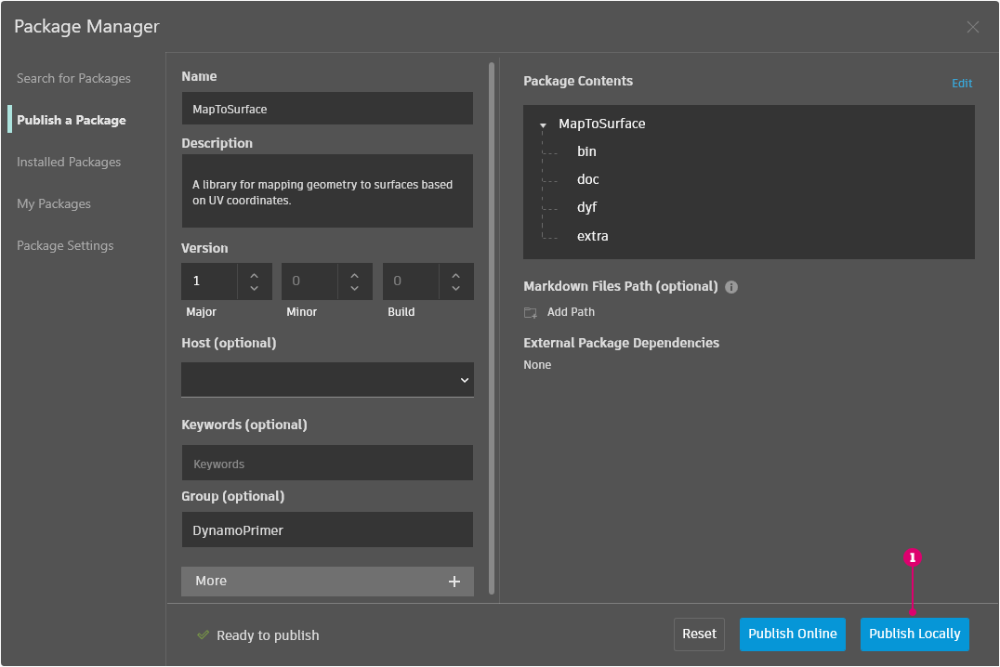

# Pubblicazione di un pacchetto

Nelle sezioni precedenti, sono stati analizzati i dettagli su come il pacchetto _MapToSurface_ è configurato con nodi personalizzati e file di esempio. Ma com'è possibile pubblicare un pacchetto che è stato sviluppato localmente? Questo case study mostra come pubblicare un pacchetto da un gruppo di file in una cartella locale.

 (1).jpg>)

Esistono diversi modi per pubblicare un pacchetto. Di seguito è riportato il processo consigliato: **pubblicare localmente, sviluppare localmente, quindi pubblicare in linea**. Si inizierà con una cartella contenente tutti i file del pacchetto.

### Disinstallazione di un pacchetto

Prima di passare alla pubblicazione del pacchetto MapToSurface, se il pacchetto è stato installato dalla lezione precedente, disinstallarlo in modo da non utilizzare pacchetti identici.

Iniziare accedendo a Pacchetti > Package Manager > scheda Pacchetti installati > accanto a MapToSurface, fare clic sul menu con i puntini verticali > Elimina.

<figure><figcaption></figcaption></figure>

Quindi riavviare Dynamo. Alla riapertura, quando si seleziona la finestra _Gestisci pacchetti_, _MapToSurface_ non dovrebbe più essere presente. Ora si è pronti per cominciare dall'inizio.

### Pubblicazione locale di un pacchetto

 È possibile pubblicare nodi e pacchetti personalizzati da Dynamo Sandbox nella versione 2.17 e successive, purché non presentino dipendenze API host. Nelle versioni precedenti, la pubblicazione di nodi e pacchetti personalizzati è abilitata solo in Dynamo for Revit e Dynamo for Civil 3D. 

> Scaricare il file di esempio facendo clic sul collegamento seguente.
>
> Un elenco completo di file di esempio è disponibile nell'Appendice.



Questo è il primo invio per il pacchetto e tutti i file di esempio e i nodi personalizzati sono stati inseriti in una cartella. Una volta preparata questa cartella, è possibile caricarla in Dynamo Package Manager.

> 1. Questa cartella contiene cinque nodi personalizzati (.dyf).
> 2. Contiene inoltre cinque file di esempio (.dyn) e un file vettoriale importato (.svg). Questi file fungeranno da esercizi introduttivi per mostrare all'utente come utilizzare i nodi personalizzati.

In Dynamo, iniziare facendo clic su _Pacchetti > Package Manager > scheda Pubblica nuovo pacchetto_.

Nella scheda _Pubblica un pacchetto_, compilare i campi pertinenti sul lato sinistro della finestra.

<figure><figcaption></figcaption></figure>

Successivamente, verranno aggiunti i file di pacchetto. È possibile aggiungere i file uno ad una o intere cartelle selezionando Aggiungi directory (1). Per aggiungere file che non sono in formato .dyf, assicurarsi di modificare il tipo di file nella finestra del browser in **"Tutti i file (**_._**)"**. Notare che verrà aggiunto indistintamente ogni file, il nodo personalizzato (.dyf) o il file di esempio (.dyn). Dynamo consentirà di suddividere questi elementi quando si pubblica il pacchetto.

<figure><figcaption></figcaption></figure>

Dopo aver selezionato la cartella MapToSurface, Package Manager ne mostra il contenuto. Se si sta caricando un pacchetto personalizzato con una struttura di cartelle complessa e non si desidera che Dynamo apporti modifiche a tale struttura, è possibile attivare il pulsante di commutazione Mantieni struttura delle cartelle. Questa opzione è destinata agli utenti avanzati; se il pacchetto non è stato appositamente impostato in un modo specifico, è consigliabile lasciare disattivato questo pulsante di commutazione e consentire a Dynamo di organizzare i file in base alle esigenze. Fare clic su Avanti per continuare.

<figure><figcaption></figcaption></figure>

Qui, è possibile visualizzare un'anteprima di come Dynamo organizzerà i file di pacchetto prima della pubblicazione. Fare clic su Fine per continuare.

<figure><figcaption></figcaption></figure>

Pubblicare facendo clic su Pubblica localmente (1). Se si sta seguendo questa procedura, assicurarsi di fare clic su _Pubblica localmente_ e **non** _Pubblica in linea per evitare di creare_ un gruppo di pacchetti duplicati in Package Manager.

Dopo la pubblicazione, i nodi personalizzati devono essere disponibili nel gruppo "DynamoPrimer" o nella libreria di Dynamo.

 (1).jpg>)

Ora osservare la directory principale per vedere in che modo Dynamo ha formattato il pacchetto appena creato. A tale scopo, accedere alla scheda Pacchetti installati > accanto a MapToSurface, fare clic sul menu con i puntini verticali > selezionare Mostra directory principale.

<figure><figcaption></figcaption></figure>

Si noti che la directory principale si trova nella posizione locale del pacchetto (tenere presente che il pacchetto è stato pubblicato "localmente"). Dynamo fa attualmente riferimento a questa cartella per la lettura di nodi personalizzati. È pertanto importante pubblicare la directory localmente in una posizione di cartella permanente (ad esempio, non sul desktop). Di seguito è riportata la suddivisione delle cartelle del pacchetto di Dynamo.

> 1. La cartella _bin_ contiene i file .dll creati con le librerie C# o zero-touch. Non sono disponibili per questo pacchetto, pertanto questa cartella è vuota per questo esempio.
> 2. La cartella _dyf_ contiene i nodi personalizzati. Se si apre questa finestra, verranno visualizzati tutti i nodi personalizzati (file .dyf) per questo pacchetto.
> 3. La cartella extra contiene tutti i file aggiuntivi. Questi file probabilmente saranno file di Dynamo (.dyn) o eventuali file aggiuntivi richiesti (.svg, .xls, .jpeg, .sat, ecc.).
> 4. Il file pkg è un file di testo di base che definisce le impostazioni del pacchetto. Questa opzione è automatica in Dynamo, ma può essere modificata se si desidera accedere ai dettagli.

### Pubblicazione di un pacchetto in linea

 Nota Seguire questa procedura solo se si sta effettivamente pubblicando un pacchetto personalizzato. 

<figure><figcaption></figcaption></figure>

1. Quando si è pronti per la pubblicazione, nella finestra Pacchetti > Package Manager > Pacchetti installati, selezionare il pulsante a destra del pacchetto che si desidera pubblicare e scegliere Pubblica.
2. Se si sta aggiornando un pacchetto già pubblicato, scegliere Pubblica versione. Dynamo aggiornerà il pacchetto in linea in base ai nuovi file nella directory principale del pacchetto. È semplicissimo.

#### Test del server di Package Manager
Quando si esegue il test di Package Manager, non inviare i pacchetti di test al server di produzione. Utilizzare il server di gestione temporanea. In questo modo si evita che i pacchetti inquinino i pacchetti e le attività reali. È facile configurare Dynamo in modo che utilizzi il server di gestione temporanea. 

Per ulteriori informazioni, fare riferimento alla [pagina Wiki Testing the Package Manager Server](https://github.com/DynamoDS/Dynamo/wiki/Testing-the-Package-Manager-Server).

### Pubblica versione...

Quando si aggiornano i file nella cartella principale del pacchetto pubblicato, è anche possibile pubblicare una nuova versione del pacchetto selezionando _Pubblica versione..._ nella finestra _Pacchetti personali_. Questo è un modo semplice per apportare gli aggiornamenti necessari al contenuto e condividerli con la comunità. _Pubblica versione_ funziona solo se si è il gestore del pacchetto.
