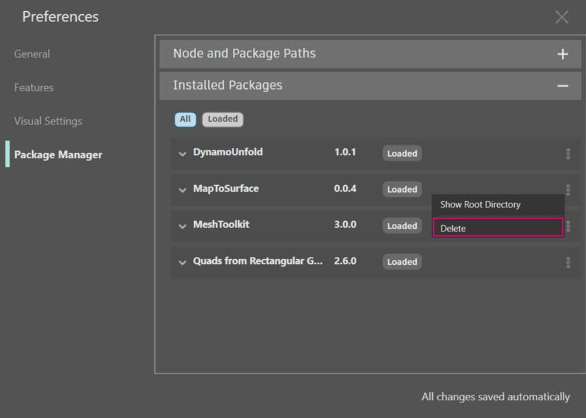
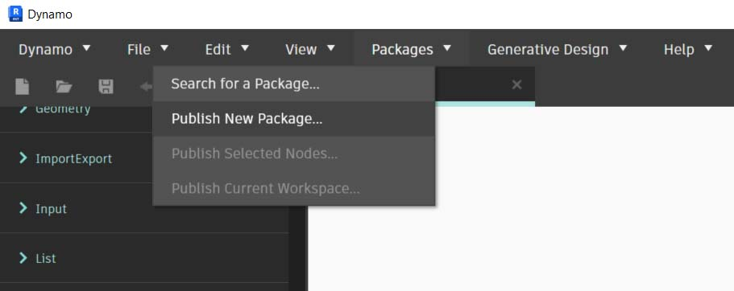
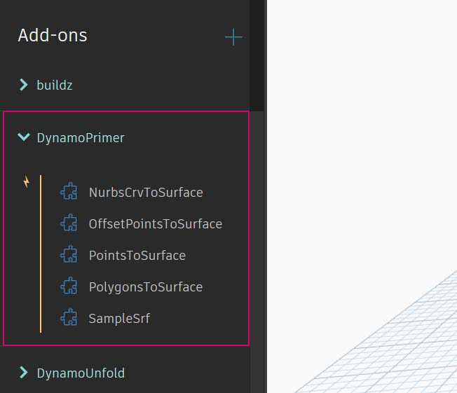
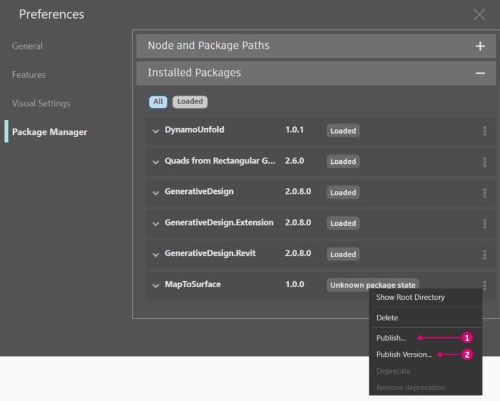

# Publikowanie pakietu

W poprzednich sekcjach omówiono szczegółowo skonfigurowanie pakietu _MapToSurface_ za pomocą węzłów niestandardowych i plików przykładowych. Jak jednak opublikować pakiet, który został utworzony lokalnie? W tej analizie przypadku pokazano sposób publikowania pakietu z zestawu plików w folderze lokalnym.

Istnieje wiele sposobów na opublikowanie pakietu. Poniżej przedstawiono zalecany przez nas proces: **publikowanie lokalne, opracowywanie lokalne, a następnie publikowanie online**. Rozpoczniemy od folderu zawierającego wszystkie pliki w pakiecie.

### Odinstalowywanie pakietu

Zanim przejdziemy do publikowania pakietu MapToSurface, jeśli został on zainstalowany w ramach poprzedniej lekcji, należy go odinstalować, aby nie pracować z identycznymi pakietami.

Rozpocznij, przechodząc do obszaru Dynamo > Preferencje > Menedżer pakietów > obok pozycji MapToSurface kliknij menu w postaci pionowych kropek > usuń

Następnie ponownie uruchom dodatek Dynamo. Po ponownym otwarciu w oknie _„Zarządzaj pakietami”_ nie powinno już być pakietu _MapToSurface_. Teraz można już zacząć od początku.

### Publikowanie pakietu lokalnie

 Publikowanie pakietu Dynamo jest możliwe tylko w dodatku Dynamo dla programu Revit i dodatku Dynamo dla programu Civil 3d. Obszar izolowany (piaskownica) dodatku Dynamo nie ma funkcji publikowania. 

> Pobierz plik przykładowy, klikając poniższe łącze.
>
> Pełna lista plików przykładowych znajduje się w załączniku.



To jest pierwsze przesłanie pakietu i wszystkie pliki przykładowe i węzły niestandardowe zostały umieszczone w jednym folderze. Po przygotowaniu tego folderu można przekazać go do menedżera pakietów Dynamo.

> 1. Ten folder zawiera pięć węzłów niestandardowych (.dyf).
> 2. Ten folder zawiera także pięć przykładowych plików (.dyn) i jeden zaimportowany plik wektorowy (.svg). Te pliki będą służyły jako ćwiczenia wprowadzające, aby pokazać użytkownikowi, jak pracować z węzłami niestandardowymi.

W dodatku Dynamo najpierw kliknij kolejno opcje _Pakiety > Opublikuj nowy pakiet..._

W oknie _Publikowanie pakietu Dynamo_ wypełniono odpowiednie formularze po lewej stronie okna.

> 1. Klikając przycisk _Dodaj plik_, dodano również pliki ze struktury folderów po prawej stronie ekranu (aby dodać pliki, które nie są plikami .dyf, należy zmienić typ pliku w oknie przeglądarki na **„Wszystkie pliki(**_**.**_**)”**. Uwaga: dodaliśmy wszystkie pliki bez rozróżniania typów: węzły niestandardowe (.dyf) i pliki przykładów (.dyn). Po opublikowaniu pakietu dodatek Dynamo skategoryzuje te elementy.
> 2. Pole „Grupa” określa, w której grupie znajdą się węzły niestandardowe w interfejsie użytkownika dodatku Dynamo.
> 3. Opublikuj, klikając przycisk „Opublikuj lokalnie”. Postępując zgodnie z tymi instrukcjami, należy koniecznie kliknąć przycisk _„Opublikuj lokalnie”_, a **nie** _„Opublikuj online”_. Nie chcemy powielenia pakietów w Menedżerze pakietów.

Po opublikowaniu węzły niestandardowe powinny być dostępne w grupie „DynamoPrimer” lub w bibliotece Dynamo.

Teraz spójrzmy na katalog główny, aby sprawdzić, w jaki sposób dodatek Dynamo sformatował utworzony właśnie pakiet. W tym celu kliknij opcje Dynamo > Preferencje > Menedżer pakietów > obok pozycji MapToSurface kliknij menu w postaci pionowych kropek > wybierz opcję Pokaż katalog główny

Zwróć uwagę, że katalog główny znajduje się w lokalnym położeniu pakietu (pakiet został opublikowany lokalnie). Dodatek Dynamo aktualnie odwołuje się do tego folderu, aby odczytać węzły niestandardowe. Dlatego ważne jest, aby lokalnie opublikować katalog w trwałym położeniu folderu (czyli na przykład nie na pulpicie). Poniżej przedstawiono strukturę folderów pakietu Dynamo.

> 1. Folder _bin_ zawiera pliki .dll utworzone za pomocą bibliotek C# lub Zero-Touch. W tym pakiecie ich nie ma, więc ten folder jest pusty dla tego przykładu.
> 2. Folder _dyf_ zawiera węzły niestandardowe. Otwarcie tego folderu spowoduje wyświetlenie wszystkich węzłów niestandardowych (plików .dyf) dla tego pakietu.
> 3. W folderze dodatkowym („extra”) znajdują się wszystkie dodatkowe pliki. Będą to prawdopodobnie pliki dodatku Dynamo (.dyn) lub dowolne dodatkowe wymagane pliki (.svg, .xls, .jpeg, .sat itp.).
> 4. Plik pkg jest podstawowym plikiem tekstowym definiującym ustawienia pakietu. Jest to zautomatyzowane w dodatku Dynamo, ale możesz to edytować, jeśli chcesz przejść do szczegółów.

### Publikowanie pakietu online

 Uwaga: ten krok należy wykonać tylko w przypadku, gdy faktycznie publikuje się własny pakiet. 

> 1. Gdy wszystko jest gotowe do opublikowania, w oknie Preferencje > Menedżer pakietów wybierz przycisk znajdujący się po prawej stronie pakietu MapToSurface i wybierz opcję _Opublikuj..._
> 2. Jeśli aktualizujesz pakiet, który już został opublikowany, wybierz opcję „Opublikuj wersję”, a dodatek Dynamo zaktualizuje pakiet online na podstawie nowych plików w katalogu głównym tego pakietu. To wystarczy.

### Opublikuj wersję...

W trakcie aktualizowania plików w folderze głównym opublikowanego pakietu można opublikować nową wersję pakietu, wybierając opcję _„Opublikuj wersję...”_ w oknie _Zarządzaj pakietami_. Jest to prosty sposób na wprowadzenie niezbędnych aktualizacji zawartości i udostępnienie ich społeczności. Polecenie _Opublikuj wersję_ działa tylko wtedy, gdy użytkownik jest administratorem pakietu.
